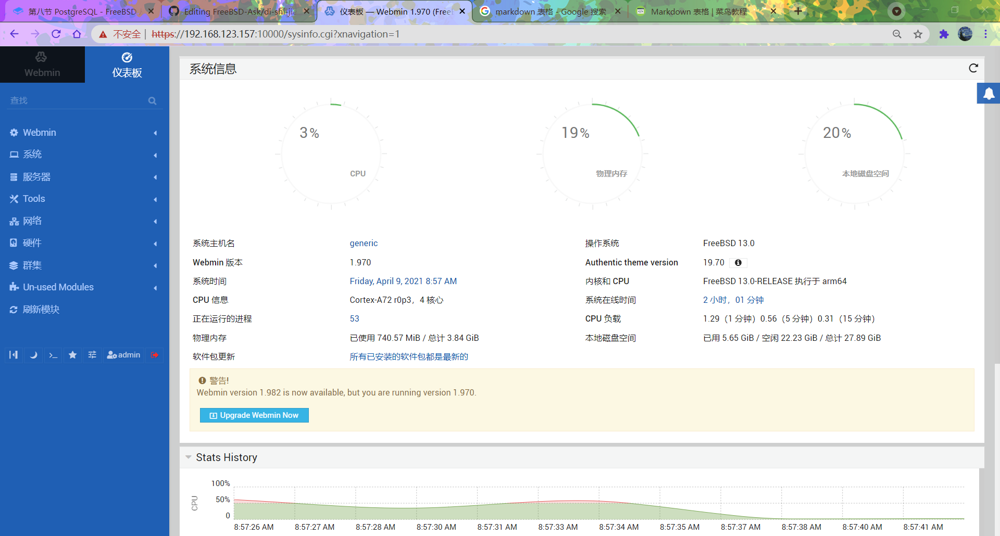

# 第 16.10 节 Webmin

```shell
# pkg install  webmin  #安装 webmin
# /usr/local/lib/webmin/setup.sh  #启动 webmin 安装向导，SSL 需要配置开启。
```

```shell
# sysrc webmin_enable="YES"
# service webmin start
```

下面打开浏览器输入 `https://Ip:10000`，如 `https://192.168.123.157:10000`

回车后如浏览器提示不安全，选择“继续前往”即可，之后会出现 Webmin 登录界面。

这是管理控制台。在文本框中输入 `admin` 和密码，点击 `Sign In`，登录进入控制台。



**切换中文：**

Webmin -> Change Language and Theme，在 `Change Language and Theme` 的 `Webmin UI language` 字段中，先选择 `Personal choice` 再选择 `Simplified Chinese(ZH_CN.UTF8)` 点击 `Make Changes`按钮，然后点击菜单 `->Dashboard` 控制台会刷新为中文界面。
