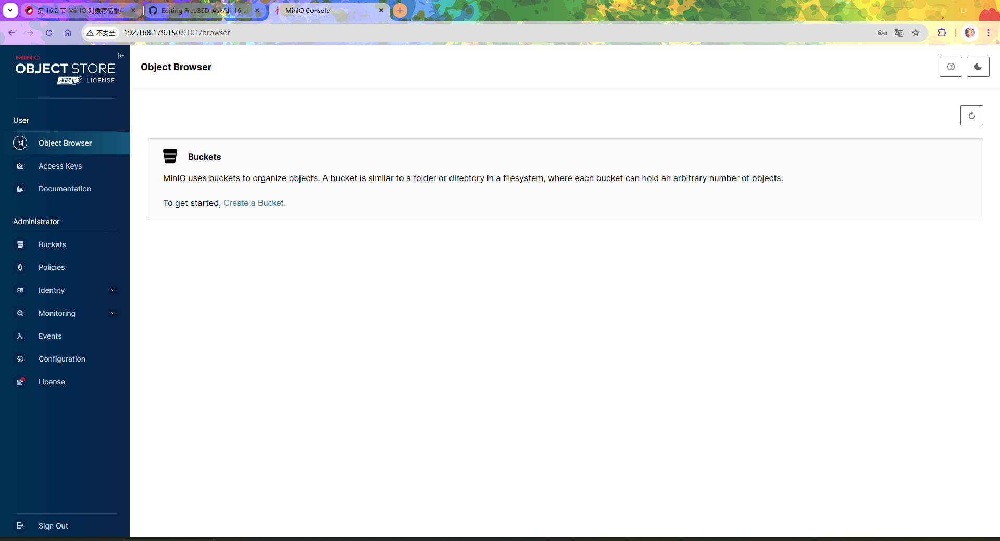

# 16.2 MinIO 对象存储服务

MinIO 是一款使用 Golang 编写、兼容 Amazon S3 的对象存储服务。

## 单机部署

### 安装 MinIO

使用 pkg 安装：

```sh
# pkg install minio
```

或使用 ports 安装：

```sh
# cd /usr/ports/www/minio/ 
# make install clean
```

### 配置

### 启用 MinIO

设置 MinIO 服务为开机自启动：

```sh
# service minio enable
```

### 设置 MinIO 存储路径
  

配置 MinIO 的数据存储路径为 `/mnt/minio`：

```sh
# sysrc minio_disks=/mnt/minio # 此处路径根据自己的需要配置
```

>**注意**
>
>不要手动创建该路径下的文件夹，以免出现权限问题，应由 MinIO 服务自动创建相关文件夹。

### 自定义 MinIO 服务端口

MinIO 会启动两个服务端口，分别为 `address` 和 `console_address`。其中 `address` 的默认端口为 9000，而 `console_address` 的默认端口为随机值。

```sh
# sysrc minio_address=":9100" # 此端口默认为 9000，我这里修改为 9100
# sysrc minio_console_address=":9101" # 此端口如果不配置，服务重启后会随机变化，我这里设置为 9101
```

#### 参考文献

读者可以在 `/usr/local/etc/rc.d/minio` 文件中找到更多相关的参数配置。

### 启动 MinIO 服务

```sh
# service minio start
```

启动完成后，可以通过 `IP:9100` 访问，例如：`http://localhost:9100`。


登录信息：

* 默认用户名（Username）：`minioadmin`
* 默认密码（Password）：`minioadmin`




## 故障排除与未竟事宜

### 当前版本的 MinIO 不支持中文界面

待解决。
