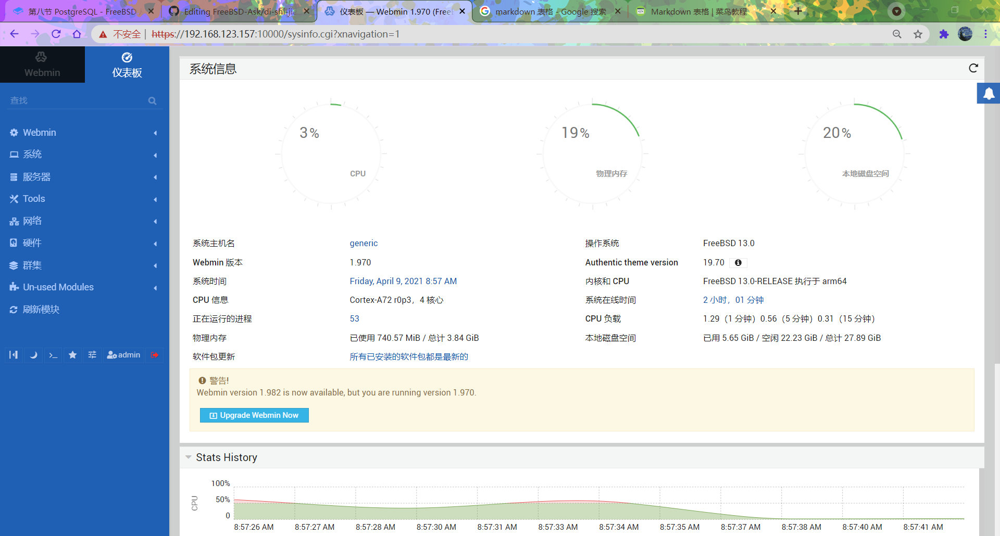

# 16.2 Webmin 管理平台

## Webmin 概述

Webmin 是一款基于 Web 的系统管理工具，支持多种类 Unix 操作系统（FreeBSD、Linux、Solaris），为其提供了图形化管理界面。

Webmin 采用模块化设计，可以用于管理用户账户、磁盘配额、服务配置、网络设置等系统管理任务。

## 安装 Webmin 管理平台

使用 pkg 安装：

```sh
# pkg install webmin
```

或使用 ports 安装：

```sh
# cd /usr/ports/sysutils/webmin/
# make install clean
```

查看安装信息：

```sh
# pkg info -D webmin
webmin-2.013:
On install:
After installing Webmin for the first time you should perform the following
steps as root:
# 安装 Webmin 后，请以 root 用户身份执行以下步骤：

* Configure Webmin by running /usr/local/lib/webmin/setup.sh
# 通过运行 /usr/local/lib/webmin/setup.sh 脚本来配置 Webmin

* Add webmin_enable="YES" to your /etc/rc.conf
# 在 /etc/rc.conf 文件中添加 webmin_enable="YES"，以使 Webmin 在系统启动时自动运行

* Start Webmin for the first time by running "service webmin start"
# 第一次启动 Webmin 时，运行 "service webmin start" 命令来启动 Webmin

The parameters requested by setup.sh may then be changed from within Webmin
itself.
# 通过 setup.sh 配置的参数之后，可以在 Webmin 界面中进行更改
```

## 目录结构

```sh
/
├── usr
│   └── local
│       ├── lib
│       │   └── webmin
│       │       └── setup.sh        # Webmin 配置脚本
│       ├── etc
│       │   └── webmin               # Webmin 配置文件目录
│       └── bin
│           └── perl                 # Perl 解释器
└── var
    └── db
        └── webmin                   # Webmin 日志文件目录
```

## Webmin 配置向导

安装完成后，需通过配置向导进行初始设置，启动 Webmin 安装向导并配置启用 SSL。

`/usr/local/lib/webmin/setup.sh` 为 Webmin 安装目录下的安装脚本，用于配置和初始化 Webmin 服务。

```sh
# /usr/local/lib/webmin/setup.sh 
***********************************************************************
        Welcome to the Webmin setup script, version 2.013
***********************************************************************
Webmin is a web-based interface that allows Unix-like operating
systems and common Unix services to be easily administered.

Installing Webmin in /usr/local/lib/webmin

***********************************************************************
Webmin uses separate directories for configuration files and log files.
Unless you want to run multiple versions of Webmin at the same time
you can just accept the defaults.

Config file directory [/usr/local/etc/webmin]: # 配置文件目录
Log file directory [/var/db/webmin]: # 日志文件目录

***********************************************************************
Webmin is written entirely in Perl. Please enter the full path to the
Perl 5 interpreter on your system.

Full path to perl (default /usr/local/bin/perl): # Perl 解释器路径

Testing Perl ..
.. done

***********************************************************************
Operating system name:    FreeBSD
Operating system version: 14.2

***********************************************************************
Webmin uses its own password protected web server to provide access
to the administration programs. The setup script needs to know :
 - What port to run the web server on. There must not be another
   web server already using this port.
 - The login name required to access the web server.
 - The password required to access the web server.
 - If the web server should use SSL (if your system supports it).
 - Whether to start webmin at boot time.

Web server port (default 10000): # Web 服务器端口号
Login name (default admin): # 登录用户名，直接回车则使用默认 admin
Login password: # 输入密码，密码无回显也不会是 ****，就是什么也没有，下同
Password again: # 再次确认密码
Use SSL (y/n): y # 是否使用 SSL（https）

***********************************************************************
Creating web server config files ..
.. done

Creating access control file ..
.. done

Creating start and stop init scripts ..
.. done

Creating start and stop init symlinks to scripts ..
.. done

Copying config files ..
.. done

Changing ownership and permissions ..
.. done

Running postinstall scripts ..
.. done

Enabling background status collection ..
.. done
```

## 服务管理

配置向导运行完成后，可以通过服务命令来管理 Webmin。

设置开机自启 Webmin 服务：

```sh
# service webmin enable
```

启动 Webmin 服务：

```sh
# service webmin start
```

## 设置中文环境

服务启动后，可以将 Webmin 界面设置为中文显示。在 Webmin 中依次进入 Change Language and Theme，在 `Webmin UI language` 字段中选择 `Personal choice`，然后选择 `Simplified Chinese (ZH_CN.UTF8)`，点击 `Make Changes` 按钮。之后返回菜单 → Dashboard，控制台界面将刷新为中文。

为方便使用，可勾选旁边的“包括机器翻译”选项。

## 使用 Webmin

在浏览器中输入 `https://localhost:10000` 进行本机访问。若从其他机器访问，则输入对应 IP 地址，例如 `https://192.168.123.157:10000`。

按回车键后，如浏览器提示不安全，请选择“继续前往”，随后将显示 Webmin 登录界面。

此界面为 Webmin 管理控制台。在文本框中输入 `admin` 用户名及密码，点击 `Sign In` 登录进入控制台。



## 课后习题

1. 在 FreeBSD 上安装 Webmin 并配置非默认端口 10001，创建一个非 admin 管理员用户，验证该用户可登录并管理系统服务。

2. 分析 Webmin 的权限控制机制，查看其用户认证与权限分配的实现方式。

3. 为 Webmin 进行安全加固，使之适用于生产环境。总结并提交 PR 至本文。
