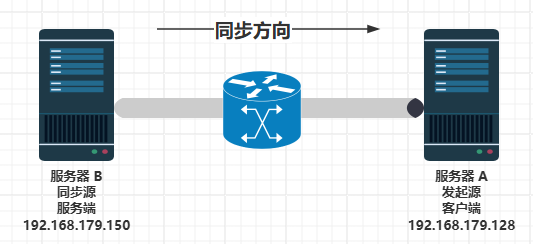

# 第 16.6 节 rsync 同步服务



## 环境概述

- 服务器 A、B 均为 `FreeBSD-12.2-RELEASE-amd64`
- 服务器 A（发起端、客户端）：`192.168.100.10`
- 服务器 B（同步源、服务端）：`192.168.100.20`

设计需求：将服务器 B 的数据同步到服务器 A：B（服务端） ——> A（客户端）。即将 B 镜像到 A。

## 服务器 B（同步源）配置

### 安装 rsync

- 使用 pkg 安装：

```sh
# pkg install rsync
```

- 或使用 Ports 安装：

```
# cd /usr/ports/net/rsync/ 
# make install clean
```

### 查询 rsync 安装后信息

```sh
root@ykla:~ #  pkg info -D rsync
rsync-3.4.1_2:
On install:
Some scripts provided by rsync, such as rrsync,
require Python, which is not installed by default.

安装提示：  
rsync 提供的一些脚本（例如 rrsync）需要 Python
而 Python 默认未安装。
```

### 配置要备份的文件夹 `test`


```sh
# mkdir -p /home/test # 新建需要备份的文件夹 `test`
# chown root /home/test/ # 设置其属主为 `root`
# cd /home/test/ # 切换路径
# touch txt001 txt002 # 在其内部新建测试文件
```

### 编辑 `rsyncd.conf` 文件


编辑 `/usr/local/etc/rsync/rsyncd.conf`，写入：

```sh
# 服务端操作系统的用户
uid = root

# 服务端操作系统的用户的组
gid = wheel

# 禁锢在源目录
use chroot = yes

# 监听地址
address = 192.168.179.150

# 用于通信的 TCP 端口，缺省是 873
port = 873

# 日志文件位置
log file = /var/log/rsyncd.log

# 存档进程 ID 的文件位置
pid file = /var/run/rsyncd.pid

# 允许访问的客户机地址
hosts allow = 192.168.179.128

# 共享模块名称，自定义的名称，不一定要与同步目录相同
[testcom]

# 同步的目录名，必须是 uid 参数指定的用户和 gid 参数指定的组
path = /home/test

# 模块说明文字
comment = testcombackup

# 是否为只读
read only = yes

# 同步时不再压缩的文件类型
dont compress = *.gz *.tgz *.zip *.z *.Z *.rpm *.deb *.bz2

# 授权账户
auth users = root

# 定义 rsync 客户端用户认证的密码文件
secrets file = /etc/rsyncd_users.db
```

### 创建授权备份账户认证的密码文件 (服务端)

- 编辑 `/etc/rsyncd_users.db`，写入：

```sh
root:12345678   # 支持多个用户，一行一个即可。
```

>**注意**
>
>服务端的密码文件应该包含用户名和密码的映射关系。格式为 `授权账户用户名:密码`。

- 限制数据文件权限，否则会报错：

```sh
# chmod 600 /etc/rsyncd_users.db
```

### 服务设置

```sh
# service rsyncd enable # 开机启动
# service rsyncd start  # 启动服务
```

### 查看 rsync 运行端口号

```sh
# sockstat | grep rsync
root     rsync       1198 5   tcp4   192.168.179.150:873   *:*
```

## 服务器 A（发起端）配置

安装好 rsync。

### 配置 `/home/testBackUp/`

创建本地文件夹 `/home/testBackUp/` 并设置好相关权限：

```sh
# mkdir -p /home/testBackUp
# chown root:wheel /home/testBackUp/
```

### 发起端访问同步源

将文件下载到本地 `/home/testBackUp/` 下载目录下，需要手动输入密码：

```sh
# rsync -avz root@192.168.179.150::testcom /home/testBackUp
Password: # 输入服务器 B 设置的密码，即 123456
receiving incremental file list
./
txt001
txt002

sent 65 bytes  received 151 bytes  86.40 bytes/sec
total size is 0  speedup is 0.00
```

`testcom` 是要从服务器同步的目录，由上方 `/usr/local/etc/rsync/rsyncd.conf` 自定义。

#### 附录：指定密码文件方式

创建授权备份账户认证的密码文件（客户端）。

- 编辑 `/etc/rsyncd_users.db`，写入：

```sh
12345678          
```

- 限制权限，否则报错 `ERROR: password file must not be other-accessible`。

```
# chmod 600 /etc/rsyncd_users.db
```

>**注意**
>
>格式为密码，客户端应仅包含密码。

进行同步：

```sh
# rsync -auvz --progress --password-file=/etc/rsyncd_users.db root@192.168.179.150::testcom /home/testBackUp
receiving incremental file list
./
txt001
              0 100%    0.00kB/s    0:00:00 (xfr#1, to-chk=1/3)
txt002
              0 100%    0.00kB/s    0:00:00 (xfr#2, to-chk=0/3)

sent 65 bytes  received 151 bytes  432.00 bytes/sec
total size is 0  speedup is 0.00
```

### 查看同步情况

```sh
root@ykla:~ # ls -l  /home/testBackUp
total 1
-rw-r--r--  1 root wheel 0 Apr 17 18:33 txt001
-rw-r--r--  1 root wheel 0 Apr 17 18:33 txt002
```
