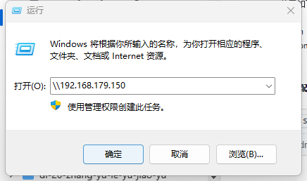
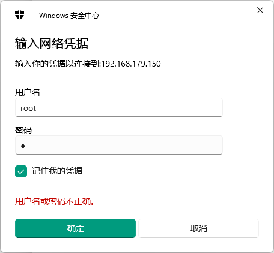
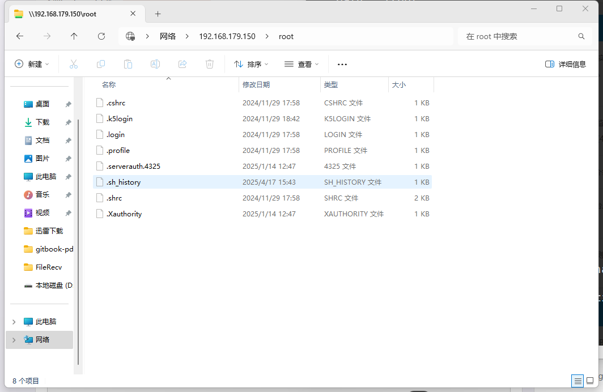

# 第 16.7 节 Samba 服务器

Samba 是对 SMB/CIFS（Server Message Block，服务器消息块）协议的再实现。CIFS（Common Internet File System，通用 Internet 文件系统）是 SMB 的衍生协议。

Samba 也是“桑巴舞”的葡萄牙语/英语对应的单词。有热情奔放的含义。

samba 须开放防火墙的 tcp/139、445 端口；udp/137、138 端口。

## 安装 samba

- 使用 pkg 安装：

```sh
# pkg install samba420
```

- 或使用 Ports 安装：

```sh
# cd /usr/ports/net/samba420/ 
# make install clean
```

## 查看安装后说明

```sh
# pkg info -D samba420
samba420-4.20.7_4:
On install:  # 安装提示：
How to start: http://wiki.samba.org/index.php/Samba4/HOWTO  
如何启动：参见官方指南

* Your configuration is: /usr/local/etc/smb4.conf
* 你的配置文件路径是：/usr/local/etc/smb4.conf

* All the relevant databases are under: /var/db/samba4
* 所有相关数据库位于：/var/db/samba4

* All the logs are under: /var/log/samba4
* 所有日志位于：/var/log/samba4

* Provisioning script is: /usr/local/bin/samba-tool
* # 初始化脚本是：/usr/local/bin/samba-tool

For the working DNS updates you will need to either build dns/bind9* 
# 若需正常使用 DNS 更新功能，你需要：
with the enabled GSSAPI(GSSAPI_MIT5 is recommended) or install        
# 要么构建启用了 GSSAPI（推荐 GSSAPI_MIT5）的 dns/bind9*，
dns/samba-nsupdate package, which is preconfigured with such a support. 
# 要么安装 dns/samba-nsupdate 包，它已预配置了所需支持。

You will need to specify location of the 'nsupdate' command in the    
smb4.conf file:
# 你需要在 smb4.conf 中指定 nsupdate 命令的位置：

    nsupdate command = /usr/local/bin/samba-nsupdate -g  # 示例配置

For additional documentation check: https://wiki.samba.org/index.php/User_Documentation  
# 更多文档请查阅：

Port related bug reports can go to the https://gitlab.com/samba-freebsd/ports/-/issues or  
# 和 FreeBSD port 相关的问题请提交到：

to the FreeBSD Bugzilla https://bugs.freebsd.org/

# 所有 Samba 本身相关的问题请提交到：
All Samba related bug reports should go to the: https://bugzilla.samba.org/  
```

## 配置 samba

- 配置服务

```sh
# service samba_server enable
```

- 创建 `/usr/local/etc/smb4.conf`，添加如下内容并保存


```ini
[global]
    min protocol = SMB2

[root]
    comment = root's stuff
    path = /root
    public = no
    browseable = yes
    writable = yes
    printable = no
    create mask = 0755
```

注释说明：

- `[global]`：全局配置段，适用于所有共享项。
- `min protocol = SMB2`：将最小支持协议限制为 SMB2，以方便高版本 Windows 访问
- `[root]`：定义一个名为 `root` 的共享。
- `comment = root's stuff`：该共享的描述信息，Windows 浏览器中可见。
- `path = /root`：共享的实际路径是 `/root`，**不推荐**在实际环境中共享该目录。
- `public = no`：不允许匿名访问（等同于 `guest ok = no`）。
- `browseable = yes`：可在网络邻居中浏览共享。
- `writable = yes`：允许客户端对该目录进行写入。
- `printable = no`：不是打印机共享。
- `create mask = 0755`：新建文件默认权限为 755，所有者读写，组和其他用户只读。

---

- 创建 samba root 用户，并配置密码：

```sh
# smbpasswd -a root
```

- 启动服务

```sh
# service samba_server start 
```


- 查看 samba 状态：

```sh
# service samba_server status
nmbd is running as pid 1520.
smbd is running as pid 1525.
```

- 在 Windows 下使用如下命令访问共享文件夹（以实际 IP 为准，照抄不管用！）：

>**技巧**
>
>在 Windows 下访问共享文件夹说明：按下 Windows 键 + **R**（小写 r 也可以） 打开“运行”对话框。在对话框中输入以下命令（以实际 IP 地址和共享文件夹名替换示例中的内容）：

```batch
\\192.168.179.150
```



输入刚才创建的用户名 `root`，以及密码：



连接成功：



## 将 Samba 设置为域成员

环境：freebsd 12

### 配置静态 IP 地址

使用如下命令配置：

```sh
# bsdconfig
```

### 配置主机名

在安装系统的时候应该都配置了主机名，你可以在 `/etc/rc.conf` 查看或编辑设置：

```sh
hostname="fb"
```

### 配置 DNS

编辑 `/etc/resolv.conf`，写入：

```sh
# Generated by resolvconf
search SVROS.COM               //设置域控制器域名
# nameserver 192.168.253.2

nameserver 192.168.253.130     //设置域控制器 IP 地址
nameserver 223.5.5.5
nameserver 127.0.0.1
options edns0
```

### 修改 `/etc/sysctl.conf`

```sh
# echo "kern.maxfiles=25600" >> /etc/sysctl.conf
# echo "kern.maxfilesperproc=16384" >> /etc/sysctl.conf
# echo "net.inet.tcp.sendspace=65536" >> /etc/sysctl.conf
# echo "net.inet.tcp.recvspace=65536" >> /etc/sysctl.conf
```

### 创建 `/etc/krb5.conf`

```ini
[libdefaults]
	default_realm = SVROS.COM   //设置域名
	dns_lookup_realm = true
	dns_lookup_kdc = true
	ticket_lifetime = 24h
	renew_lifetime = 7d
	forwardable = yes
```

### 修改 `/etc/nsswitch.conf`

```sh
# sed -i -e "s/^passwd:.*/passwd: files winbind/" /etc/nsswitch.conf
# sed -i -e "s/^group:.*/group: files winbind/" /etc/nsswitch.conf
```

### 创建 `/usr/local/etc/smb4.conf`

```ini
[global]
	workgroup = SVROS
	server string = Samba Server Version %v
	security = ads
	realm = SVROS.COM
	domain master = no
	local master = no
	preferred master = no
	socket options = TCP_NODELAY IPTOS_LOWDELAY SO_RCVBUF=131072 SO_SNDBUF=131072
	use sendfile = true

	idmap config * : backend = tdb
	idmap config * : range = 100000-299999
	idmap config SVROS : backend = rid
	idmap config SVROS : range = 10000-99999
	winbind separator = +
	winbind enum users = yes
	winbind enum groups = yes
	winbind use default domain = yes
	winbind nested groups = yes
	winbind refresh tickets = yes
	template homedir = /home/%D/%U
	template shell = /bin/false

	client use spnego = yes
	client ntlmv2 auth = yes
	encrypt passwords = yes
	restrict anonymous = 2
	log file = /var/log/samba4/log.%m
	max log size = 50

#============================ 自定义共享信息 ==============================

[testshare]
	comment = Test share
	path = /samba/testshare
	read only = no
	force group = "Domain Users"
	directory mode = 0770
	force directory mode = 0770
	create mode = 0660
	force create mode = 0660
```

上面“testshare”最后两行内容实际使用权限优化（可选）

```sh
create mode = 0750
force create mode = 0750
```

### 将 samba 加入到域

```sh
net ads join --no-dns-updates -U administrator
net ads testjoin
# Should report "Join is OK"
# On your DC, open the DNS MMC and add an "A" entry for your BSD server so clients can find it
```

### 使 samba 启动并设置为开机自启动

```sh
# echo "samba_server_enable=YES" >> /etc/rc.conf
# echo "winbindd_enable=YES" >> /etc/rc.conf
# service samba_server start
```

### 测试 Kerberos

```sh
kinit administrator
# Enter domain admin password, it should return to the prompt with no errors
klist
# Credentials cache: FILE:/tmp/krb5cc_0
#    Principal: administrator@SVROS.COM
#
# Issued                Expires               Principal
# Dec  6 10:15:39 2021  Feb  4 20:15:39 2021  krbtgt
```

### 测试 Winbind

```sh
wbinfo -u
# 应该会返回域用户列表

wbinfo -g
# 应该会返回域用户组列表

getent passwd
# 用户列表末尾应该包含 UID 大于 10000 的域用户

getent group
# 用户组列表末尾应该包含 GID 大于 10000 的域用户组
```

### 如果 wbinfo 命令显示报错，请执行命令

```sh
# service samba_server restart
```

### 创建共享文件夹

```sh
# mkdir -p /samba/testshare
# chown "administrator":"domain users" /samba/testshare
# chmod 0770 /samba/testshare
```

如果只允许属主可读可写，属组只允许读，用以下命令设置：

```sh
# chmod 0750 /samba/testshare
```

如果只允许属主可读可写，属组和其他均不可读写，用以下命令设置：

```sh
# chmod -R 0700 /samba/testshare
```

## 故障排除与未竞事宜

Samba 日志位于 `/var/log/samba4`。
