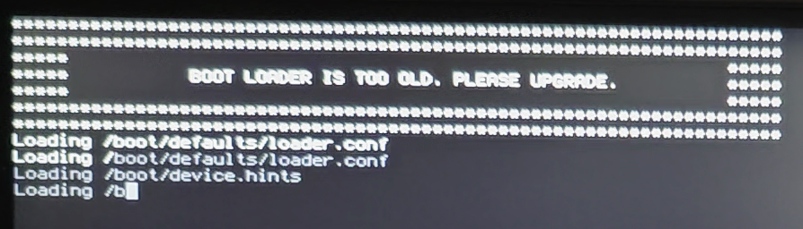
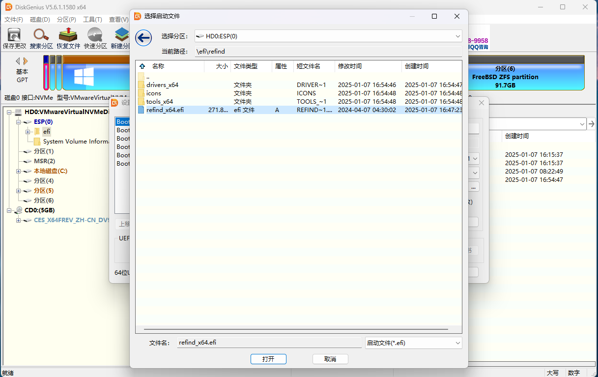
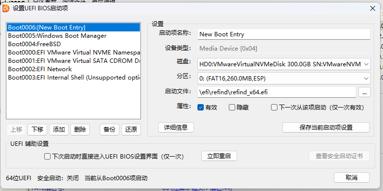
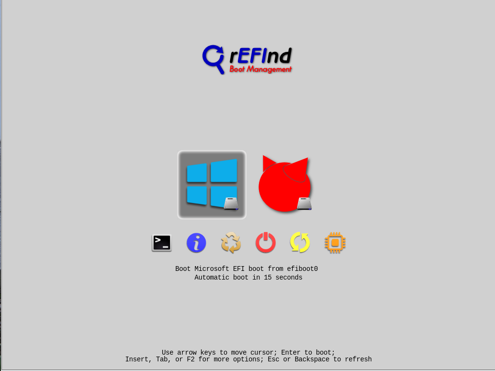

# 16.2 引导管理器与 UEFI 固件

统一可扩展固件接口（Unified Extensible Firmware Interface，UEFI）是现代计算机的固件接口标准，旨在取代传统的基本输入输出系统（BIOS）。

UEFI 规范定义了操作系统与平台固件之间的接口，提供了启动服务（Boot Services）和运行时服务（Runtime Services），以及用于存储启动变量的非易失性存储空间。

FreeBSD 同时支持传统的 MBR 标准和 GUID 分区表（GUID Partition Table，GPT）引导方式。GPT 分区通常出现在使用 UEFI 固件的计算机上，但 FreeBSD 也可以通过 gptboot(8) 在仅有传统 BIOS 的机器上从 GPT 分区引导。

UEFI 引导过程与传统 BIOS 引导过程在架构上有所不同。

在传统 BIOS 系统中，固件读取主引导记录（MBR）中的引导代码并执行。

在 UEFI 系统中，固件直接从 EFI 系统分区（ESP）上的 FAT32 文件系统中加载 EFI 应用程序。ESP 是一个专用分区，其分区类型 GUID 为 `C12A7328-F81F-11D2-BA4B-00A0C93EC93B`，通常挂载于 **/boot/efi**。UEFI 引导加载程序是 `loader.efi`。其加载方式有两种：通过 efibootmgr(8) 配置或作为默认引导程序放置时，由固件直接加载；当 `loader.efi` 位于 UFS 或 ZFS 文件系统内时，则由固件先加载 `boot1.efi`，再由 `boot1.efi` 加载 `loader.efi`。使用 bsdinstall(8) 安装的系统，`loader.efi` 由固件直接加载。

## UEFI 系统检测方法

efibootmgr 是 FreeBSD 基本系统中用于查看和管理 EFI 启动项的工具，与 UEFI 固件交互以操作启动项配置。

在非 UEFI 环境下运行 efibootmgr 将报错 `efi variables not supported on this system`。

```sh
# efibootmgr
efibootmgr: efi variables not supported on this system. root? kldload efirt?
```

如果当前系统是 UEFI，efibootmgr 会输出类似以下内容：

```sh
# efibootmgr
Boot to FW : false
BootCurrent: 0004
BootOrder  : 0004, 0000, 0001, 0002, 0003
+Boot0004* FreeBSD
Boot0000* EFI VMware Virtual SCSI Hard Drive (0.0)
Boot0001* EFI VMware Virtual IDE CDROM Drive (IDE 1:0)
Boot0002* EFI Network
Boot0003* EFI Internal Shell (Unsupported option)
```

## UEFI 与 efibootmgr

- 查看当前启动项：

```sh
# efibootmgr
Boot to FW : false
BootCurrent: 0001
Timeout    : 1 seconds
BootOrder  : 0002, 0003, 0000, 0001
 Boot0002* Windows Boot Manager
 Boot0003* UEFI OS
 Boot0000* refind
+Boot0001* freebsd # + 为默认启动项
```

> **技巧**
>
> 使用 `efibootmgr -v` 可查看详细信息。

设置 rEFInd 优先启动（这并非将其设为默认启动项，仅改变 BIOS/UEFI 中的启动顺序）：

设置 EFI 启动顺序为 0000, 0001, 0002, 0003：

```sh
# efibootmgr -o 0000,0001,0002,0003
Boot to FW : false
BootCurrent: 0001
Timeout    : 1 seconds
BootOrder  : 0000, 0001, 0002, 0003
 Boot0000* refind
+Boot0001* freebsd
 Boot0002* Windows Boot Manager
 Boot0003* UEFI OS
```

> **警告**
>
> 不应使用 `efibootmgr -o 0000` 直接指定启动顺序，这样会将 BootOrder 设置为仅包含 0000，导致其他启动项被排除在启动顺序之外（启动项本身仍然存在，但不会被固件尝试引导）。

## UEFI 操作实例

多硬盘系统中，有时需要将分散的 EFI 分区合并为单一分区管理，以简化启动配置。以下示例演示如何将两块硬盘上的 EFI 配置文件统一到一块硬盘的 EFI 分区中。

EFI 分区的目录结构如下：

```sh
/mnt/efi/                  # EFI 分区挂载点
└── EFI/
    ├── freebsd/            # FreeBSD 引导文件目录
    │   └── loader.efi      # FreeBSD UEFI 引导程序
    ├── Boot/                # 默认引导目录
    │   └── bootx64.efi     # UEFI 平台默认回退引导程序
    └── Microsoft/           # Windows 引导目录（双系统场景）
```

此示例删除 nda0 上由 FreeBSD 安装生成的 EFI 分区，并将 FreeBSD 的引导文件迁移到 `ada0` 硬盘的 EFI 分区中。

首先关闭 Windows 的快速启动，命令为 `powercfg /h off`（若能进入 BIOS 设置界面，则无需关闭）。

随后关机并重启进入 FreeBSD 系统，创建挂载点：

```sh
# mkdir /mnt/efi
```

检测 `ada0p1`（硬盘的第一个分区）是否为待挂载的 EFI 分区，输入命令：

```sh
# fstyp /dev/ada0p1 # 检测 /dev/ada0p1 分区的文件系统类型，但不修改
```

上述命令输出为 `ntfs`，说明该分区不是 EFI 分区；

再检查第二块分区：

```sh
# fstyp /dev/ada0p2 # 检测 /dev/ada0p2 分区的文件系统类型
```

输出 `msdosfs`，表明这是 Windows 磁盘上的 EFI 分区。

接下来挂载 ada0 磁盘上的 EFI 分区到 FreeBSD 的 **/mnt/efi**：

```sh
# mount -t msdosfs /dev/ada0p2 /mnt/efi
```

为 FreeBSD 引导项在 EFI 路径下创建目录：

```sh
# mkdir /mnt/efi/EFI/freebsd
```

将 FreeBSD 启动文件复制到该路径：

```sh
# cp /boot/loader.efi /mnt/efi/EFI/freebsd/loader.efi
```

创建 EFI 启动项“FreeBSD 15.0”，指向 FreeBSD 的引导程序：

```sh
# efibootmgr -a -c -l /mnt/efi/EFI/freebsd/loader.efi -L "FreeBSD 15.0"
```

重启进入 Windows，使用 EasyUEFI 激活 `FreeBSD 15.0` 启动项。

确认 FreeBSD 可正常启动后，才能使用 [DiskGenius](https://www.diskgenius.cn/) 或其他分区工具删除 nda0 磁盘的 EFI 分区及其文件。

## 更新 EFI 引导

### 背景介绍

> **警告**
>
> 使用 EFI 引导的系统，EFI 系统分区（ESP）上有引导加载程序的副本，用于固件引导内核。如果根文件系统是 ZFS，则引导加载程序必须能读取 ZFS 引导文件系统。系统升级后、执行 `zpool upgrade` 前，必须先更新 ESP 上的引导加载程序，否则系统可能无法引导。虽然不是强制性的，但在 UFS 作为根文件系统时也应如此。

可以使用命令 `efibootmgr -v` 来确定当前引导加载程序的位置。`BootCurrent` 的值是当前引导系统所用的引导项编号。输出的相应条目以 `+` 开头，如下所示：

```sh
# efibootmgr -v
Boot to FW : false
BootCurrent: 0004
BootOrder  : 0004, 0000, 0001, 0002, 0003
+Boot0004* FreeBSD HD(1,GPT,f83a9e2f-bd87-11ef-95b7-000c29761cd2,0x28,0x82000)/File(\efi\freebsd\loader.efi) # 注意此行
                      nda0p1:/efi/freebsd/loader.efi (null)
 Boot0000* EFI VMware Virtual NVME Namespace (NSID 1) PciRoot(0x0)/Pci(0x15,0x0)/Pci(0x0,0x0)/NVMe(0x1,00-00-00-00-00-00-00-00)
 Boot0001* EFI VMware Virtual IDE CDROM Drive (IDE 1:0) PciRoot(0x0)/Pci(0x7,0x1)/Ata(Secondary,Master,0x0)
 Boot0002* EFI Network PciRoot(0x0)/Pci(0x11,0x0)/Pci(0x1,0x0)/MAC(000c29761cd2,0x0)
 Boot0003* EFI Internal Shell (Unsupported option) MemoryMapped(0xb,0xbeb4d018,0xbf07e017)/FvFile(c57ad6b7-0515-40a8-9d21-551652854e37)


Unreferenced Variables:
```

ESP 通常已挂载到 **/boot/efi**。如果没有，可手动挂载，使用 `efibootmgr` 输出中列出的分区（本例为 `nda0p1`）：`mount_msdosfs /dev/nda0p1 /boot/efi`。另一示例请参阅 [loader.efi(8)](https://man.freebsd.org/cgi/man.cgi?query=loader.efi&sektion=8)。

`efibootmgr -v` 输出中 `File` 字段的值，如 **\efi\freebsd\loader.efi**，即 EFI 系统分区中当前使用的引导加载程序路径。若挂载点是 **/boot/efi**，则此文件为 **/boot/efi/efi/freebsd/loader.efi**。（在 FAT32 文件系统上大小写不敏感；FreeBSD 使用小写）`File` 的另一个常见值可能是 **\EFI\boot\bootXXX.efi**，其中 `XXX` 是 amd64（即 `x64`）、aarch64（即 `aa64`）或 riscv64（即 `riscv64`）；如未配置，则为默认引导加载程序。应将 **/boot/loader.efi** 复制到 **/boot/efi** 中的正确路径以更新已配置及默认的引导加载程序。

### 更新方法

在版本更新后，系统启动时可能会出现引导加载程序版本过旧的提示。

> **注意**
>
> 该界面出现的时间较短，在快速启动的系统中可能一闪而过。可使用相机拍摄后观察。

系统检测到引导加载程序版本过旧时，会显示如下类似提示界面。



即

```sh
**************************************************************
**************************************************************
*****                                                    *****
*****      BOOT LOADER IS TOO OLD, PLEASE UPGRADE.       *****
*****                                                    *****
**************************************************************
**************************************************************
```

loader 需要更新。还可以通过以下命令验证版本：

```sh
# strings /boot/efi/efi/freebsd/loader.efi | grep FreeBSD | grep EFI  # 查看 EFI 引导加载程序版本
FreeBSD/amd64 EFI loader, Revision 1.1

# strings /boot/loader.efi | grep FreeBSD | grep EFI  # 查看 /boot/loader.efi 的 EFI 引导加载程序版本
FreeBSD/amd64 EFI loader, Revision 3.0
```

**/boot/efi/efi/freebsd/loader.efi** 为当前正在使用的 loader（版本确实较旧）。

将 **/boot/loader.efi** 复制到 EFI 系统分区的 FreeBSD 目录下进行更新：

```sh
# cp /boot/loader.efi /boot/efi/efi/freebsd/
```

> **警告**
>
> 请先更新 loader，再更新 ZFS 版本！

> **重要**
>
> 非 EFI、bootcode、ZFS 等相关更新请自行查阅相关章节。

## Grub

测试表明，UEFI + ZFS 环境中，GRUB 直接引导 FreeBSD 内核存在兼容性问题，通常推荐使用 chainload 机制（如配置 `chainloader +1`）间接引导。传统 BIOS 启动 + UFS 根文件系统环境中，GRUB 可通过 `kfreebsd` 命令直接引导 FreeBSD 内核。

```ini
menuentry "FreeBSD 14.2-RELEASE" { # 指定 GRUB 条目名称
set root='(hd0,gpt1)'  # 根据实际情况确认，此处为 EFI 系统分区
chainloader /EFI/freebsd/loader.efi # 指定 FreeBSD 的 EFI 引导文件
}
```

### 故障排除

目前配置的报错（`grub2-efi` FreeBSD 15.0）：

```sh
# grub-install --target=x86_64-efi --efi-directory=/boot/efi/efi/ --bootloader-id=grub --boot-directory=/boot/ --modules="part_gpt part_msdos bsd zfs"
grub-install: error: relocation 0x4 is not implemented yet.
# grub-install --target=x86_64-efi --efi-directory=/boot/efi/efi/ --bootloader-id=grub --boot-directory=/boot/ --modules="part_gpt part_msdos bsd zfs"
Installing for x86_64-efi platform.
grub-install: error: unknown filesystem.
```

添加参数 `-vvv` 可查看详细错误信息，输出内容较长，可在 <https://gist.github.com/ykla/9b6de6c8d4eee524840acb9981bf850a> 查看。

## rEFInd 引导管理器（多系统引导管理）

多系统环境下，频繁进入 BIOS 固件界面切换操作系统较为不便。可借助 [rEFInd](https://www.rodsbooks.com/refind/) 实现类似于 Clover 的可视化启动菜单效果，开机时直观地选择要进入的操作系统。

`rEFInd` 派生自 `rEFIt`，其名称可理解为“re-find”（意为“重新发现”）与“EFI”（Extensible Firmware Interface，可扩展固件接口）的组合，主要用于管理 UEFI 启动，提供图形化界面与灵活的配置选项。

首先需要下载 rEFInd 软件。打开下载页面 [Getting rEFInd from Sourceforge](https://www.rodsbooks.com/refind/getting.html)，点击 `A binary zip file` 链接开始下载。本节撰写时使用的版本为 `refind-bin-0.14.2.zip`。

下载的压缩包中，仅部分文件是必需的启动文件。仅需保留其中的 `refind` 文件夹，其余文件无需使用。

`refind` 文件夹中也仅包含部分必需的启动文件。所有文件名中包含 `aa64` 或 `ia32` 的文件均可删除（通常仅保留 `x64` 版本）。

最终需要保留的文件如下图所示。


将 `refind.conf-sample` 文件复制一份，并重命名为 `refind.conf`。

通常无需手动配置。但若出现无法自动识别现有操作系统的情况，请按以下方法手动添加引导项：

打开 `refind.conf` 文件，在任意空白处添加如下配置：

```ini
menuentry "FreeBSD" {
	icon \EFI\refind\icons\os_freebsd.png
	volume "FreeBSD"
	loader \EFI\freebsd\loader.efi
}

menuentry "Windows 10" {
	icon \EFI\refind\icons\os_win.png
	volume "Windows 10"
	loader \EFI\Microsoft\Boot\bootmgfw.efi
}
```

目录结构：

```sh
EFI/
├── refind/
│   ├── refind.conf        # rEFInd 主配置文件
│   ├── refind.conf-sample # rEFInd 示例配置文件
│   ├── refind_x64.efi     # rEFInd 64 位启动文件
│   ├── icons/
│   │   ├── os_freebsd.png # FreeBSD 图标
│   │   └── os_win.png    # Windows 图标
│   └── themes/
│       └── Matrix-rEFInd/
│           └── theme.conf  # Matrix 主题配置
├── freebsd/
│   └── loader.efi        # FreeBSD 引导加载程序
└── Microsoft/
    └── Boot/
        └── bootmgfw.efi   # Windows 启动管理器
```

使用 [DiskGenius](https://www.diskgenius.com/) 将处理后的 `refind` 文件夹复制到 EFI 系统分区（ESP）的 `EFI` 目录下。


### 添加启动项

使用 [DiskGenius](https://www.diskgenius.com/) 添加 UEFI 引导项。


点击菜单栏的“工具”，选择“设置 UEFI BIOS 启动项”。


在新窗口中点击“添加”，随后浏览并选中 `refind` 文件夹内的 `refind_x64.efi` 文件。



将该启动项移动至列表顶部，设为第一启动项。保存设置并重启电脑以测试效果。





重启后，在 rEFInd 界面中选择任一操作系统选项，即可进入相应系统。

### 附录：rEFInd 主题

rEFInd 支持多种图形化主题。

本例以 Matrix-rEFInd（灵感来源于电影《黑客帝国》）主题为例来说明。

项目地址为：[Matrix-rEFInd](https://github.com/Yannis4444/Matrix-rEFInd/)

下载项目压缩包 `Matrix-rEFInd-master.zip` 并解压。将解压得到的文件夹 `Matrix-rEFInd-master` 重命名为 `Matrix-rEFInd`。

在本地新建目录 `themes`，将重命名后的 `Matrix-rEFInd` 文件夹放入其中。

将此 `themes` 目录整体复制到 EFI 系统分区中的 **EFI\refind\** 目录下。

编辑 `refind.conf` 文件（如果无法直接在 ESP 中编辑，可将其复制到桌面，修改后覆盖原文件），在文件末尾添加一行：

```ini
include themes/Matrix-rEFInd/theme.conf
```

即可调用主题 Matrix-rEFInd。

重启之后观察效果：


> **技巧**
>
> 如果在虚拟机（如 VMware、VirtualBox）中操作，由于其 UEFI 固件的屏幕分辨率限制，rEFInd 界面可能无法同时显示所有操作系统选项，需通过方向键切换查看，这与上图所示的效果可能不同。

## 参考文献

- Microsoft. set id (Diskpart)[EB/OL]. (2024-11-01)[2026-04-28]. <https://learn.microsoft.com/en-us/windows-server/administration/windows-commands/set-id>. EFI 系统分区的 GUID 是 c12a7328-f81f-11d2-ba4b-00a0c93ec93b。
- Smith R W. rEFInd Boot Manager[EB/OL]. [2026-04-17]. <https://www.rodsbooks.com/refind/>. rEFInd 官方网站，该引导管理器派生自 rEFIt 项目，用于管理 UEFI 环境下的多系统启动。
- archlinuxcn. efibootmgr 无法添加 UEFI 启动项[EB/OL]. [2026-03-26]. <https://bbs.archlinuxcn.org/viewtopic.php?id=12914>. 讨论 efibootmgr 在部分固件上无法写入启动项的原因与替代方案。
- FreeBSD Project. efibootmgr(8)[EB/OL]. [2026-03-26]. <https://man.freebsd.org/cgi/man.cgi?query=efibootmgr&sektion=8>. UEFI 启动管理器手册页。
- emacs_8861834. 深入掌握 efibootmgr 操作要领安全删除启动项方法解析[EB/OL]. [2026-03-26]. <https://my.oschina.net/emacs_8861834/blog/17450288>. 详解 efibootmgr 各子命令的用法及安全删除启动项的注意事项。
- Stack Exchange. Working GRUB configuration for UEFI booting FreeBSD[EB/OL]. [2026-03-26]. <https://unix.stackexchange.com/questions/354260/working-grub-configuration-for-uefi-booting-freebsd>. 提供 GRUB 引导 FreeBSD 的可用配置示例与排错经验。
- Reddit. Trying to boot FBSD13 via grub2[EB/OL]. [2026-03-26]. <https://www.reddit.com/r/freebsd/comments/q4qgq9/trying_to_boot_fbsd13_via_grub2/>. 讨论通过 GRUB2 引导 FreeBSD 13 时遇到的常见问题。

## 课后习题

1. 在 QEMU 中测试 UEFI 固件下 FreeBSD 引导的多阶段流程，验证 EFI loader、loader.efi 和内核加载的各个阶段。
2. 尝试在 FreeBSD 上编译 Clover 引导管理器，记录编译过程中的平台适配问题。
3. 安装 FreeBSD 时，创建独立的 EFI 分区与 freebsd-boot 分区，对比两种引导方式下系统启动日志的差异。
