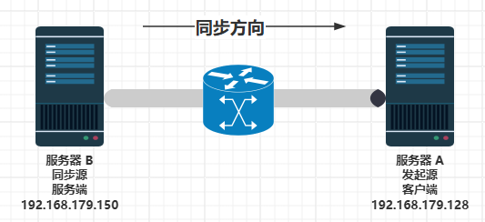

# 17.6 Rsync 数据同步

## Rsync 概述

Rsync（Remote Sync，远程同步）是由 Andrew Tridgell 和 Paul Mackerras 共同开发的高效文件同步工具。Rsync 采用增量传输算法，仅传输文件中发生变化的部分，显著减少网络带宽消耗与同步时间，是系统备份与数据镜像的常用工具。

## 环境概述

开始配置之前，先了解本节使用的环境。首先介绍本节配置涉及的两台服务器。



- 服务器 A（发起端、客户端）：`192.168.179.128`
- 服务器 B（同步源、服务端）：`192.168.179.150`

设计需求：将服务器 B 的数据同步到服务器 A，即 B（服务端）→ A（客户端），将服务器 B 的数据完整镜像到服务器 A。

## 服务器 B（同步源）配置

首先配置同步源服务器，即服务器 B。

### 安装 rsync

在服务器 B 上安装 rsync，有两种方式可供选择：

- 使用 pkg 安装：

```sh
# pkg install rsync
```

- 或使用 Ports 安装：

```sh
# cd /usr/ports/net/rsync/
# make install clean
```

### 安装后信息查看

```sh
# pkg info -D rsync
rsync-3.4.1_2:
On install:
Some scripts provided by rsync, such as rrsync,
require Python, which is not installed by default.

安装提示：
rsync 提供的一些脚本（例如 rrsync）需要 Python
而 Python 默认未安装。
```

### 同步目录准备

```sh
# mkdir -p /home/test # 新建用于备份的文件夹 `test`
# chown root /home/test/ # 设置文件夹属主为 `root`
# cd /home/test/ # 切换路径
# touch txt001 txt002 # 在文件夹内创建测试文件
```

文件结构：

```sh
/
├── home
│   ├── test                              # 服务器 B 的同步源目录
│   │   ├── txt001                         # 测试文件 1
│   │   └── txt002                         # 测试文件 2
│   └── testBackUp                         # 服务器 A 的本地备份目录
├── usr
│   └── local
│       └── etc
│           └── rsync
│               └── rsyncd.conf           # rsyncd 服务端主配置文件
├── var
│   ├── log
│   │   └── rsyncd.log                     # rsyncd 服务日志
│   └── run
│       └── rsyncd.pid                     # rsyncd 进程 ID 文件
└── etc
    └── rsyncd_users.db                     # rsync 用户认证密码文件
```

### 服务端主配置文件

编辑 `/usr/local/etc/rsync/rsyncd.conf` 文件，写入：

```ini
# 服务端操作系统的用户
uid = root

# 服务端操作系统用户所属的组
gid = wheel

# 限制在源目录
use chroot = yes

# 监听地址
address = 192.168.179.150

# 通信使用的 TCP 端口，默认端口为 873
port = 873

# 日志文件位置
log file = /var/log/rsyncd.log

# 存档进程 ID 的文件位置
pid file = /var/run/rsyncd.pid

# 允许访问的客户机地址
hosts allow = 192.168.179.128

# 共享模块名称，自定义的名称，不一定要与同步目录相同
[testcom]

# 同步的目录路径，必须属于 uid 参数指定的用户和 gid 参数指定的组
path = /home/test

# 模块说明文字
comment = testcombackup

# 是否为只读
read only = yes

# 同步时不压缩的文件类型
dont compress = *.gz *.tgz *.zip *.z *.Z *.rpm *.deb *.bz2

# 授权账户
auth users = root

# 定义 rsync 客户端用户认证的密码文件
secrets file = /etc/rsyncd_users.db
```

### 创建用于授权备份账户认证的密码文件（服务端）

- 编辑 `/etc/rsyncd_users.db` 文件，写入：

```sh
root:12345678   # 支持多个用户，每行一个
```

> **注意**
>
> 服务端的密码文件应该包含用户名和密码的映射关系。格式为 `授权账户用户名:密码`。

- 限制数据文件权限，否则会报错：

```sh
# chmod 600 /etc/rsyncd_users.db
```

设置 rsync 用户数据库文件的权限为仅所有者可读写。

### 服务启动配置

```sh
# service rsyncd enable   # 设置 rsync 服务开机自动启动
# service rsyncd start    # 启动 rsync 服务
```

### 服务端口验证

查看 rsync 服务使用的网络端口和对应进程：

```sh
# sockstat | grep rsync
root     rsync       1198 5   tcp4   192.168.179.150:873   *:*
```

## 服务器 A（发起端）配置

请自行参照上文安装 rsync。

### 本地备份目录配置

创建用于本地备份目录 `/home/testBackUp/` 并设置相应权限：

```sh
# mkdir -p /home/testBackUp                 # 创建备份目录
# chown root:wheel /home/testBackUp/       # 设置目录所有者为 root，组为 wheel
```

### 同步操作（密码输入方式）

将文件下载到本地 `/home/testBackUp/` 下载目录下，需要手动输入密码。

```sh
# rsync -avz root@192.168.179.150::testcom /home/testBackUp  # 用 rsync 从远程 testcom 模块同步文件到本地备份目录
Password: # 输入服务器 B 设置的密码
receiving incremental file list
./
txt001
txt002

sent 65 bytes  received 151 bytes  86.40 bytes/sec
total size is 0  speedup is 0.00
```

`testcom` 是在 `/usr/local/etc/rsync/rsyncd.conf` 文件中自定义的同步模块名称，对应服务器上的目录。

#### 附录：指定密码文件方式

创建授权备份账户认证的密码文件（客户端）。

- 编辑客户端的 `/etc/rsyncd_users.db` 文件，仅写入密码：

```sh
12345678
```

- 限制权限，否则将触发错误 `ERROR: password file must not be other-accessible`。

```sh
# chmod 600 /etc/rsyncd_users.db
```

设置 rsync 用户数据库文件权限为仅所有者可读写。

> **注意**
>
> 格式为密码，客户端应仅包含密码。

进行同步。

使用 rsync 将远程 `testcom` 模块同步到本地备份目录，显示同步进度，并指定密码文件。

```sh
# rsync -auvz --progress --password-file=/etc/rsyncd_users.db root@192.168.179.150::testcom /home/testBackUp
receiving incremental file list
./
txt001
              0 100%    0.00kB/s    0:00:00 (xfr#1, to-chk=1/3)
txt002
              0 100%    0.00kB/s    0:00:00 (xfr#2, to-chk=0/3)

sent 65 bytes  received 151 bytes  432.00 bytes/sec
total size is 0  speedup is 0.00
```

### 同步结果验证

列出本地备份目录中的详细文件信息：

```sh
# ls -l  /home/testBackUp
total 1
-rw-r--r--  1 root wheel 0 Apr 17 18:33 txt001
-rw-r--r--  1 root wheel 0 Apr 17 18:33 txt002
```

## 参考文献

- Tridgell A, Mackerras P. The rsync algorithm[EB/OL]. [2026-04-17]. <https://rsync.samba.org/tech_report/>. rsync 算法的原始技术报告，由两位作者共同发表。

## 课后习题

1. 比较 rsync 和 zfs-send/zfs-receive 技术。

2. 进行安全加固，使之适用于生产环境。总结并提交 PR 至本节。
