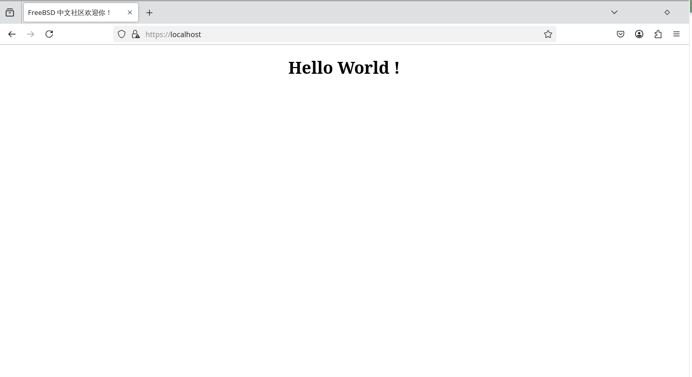

# 17.10 Caddy

## 安装 Caddy

使用 pkg 安装：

```sh
# pkg ins caddy
```

或使用 ports 安装：

```sh
# cd /usr/ports/www/caddy/ 
# make install clean
```

## 查看安装后配置

```sh
# pkg info -D caddy
caddy-2.9.1:
On install:
To enable caddy:
# 启用 Caddy：

- Edit /usr/local/etc/caddy/Caddyfile
  See https://caddyserver.com/docs/
# - 编辑 /usr/local/etc/caddy/Caddyfile
#   参见 https://caddyserver.com/docs/ 获取更多配置信息

- Run 'service caddy enable'
# - 运行 'service caddy enable' 来启用 Caddy 服务，使其在系统启动时自动启动

Note while Caddy currently defaults to running as root:wheel, it is strongly
recommended to run the server as an unprivileged user, such as www:www --
# 注意，虽然 Caddy 当前默认以 root:wheel 运行，但强烈建议将其作为一个非特权用户运行，如 www:www。

- Use security/portacl-rc to enable privileged port binding:
# - 使用 security/portacl-rc 来启用特权端口绑定：

  # pkg install security/portacl-rc
  # sysrc portacl_users+=www
  # sysrc portacl_user_www_tcp="http https"
  # sysrc portacl_user_www_udp="https"
  # service portacl enable
  # service portacl start
#   这些命令安装并启用 portacl 端口访问控制，允许非特权用户（如 www）绑定 HTTP 和 HTTPS 端口

- Configure caddy to run as www:www
# - 配置 Caddy 以 www:www 用户身份运行

  # sysrc caddy_user=www caddy_group=www
#   使用该命令来将 Caddy 配置为以 www:www 用户和组运行

- Note if Caddy has been started as root previously, files in
  /var/log/caddy, /var/db/caddy, and /var/run/caddy may require their ownership
  changing manually.
# 注意，如果 Caddy 曾作为 root 启动过，/var/log/caddy、/var/db/caddy 和 /var/run/caddy 中的文件可能需要手动更改文件的所有权。

/usr/local/etc/rc.d/caddy has the following defaults:
# /usr/local/etc/rc.d/caddy 默认配置如下：

- Server log: /var/log/caddy/caddy.log
  (runtime messages, NOT an access.log)
# - 服务器日志：/var/log/caddy/caddy.log
#   该文件包含运行时日志信息，而非访问日志

- Automatic SSL certificate storage: /var/db/caddy/data/caddy/
# - 自动 SSL 证书存储位置：/var/db/caddy/data/caddy/

- Administration endpoint: //unix/var/run/caddy/caddy.sock
# - 管理端点：//unix/var/run/caddy/caddy.sock
#   管理接口通过 Unix 套接字访问

- Runs as root:wheel (this will change to www:www in the future)
# - 目前默认以 root:wheel 用户身份运行，未来将更改为 www:www 用户身份运行

On upgrade from caddy<2.3.0:
The default locations for caddy runtime files have changed!
# 从 caddy<2.3.0 升级：
# Caddy 运行时文件的默认位置已更改！

- Caddy's runtime log is now /var/log/caddy/caddy.log
  (was /var/log/caddy.log)
# - Caddy 运行时日志现在位于 /var/log/caddy/caddy.log（之前是 /var/log/caddy.log）

- Automatic SSL certs are now stored in /var/db/caddy/data/caddy
  (was /root/.local/share/caddy)
# - 自动 SSL 证书现在存储在 /var/db/caddy/data/caddy（之前是 /root/.local/share/caddy）

- Configuration autosaves are now stored in /var/db/caddy/config/caddy
  (was /root/.config/caddy)
# - 配置自动保存现在存储在 /var/db/caddy/config/caddy（之前是 /root/.config/caddy）

You can change these defaults. See /usr/local/etc/rc.d/caddy
# 你可以更改这些默认设置。请查看 /usr/local/etc/rc.d/caddy 文件了解更多信息

On upgrade from caddy<2.7.4_2:
The default Caddy administration endpoint location has been changed from
localhost:2019 to a protected Unix domain socket located in
/var/run/caddy/caddy.sock
# 从 caddy<2.7.4_2 升级：
# 默认的 Caddy 管理端点位置已从 localhost:2019 更改为受保护的 Unix 域套接字，
# 位于 /var/run/caddy/caddy.sock

This can be overridden with the `caddy_admin` rc variable, or by specifying
an alternative in the Caddyfile `admin` section, documented here:
# 这可以通过 `caddy_admin` rc 变量覆盖，或者在 Caddyfile 的 `admin` 部分指定，详细信息请参阅这里：

  https://caddyserver.com/docs/caddyfile/options#admin

The previous default, particularly paired with the server running as root,
may have serious security implications for shared machines with untrusted
users.
# 之前的默认设置，尤其是与 root 身份一起使用时，可能会对共享机器带来严重的安全隐患，特别是在不信任的用户环境下。

On upgrade:
It is STRONGLY RECOMMENDED to run Caddy as an unprivileged user, such as
www:www, rather than the current default of root:wheel.
# 升级时：
# 强烈建议将 Caddy 以非特权用户身份运行，如 www:www，而不是当前默认的 root:wheel。

If you have relied upon earlier defaults:
# 如果你依赖于早期的默认设置：

- Use security/portacl-rc to enable privileged port binding:
# - 使用 security/portacl-rc 启用特权端口绑定：

  # pkg install security/portacl-rc
  # sysrc portacl_users+=www
  # sysrc portacl_user_www_tcp="http https"
  # sysrc portacl_user_www_udp="https"
  # service portacl enable
  # service portacl start
#   安装并配置 portacl 以便允许非特权用户（如 www）绑定 HTTP 和 HTTPS 端口

- Stop the server, and update ownership on Caddy runtime files:
# - 停止服务器，并更新 Caddy 运行时文件的所有权：

  # service caddy stop
  # chown -R www:www /var/db/caddy /var/log/caddy /var/run/caddy
#   停止 Caddy 服务并将文件的所有权更改为 www:www 用户

Other changes may be necessary depending on your exact Caddy
configuration.
# 根据你的 Caddy 配置，可能还需要进行其他更改。

- Change the default runtime user, and restart the server:
# - 更改默认的运行时用户，并重启服务器：

  # sysrc caddy_user=www caddy_group=www
  # service caddy start
#   使用此命令更改 Caddy 的运行时用户和组为 www:www，并重新启动 Caddy 服务
```

## 配置 Caddy

>**注意**
>
>由于非特权用户无法开启 443 端口，会报错 `listen tcp :443: bind: permission denied`。

安装上文提到的 `security/portacl-rc`：

```sh
# pkg install security/portacl-rc
# sysrc portacl_users+=www
# sysrc portacl_user_www_tcp="http https"
# sysrc portacl_user_www_udp="https"
# service portacl enable
# service portacl start
```

配置服务：

```sh
# service caddy enable # 请按顺序执行
# service caddy start # 请按顺序执行
# service caddy stop # 请按顺序执行
# sysrc caddy_user=www caddy_group=www
# chown -R www:www /var/db/caddy /var/log/caddy /var/run/caddy
```

新建测试页面：

```sh
# mkdir -p /usr/local/www/caddy/
```

编辑 `/usr/local/www/caddy/index.html`，写入：

```html
<!DOCTYPE html>
<html lang="en">
<head>
    <meta charset="UTF-8">
    <meta name="viewport" content="width=device-width, initial-scale=1.0">
    <title>FreeBSD 中文社区欢迎你！</title>
</head>
<body>
    <h1 style="text-align: center;">Hello World !</h1>
</body>
</html>
```

```sh
# service caddy start
Starting caddy... done
Log: /var/log/caddy/caddy.log
```

在本机打开 `https://localhost/`：



### 参考文献

- [Caddy 安装与使用教程](https://blog.ovvv.top/posts/f3ac7ef6/)，本文测试页面的 HTML 来自此处

