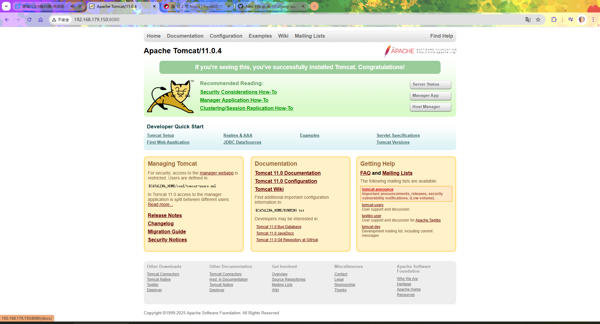

# 17.9 Tomcat

## 安装

```sh
# pkg install tomcat110
```

或

```sh
# cd /usr/ports/www/tomcat110/ 
# make install clean
```

## 配置

Tomcat 11 文件路径在 `/usr/local/apache-tomcat-11.0`。

### 服务

- 加入启动项：
  
```sh
root@ykla:~ # service tomcat110 enable
tomcat110 enabled in /etc/rc.conf
```

启动服务：

```sh
root@ykla:~ # service tomcat110 start
Starting tomcat110.
```

打开 `ip:8080`，如 `http://192.168.179.150:8080/`：


