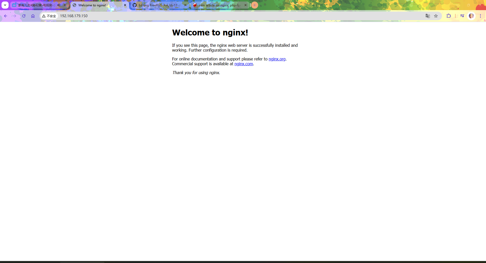

# 17.2 Nginx

## 安装

使用 pkg 安装：

```sh
# pkg install nginx
```

使用 ports 安装：

```sh
# cd /usr/ports/www/nginx/ 
# make install clean
```

### 查找相关的软件包

- 使用 pkg 检索：

```sh
$ pkg search -o nginx
```

- 在 Ports 检索：

```sh
$ ls /usr/ports/www/ | grep nginx
```

## 守护进程

设置 Nginx 服务在系统启动时自动启动：

```sh
# service nginx enable
nginx enabled in /etc/rc.conf
```

启动 Nginx 服务：

```sh
# service nginx start
Performing sanity check on nginx configuration:
nginx: the configuration file /usr/local/etc/nginx/nginx.conf syntax is ok
nginx: configuration file /usr/local/etc/nginx/nginx.conf test is successful
Starting nginx.
```

可以通过以下命令查看 Nginx 正在监听的 IPv4 网络连接及端口：

```sh
# sockstat -4 | grep nginx
www      nginx       1154 6   tcp4   *:80                  *:*
root     nginx       1153 6   tcp4   *:80                  *:*
```

## 浏览网页

在本机浏览器中打开 `localhost`，或使用服务器 IP 地址访问，例如 `http://192.168.179.150/`：



## 配置文件

有关配置教程，请参阅 [官方文档](https://nginx.org/en/docs/) 。

本文仅简要说明在 FreeBSD 中如何启动 Nginx 及其配置文件位置和使用方法。

在 FreeBSD 中，Nginx 的配置文件位于 `/usr/local/etc/nginx/` 目录下，主要配置文件为 `/usr/local/etc/nginx/nginx.conf`。

默认配置中，Nginx 的站点根目录为 `/usr/local/www/nginx/`。如需更改站点根目录，请在 `/usr/local/etc/nginx/nginx.conf` 中将

```ini
root	/usr/local/www/nginx;
```

修改为你希望的目录路径，例如 `root /path/to/new/webroot;`。

### 示例配置文件（Nginx + Typecho 伪静态 + SSL）

```ini
#user  nobody;                                   # 指定 Nginx 运行用户，默认注释表示使用编译时设置
worker_processes  1;                             # 工作进程数量

# This default error log path is compiled-in      # 说明默认错误日志路径的编译行为
# to make sure configuration parsing             # 确保配置解析错误有日志记录
# errors are logged somewhere, especially        # 尤其是在无人值守启动时
# during unattended boot when stderr             # 标准错误通常不会被记录
# isn't normally logged anywhere. This path      # 该路径在每次启动时都会被触碰
# will be touched on every nginx                 # 无论是否配置其他错误日志路径
# start regardless of error log location         # 详细信息参考下方链接
# configured here. See
# https://trac.nginx.org/nginx/ticket/147         # 官方问题跟踪链接
# for more info.
#
#error_log  /var/log/nginx/error.log;             # 错误日志文件路径
#

#pid        logs/nginx.pid;                       # Nginx 主进程 PID 文件路径


events {                                         # events 模块配置开始
    worker_connections  1024;                    # 单个工作进程允许的最大连接数
}                                                # events 模块结束


http {                                           # http 模块配置开始
    include       mime.types;                    # 引入 MIME 类型定义文件
    default_type  application/octet-stream;     # 默认响应的 MIME 类型

    #log_format  main  '$remote_addr - $remote_user [$time_local] "$request" '  # 定义日志格式
    #                  '$status $body_bytes_sent "$http_referer" '               # 日志内容续行
    #                  '"$http_user_agent" "$http_x_forwarded_for"';             # 日志内容续行

    #access_log  logs/access.log  main;           # 访问日志路径及使用的格式

    sendfile        on;                          # 启用 sendfile 以提高文件传输效率
    #tcp_nopush     on;                          # 配合 sendfile 使用，减少网络包

    #keepalive_timeout  0;                       # 禁用 keepalive
    keepalive_timeout  65;                       # keepalive 超时时间（秒）

    #gzip  on;                                  # 启用 gzip 压缩


    server {                                     # HTTP 虚拟主机配置开始
        listen       80;                         # 监听 80 端口
        server_name  localhost;                  # 虚拟主机名

        #charset koi8-r;                         # 设置字符集

        #access_log  logs/host.access.log  main; # 虚拟主机访问日志

        location / {                             # 根路径匹配规则
            root   /usr/local/www/nginx;         # 网站根目录
            index  index.html index.htm index.php; # 默认首页文件顺序

            if (-f $request_filename/index.html){# 判断是否存在 index.html
                rewrite (.*) $1/index.html break;# 重写到 index.html
            }
            if (-f $request_filename/index.php){ # 判断是否存在 index.php
                rewrite (.*) $1/index.php;       # 重写到根目录下的 index.php
            }
            if (!-f $request_filename){          # 判断请求文件是否不存在
                rewrite (.*) /index.php;         # 重写到根目录 index.php
            }
        }                                        # location / 结束


        location ~ .*.php(/.*)*$ {               # 匹配 PHP 请求
            root           /usr/local/www/nginx; # PHP 文件根目录
            fastcgi_pass   127.0.0.1:9000;       # FastCGI 服务地址
            fastcgi_index  index.php;            # 默认 FastCGI 索引文件
            fastcgi_param  SCRIPT_FILENAME $request_filename; # PHP 脚本路径
            include        fastcgi_params;       # 引入 FastCGI 参数文件
        }                                        # PHP location 结束


        #error_page  404              /404.html; # 自定义 404 页面

        error_page   500 502 503 504  /50x.html; # 定义 5xx 错误页面
        location = /50x.html {                   # 精确匹配 50x.html
            root   /usr/local/www/nginx-dist;    # 错误页面目录
        }                                        # 错误页面 location 结束

        #location ~ /.ht {                       # 匹配 .ht* 文件
        #    deny  all;                          # 拒绝访问
        #}
    }                                            # HTTP server 结束


    server {                                     # HTTPS 虚拟主机配置开始
        listen       443;                        # 监听 443 端口
        server_name  localhost;                  # 虚拟主机名

        ssl_certificate      /usr/local/etc/nginx/fbxs.crt; # SSL 证书路径
        ssl_certificate_key  /usr/local/etc/nginx/fbxs.key; # SSL 私钥路径

        ssl on;                                  # 启用 SSL（已废弃旧语法，仅为兼容）
        ssl_certificate fbxs.crt;                # SSL 证书文件（相对路径）
        ssl_certificate_key fbxs.key;            # SSL 私钥文件（相对路径）
        ssl_session_timeout 5m;                  # SSL 会话超时时间
        ssl_protocols TLSv1 TLSv1.1 TLSv1.2;     # 配置启用的 TLS 协议版本（可根据安全要求调整）
        ssl_ciphers ECDHE-RSA-AES128-GCM-SHA256:HIGH:!aNULL:!MD5:!RC4:!DHE; # 加密套件
        ssl_prefer_server_ciphers on;            # 优先使用服务器端加密套件

        location ~ .*.php(/.*)*$ {               # HTTPS 下 PHP 请求处理
            root           /usr/local/www/nginx-dist; # HTTPS 网站根目录
            fastcgi_pass   127.0.0.1:9000;       # FastCGI 服务地址
            fastcgi_index  index.php;            # 默认 FastCGI 索引文件
            fastcgi_param  SCRIPT_FILENAME $request_filename; # PHP 脚本路径
            include        fastcgi_params;       # 引入 FastCGI 参数
        }                                        # HTTPS PHP location 结束

        location / {                             # HTTPS 根路径匹配
            root   /usr/local/www/nginx-dist;    # HTTPS 网站根目录
            index  index.php;                    # 默认首页文件
        }                                        # HTTPS location / 结束
    }                                            # HTTPS server 结束

}                                                # HTTP 模块结束
```
