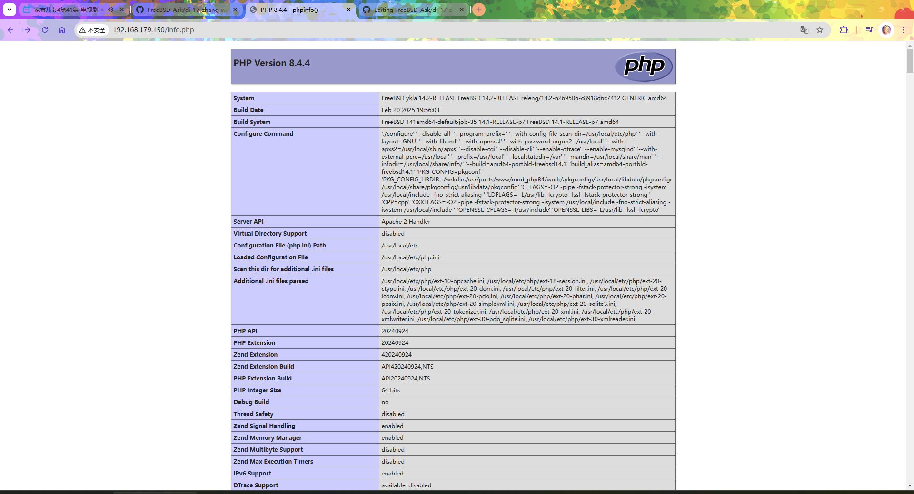
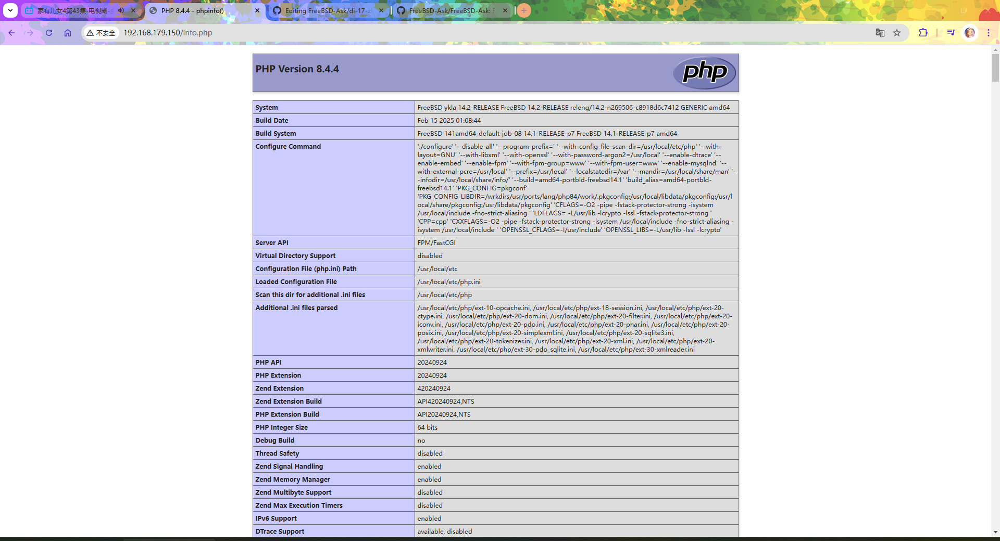

# 17.3 PHP 8.x

## 安装 PHP

> **注意**
>
> 不同的 PHP 模块之间是有冲突的，因此会造成 ports 编译失败，不要试图全选所有的 PHP 插件选项。因此推荐使用 pkg 进行安装。

```sh
# pkg install php84 php84-extensions mod_php84
```

或者

```
# cd /usr/ports/lang/php84/ && make install clean
# cd /usr/ports/lang/php84-extensions/ && make install clean
# cd /usr/ports/www/mod_php84 && make install clean
```

- 查看 PHP 版本：

```sh
root@ykla:~ # php -v
PHP 8.4.4 (cli) (built: Feb 15 2025 01:05:08) (NTS)
Copyright (c) The PHP Group
Zend Engine v4.4.4, Copyright (c) Zend Technologies
```

> **注意**
>
> `84` 这个数字是会变动的。可以先 `pkg search -o lang/php` 看看当前的版本是多少再安装。
>
>```sh
>root@ykla:~ # pkg search -o lang/php
>lang/php-mode.el               PHP mode for GNU Emacs
>lang/php-mode.el               PHP mode for GNU Emacs
>lang/php-mode.el               PHP mode for GNU Emacs
>lang/php-mode.el               PHP mode for GNU Emacs
>lang/php81                     PHP Scripting Language (8.1.X branch)
>lang/php81-extensions          "meta-port" to install PHP extensions
>lang/php82                     PHP Scripting Language (8.2.X branch)
>lang/php82-extensions          "meta-port" to install PHP extensions
>lang/php83                     PHP Scripting Language (8.3.X branch)
>lang/php83-extensions          "meta-port" to install PHP extensions
>lang/php84                     PHP Scripting Language (8.4.X branch)
>lang/php84-extensions          "meta-port" to install PHP extensions (8.4.X branch)
>```

PHP 的示例文件在 `/usr/local/etc/php.ini-production`。

```sh
root@ykla:~ # cp -v /usr/local/etc/php.ini-production /usr/local/etc/php.ini
/usr/local/etc/php.ini-production -> /usr/local/etc/php.ini
```

- 启动服务：

```
root@ykla:~ # service php_fpm enable
php_fpm enabled in /etc/rc.conf
root@ykla:~ # service php_fpm start
Performing sanity check on php-fpm configuration:
[25-Feb-2025 20:28:32] NOTICE: configuration file /usr/local/etc/php-fpm.conf test is successful
Starting php_fpm.
root@ykla:~ # service php_fpm status
php_fpm is running as pid 2592.
```

- 查看安装后信息：

```sh
root@ykla:~ # pkg info -D mod_php84
mod_php84-8.4.4_1:
On install:
******************************************************************************

Consider switching to php-fpm and mod_fast_cgi as per Apache httpd project
recommendation. See https://cwiki.apache.org/confluence/display/HTTPD/PHP-FPM
建议根据 Apache httpd 项目的推荐，切换到 php-fpm 和 mod_fast_cgi。详情请见 https://cwiki.apache.org/confluence/display/HTTPD/PHP-FPM

******************************************************************************

If you are building PHP-based ports in poudriere(8) or Synth with ZTS enabled,
add WITH_MPM=event to /etc/make.conf to prevent build failures.
如果你在 poudriere(8) 或 Synth 中构建启用了 ZTS 的 PHP 基础端口，请将 WITH_MPM=event 添加到 /etc/make.conf，以防止构建失败。

******************************************************************************

Make sure index.php is part of your DirectoryIndex.
确保 index.php 是 DirectoryIndex 的一部分。

You should add the following to your Apache configuration file:
你应该将以下内容添加到你的 Apache 配置文件中：

<FilesMatch "\.php$">
    SetHandler application/x-httpd-php
</FilesMatch>
<FilesMatch "\.phps$">
    SetHandler application/x-httpd-php-source
</FilesMatch>

******************************************************************************
```

### 参考资料

- [Install PHP 8.0 on FreeBSD 13 / FreeBSD 12](https://computingforgeeks.com/how-to-install-php-8-on-freebsd-system/)
- [PHP-FPM(8)](https://man.freebsd.org/cgi/man.cgi?query=php-fpm)，man 页面
- [Apache and PHP](https://forums.freebsd.org/threads/apache-and-php.80625/)，此处提示要安装 `mod_php84`

## 配置 Apache

编辑 `/usr/local/etc/apache24/Includes/php.conf`：

```php
<FilesMatch "\.php$">
    SetHandler application/x-httpd-php
</FilesMatch>
<FilesMatch "\.phps$">
    SetHandler application/x-httpd-php-source
</FilesMatch>
```

编辑 `/usr/local/www/apache24/data/info.php`，加入：

```php
<?php
    phpinfo();
?>
```

重启服务：

```sh
# service php_fpm restart
# service apache24 restart
```

访问 `ip/info.php`，如 `http://192.168.179.150/info.php`：



### 参考文献

- [Install PHP 8.0 on FreeBSD 13 / FreeBSD 12](https://computingforgeeks.com/how-to-install-php-8-on-freebsd-system/)，文章主体框架在此

## 配置 Nginx

- 编辑 `/usr/local/etc/nginx/nginx.conf`：

删掉下面行中的所有 `#`：

```ini
        #location ~ \.php$ {
        #    root           html;
        #    fastcgi_pass   127.0.0.1:9000;
        #    fastcgi_index  index.php;
        #    fastcgi_param  SCRIPT_FILENAME  /scripts$fastcgi_script_name;
        #    include        fastcgi_params;
        #}
```

并修改如下：

```ini
        location ~ \.php$ {
            root           /usr/local/www/nginx; # 注意修改此处变成这样
            fastcgi_pass   127.0.0.1:9000;
            fastcgi_index  index.php;
            fastcgi_param  SCRIPT_FILENAME  $document_root$fastcgi_script_name; # 注意修改此处变成这样，$document_root 即网站路径
            include        fastcgi_params;
        }
```

- 编辑 `/usr/local/www/nginx/info.php`，加入

```php
<?php
    phpinfo();
?>
```

- 重启服务：

```
root@ykla:~ # service php_fpm restart
Performing sanity check on php-fpm configuration:
[25-Feb-2025 20:59:12] NOTICE: configuration file /usr/local/etc/php-fpm.conf test is successful
Starting php_fpm.
root@ykla:~ # service nginx restart
Performing sanity check on nginx configuration:
nginx: the configuration file /usr/local/etc/nginx/nginx.conf syntax is ok
nginx: configuration file /usr/local/etc/nginx/nginx.conf test is successful
Stopping nginx.
Waiting for PIDS: 1153.
Performing sanity check on nginx configuration:
nginx: the configuration file /usr/local/etc/nginx/nginx.conf syntax is ok
nginx: configuration file /usr/local/etc/nginx/nginx.conf test is successful
Starting nginx.
```

访问 `ip/info.php`，如 `http://192.168.179.150/info.php`：



### 参考文献

- [How to Install PHP and PHP-FPM on FreeBSD 14.0](https://docs.vultr.com/how-to-install-php-and-php-fpm-on-freebsd-14-0)。本文主要参考本文
