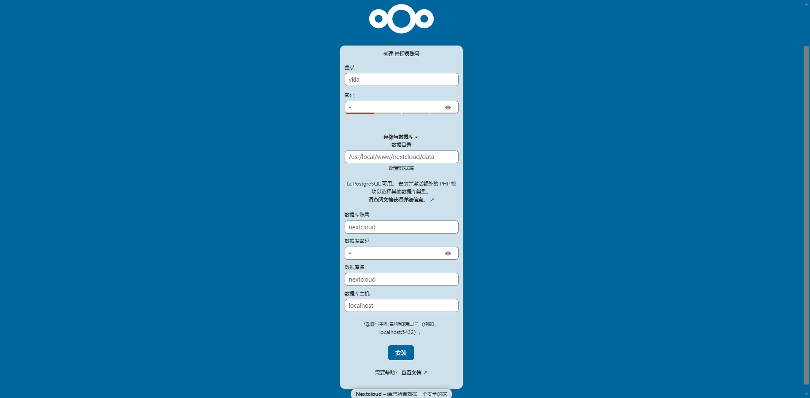
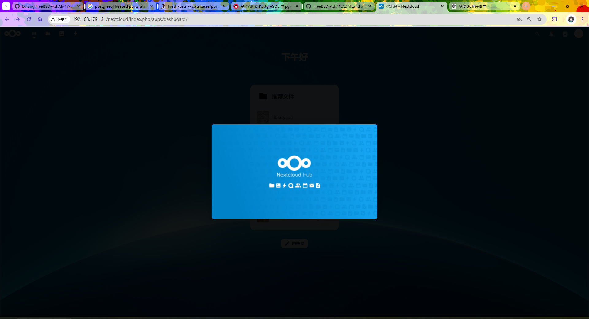
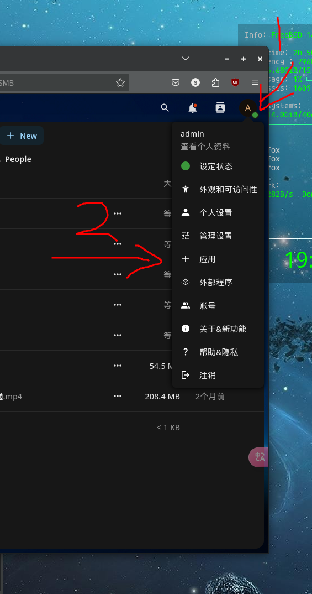
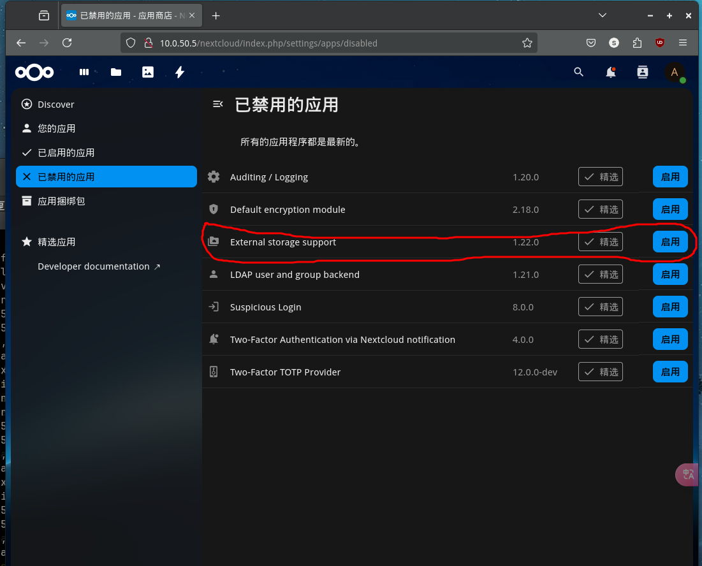
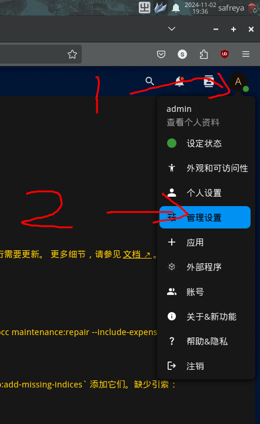
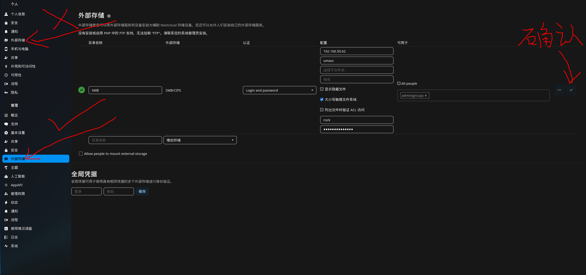
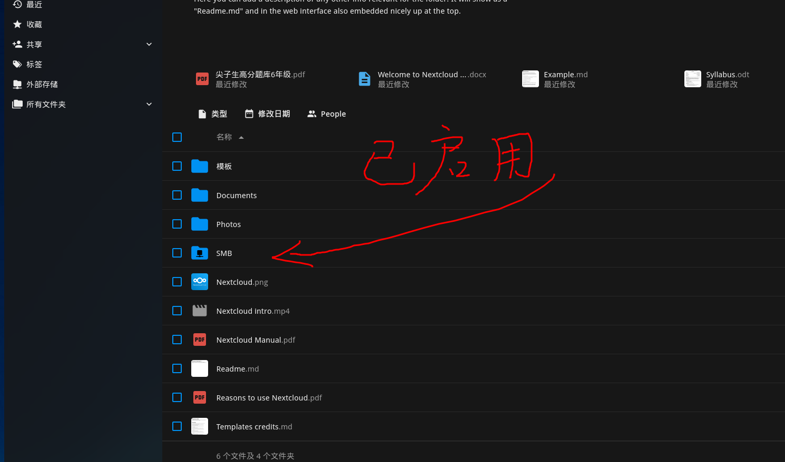

# 17.5 Nextcloud（基于 PostgreSQL）


## 安装 Nextcloud

为了方便安装，请使用 Ports（FreeBSD ports collection）而非 pkg 安装包管理器：

```sh
# cd /usr/ports/www/nextcloud/
# make config # 为了方便，仅配置 nextcloud 本体
```

本文选择启用 `PGSQL`、`SMB` 和 `PCNTL`；取消勾选 `MYSQL`：


使用 ports 编译安装 Nextcloud：

```sh
# make BATCH=yes install clean
```

## 安装配置 PostgreSQL

安装 PostgreSQL（请注意与上面通过 Ports 默认安装的 `postgresql-client` 版本保持一致）。

本节要求读者自行安装 `postgresql16-server`，并完成初始化和服务自启。

>**注意**
>
>若使用 pkg 安装，请另行安装 `databases/php83-pdo_pgsql`，php 版本号需要全部一致。

在 PostgreSQL 初始化完成后，执行以下命令：

```sql
$ psql -Upostgres # 进入 PostgreSQL 命令行模式
psql (16.7)
Type "help" for help.

postgres=# create user nextcloud; --为 PostgreSQL 创建用户 nextcloud
CREATE ROLE
postgres=# \password nextcloud --为用户 nextcloud 设置/修改密码，注意斜杠 \ 必须输入
Enter new password for user "nextcloud": --此处输入密码，密码不会显示在屏幕上，也不会显示为星号 (*)，输入过程为空，下同
Enter it again: --再次重复输入上面密码
postgres=# create database nextcloud owner=nextcloud; --创建数据库 nextcloud，并将所有权赋予用户 nextcloud
CREATE DATABASE
postgres-# \q --退出 PostgreSQL 命令行，注意斜杠要输入：\ 
```

>**技巧**
>
>如需远程访问数据库服务器，请自行修改 `/var/db/postgres/data16/pg_hba.conf` 文件，以允许用户 nextcloud 从指定 IP 使用 SCRAM-SHA-256 验证方式连接 PostgreSQL。
>
>示例（IP 段 `10.0.50.5/32` 读者需改成自己的）：
>
>```sh
>host    nextcloud       nextcloud       10.0.50.5/32               scram-sha-256
>```


## 安装 `mod_php`

可以通过 `php -v` 命令检查当前 PHP 版本，确保与系统中安装的版本一致：


```sh
# php -v
PHP 8.3.17 (cli) (built: Feb 15 2025 01:11:28) (NTS)
Copyright (c) The PHP Group
Zend Engine v4.3.17, Copyright (c) Zend Technologies
    with Zend OPcache v8.3.17, Copyright (c), by Zend Technologies
```

- 使用 pkg 安装 mod_php：

```sh
# pkg install mod_php83
```

- 守护进程：

```sh
# service php_fpm enable   # 设置 PHP-FPM 服务开机自启
# service php_fpm start    # 启动 PHP-FPM 服务
```


## 基于 Apache


请读者参考其他章节内容完成 Apache 的安装和服务自启。

### 查看 Apache 配置方法

查看 mod_php83 面向 Apache 的配置方法：

```sh
# pkg info -D mod_php83
mod_php83-8.4.4_1:
On install:
******************************************************************************

Consider switching to php-fpm and mod_fast_cgi as per Apache httpd project
recommendation. See https://cwiki.apache.org/confluence/display/HTTPD/PHP-FPM
建议根据 Apache httpd 项目的推荐，切换到 php-fpm 和 mod_fast_cgi。详情请见 https://cwiki.apache.org/confluence/display/HTTPD/PHP-FPM

******************************************************************************

If you are building PHP-based ports in poudriere(8) or Synth with ZTS enabled,
add WITH_MPM=event to /etc/make.conf to prevent build failures.
如果你在 poudriere(8) 或 Synth 中构建启用了 ZTS 的 PHP 基础端口，请将 WITH_MPM=event 添加到 /etc/make.conf，以防止构建失败。

******************************************************************************

Make sure index.php is part of your DirectoryIndex.
确保 index.php 是 DirectoryIndex 的一部分。

You should add the following to your Apache configuration file:
你应该将以下内容添加到你的 Apache 配置文件中：

<FilesMatch "\.php$">
    SetHandler application/x-httpd-php
</FilesMatch>
<FilesMatch "\.phps$">
    SetHandler application/x-httpd-php-source
</FilesMatch>

******************************************************************************
```

查看 nextcloud-php83 面向 Apache 配置方法：

```sh
# pkg info -D nextcloud-php83
nextcloud-php83-30.0.6:
On install:
 /!\ The FreeBSD package REQUIRES the apps_paths configuration as    /!\
 /!\ seen in config/config.sample.php to function                    /!\
 /!\ FreeBSD 包需要配置 apps_paths，如 config/config.sample.php 中所示才能正常工作 /!\

Please note that everything has been installed in /usr/local/www/nextcloud.
请注意，所有文件已安装在 /usr/local/www/nextcloud 中。

You will probably want to add an alias to your httpd.conf file,
something like this:
你可能需要在 httpd.conf 文件中添加一个别名，类似如下：

    	Alias /nextcloud /usr/local/www/nextcloud
	AcceptPathInfo On
	<Directory /usr/local/www/nextcloud>
	    AllowOverride All
	    Require all granted
	</Directory>

And restart Apache. Nextcloud will start the bundled installer on first
access. Once the bundled installer finishes, further configuration can
be done via 'Settings', 'Administration'. Additional configuration
options are available in
然后重启 Apache。Nextcloud 会在首次访问时启动捆绑的安装程序。安装程序完成后，可以通过 'Settings' 和 'Administration' 进行进一步配置。更多配置选项可以在以下位置找到：

	/usr/local/www/nextcloud/config/config.php

You can find annotated configuration options in config.documented.php
in the same directory. Nextcloud's configuration documentation is at
你可以在同一目录下的 config.documented.php 中找到带注释的配置选项。Nextcloud 的配置文档请参考：

	https://docs.nextcloud.com/server/stable/admin_manual/configuration_server

The caching options require additional Nextcloud configuration.
缓存选项需要额外的 Nextcloud 配置。

On upgrade:
After a version migration you should upgrade your nextcloud instance
using command line:
升级后，你应该使用命令行升级你的 nextcloud 实例：

  occ upgrade

Merge any changes to /usr/local/www/nextcloud/.htaccess.dist into .htaccess (above the
'#### DO NOT CHANGE ANYTHING ABOVE THIS LINE ####' divider if it exists)
and update the dynamic part of the file using the commandline:
将 /usr/local/www/nextcloud/.htaccess.dist 中的任何更改合并到 .htaccess 文件中（如果存在的话，请合并到 '#### DO NOT CHANGE ANYTHING ABOVE THIS LINE ####' 分隔符上方），并使用命令行更新文件的动态部分：

  occ maintenance:update:htaccess

As of Nextcloud 27.1.0 the recommended PHP version is 8.2.
Nextcloud 27.1.0，推荐使用 PHP 8.2 版本。
```


编辑 `/usr/local/etc/apache24/httpd.conf`，加入：

```apache
<FilesMatch "\.php$">                           # 匹配以 .php 结尾的文件
    SetHandler application/x-httpd-php          # 将匹配文件交由 PHP 处理
</FilesMatch>

<FilesMatch "\.phps$">                          # 匹配以 .phps 结尾的文件
    SetHandler application/x-httpd-php-source   # 将匹配文件作为 PHP 源代码显示
</FilesMatch>

Alias /nextcloud /usr/local/www/nextcloud       # 将 /nextcloud URL 映射到本地目录
AcceptPathInfo On                               # 允许路径信息传递给脚本

<Directory /usr/local/www/nextcloud>           # 配置 Nextcloud 目录访问权限
    AllowOverride All                            # 允许 .htaccess 覆盖配置
    Require all granted                           # 允许所有访问
</Directory>
```

启动 Apache 24 服务：

```sh
# service apache24 start
```

## 启动

访问 `http://ip/nextcloud` 即可，请将 `ip` 替换为你的局域网 IP 地址。



请输入所需的登录账户和密码，其余设置可参照下图。


安装完成会重定向到插件推荐：不必理会，重新打开 `http://ip/nextcloud` 即可正常使用。




## 在 nextcloud 中挂载 samba 共享

### 安装模块 `php83-pecl-smbclient`

在 Nextcloud 服务器端执行模块安装。

- 使用 pkg 安装：

```sh
# pkg install php83-pecl-smbclient
```

- 或者使用 ports 安装：

```sh
# cd /usr/ports/net/pecl-smbclient/ 
# make install clean
```

- 重启 Apache 24 服务以应用配置更改：

```sh
# service apache24 restart
```

### 设置 samba 共享

找到“应用”



找到“外部存储支持”应用，并启用（默认情况下为禁用状态）



进入管理设置：



找到管理中的外部存储（不是“个人”里面的外部存储）



查看所有文件，samba 已启用：




## 未竟事项

其他常用插件可以使用命令 `pkg search -x nextcloud | grep php82` 查找，然后通过 pkg 安装。


>**技巧**
>
>在某些版本中，初始化 Nextcloud 时可能会出现权限问题，请检查 `/usr/local/www/nextcloud` 中 `config` 目录及其下文件的访问权限，确保运行 Apache 的用户具有读写权限。


## 参考文献

- [System requirements](https://docs.nextcloud.com/server/latest/admin_manual/installation/system_requirements.html)，各种软件的版本需求
- [PHP Modules & Configuration](https://docs.nextcloud.com/server/latest/admin_manual/installation/php_configuration.html)，需要和可选的 PHP 模块及配置
