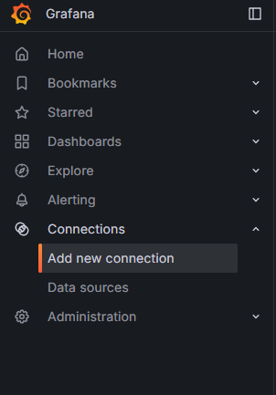
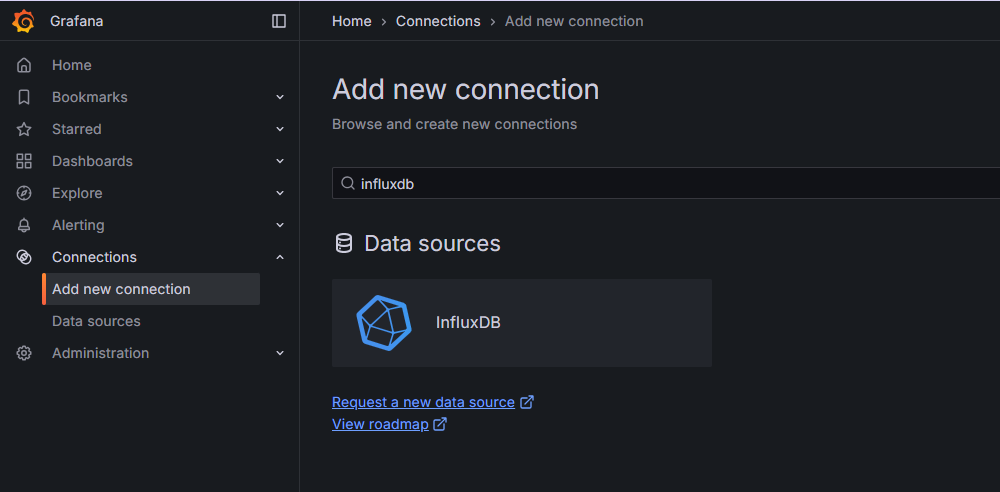
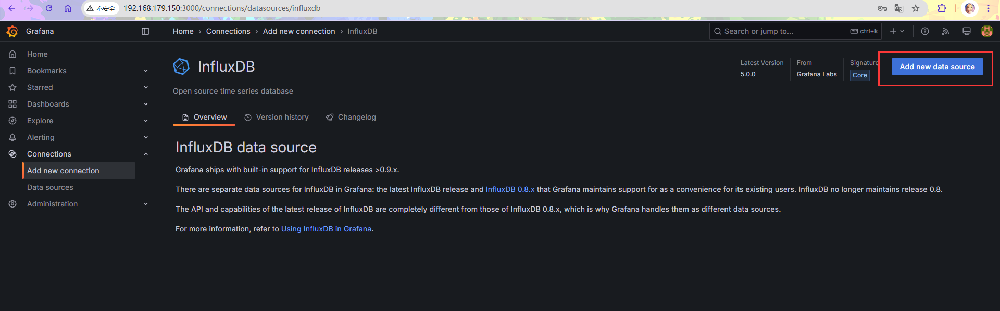
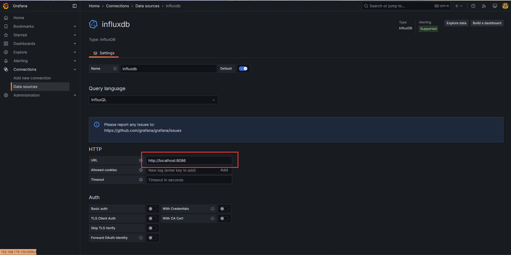
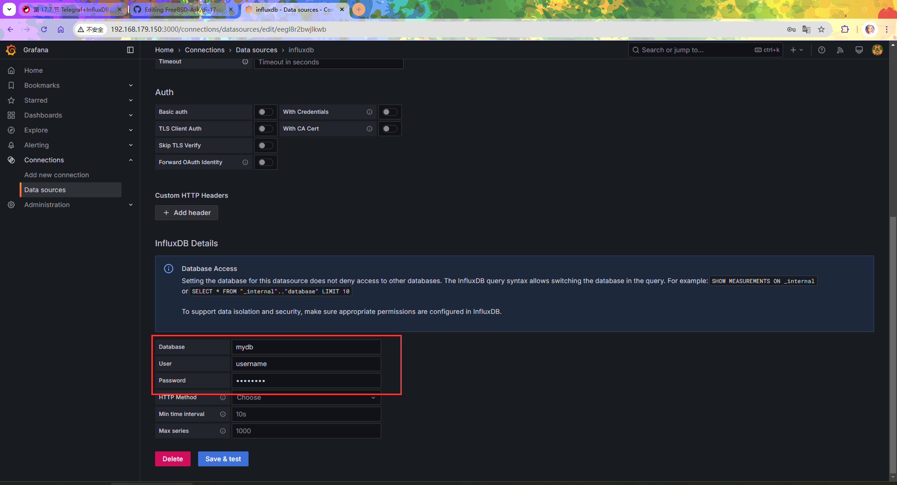
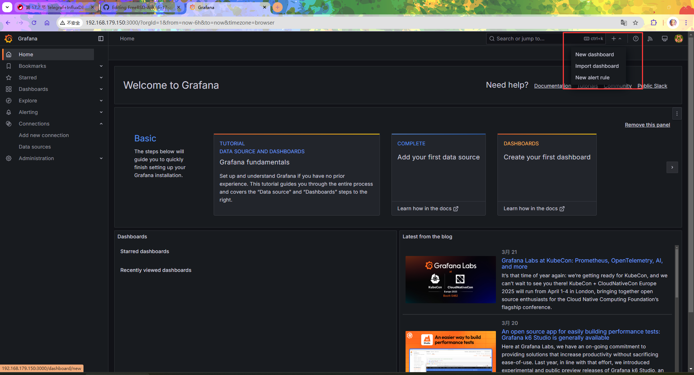
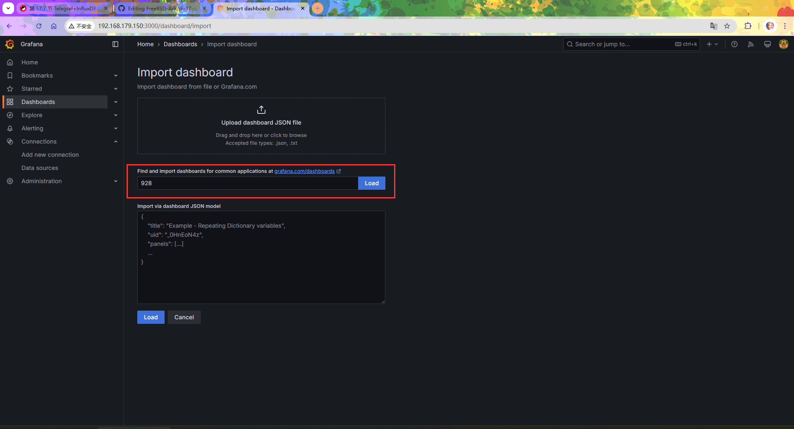
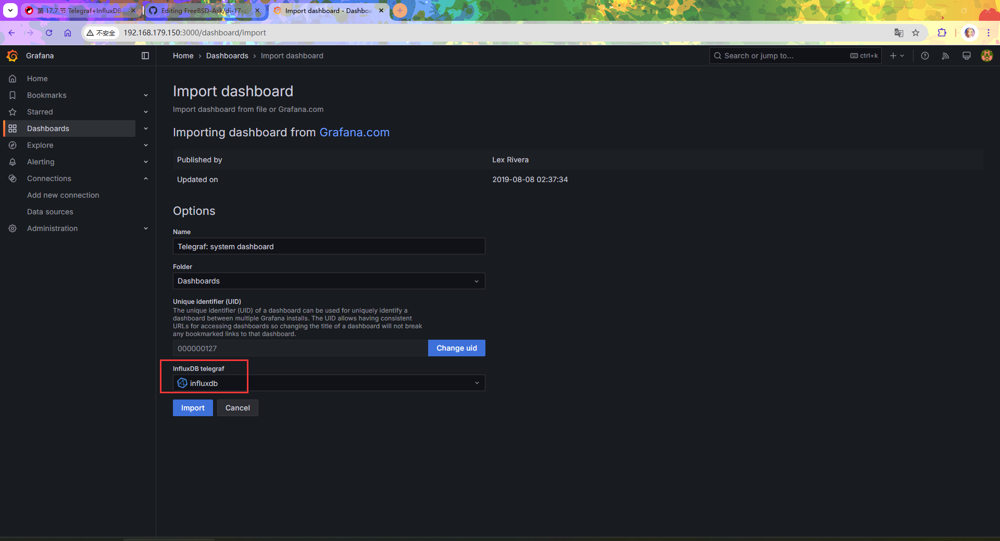
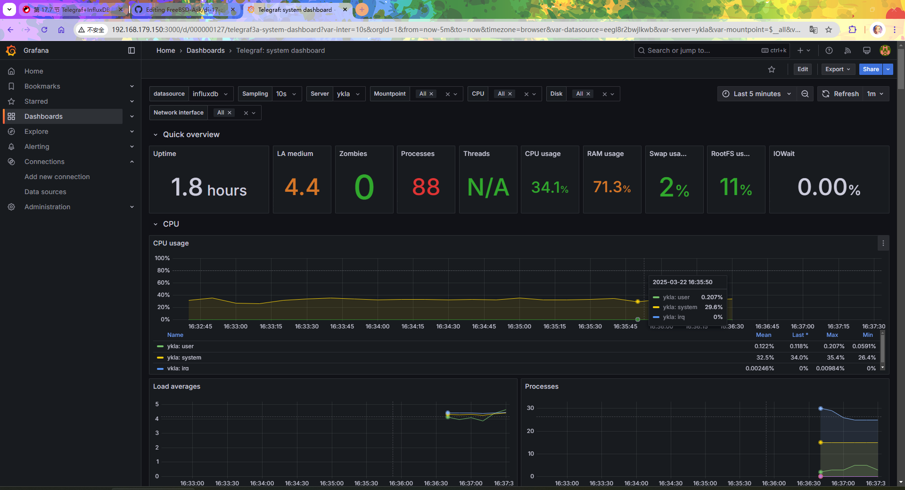
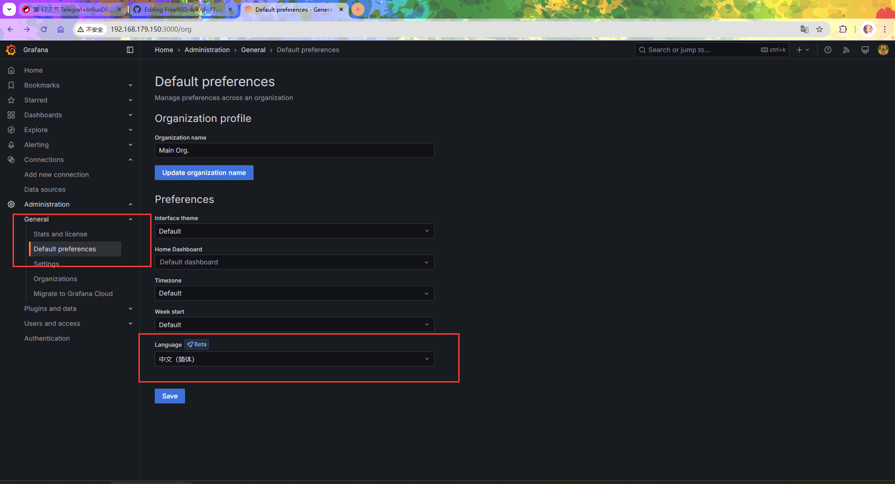

# 17.6 Telegraf、InfluxDB 与 Grafana 监控平台

## InfluxDB 安装与配置

InfluxDB 是一款用于存储和分析时间序列数据的开源数据库。

### 安装 InfluxDB

使用 pkg 安装：

```sh
# pkg install influxdb
```

或者使用 ports 安装：

```sh
# cd /usr/ports/databases/influxdb/ 
# make install clean
```

### 服务管理

- 设置 InfluxDB 服务开机自启：

```sh
# service influxd enable
```

- 启动 InfluxDB 服务：

```sh
# service influxd start
```

### 修改 InfluxDB 配置

读者可以自行修改 InfluxDB 的配置文件 `/usr/local/etc/influxd.conf`。编辑该文件可实现自定义配置。

修改完成后请重启 InfluxDB 服务：

```sh
# service influxd restart
```

### 创建 InfluxDB 数据库

```sql
# influx # 连接到 InfluxDB 数据库
Connected to http://localhost:8086 version 1.8.10
InfluxDB shell version: 1.8.10
> CREATE DATABASE mydb -- 创建 InfluxDB 数据库
> CREATE USER username WITH PASSWORD 'password' -- 创建数据库用户及密码，此处用户名为 username，密码为 password
> SHOW DATABASES -- 查看数据库
name: databases
name
----
_internal
mydb
>
> quit -- 退出 InfluxDB shell
```

## Telegraf

### 安装 Telegraf

使用 pkg 安装：

```sh
# pkg install telegraf
```

或者使用 ports 安装：

```sh
# cd /usr/ports/net-mgmt/telegraf/ 
# make install clean
```

### 加入启动项

设置 Telegraf 服务开机自启：

```sh
# service telegraf enable
```

此时暂时不要启动 Telegraf 服务。

### 配置 InfluxDB 连接

这里使用的是 InfluxDB 1.8 版本。

需要在配置文件 `/usr/local/etc/telegraf.conf` 中进行修改如下：

```ini
# 配置 InfluxDB 连接信息，此处的内容应与上面配置的 InfluxDB 数据库账号和密码一致
[[outputs.influxdb]]        # 输出插件类型为 InfluxDB
  urls = ["http://127.0.0.1:8086"]  # InfluxDB 服务地址
  database = "mydb"                 # 要写入的数据库名称
  username = "username"             # 数据库用户名
  password = "password"             # 数据库密码
```

### 配置采集指标

配置文件路径：`/usr/local/etc/telegraf.conf`：

这里将收集系统的 CPU、磁盘（disk）、磁盘 IO（diskio）、内存（memory）、交换空间（swap）等指标。下面是 Telegraf 配置文件中的部分内容，其中部分参数默认启用，部分参数需要手动取消注释。

详情参见 [官方文档](https://docs.influxdata.com/telegraf/v1.26/configuration/)。

```ini
# 内存
[[inputs.mem]]

# swap
[[inputs.swap]]

# 磁盘
[[inputs.disk]]
  ignore_fs = ["tmpfs", "devtmpfs", "devfs", "iso9660", "overlay", "aufs", "squashfs"]

# 磁盘 IO
[[inputs.diskio]]

# 进程
[[inputs.processes]]

# 系统（运行时长等）
[[inputs.system]]

# 网络
[[inputs.net]]
```

### 启动服务

启动 Telegraf 服务

```sh
# service telegraf start
```

## Grafana


### 安装 Grafana

使用 pkg 安装：

```sh
# pkg install grafana
```

使用 ports 安装：

```sh
# cd /usr/ports/www/grafana/ 
# make install clean
```

### 守护进程

设置 Grafana 服务开机自启：

```sh
# service grafana enable
```

启动 Grafana 服务

```sh
# service grafana start
```

### 登录 grafana

Grafana 的默认登录地址为 `http://localhost:3000`。


- 默认登录用户名和密码：
  - Username（用户名）：`admin`
  - Password（密码）：`admin`


登录后会要求修改密码。

### 配置数据源

- 登录后点击左上角的 **Connections** -> 选择 **Add new connection**

   

- 在右边的输入框中输入 `InfluxDB` -> 选择搜索出来的 **InfluxDB**，点击

   

- 点击右上角的 **Add new data source** 按钮 -> 配置 InfluxDB 相关的内容。

   

- 在数据源配置页面填写相关的 InfluxDB 连接信息，需配置内容如下：

   >**注意**
   >
   >我们上面使用的是 InfluxDB 1.8，所以选择的查询语言必须选 `InfluxQL`（默认即是）

`URL` 输入：`http://localhost:8086`。



在数据源配置中，Database 输入 `mydb`，User 输入 `username`，Password 输入 `password`（这些值在创建 InfluxDB 数据库时设置）。




点击 **`Save & Test`** 按钮保存配置。提示成功链接，并获取了数据：


### 配置 Dashboard

选择用于展示数据的 Dashboard，可以自行开发，也可以使用 [官方模版库](https://grafana.com/grafana/dashboards/) 中其他人开发的模板。

此处导入 id 为 [928](https://grafana.com/grafana/dashboards/928-telegraf-system-dashboard/) 的模版。

- 导入模版，点击右上角的 **`+`** -> **`Import dashboard`**  进入导入模版页面。

   

- 选择 `id` 为 `928` 的模版导入，输入 `928`，再点击“Load”。

   

  选择我们的数据库。

  

- 模版最终效果

   

### 设置中文

依次进入 Home -> Administration -> General -> Default preferences -> Language，选择“简体中文”。



## 故障排除与未竟事宜

### 内核、网络、CPU 相关信息均未显示

问题可能与 `/proc` 文件系统有关。

该问题仍需进一步排查和解决。
