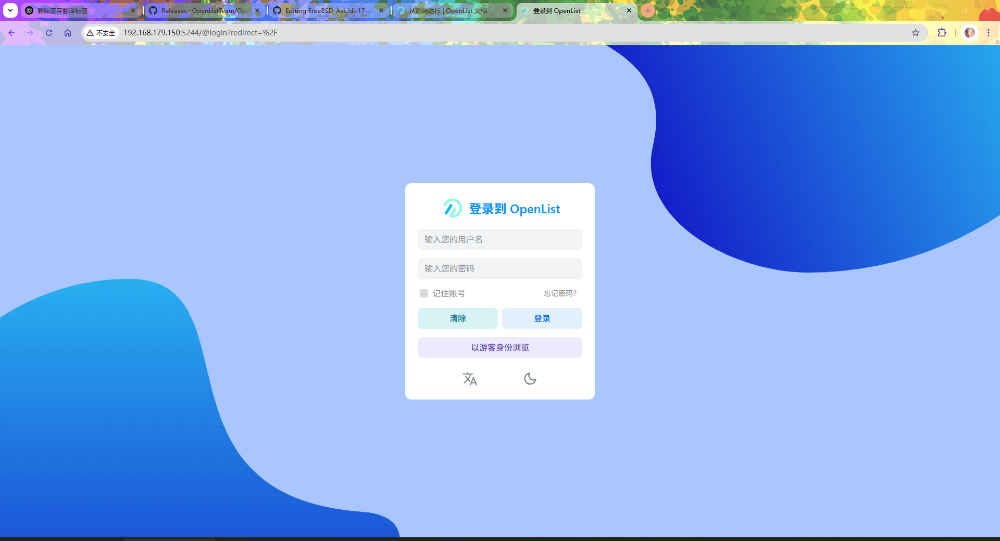
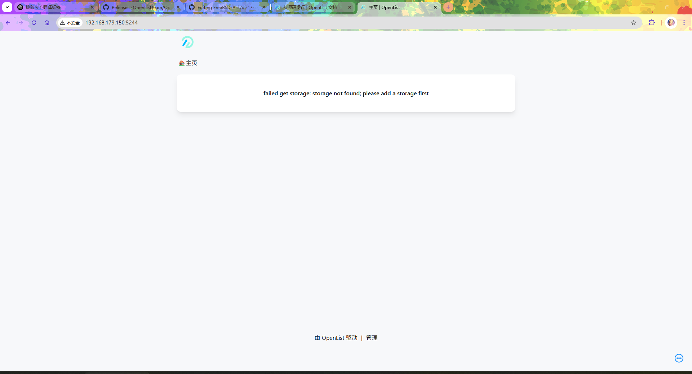

# 17.7 OpenList

功能请求：将 OpenList 制作成 FreeBSD Port。

## 安装 OpenList

### OpenList 官方二进制包

请以普通用户身份执行以下操作：

```sh
$ mkdir openlist                           # 创建 openlist 目录
$ cd openlist                              # 进入 openlist 目录
$ fetch https://github.com/OpenListTeam/OpenList/releases/download/v4.0.8/openlist-freebsd-amd64.tar.gz   # 下载 OpenList 压缩包文件
$ tar zxvf openlist-freebsd-amd64.tar.gz   # 解压下载的压缩包
$ rm openlist-freebsd-amd64.tar.gz         # 删除压缩包以节省空间
```

>**技巧**
>
>根据 [手动安装](https://docs.oplist.org/zh/guide/install/manual.html) 文档及实际测试，无需额外配置后端 OpenList-Frontend。


### 编译安装 OpenList（可选）


#### 安装 OpenList 的依赖

- 使用 pkg 安装所需依赖

```sh
# pkg install git go
```

- 或者使用 Ports 安装所需依赖

```sh
# cd /usr/ports/devel/git/ && make install clean
# cd /usr/ports/lang/go/ && make install clean
```

#### 编译构建

请以普通用户执行：

- 下载 OpenList 源码

```sh
$ git clone -b v4.0.8 https://github.com/OpenListTeam/OpenList   # 克隆 OpenList 仓库并指定版本为 v4.0.8
$ cd OpenList/public/dist                                        # 进入前端发布目录（dist）
$ fetch https://github.com/OpenListTeam/OpenList-Frontend/releases/download/v4.0.8/openlist-frontend-dist-v4.0.8.tar.gz   # 下载官方已编译好的前端文件，版本需与后端一致
$ tar zxvf openlist-frontend-dist-v4.0.8.tar.gz                  # 解压前端文件
$ rm openlist-frontend-dist-v4.0.8.tar.gz                        # 删除压缩包以清理空间
$ cd ../..                                                        # 返回上层目录
```

- 开始构建 OpenList

```sh
$ mkdir build                                  # 创建 build 目录
$ cd build                                     # 进入 build 目录
$ go build -ldflags="-w -s" -tags=jsoniter ..  # 使用 Go 编译上一级目录的项目，去除符号表和调试信息，并启用 jsoniter 标签构建
```

编译后的文件位于 `build` 目录下，文件名为 `OpenList`。为了方便使用，在以下教程中将其重命名为 `openlist`。


## 编写 RC 脚本

创建并编辑 `/usr/local/etc/rc.d/openlist`：

```sh
#!/bin/sh
. /etc/rc.subr

name="openlist"
rcvar="openlist_enable"
command_path=/home/ykla/OpenList     # OpenList 可执行文件所在目录
command="${command_path}/openlist"   # 命令路径
command_args="start"                 # 启动命令参数
stop_cmd=do_stop                     # 停止命令参数

do_stop()
{
    ${command} stop
}

load_rc_config $name                 # 载入 rc.conf 文件中定义的变量
: ${openlist_enable:=no}             # 如果未设置 openlist_enable 则设为 no
run_rc_command "$1"                  # 运行 service 命令
```

赋予 OpenList 服务脚本可执行权限：

```sh
# chmod +x /usr/local/etc/rc.d/openlist
```

## 使用 OpenList 服务

设置 OpenList 服务开机自启

```sh
# service openlist enable
```

为了增强安全性，应使用普通用户身份执行进程（ykla 为示例用户名，读者需替换为自己的用户名）。

设置 OpenList 服务运行的用户为 ykla：

```sh
# sysrc openlist_user=ykla
```

>**警告**
>
>注意 `OpenList` 目录的属主和所属组必须为 `ykla`，即读者的普通用户名，否则将报错：
>
>`FATA[2025-07-06 11:27:56] 1511: failed to open start log file:open /home/ykla/OpenList/daemon/start.log: no such file or directory`。
>
>修改命令类似于（递归修改 /home/ykla/OpenList 目录及其内容的所有者和所属组为 ykla）：
>
>```sh
># chown -R ykla:ykla /home/ykla/OpenList
>```

## 初始化

启动 OpenList 服务实例

```sh
# service openlist start
Starting openlist.
INFO[2025-07-06 11:32:41] success start pid: 1566
```

重置 OpenList 用户 `admin` 的密码为 `1`：

```sh
root@ykla:/home/ykla/OpenList # ./openlist admin set 1 
INFO[2025-07-06 11:39:39] reading config file: data/config.json        
INFO[2025-07-06 11:39:39] load config from env with prefix: OPENLIST_  
INFO[2025-07-06 11:39:39] init logrus...                               
INFO[2025-07-06 11:39:39] admin user has been updated:                 
INFO[2025-07-06 11:39:39] username: admin                              
INFO[2025-07-06 11:39:39] password: 1  
```

## 登录

访问 `http://ip:5244`，请将 `ip` 替换为你的局域网地址，用户名为 `admin`





### 参考文献

- [alist 指定 --data 运行不起作用](https://github.com/AlistGo/alist/issues/2580)。
- 另外 [start 等静默启动](https://alist.nn.ci/zh/guide/install/manual.html#%E5%AE%88%E6%8A%A4%E8%BF%9B%E7%A8%8B) 会强制 `--force-bin-dir`。对于 `start` 指定任何 `data` 均会在后面附带  `--force-bin-dir`。但是仍然是无效的。

## 为 OpenList 指定外部播放器（vlc）

### 使用 urlendec 进行地址解码

一组用于对任意数据流进行 URL 编码和解码的工具，可从命令行或标准输入读取数据。我们需要 Port urlendec 对我们的地址进行解码。

- 使用 pkg 安装 urlendec：

```sh
pkg install urlendec
```

- 或者使用 Ports 安装 urlendec：

```sh
# cd /usr/ports/net/urlendec/ 
# make install clean
```

### 配置 vlc 外部播放器

OpenList 内嵌的播放器有时无法播放某些视频，但可通过 URI 调用外部程序（使用 `xdg-open`）进行播放。

OpenList 为 vlc 指定的视频地址形如 `vlc://http://xxx`，只要为 `vlc://` 开头的 URI 指定 vlc 程序即可。请自行安装 vlc。

`xdg-open` 向 VLC 传递 URI 时会包含 `vlc://` 前缀，而 VLC 无法直接打开带该前缀的地址。因此，需要在播放前去除该前缀，然后调用 VLC，下面是对应脚本 `~/.local/share/applications/vlc-noschema.sh`：


```sh
#!/bin/sh
url="$1"                                     # 获取传入的第一个参数 URL
clean_url='http:'"${url#vlc://http}"        # 去除 vlc://http 前缀
vlc "$clean_url"                             # 使用 VLC 播放处理后的 URL
```

赋予当前用户可执行权限：

```sh
$ chmod u+x ~/.local/share/applications/vlc-noschema.sh
```

新建 `userapp-xxx.desktop`（你只可改动字段 `xxx` 为你想要的名字，其他字段不可改变。如 `userapp-abc.desktop`）文件，以便 xdg-open 调用上面的脚本，在本文中为 `~/.local/share/applications/userapp-vlc.desktop`：

```ini
[Desktop Entry]
Encoding=UTF-8
Version=1.0
Type=Application
NoDisplay=true
Exec=/home/safreya/.local/share/applications/vlc-noschema.sh %U
Name=vlc
Comment=Custom definition for vlc
```

注册 `vlc://` URI 的调用程序：

```sh
$ update-desktop-database ~/.local/share/applications   # 更新桌面应用程序数据库
$ xdg-mime default userapp-vlc.desktop x-scheme-handler/vlc   # 设置 VLC 自定义 URL 协议处理程序
```

### 配置 mpv 外部播放器

新建文件 `~/.local/share/applications/mpv-noschema.sh`：

```sh
#!/bin/sh
url="$1"                                           # 获取传入的第一个参数 URL
clean_url=$(urldecode "${url#mpv://}")           # 去除 mpv:// 前缀并进行 URL 解码
mpv "$clean_url"                                  # 使用 MPV 播放处理后的 URL
```

赋予当前用户可执行权限：

```sh
$ chmod u+x ~/.local/share/applications/mpv-noschema.sh
```

## 本机存储的多属主权限管理

以普通用户身份运行服务是一种安全的方式，如上文使用了用户 ykla。

在某些情况下，OpenList 挂载的本地目录及其子目录和文件的属主可能不是 ykla，例如通过 HTTP 服务上传的目录及文件，或以 daemon 方式运行的 aria2 或 qBitTorrent 下载的目录及文件，以及其他类似情况。

常用的解决方案：

- 通过设置（组和其他）访问权限使 OpenList 的运行用户可以访问。

- 一开始就规划好，使各种可能的服务都使用同一个用户运行，但这个方法比较麻烦，也会让各种服务的专有文件失去隔离性。

上面的方案在属主不同的情况比较少的时候还是可以的，情况多了就不太方便。这时使用 bindfs 就比较方便。Bindfs 类似于 nullfs，但在将目标目录挂载到其他位置时，可以覆盖文件的属主和所属组。

### 安装 bindfs

- 使用 pkg 安装：

```sh
# pkg install fusefs-bindfs
```

- 使用 Ports 安装：

```sh
# cd /usr/ports/filesystems/bindfs/
# make install clean
```

### 测试用例

- 以普通用户权限运行：创建目录及其父目录，用于存放上传的网页文件。

```sh
$ mkdir -p /home/ykla/extdata/wwwupload 
```

- 以 root 用户权限运行：使用 bindfs 将 `/var/www/upload` 挂载到 `/home/ykla/extdata/wwwupload`，并设置所有者和所属组为 `ykla`。

```sh
# bindfs -u ykla -g ykla /var/www/upload /home/ykla/extdata/wwwupload
```

这里 `/var/www/upload` 的属主是 `www`。

该命令将 `/var/www/upload` 挂载到了 `/home/ykla/extdata/wwwupload`。

用户 ykla 访问 `/var/www/upload` 时，目录下的目录和文件属主保持不变（仍为 `www`）；访问 `/home/ykla/extdata/wwwupload` 时，目录下的目录和文件属主均显示为 `ykla`。

这时 OpenList 只要用本机存储挂载 `/home/ykla/extdata/wwwupload` 即可轻松解决访问权限问题。

也可以用 `--map` 选项，使用类似于 NFS 的 UID/GID 映射机制（用于将某些用户/组映射成其他的用户/组），这在某些时候可能是更好的选择。

#### 参考文献

- 具体用法参考 [bindfs](https://man.freebsd.org/cgi/man.cgi?query=bindfs)

## 影视刮削

此方案使用 zsh，请自行安装。

此处的“刮削”指获取本地多媒体文件的相关信息，包括海报、制作人信息、配音、字幕等附属内容。

OpenList 未内置原生的刮削功能。

但是利用好 OpenList 的 markdown（`top.md`、`bottom.md`、`readme.md`）就能提供简单的刮削功能。

### 使用 inotify-tools 监控目录

inotify-tools 为 shell 脚本提供了用于文件系统事件的简单接口。

#### 安装 inotify-tools

- 使用 pkg 安装：

```sh
# pkg ins inotify-tools
```

- 还可以使用 Ports 安装：

```sh
# cd /usr/ports/sysutils/inotify-tools/ 
# make install clean
```

#### 监控脚本

新建文件 `~/.monitor.zsh`，并添加以下内容：

```sh
#!/usr/bin/zsh

zmodload zsh/datetime                               # 加载 zsh 日期时间模块

WATCH_DIR="/home/ykla/extdata/media"               # 监控的目录
EVENTS="create,moved_to"                           # 需要监控的事件类型
ACTION_SCRIPT="/home/ykla/searchtmdb.zsh"         # 触发事件时执行的脚本路径

inotifywait -m -r --format "%w%f %e" -e "$EVENTS" "$WATCH_DIR" | while read -r target event
do
        timestamp=$(strftime '%F %T')             # 获取当前时间戳
        echo "[${timestamp}]${event}:${target}" >> dir.log   # 记录事件到日志文件
        echo "${event}" | grep -q 'ISDIR'        # 检查事件是否为目录
        if [[ $? == 0 ]]; then
           zsh "$ACTION_SCRIPT" >>dir.log        # 如果是目录，执行刮削脚本并记录日志
        fi
done
```

赋予当前用户可执行权限：

```sh
$ chmod u+x ~/.monitor.zsh
```

在后台启用监控脚本。

后台运行 monitor 脚本，并忽略挂起信号，输出默认写入 `nohup.out`：

```sh
$ nohup  ~/.monitor.zsh
```

或

```sh
$ ~/.monitor.zsh &   # 在后台运行 monitor 脚本
disown               # 将后台进程从当前 shell 中分离
```

#### 参考文献

- inotifywait 用法参见 [inotifywait](https://man.freebsd.org/cgi/man.cgi?query=inotifywait&apropos=0)

### 写入刮削的信息

将刮削的信息写入视频所在目录下的 `top.md` 等文件。

TMDb 在国内可以正常使用，但可能受到 DNS 污染，解决 DNS 污染后即可正常访问。具体刮削脚本参见 [https://gist.github.com/ykla/91e27db14e68ba60903e97fe1c437246](https://gist.github.com/ykla/91e27db14e68ba60903e97fe1c437246)。

效果如下：


## 故障排除与未竟事宜

### 日志

OpenList 的日志在 `daemon/start.log`。

### 使用 bindfs 在 fstab 中进行挂载

此项尚待解决。

### bindfs 的多线程模型存在缺陷

如果 bindfs 以多线程模式运行（使用 `--multithreaded` 选项），可能存在安全问题。

此问题尚待解决。
