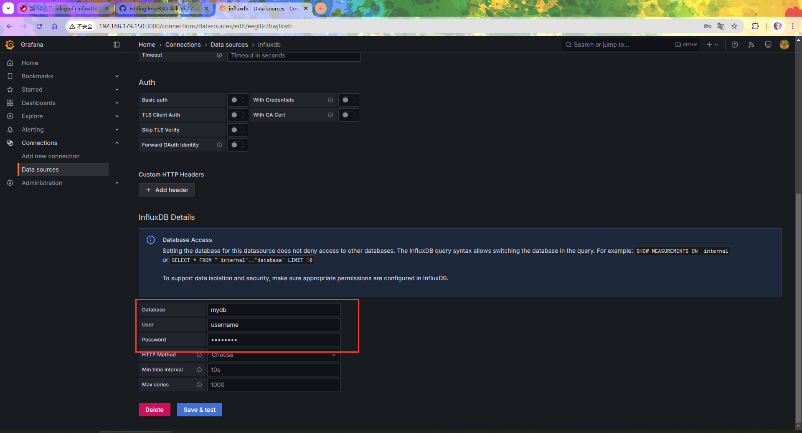
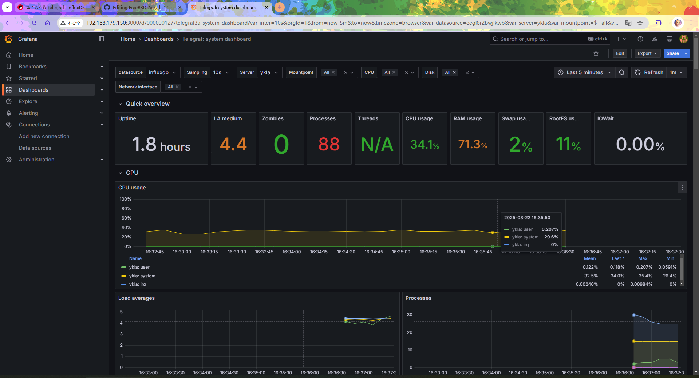

# 第 17.9 节 Telegraf+InfluxDB+Grafana 监控平台

## InfluxDB

InfluxDB是一个用于存储和分析时间序列数据的开源数据库。

### InfluxDB 安装

#### 安装

```
# pkg install influxdb
```

或者

```
cd /usr/ports/databases/influxdb/ && make install clean
```

#### 加入启动项

```
# sysrc influxd_enable="YES"
```

#### 启动服务

```
# service influxd start
```

### 修改配置

配置文件路径为 `/usr/local/etc/influxd.conf`

```
# vim /usr/local/etc/influxd.conf
```

修改完成后重启服务：

```
# service influxd restart
```

### 使用

### 连接数据库

```
# influx
```

#### 创建数据库

```
# CREATE DATABASE mydb
```

#### 查看数据库

```
# SHOW DATABASES
```

#### 创建用户名和密码

```
# CREATE USER username WITH PASSWORD 'password'
```

## Telegraf


### 安装

```
# pkg install telegraf
```

#### 加入启动项

```
# sysrc telegraf_enable="YES"
```

### 配置

配置文件路径：`/usr/local/etc/telegraf.conf`

#### 配置 influxdb 连接

我们用的是 influxdb-1.8 的版本，在配置文件中配置如下内容：

```
# 配置 influxdb 连接内容，此处的内容和上面配置的 InfluxDB 数据库连接账号密码
[[outputs.influxdb]]
  urls = ["http://127.0.0.1:8086"]
  database = "my_db" 
  username = "username"
  password = "password"
```

#### 配置采集指标

这里会收集系统 cpu、disk、diskio、memory、swap 等相关指标。下面是 telegraf 配置文件中的部分内容，部分是默认开放，部分需要手动放开注释参数，详情请看[官方文档](https://docs.influxdata.com/telegraf/v1.26/configuration/)。

```
# Read metrics about cpu usage
[[inputs.cpu]]
  ## Whether to report per-cpu stats or not
  percpu = true
  ## Whether to report total system cpu stats or not
  totalcpu = true
  ## Comment this line if you want the raw CPU time metrics
  fielddrop = ["time_*"]

# Read metrics about disk usage by mount point
[[inputs.disk]]
  ## By default, telegraf gather stats for all mountpoints.
  ## Setting mountpoints will restrict the stats to the specified mountpoints.
  # mount_points = ["/"]
  ## Ignore some mountpoints by filesystem type. For example (dev)tmpfs (usually
  ## present on /run, /var/run, /dev/shm or /dev).
  ignore_fs = ["tmpfs", "devtmpfs"]

# Read metrics about disk IO by device
[[inputs.diskio]]
  ## By default, telegraf will gather stats for all devices including
  ## disk partitions.
  ## Setting devices will restrict the stats to the specified devices.
  # devices = ["sda", "sdb"]
  ## Uncomment the following line if you need disk serial numbers.
  # skip_serial_number = false

# Get kernel statistics from /proc/stat
[[inputs.kernel]]
  # no configuration

# Read metrics about memory usage
[[inputs.mem]]
  # no configuration

# Get the number of processes and group them by status
[[inputs.processes]]
  # no configuration

# Read metrics about swap memory usage
[[inputs.swap]]
  # no configuration

# Read metrics about system load & uptime
[[inputs.system]]
  # no configuration
# Read metrics about network interface usage
[[inputs.net]]
  # collect data only about specific interfaces
  # interfaces = ["eth0"]

[[inputs.netstat]]
  # no configuration
[[inputs.interrupts]]
  # no configuration
```

### 启动服务

```
# service telegraf start
```

## Grafana

### 安装

#### 查找 Grafana

```
pkg search grafana
```

返回结果如下：

```
grafana-loki-2.8.1             Scalable, highly-available, multi-tenant log aggregation system
grafana8-8.5.27                Dashboard and graph editor for multiple data stores
grafana9-9.5.5                 Dashboard and graph editor for multiple data stores
py39-grafana-dashboard-manager-0.1.3 CLI for saving and restoring Grafana dashboards via HTTP API
rubygem-aws-sdk-managedgrafana-1.15.0 Official AWS Ruby gem for Amazon Managed Grafana
```

#### 安装

从上面的查询可以看到，有多个版本的 Grafana，这里我们选择 grafana9-9.5.5 这个版本。

```
# pkg install grafana9-9.5.5
```

#### 设置系统启动

```
# sysrc grafana_enable="YES"
```

### 启动

#### 启动服务

```
# service grafana start
```

### 使用

#### 登录

默认的登录地址为：<http://localhost:3000>，默认登录账号密码如下：

```
admin # 账号
admin # 密码
```

登录后会要求修改密码，请务必使用**强密码**！

#### 配置数据源

1. 登录后点击左上角的 **Toggle Menu** -> 选择 **Connections** -> 选择 **Connect data**
   
   

2. 在右边的输入框中输入 `InfluxDB` -> 选择搜索出来的 **InfluxDB**
   
   

3. 点击右上角的 **Create a InfluxDB data source** 按钮 -> 配置 InfluxDB 相关的内容。
   
   

4. 在数据源配置页面填写相关的 InfluxDB 连接信息，需配置内容如下：
   > 注意：我们上面使用的是 influxdb1.8，所以选择的查询语言一定要选 InfluxQL

   

   

   点击 **`Save & Test`** 按钮保存配置。

#### 配置 Dashboard

选择展示数据的 dashboard，可以自行开发，也可以[官方模版库](https://grafana.com/grafana/dashboards/)中其他人开发好的模版。这里导入一个 id 为 [928](https://grafana.com/grafana/dashboards/928-telegraf-system-dashboard/) 的模版。

1. 导入模版，点击右上角的 **`+`** -> **`Import dashboard`**  进入导入模版页面。
   
   

2. 选择 id 为 928 的模版导入
   
   

3. 模版最终效果
   
   
