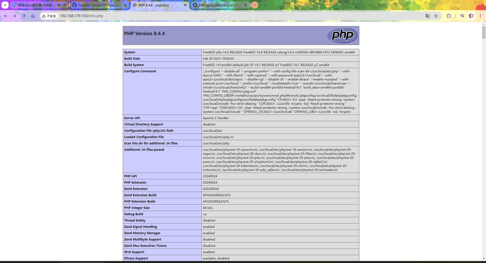
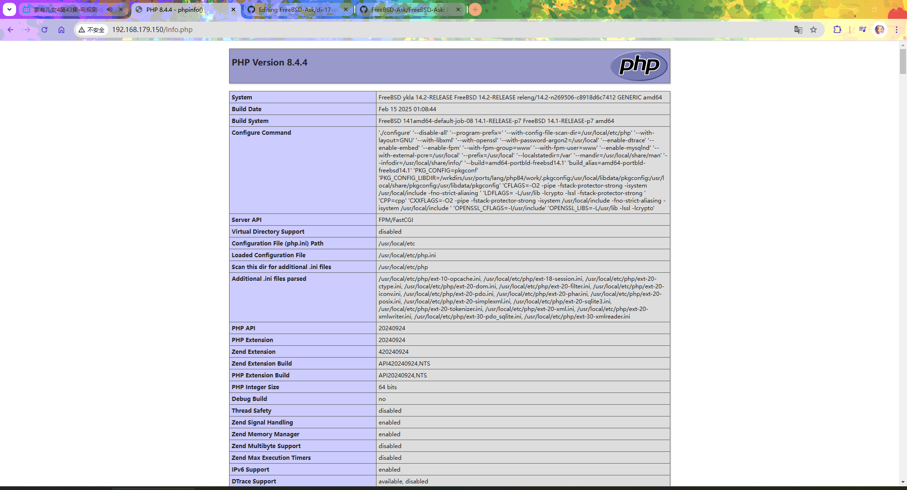

# 17.3 PHP 8.x 配置

PHP（PHP: Hypertext Preprocessor，超文本预处理器）是一种广泛使用的开源脚本语言，特别适合 Web 开发，支持嵌入式 HTML 编程和多种数据库接口，其设计理念注重开发效率和易用性。

PHP 8.x 版本在性能优化、类型系统和安全特性方面都有显著改进，包括 JIT 编译器的引入、类型系统的增强以及安全机制的完善。

本节详细介绍在 FreeBSD 上配置 PHP 8.x 运行环境的方法。

## 安装 PHP

使用 pkg 包管理器安装 PHP 是最便捷的方式，可同时安装 PHP 本体、扩展模块以及 Apache 模块，能够自动处理依赖关系和版本兼容性：

```sh
# pkg install php84 php84-extensions mod_php84
```

> **技巧**
>
> 不同的 PHP 模块之间可能存在冲突，这会导致 Ports 编译失败，因此不建议启用全部的 PHP 插件。推荐使用 pkg 进行安装，能够更好地处理模块间的依赖关系。

或者使用 Ports 方式安装 PHP：

```sh
# cd /usr/ports/lang/php84/ && make install clean
# cd /usr/ports/lang/php84-extensions/ && make install clean
# cd /usr/ports/www/mod_php84 && make install clean
```

安装完成后，可通过以下命令显示已安装 PHP 的版本信息：

```sh
# php -v
PHP 8.4.4 (cli) (built: Feb 15 2025 01:05:08) (NTS)
Copyright (c) The PHP Group
Zend Engine v4.4.4, Copyright (c) Zend Technologies
```

> **注意**
>
> 数字 `84` 可能会随 PHP 版本变化而不同。可以使用以下命令查看当前可用的 PHP 版本后再进行安装。
>
>```sh
># pkg search -o lang/php    # 在 FreeBSD Ports/Packages 中搜索以 lang/php 开头的包
>lang/php-mode.el               PHP mode for GNU Emacs
>lang/php81                     PHP Scripting Language (8.1.X branch)
>lang/php81-extensions          "meta-port" to install PHP extensions
>lang/php82                     PHP Scripting Language (8.2.X branch)
>lang/php82-extensions          "meta-port" to install PHP extensions
>lang/php83                     PHP Scripting Language (8.3.X branch)
>lang/php83-extensions          "meta-port" to install PHP extensions
>lang/php84                     PHP Scripting Language (8.4.X branch)
>lang/php84-extensions          "meta-port" to install PHP extensions (8.4.X branch)
>```

## 配置 PHP 守护进程

安装完成后，需对 PHP 进行基本配置，包括复制配置文件和启动 PHP-FPM（FastCGI 进程管理器）服务。

目录结构：

```sh
/usr/local/
├── etc/
│   ├── php.ini                    # PHP 主配置文件
│   ├── php.ini-production         # PHP 生产环境示例配置文件
│   ├── php-fpm.conf               # PHP-FPM 主配置文件
│   └── apache24/
│       └── Includes/
│           └── php.conf           # Apache 的 PHP 配置文件
└── www/
    ├── apache24/
    │   └── data/
    │       └── info.php           # PHP 信息测试文件（Apache）
    └── nginx/
        └── info.php               # PHP 信息测试文件（Nginx）
```

PHP 的示例配置文件位于 `/usr/local/etc/php.ini-production`，该文件包含了适合生产环境的推荐配置。

将生产环境的 PHP 配置文件复制为默认配置文件，并显示复制过程：

```sh
# cp -v /usr/local/etc/php.ini-production /usr/local/etc/php.ini
/usr/local/etc/php.ini-production -> /usr/local/etc/php.ini
```

设置 PHP-FPM 服务开机自启，可确保系统重启后 PHP-FPM 服务自动运行：

```sh
# service php_fpm enable
php_fpm enabled in /etc/rc.conf
```

启动 PHP-FPM 服务，使配置生效，在启动前系统会自动进行配置文件的语法检查：

```sh
# service php_fpm start
Performing sanity check on php-fpm configuration:
[25-Feb-2025 20:28:32] NOTICE: configuration file /usr/local/etc/php-fpm.conf test is successful
Starting php_fpm.
```

查看 PHP-FPM 服务当前状态，确认服务是否正常运行：

```sh
# service php_fpm status
php_fpm is running as pid 2592.
```

查看安装后信息，了解 mod_php84 的配置说明：

```sh
# pkg info -D mod_php84
mod_php84-8.4.4_1:
On install:
******************************************************************************

Consider switching to php-fpm and mod_fast_cgi as per Apache httpd project
recommendation. See https://cwiki.apache.org/confluence/display/HTTPD/PHP-FPM
建议根据 Apache httpd 项目的推荐，切换到 php-fpm 和 mod_fast_cgi。详情请见 https://cwiki.apache.org/confluence/display/HTTPD/PHP-FPM

******************************************************************************

If you are building PHP-based ports in poudriere(8) or Synth with ZTS enabled,
add WITH_MPM=event to /etc/make.conf to prevent build failures.
如果在 poudriere(8) 或 Synth 中构建启用了 ZTS 的 PHP 基础端口，请将 WITH_MPM=event 添加到 /etc/make.conf，以防止构建失败。

******************************************************************************

Make sure index.php is part of your DirectoryIndex.
确保 index.php 是 DirectoryIndex 的一部分。

You should add the following to your Apache configuration file:
应该将以下内容添加到 Apache 配置文件中：

<FilesMatch "\.php$">
    SetHandler application/x-httpd-php
</FilesMatch>
<FilesMatch "\.phps$">
    SetHandler application/x-httpd-php-source
</FilesMatch>

******************************************************************************
```

### 参考文献

以下是与 PHP 安装和配置相关的参考文献，供读者进一步学习和查阅。

- ComputingForGeeks. Install PHP 8.0 on FreeBSD 13 / FreeBSD 12[EB/OL]. (2021-12-13)[2026-03-25]. <https://computingforgeeks.com/how-to-install-php-8-on-freebsd-system/>. 详细讲解了 FreeBSD 上 PHP 8 安装步骤及依赖处理
- FreeBSD Project. PHP-FPM(8)[EB/OL]. [2026-03-25]. <https://man.freebsd.org/cgi/man.cgi?query=php-fpm>. 系统阐述了 PHP-FPM 进程管理机制及配置参数
- FreeBSD Forums. Apache and PHP[EB/OL]. [2026-03-25]. <https://forums.freebsd.org/threads/apache-and-php.80625/>. 提供了 Apache 与 PHP 集成配置的实践经验，提示安装 `mod_php84`

## 面向 Apache 的 PHP 配置文件

如果使用 Apache 作为 Web 服务器，需进行相应的配置，使 Apache 能够正确处理 PHP 文件。

编辑 `/usr/local/etc/apache24/Includes/php.conf` 文件，添加

```apache
<FilesMatch "\.php$">                           # 匹配以 .php 结尾的文件
    SetHandler application/x-httpd-php          # 将匹配文件交由 PHP 处理
</FilesMatch>
<FilesMatch "\.phps$">                          # 匹配以 .phps 结尾的文件
    SetHandler application/x-httpd-php-source   # 将匹配文件作为 PHP 源代码显示
</FilesMatch>
```

编辑 `/usr/local/www/apache24/data/info.php` 文件，加入：

```php
<?php
    phpinfo();
?>
```

用于输出当前 PHP 的配置信息和运行环境。

重启服务：

```sh
# service php_fpm restart   # 重启 PHP-FPM 服务
# service apache24 restart  # 重启 Apache 24 服务
```

访问 `ip/info.php`，如 `http://192.168.179.150/info.php`：



### 参考文献

以下是与 Apache 配合 PHP 配置相关的参考文献。

- ComputingForGeeks. Install PHP 8.0 on FreeBSD 13 / FreeBSD 12[EB/OL]. (2021-12-13)[2026-03-25]. <https://computingforgeeks.com/how-to-install-php-8-on-freebsd-system/>. 提供了完整的 PHP 安装与配置指导，文章主体框架来源于此

## 面向 Nginx 的 PHP 配置文件

如果使用 Nginx 作为 Web 服务器，同样需进行相应的配置，使 Nginx 能够通过 PHP-FPM 处理 PHP 文件。

编辑 `/usr/local/etc/nginx/nginx.conf` 文件，需要进行相应的配置修改：

删除以下行中的所有注释符号 `#`：

```nginx
        #location ~ \.php$ {
        #    root           html;
        #    fastcgi_pass   127.0.0.1:9000;
        #    fastcgi_index  index.php;
        #    fastcgi_param  SCRIPT_FILENAME  /scripts$fastcgi_script_name;
        #    include        fastcgi_params;
        #}
```

修改如下：

```nginx
location ~ \.php$ {                                 # 匹配 .php 文件请求
    root           /usr/local/www/nginx;           # 网站根目录，请根据实际路径修改
    fastcgi_pass   127.0.0.1:9000;                 # FastCGI 服务地址
    fastcgi_index  index.php;                       # 默认 FastCGI 索引文件
    fastcgi_param  SCRIPT_FILENAME  $document_root$fastcgi_script_name;  # PHP 脚本完整路径，其中 $document_root 表示网站根目录
    include        fastcgi_params;                 # 引入 FastCGI 参数文件
}
```

编辑 `/usr/local/www/nginx/info.php` 文件，加入测试代码以显示 PHP 配置信息：

```php
<?php
    phpinfo();
?>
```

用于显示当前 PHP 的配置信息及运行环境。

重启服务，使配置更改生效：

```sh
# service php_fpm restart    # 重启 PHP-FPM 服务以应用配置更改
Performing sanity check on php-fpm configuration:
[25-Feb-2025 20:59:12] NOTICE: configuration file /usr/local/etc/php-fpm.conf test is successful
Starting php_fpm.
# service nginx restart    # 重启 Nginx 服务以应用配置更改
Performing sanity check on nginx configuration:
nginx: the configuration file /usr/local/etc/nginx/nginx.conf syntax is ok
nginx: configuration file /usr/local/etc/nginx/nginx.conf test is successful
Stopping nginx.
Waiting for PIDS: 1153.
Performing sanity check on nginx configuration:
nginx: the configuration file /usr/local/etc/nginx/nginx.conf syntax is ok
nginx: configuration file /usr/local/etc/nginx/nginx.conf test is successful
Starting nginx.
```

访问 `IP/info.php`，如 `http://192.168.179.150/info.php`：



### 参考文献

以下是与 Nginx 配合 PHP 配置相关的参考文献。

- Vultr. How to Install PHP and PHP-FPM on FreeBSD 14.0[EB/OL]. (2025-04-01)[2026-03-25]. <https://docs.vultr.com/how-to-install-php-and-php-fpm-on-freebsd-14-0>. 本文曾主要参考此文，提供了 Nginx 与 PHP-FPM 集成的详细步骤

## 课后习题

1. 将目前未适配的 PHP 模块适配到 FreeBSD Ports。

2. 优化 FreeBSD PHP 相关 Port，避免潜在的冲突（如全选则冲突）。

3. 对相关配置进行安全加固，使其适用于生产环境。
