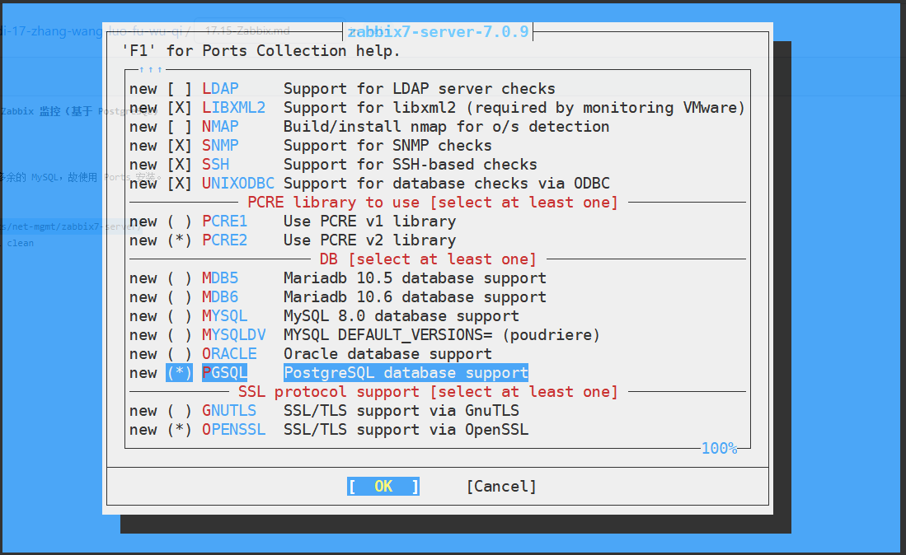

# 17.4 Zabbix 监控系统（基于 PostgreSQL）

Zabbix 是一个开源的企业级监控解决方案，用于监控网络服务、服务器硬件及应用程序，其架构采用服务器-代理模式，能够实现全面的基础设施监控。

本节阐述基于 PostgreSQL 数据库在 FreeBSD 上安装与配置 Zabbix 7 的方法。

## 安装 zabbix7-server

zabbix7-server 是服务器端（Zabbix Server），作为监控系统的核心组件，负责接收和处理监控数据，应安装在监控服务器上，承担数据处理、告警生成等核心功能。

通过 pkg 安装将额外引入 MySQL 依赖，并可能导致绑定冲突，故建议采用 Ports 方式安装，以便更精确地控制依赖关系与配置选项。首先进入对应的 Ports 目录并进行配置。

```sh
# cd /usr/ports/net-mgmt/zabbix7-server/ 
# make config
```



依照图示配置，选中 `PGSQL` 选项后确认，随后执行编译安装命令，编译过程耗时较长：

```sh
# make install clean
```

## 安装 PostgreSQL

Zabbix 需要数据库来存储监控数据，数据库是监控系统的重要组成部分，负责持久化存储所有监控指标和配置信息。

PostgreSQL 作为关系型数据库为 Zabbix 提供了可靠的数据存储支持。

PostgreSQL 16 的安装、初始化及服务自启配置请参阅本书相关章节。

## 安装 Nginx

Zabbix 前端需要通过 Web 服务器访问，Web 服务器为用户提供了访问监控界面的入口。本节使用 Nginx 作为 Web 服务器。Nginx 的安装与服务自启配置请参阅本书相关章节。

## 安装 zabbix7-frontend

zabbix7-frontend 是 Web 控制前端（Zabbix Frontend），为用户提供了图形化的监控管理界面，是用户与监控系统交互的主要方式。

采用 pkg 安装可自动处理依赖关系，执行以下命令：

```sh
# pkg ins zabbix7-frontend-php83
```

上述安装过程会自动安装 PHP。本文中安装的版本是 PHP 8.3（写作本文时 PHP 8.4 可能导致错误）。具体可用版本可到 [zabbix7-frontend](https://www.freshports.org/net-mgmt/zabbix7-frontend) 查看，该网站提供了最新的包信息和兼容性说明。

或者使用 Ports 方式安装，这种方式提供了更大的配置灵活性，需要先进入对应的目录再执行编译安装命令：

```sh
# cd /usr/ports/net-mgmt/zabbix7-frontend/ 
# make install clean
```

## PDO

Zabbix 前端需要通过 PHP 访问 PostgreSQL 数据库，因此需要安装相应的 PHP 数据库扩展，PDO（PHP Data Objects）是 PHP 中用于数据库访问的统一接口。注意所使用的 PHP 版本要与 Zabbix 前端兼容，这是确保系统正常运行的关键。

使用 pkg 安装 PHP 数据库扩展：

```sh
# pkg ins php83-pdo_pgsql php83-pgsql
```

或者使用 Ports 方式安装 PHP 数据库扩展：

```sh
# cd /usr/ports/databases/php83-pdo_pgsql/ && make install clean
# cd /usr/ports/databases/php83-pgsql/ && make install clean
```

## 安装 zabbix7-agent

zabbix7-agent 是 Zabbix 的代理程序，负责在被监控主机上收集监控数据并发送给 Zabbix Server，是监控数据采集的关键组件。应安装在需要被监控的服务器上，可以部署在多台机器上实现分布式监控。

使用 pkg 安装 zabbix7-agent。

```sh
# pkg install zabbix7-agent
```

或者使用 Ports 方式安装 zabbix7-agent。

```sh
# cd /usr/ports/net-mgmt/zabbix7-agent/ 
# make install clean
```

## 守护进程

为确保 Zabbix 相关服务在系统启动时自动运行，保证监控系统的持续性和可靠性，需将相关服务配置为开机自启，这是生产环境部署的标准做法。

```sh
# service zabbix_server enable   # 设置 Zabbix Server 服务开机自启
# service zabbix_agentd enable   # 设置 Zabbix Agent 服务开机自启
# service php_fpm enable         # 设置 PHP-FPM 服务开机自启
```

## 设置 PostgreSQL 数据库

需要在 PostgreSQL 中创建专门的数据库和用户供 Zabbix 使用，并导入 Zabbix 的初始数据，这是配置监控系统数据库的必要步骤。请自行初始化 PostgreSQL 数据库后再执行以下命令：

```sql
$ cd /usr/local/share/zabbix7/server/database/postgresql/             # 进入 Zabbix PostgreSQL 数据库初始化脚本目录
$ psql                                     # 启动 PostgreSQL 命令行客户端
psql (16.8)
Type "help" for help.

template1=# create database zabbix;                 -- 创建 zabbix 数据库
CREATE DATABASE

template1=# CREATE USER zabbix WITH PASSWORD 'z';  -- 创建用户 zabbix 并设置密码为 'z'
CREATE ROLE

postgres=# GRANT USAGE, CREATE on SCHEMA public to zabbix;  -- 授权 zabbix 用户使用 public 模式并创建对象
GRANT

postgres=# GRANT ALL PRIVILEGES ON DATABASE zabbix TO zabbix;  -- 授权 zabbix 用户对 zabbix 数据库所有权限
GRANT

postgres=# ALTER DATABASE zabbix owner to zabbix;   -- 将 zabbix 数据库所有权转给 zabbix 用户
ALTER DATABASE

postgres=# \q                                     -- 退出 PostgreSQL 命令行
```

必须退出再继续，确保使用正确的用户权限进行后续操作：

```text
$  psql -U zabbix zabbix # 使用用户账户 zabbix 登录到数据库 zabbix
psql (16.8, server 16.7)
Type "help" for help.

zabbix=> \i schema.sql -- 在 zabbix 数据库中执行 schema.sql 脚本以创建数据库结构
CREATE TABLE
CREATE INDEX
CREATE TABLE
CREATE INDEX
CREATE TABLE

……此处省略部分内容……

zabbix=> \i images.sql
INSERT 0 1
INSERT 0 1
INSERT 0 1
INSERT 0 1
INSERT 0 1

……此处省略部分内容……

zabbix=>  \i data.sql
START TRANSACTION
INSERT 0 4
INSERT 0 1
INSERT 0 2

……此处省略部分内容……

zabbix=# \q -- 退出
$ exit # 退出数据库用户
root@ykla:~ # # 返回到 root 用户
```

### 参考文献

以下是与 PostgreSQL 配置相关的参考文献，供读者进一步查阅，这些资料提供了更深入的数据库配置说明。

- ShowMe.Codes. PostgreSQL15 Public Schema 没有权限问题解决[EB/OL]. [2026-03-25]. <https://showme.codes/zh-cn/2024-01-01-postgresql15-public-schema-permission/>. 详述了 PostgreSQL 15+ 中 public schema 权限变更及解决方案。

## 设置 Zabbix Server

需要配置 Zabbix Server 的主要配置文件，使其能够连接到 PostgreSQL 数据库，这是确保监控系统正常工作的关键配置步骤。

目录结构：

```sh
/
├── usr
│   └── local
│       ├── etc
│       │   └── zabbix7
│       │       ├── zabbix_server.conf     # Zabbix Server 配置文件
│       │       └── zabbix_agentd.conf     # Zabbix Agent 配置文件
│       ├── share
│       │   └── zabbix7
│       │       └── server
│       │           └── database
│       │               └── postgresql    # Zabbix PostgreSQL 数据库初始化脚本
│       └── www
│           └── zabbix7
│               └── conf
│                   ├── zabbix.conf.php           # Zabbix 前端配置文件
│                   └── zabbix.conf.php.example   # Zabbix 前端配置示例
└── var
    └── log
        └── zabbix
            ├── zabbix_server.log        # Zabbix Server 日志
            └── zabbix_agentd.log        # Zabbix Agent 日志
```

Zabbix Server 的主要配置文件位于 `/usr/local/etc/zabbix7/zabbix_server.conf`。

加入以下内容：

```ini
SourceIP=127.0.0.1           # Zabbix Server 监听的源 IP 地址
LogFile=/var/log/zabbix/zabbix_server.log   # Zabbix Server 日志文件路径
DBHost=                        # 数据库主机地址，留空表示本地主机
DBName=zabbix                  # Zabbix Server 使用的数据库名称
DBUser=zabbix                  # 数据库用户名
DBPassword=z                   # 数据库用户密码
Timeout=4                      # Zabbix Server 与数据库或代理的超时时间（秒）
LogSlowQueries=3000            # 记录超过指定毫秒数的慢查询
StatsAllowedIP=127.0.0.1       # 允许访问 Zabbix Server 统计信息的 IP
```

## 设置 Zabbix Agent

需要配置 Zabbix Agent 的主要配置文件，使其能够与 Zabbix Server 通信。Zabbix Agent 的配置文件位于 `/usr/local/etc/zabbix7/zabbix_agentd.conf`。

加入以下内容：

```ini
LogFile=/var/log/zabbix/zabbix_agentd.log   # Zabbix Agent 日志文件路径
SourceIP=127.0.0.1                          # Zabbix Agent 使用的源 IP 地址
Server=127.0.0.1                            # Zabbix Server IP 地址，用于被动检查
ServerActive=127.0.0.1                      # Zabbix Server IP 地址，用于主动检查
Hostname=ykla                               # 当前主机在 Zabbix Server 中的主机名
```

## 配置 Zabbix 前端

需要配置 Zabbix 前端的配置文件，使其能够连接到 PostgreSQL 数据库。Zabbix 前端配置文件模板位于 `/usr/local/www/zabbix7/conf/zabbix.conf.php.example` 文件（Zabbix Frontend 配置模板）。

复制 Zabbix 示例配置文件为正式配置文件：

```sh
# cp /usr/local/www/zabbix7/conf/zabbix.conf.php.example /usr/local/www/zabbix7/conf/zabbix.conf.php
```

编辑 `/usr/local/www/zabbix7/conf/zabbix.conf.php` 文件，将：

```ini
$DB['TYPE']                             = 'MYSQL';
$DB['SERVER']                   = 'localhost';
$DB['PORT']                             = '0';
$DB['DATABASE']                 = 'zabbix';
$DB['USER']                             = 'zabbix';
$DB['PASSWORD']                 = '';
```

修改如下：

```ini
$DB['TYPE']     = 'POSTGRESQL';   # 数据库类型设置为 PostgreSQL
$DB['SERVER']   = 'localhost';    # 数据库服务器地址
$DB['PORT']     = '0';            # 数据库端口，0 表示使用默认端口
$DB['DATABASE'] = 'zabbix';       # 数据库名称
$DB['USER']     = 'zabbix';       # 数据库用户名
$DB['PASSWORD'] = 'z';            # 数据库用户密码
```

### 配置 nginx

需要配置 Nginx 来提供 Zabbix 前端的 Web 访问服务。备份原有 Nginx 主配置文件：

```sh
# cp /usr/local/etc/nginx/nginx.conf /usr/local/etc/nginx/nginx.conf.simple
```

编辑 `/usr/local/etc/nginx/nginx.conf` 文件，清空原有内容，修改如下，

```nginx
worker_processes 1;                              # 工作进程数量
events {
  worker_connections 1024;                       # 单个工作进程允许的最大连接数
}
http {
  include             mime.types;                # 引入 MIME 类型定义文件
  default_type        application/octet-stream; # 默认 MIME 类型
  sendfile            on;                        # 启用 sendfile 提高静态文件传输效率
  keepalive_timeout   65;                        # keepalive 超时时间（秒）
  server {
    listen            80;                        # 监听 HTTP 80 端口
    server_name       localhost;                 # 虚拟主机名称
    root /usr/local/www/zabbix7;                # 网站根目录
    index index.php index.html index.htm;        # 默认首页文件顺序
    location / {
      try_files $uri $uri/ =404;                # 请求文件不存在时返回 404
    }
    location ~ \.php$ {                           # 匹配 .php 文件请求
      fastcgi_split_path_info ^(.+\.php)(/.+)$; # 分割 PATH_INFO
      fastcgi_param SCRIPT_FILENAME $document_root$fastcgi_script_name; # PHP 脚本路径
      fastcgi_param PATH_INFO $fastcgi_path_info;                         # 设置 PATH_INFO
      fastcgi_param REMOTE_USER $remote_user;                             # 设置 REMOTE_USER
      fastcgi_pass   127.0.0.1:9000;                                      # FastCGI 服务地址
      fastcgi_index index.php;                                            # 默认 FastCGI 索引文件
      include fastcgi_params;                                             # 引入 FastCGI 参数文件
    }
  }
}
```

## 配置 PHP

需要对 PHP 进行配置，以满足 Zabbix 前端的运行要求。

### 编辑 `/usr/local/etc/php.ini-production` 文件

将生产环境 PHP 配置文件复制为默认配置文件：

```sh
# cp /usr/local/etc/php.ini-production /usr/local/etc/php.ini
```

编辑 `/usr/local/etc/php.ini` 文件：

- 找到 `;date.timezone =` 修改为 `date.timezone = Asia/Shanghai`（注意要删掉原来开头的 `;`）
- 找到 `post_max_size = 8M` 修改为 `post_max_size = 16M`
- 找到 `max_execution_time = 30`，修改为 `max_execution_time = 300`
- 找到 `max_input_time = 60`，修改为 `max_input_time = 300`

## 启动服务

所有配置完成后，需要按顺序启动相关服务，使 Zabbix 监控系统正常运行。

```sh
# service postgresql restart    # 重启 PostgreSQL 服务
# service php_fpm start         # 启动 PHP-FPM 服务
# service nginx start           # 启动 Nginx 服务
# service zabbix_server start   # 启动 Zabbix Server 服务
# service zabbix_agentd start   # 启动 Zabbix Agent 服务
```

## 登录

服务启动成功后，可以通过浏览器访问 Zabbix Web 前端进行登录和配置。Zabbix Web 前端的默认用户名和密码如下：

- 用户名：`Admin`
- 密码：`zabbix`


## 配置中文

登录 Zabbix 后，可以将界面语言设置为中文，方便使用。


## 故障排除与未竟事宜

在使用 Zabbix 过程中如遇到问题，可以查看相关日志文件进行排查。本节还列出了一些待完善的事项。

### 日志

- 代理：`/var/log/zabbix/zabbix_agentd.log` 文件
- 服务器端：`/var/log/zabbix/zabbix_server.log` 文件
- PHP 相关错误：`/var/log/nginx/error.log` 文件

### 待解决

以下是一些有待探讨的问题，供读者参考和进一步思考。

- 中文显示乱码；
- 部分监控项未显示；
- HTTP 等安全配置有待完善。

## 参考文献

以下是与 Zabbix 相关的参考文献，供读者学习和查阅。

- FreeBSD Foundation. Monitor Your Hosts with Zabbix[EB/OL]. [2026-03-25]. <https://freebsdfoundation.org/our-work/journal/browser-based-edition/networking-10th-anniversary/practical-ports-monitor-your-hosts-with-zabbix/>. 提供了 FreeBSD 上 Zabbix 监控部署的完整实践指南。

## 课后习题

1. 将本文中尚未在 FreeBSD 上实现的监控模块重新实现。

2. 重写一个完全面向 FreeBSD 的监控模板。

3. 完善 Zabbix 的简体中文翻译，并贡献至上游。

4. 对 Zabbix 进行安全加固。
