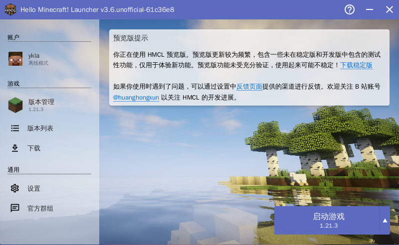
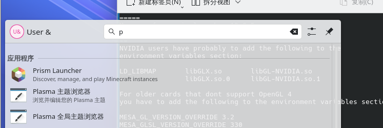
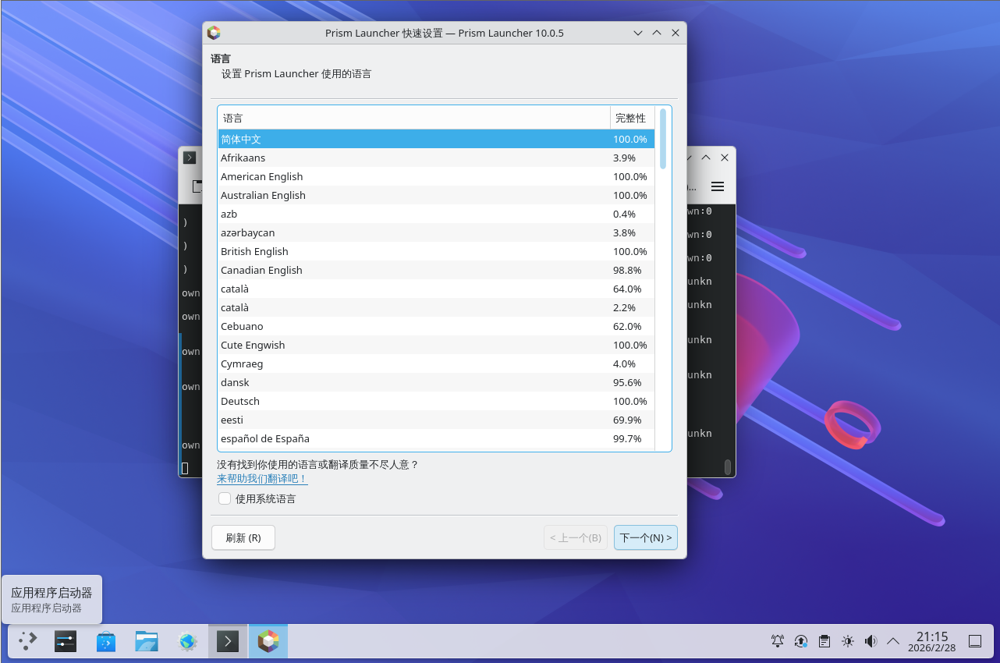
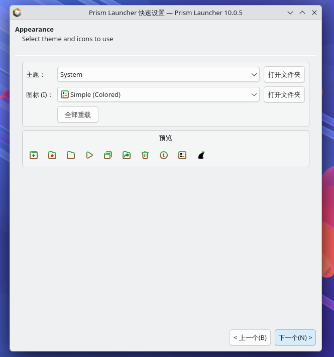
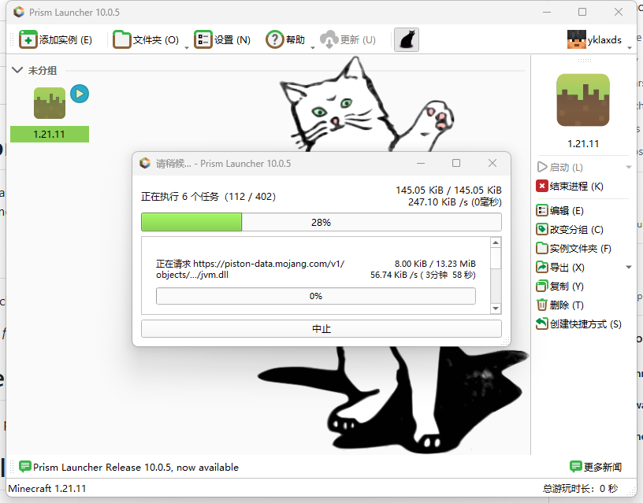
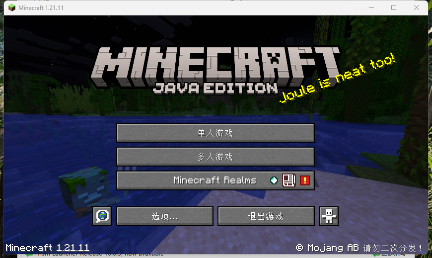
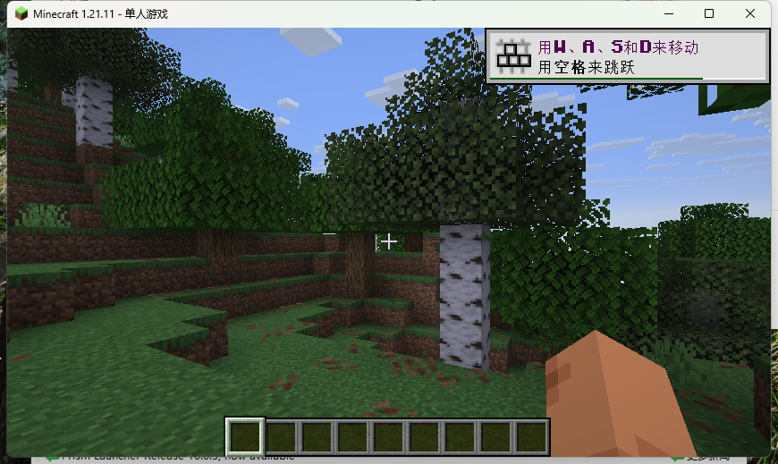

# 17.3 我的世界（Minecraft）

Minecraft 是一款由 Java 语言开发的沙盒游戏，不同版本对 JDK 版本有特定要求（1.20.5+ 需 Java 21）。本节介绍 FreeBSD 上 OpenJDK 安装、启动器配置。

## 安装 OpenJDK

Minecraft 各版本要求的 JDK 版本不同：

| Minecraft 版本 | 所需 JDK 版本 |
| -------------- | ------------- |
| 1.17 | Java 16 |
| 1.18 至 1.20.4 | Java 17 |
| 1.20.5 及以上 | Java 21 |

经测试，JDK 21 可正常运行最新版 Minecraft。

使用 pkg 安装 OpenJDK 21：

```sh
# pkg install openjdk21
```

或者使用 Ports 安装 OpenJDK 21：

```sh
# cd /usr/ports/java/openjdk21/
# make install clean
```

## Minecraft 客户端

FreeBSD 中有两种常见启动器，分别是 HMCL 和 Prism Launcher。Prism Launcher 可通过 FreeBSD Ports 获得，HMCL 只能手动下载 `.jar` 文件运行。

### HMCL

HMCL（Hello Minecraft! Launcher）是一款用 Java 开发的 Minecraft 启动器，支持多版本管理和模组加载。

#### 配置 HMCL

配置启动器前需先获取安装文件。

从 [releases](https://github.com/HMCL-dev/HMCL/releases) 页面下载最新的发行版。

打开终端执行命令，使用 Java 运行 HMCL 启动器的 JAR 文件：

```sh
$ java -jar HMCL*.jar
```

并非所有 Minecraft 版本都受支持，适配情况请参阅 [平台支持状态](https://github.com/HMCL-dev/HMCL/blob/main/docs/PLATFORM_zh.md) 文档。其余设置与平台无关，关键配置包括 Java 路径设置、游戏目录选择和内存分配三项。

#### 使用 HMCL 启动游戏

使用 HMCL 启动游戏的具体操作可参考下图。




### Prism Launcher

Prism Launcher 是一款使用 C++ 和 Qt 框架开发的开源启动器。该启动器默认禁止离线登录，且限制[绕过方法](https://github.com/antunnitraj/Prism-Launcher-PolyMC-Offline-Bypass)，仅推荐正版用户使用。

#### 安装 Prism Launcher

使用 pkg 安装 Prism Launcher：

```sh
# pkg install prismlauncher
```

还可使用 Ports 安装 Prism Launcher：

```sh
# cd /usr/ports/games/prismlauncher/
# make install clean
```

#### 配置 Prism Launcher

配置时需注意桌面环境的兼容性。

如果使用 KDE 桌面环境，需更新第三方软件包到最新版本。这是因为 KDE 桌面环境要求特定的 Qt 版本，Prism Launcher 依赖的 Qt 库需与系统库保持一致。

```sh
# pkg upgrade
```

否则可能无法启动，终端会提示 Qt 库版本不兼容或缺少符号等错误信息。

点击启动程序：



此处为语言设置，默认支持中文。



此处设置 Java 版本，保持默认设置即可。


外观设置，保持默认设置。



#### 使用 Prism Launcher 启动 Minecraft

启动程序后，可见 Prism Launcher 支持中文，但需要正版登录。


登录后下载最新版本的游戏。

> **注意**
>
> 需要 Minecraft 正版账号才能登录游戏，可 [购买](https://www.minecraft.net/zh-hans/store/minecraft-java-bedrock-edition-pc) 该游戏。



进入我的世界游戏。



进入游戏画面。



## 参考文献

- Mojang Studios. Minecraft: Java Edition 1.20.5[EB/OL]. [2026-04-17]. <https://www.minecraft.net/en-us/article/minecraft-java-edition-1-20-5>. Minecraft 1.20.5 起要求 Java 21 和 64 位操作系统。
- HMCL-dev. Hello Minecraft! Launcher[EB/OL]. [2026-04-17]. <https://github.com/HMCL-dev/HMCL>. HMCL 是一款开源跨平台 Minecraft 启动器，以 GPLv3 协议发布。
