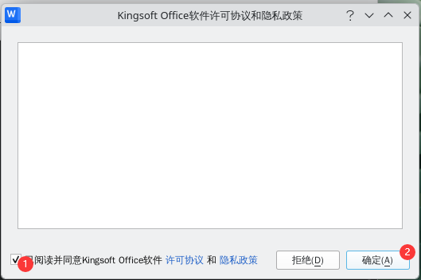

# 18.9 WPS Office（Linux 版）

WPS Office for Linux 是金山软件公司开发的 Linux 办公套件，兼容 Microsoft Office 文件格式，支持文字处理、电子表格和演示文稿等功能。

WPS Office 没有原生 FreeBSD 版本，且 Ports 中的 WPS 已无人维护，需通过自行构建的 Linux 兼容层安装。本节基于 Rocky Linux 兼容层给出安装与配置步骤。

> **警告**

> 因为该 Port 已无人维护，请勿使用 Ports 中的 WPS Office。请自行构建兼容层后安装使用。

## 基于 Rocky Linux 兼容层（FreeBSD Port）

> **注意**
>
> 请先参考本书其他章节完成 Rocky Linux 兼容层（FreeBSD Port）的安装。

RPM 工具用于将 rpm 软件包安装到基本系统中的 Rocky Linux 兼容层。

### 安装 RPM 工具

参考本书其他相关章节安装 RPM 工具（`pkg install rpm4`）。

### 下载 WPS Office

WPS Office 官方下载地址：[WPS Office for Linux](https://linux.wps.cn/)。选择“64位 Rpm格式”

请自行获取有效链接。如果使用火狐浏览器，可能需要关闭浏览器地址栏中的“增强型跟踪保护”功能方可下载。

> **技巧**
>
> 该链接存在问题，目前无法通过 fetch 或 wget 下载。如有解决方案，请提交 PR 或 issue。

本文获取到的文件为 **wps-office-12.1.2.25882.AK.preread.sw.Personal-1-663297.x86_64.rpm**。

### 安装 WPS Office

切换到兼容层路径：

```sh
# cd /compat/linux/
```

安装 WPS Office：

```sh
# rpm2cpio < /home/ykla/下载/wps-office-12.1.2.25882.AK.preread.sw.Personal-1-663297.x86_64.rpm  | cpio -id
```

> **技巧**
>
> 本节示例中出现的用户名 `ykla`、主机名 `ykla` 及路径 `/home/ykla` 均为示例，请根据自身环境替换为实际值。

有类似“symlink”的错误信息是正常的。请将路径替换为本地下载文件的实际路径。

WPS Office 文件结构：

```sh
/compat/linux/
└── opt/
     └── kingsoft/
         └── wps-office/
             └── office6/
                  └── wps # WPS 可执行文件
```

### 解决依赖问题

未使用包管理器动态安装，故依赖可能存在异常，须检查依赖项。

切换到兼容层的 shell：

```bash
$ /compat/linux/usr/bin/bash
```

查看 WPS 可执行文件的动态库依赖：

```sh
bash-5.1$ ldd /opt/kingsoft/wps-office/office6/wps
        linux-vdso.so.1 (0x00007fffffffe000)
        libdl.so.2 => /lib64/libdl.so.2 (0x0000000801064000)
        libpthread.so.0 => /lib64/libpthread.so.0 (0x0000000801069000)
        libtcmalloc_minimal.so.4 => /opt/kingsoft/wps-office/office6/libtcmalloc_minimal.so.4 (0x0000000801600000)
        liblibsafec.so => /opt/kingsoft/wps-office/office6/liblibsafec.so (0x000000080106e000)
        libstdc++.so.6 => /opt/kingsoft/wps-office/office6/libstdc++.so.6 (0x0000000801a00000)
        libm.so.6 => /lib64/libm.so.6 (0x000000080108b000)
        libgcc_s.so.1 => /opt/kingsoft/wps-office/office6/libgcc_s.so.1 (0x0000000801166000)
        libc.so.6 => /lib64/libc.so.6 (0x0000000801e00000)
        /lib64/ld-linux-x86-64.so.2 (0x0000000001021000)
        librt.so.1 => /lib64/librt.so.1 (0x000000080118b000)
```

输出表明依赖库已经齐全。

### 运行 WPS Office

使用普通用户权限在 Linux 兼容环境中启动 WPS Office：

```bash
$ /compat/linux/opt/kingsoft/wps-office/office6/wps
```

接受软件的许可协议和隐私政策：



输入法正常运行。


快捷方式：将 **/compat/linux/opt/kingsoft/wps-office/desktops/wps-office-wps.desktop** 复制到桌面，修改如下。

```ini
[Desktop Entry]
Comment=Use WPS Writer to edit articles and reports.
Comment[zh_CN]=使用 WPS 文字编写报告，排版文章
Exec=/compat/linux/opt/kingsoft/wps-office/office6/wps %U
GenericName=WPS Writer
GenericName[zh_CN]=WPS 文字
MimeType=application/wps-office.wps;application/wps-office.wpt;application/wps-office.wpso;application/wps-office.wpss;application/wps-office.doc;application/wps-office.dot;application/vnd.ms-word;application/msword;application/x-msword;application/msword-template;application/wps-office.docx;application/wps-office.dotx;application/rtf;application/vnd.ms-word.document.macroEnabled.12;application/vnd.openxmlformats-officedocument.wordprocessingml.document;x-scheme-handler/ksoqing;x-scheme-handler/ksowps;x-scheme-handler/ksowpp;x-scheme-handler/ksoet;x-scheme-handler/ksowpscloudsvr;x-scheme-handler/ksowebstartupwps;x-scheme-handler/ksowebstartupet;x-scheme-handler/ksowebstartupwpp;application/wps-office.uot3;application/wps-office.uott3;x-scheme-handler/ksodoccenter;application/wps-office.msg;application/wps-office.eml;
Name=WPS Writer
Name[zh_CN]=WPS 文字
StartupNotify=false
Terminal=false
Type=Application
Categories=Office;WordProcessor;Qt;
X-DBUS-ServiceName=
X-DBUS-StartupType=
X-KDE-SubstituteUID=false
X-KDE-Username=
Icon=wps-office2023-wpsmain
InitialPreference=3
StartupWMClass=wps
```

赋予权限后即可使用。

## 基于 Arch Linux 兼容层

请先参照本书其他相关章节构建 Arch Linux 兼容层，进入兼容层并切换到普通用户：

```sh
# chroot /compat/arch/ /bin/bash # 进入 Arch 兼容层
# su test # 切换到普通用户才能使用 AUR，此时位于 Arch 兼容层
```

开始安装：

```sh
$ yay -S wps-office-cn ttf-wps-fonts wps-office-mui-zh-cn # 此时位于 Arch 兼容层，当前用户为 test
AUR Explicit (2): wps-office-cn-11.1.0.11698-1, ttf-wps-fonts-1.0-5
:: (1/1) Downloaded PKGBUILD: ttf-wps-fonts
  2 wps-office-cn                            (Build Files Exist)
  1 ttf-wps-fonts                            (Build Files Exist)
==> Packages to cleanBuild?
==> [N]one [A]ll [Ab]ort [I]nstalled [No]tInstalled or (1 2 3, 1-3, ^4)
==> 1  # 输入 1 后按回车
:: Deleting (1/1): /home/test/.cache/yay/ttf-wps-fonts
HEAD is now at ba3222c Add upstream URL
  2 wps-office-cn                            (Build Files Exist)
  1 ttf-wps-fonts                            (Build Files Exist)
==> Diffs to show?
==> [N]one [A]ll [Ab]ort [I]nstalled [No]tInstalled or (1 2 3, 1-3, ^4)
==> 1 # 输入 1 后按回车
diff --git /home/test/.cache/yay/ttf-wps-fonts/.gitignore /home/test/.cache/yay/ttf-wps-fonts/.gitignore
new file mode 100644
index 0000000..12be320
--- /dev/null
+++ /home/test/.cache/yay/ttf-wps-fonts/.gitignore
@@ -0,0 +1,5 @@
+*.pkg.tar.xz
+*.src.tar.gz
+src/
+pkg/
+
diff --git /home/test/.cache/yay/ttf-wps-fonts/PKGBUILD /home/test/.cache/yay/ttf-wps-fonts/PKGBUILD
new file mode 100644
index 0000000..21a51bb
--- /dev/null
…………
+url="https://github.com/IamDH4/ttf-wps-fonts"
+source=("$pkgname.zip::https://github.com/IamDH4/$pkgname/archive/master.zip"
+        "license.txt")
+sha1sums=('cbc7d2c733b5d3461f3c2200756d4efce9e951d5'
+          '6134a63d775540588ce48884e8cdc47d4a9a62f3')
+
# 输入 q 退出
:: Proceed with install? [Y/n] y # 输入 y 确认
==> Making package: ttf-wps-fonts 1.0-5 (Thu Jul  6 06:23:35 2023)
…………
==> Leaving fakeroot environment.
==> Finished making: wps-office-cn 11.1.0.11698-1 (Thu Jul  6 06:37:32 2023)
==> Cleaning up...

We trust you have received the usual lecture from the local System
Administrator. It usually boils down to these three things:

    #1) Respect the privacy of others.
    #2) Think before you type.
    #3) With great power comes great responsibility.

For security reasons, the password you type will not be visible.

[sudo] password for test: # 输入 test 用户的密码。若密码正确但仍提示错误，请重启 FreeBSD 后重试

Packages (2) ttf-wps-fonts-1.0-5  wps-office-cn-11.1.0.11698-1

Total Installed Size:  1370.17 MiB

:: Proceed with installation? [Y/n] y # 输入 y 确认安装
(2/2) checking keys in keyring                                      [######################################] 100%
(2/2) checking package integrity                                    [######################################] 100%
…………
(2/2) installing ttf-wps-fonts                                      [######################################] 100%
:: Running post-transaction hooks...
(1/4) Arming ConditionNeedsUpdate...
(2/4) Updating fontconfig cache...
(3/4) Updating the desktop file MIME type cache...
(4/4) Updating X fontdir indices...
[test@ykla ~]$ exit
# pacman -S libxcomposite # 安装缺失的依赖
```

安装完毕。

Fcitx5 输入法暂时无法使用，功能待后续测试。如有解决方法，请提供参考。

## 基于 Ubuntu 的兼容层

请先参照本书其他相关章节构建 Ubuntu 兼容层，随后进入并安装 WPS Office：

```sh
# chroot /compat/ubuntu/ /bin/bash
```

安装依赖包：

```bash
# apt install bsdmainutils xdg-utils libxslt1.1 libqt5gui5 xcb
```

下载 WPS Office Debian 安装包：

```sh
# wget https://wps-linux-personal.wpscdn.cn/wps/download/ep/Linux2019/11698/wps-office_11.1.0.11698_amd64.deb
```

调用包管理器安装 WPS Office：

```bash
# apt install ./wps-office_11.1.0.11698_amd64.deb
```

安装完毕。

> **注意**
>
> 本节撰写时，Fcitx5 输入法未生效，功能待后续测试。如有解决方法，请提供参考。

## 故障排除与未竟事宜

### 无法启动

查看 **/usr/lib/office6/wps** 可执行文件的动态库依赖：

```sh
# ldd /usr/lib/office6/wps
```

根据 `ldd` 输出补充缺失的库。

### 需要 root 权限才能启动

尚未解决。

### 由于缺少 Bash 导致 WPS 无法启动

WPS 的启动文件需要调用 Bash，安装 Bash 后即可正常启动。

- 使用 pkg 安装：

```sh
# pkg install bash
```

- 或者使用 Ports 安装：

```sh
# cd /usr/ports/shells/bash/
# make install clean
```
