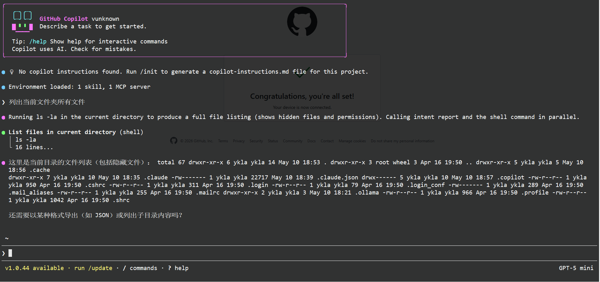

# 18.4 大模型本地部署

## llama.cpp

llama.cpp 使用 C/C++ 编写，旨在通过最简化的配置在各类硬件上实现大模型推理。llama.cpp 依赖 **misc/ggml** 提供底层张量计算库，该依赖会在安装 **misc/llama-cpp** 时自动安装。纯 CPU 环境如需关闭 GPU 加速，可在 **misc/ggml** 中设置 `VULKAN=OFF` 选项（而非在 `llama-cpp` 本身）。

### 安装

- 使用 pkg 安装：

```sh
# pkg install llama-cpp
```

- 使用 Ports 安装：

```sh
# cd /usr/ports/misc/llama-cpp/
# make install clean
```

- 查看安装说明

```sh
# pkg info -D llama-cpp
```

### 部署千问大模型

GGUF 是一种文件格式，存储了运行模型所需的信息。llama.cpp 要求模型以该格式存储。

[Hugging Face](https://huggingface.co/models?sort=trending&search=llama+gguf) 平台托管了大量适配 llama.cpp 的 GGUF 格式的大模型，用户可直接搜索关键词“llama gguf”。

[Qwen](https://huggingface.co/Qwen/collections) 是阿里云开发的大型语言模型家族。假设使用 Qwen/Qwen3-0.6B-GGUF：

```sh
$ llama-cli -hf Qwen/Qwen3-0.6B-GGUF:Q8_0 --jinja --color -ngl 99 -fa -sm row --temp 0.6 --top-k 20 --top-p 0.95 --min-p 0 --presence-penalty 1.5 -c 1024 -n 256 --no-context-shift
```

| 参数 | 功能说明 |
| ---- | -------- |
| **-hf Qwen/Qwen3-0.6B-GGUF:Q8_0** | 指定模型来源和量化版本，使用来自 Hugging Face Hub 的模型文件，使用 8-bit 量化权重 |
| `--jinja` | 启用 Jinja 模板解析，可在提示中使用变量 |
| `--color` | 在终端显示彩色输出，便于区分用户输入和模型生成文本 |
| `-ngl` | 指定卸载到 GPU 的层数（n-gpu-layers），数值越大使用 GPU 越多 |
| `-fa` | 启用 Flash Attention，优化注意力计算，可提升推理速度并降低显存占用 |
| `-sm row` | 设置多 GPU 张量分割模式（split mode），row 表示按行分割张量到不同 GPU |
| `--temp` | 设置采样温度，控制生成文本的随机性 |
| `--top-k` | 限制每次生成 token 时，从概率最高的候选中选择，提高文本多样性 |
| `--top-p` | 核采样策略，只选择累计概率达到一定阈值的 token |
| `--min-p` | 生成 token 的最小概率阈值，用于过滤低概率 token |
| `--presence-penalty` | 对重复出现的 token 施加惩罚，减少重复文本 |
| `-c` | 上下文窗口长度，模型在生成时可以记住的历史 token 数量 |
| `-n` | 最大生成 token 数，控制一次生成文本的总长度 |
| `--no-context-shift` | 禁用上下文滑动或移动窗口，保持固定上下文生成文本 |

详细参数说明参见 [Qwen 官方文档中的 llama.cpp 部署指南](https://qwen.readthedocs.io/zh-cn/latest/run_locally/llama.cpp.html)。

上述输出如下：

```sh
Downloading Qwen3-0.6B-Q8_0.gguf ─────────────────────────────────── 100%

Loading model...


▄▄ ▄▄
██ ██
██ ██  ▀▀█▄ ███▄███▄  ▀▀█▄    ▄████ ████▄ ████▄
██ ██ ▄█▀██ ██ ██ ██ ▄█▀██    ██    ██ ██ ██ ██
██ ██ ▀█▄██ ██ ██ ██ ▀█▄██ ██ ▀████ ████▀ ████▀
                                    ██    ██
                                    ▀▀    ▀▀

build      : b9033-unknown
model      : Qwen/Qwen3-0.6B-GGUF:Q8_0
modalities : text

available commands:
  /exit or Ctrl+C     stop or exit
  /regen              regenerate the last response
  /clear              clear the chat history
  /read <file>        add a text file
  /glob <pattern>     add text files using globbing pattern


>> 介绍一下你自己

[Start thinking]
好的，用户问我要介绍一下自己。我需要先确认用户的需求是什么。可能他们想了解我的能力、经验或特点？或者只是想测试是否能回答问题？

接下来，我要考虑用户的身份。可能是学生、职场人士，或者刚接触AI的人。不同背景的用户对介绍的内容可能会有不同侧重。例如，学生可能更关注学习和技能，而职场人士可能关注实际应用。

此后，我需要确保回答友好且实用。要涵盖基本的信息，但不应过于冗长。同时，保持自然的口语化，避免使用专业术语过多，让信息易于理解。

另外，用户可能没有明确说出深层需求，例如他们可能想通过我的介绍找到合适的资源或学习方向。因此，在回答中可以提到一些可能性，帮助用户做出决策。

最后，检查回答是否准确、简洁，并且符合用户期望的语气。确保没有遗漏关键点，同时保持整体连贯性和自然流畅。

[End thinking]

我是一个AI助手，专注于提供帮助和解答问题。我可以协助你完成学习、工作或生活中的各种任务。如果你有任何问题或需要帮助，请随时告诉我！

[ Prompt: 52.0 t/s | Generation: 25.2 t/s ]

> /exit
```

输入 `/exit` 或者按 **Ctrl** + **C** 退出。再次使用时执行相同命令即可。

模型将缓存到 **~/.cache/huggingface/hub** 路径下。

## Ollama

Ollama 是运行大型语言模型的工具，主要由 Go 语言和 C 语言编写。

### 安装

- 使用 pkg 安装：

```sh
# pkg install ollama
```

- 使用 Ports 安装：

```sh
# cd /usr/ports/misc/ollama/
# make install clean
```

- 查看安装说明

```sh
# pkg info -D ollama
```

### 服务管理

启用服务并设置开机自启：

```sh
# service ollama enable
```

立即启动该服务：

```sh
# service ollama start
```

### 部署 DeepSeek-R1

拉取 1.5b 参数的 DeepSeek-R1 模型：

```sh
$ ollama run deepseek-r1:1.5b
```

更多大模型参见 [library](https://ollama.com/library/)。

上述命令输出如下：

```sh
$ ollama run deepseek-r1:1.5b
pulling manifest
pulling aabd4debf0c8: 100% █████████████████████████████████ 1.1 GB
pulling c5ad996bda6e: 100% █████████████████████████████████  556 B
pulling 6e4c38e1172f: 100% █████████████████████████████████ 1.1 KB
pulling f4d24e9138dd: 100% █████████████████████████████████  148 B
pulling a85fe2a2e58e: 100% █████████████████████████████████  487 B
verifying sha256 digest
writing manifest
success
>>> 你好，世界！
你好！很高兴见到你。有什么我可以帮助你的吗？无论是学习、生活还是其他方面的问题，我都很乐意
解答和分享。如果你有任何想法或需要讨论的点，随时告诉我。我会用最真诚的态度去为你服务
！
>>> 你是谁
您好！我是由中国的深度求索（DeepSeek）公司开发的智能助手DeepSeek-R1。如您有任何问题，我
会尽我所能为您提供帮助。

>>>
... Press Enter to send
```

参数量越大的模型，体积通常也越大。Ollama 默认存储位置是 **~/.ollama/models**。

输入 `/bye` 或者按 **Ctrl** + **D** 退出。再次使用时执行相同命令即可。

## Claude Code

Claude Code 是一款 AI 编程助手和自动化编程工具，能够读取和理解完整的代码库，编辑文件、运行命令，并与开发工具协作。它适用于终端、IDE、桌面应用和浏览器环境，帮助快速开发功能、修复漏洞和自动处理开发任务。Claude Code 需要付费订阅使用。

Claude Code 的源代码主要由 TypeScript 语言构成，运行在 Bun 运行时上。

### 安装

- 使用 pkg 安装：

```sh
# pkg install claude-code
```

- 使用 Ports 安装：

```sh
# cd /usr/ports/misc/claude-code/
# make install clean
```

### 使用 Claude Code

```sh
$ claude
Welcome to Claude Code v2.1.110
…………………………………………………………………………………………………………………………………………………………

     *                                       █████▓▓░
                                 *         ███▓░     ░░
            ░░░░░░                        ███▓░
    ░░░   ░░░░░░░░░░                      ███▓░
   ░░░░░░░░░░░░░░░░░░░    *                ██▓░░      ▓
                                             ░▓▓███▓▓░
 *                                 ░░░░
                                 ░░░░░░░░
                               ░░░░░░░░░░░░░░░░
       █████████                                        *
      ██▄█████▄██                        *
       █████████      *
…………………█ █   █ █………………………………………………………………………………………………………………

 Let's get started.

 Choose the text style that looks best with your terminal
 To change this later, run /theme

 > 1. Dark mode ✔
   2. Light mode
   3. Dark mode (colorblind-friendly)
   4. Light mode (colorblind-friendly)
   5. Dark mode (ANSI colors only)
   6. Light mode (ANSI colors only)

 ╌╌╌╌╌╌╌╌╌╌╌╌╌╌╌╌╌╌╌╌╌╌╌╌╌╌╌╌╌╌╌╌╌╌╌╌╌╌╌╌╌╌╌╌╌╌╌╌╌╌╌╌╌╌╌╌╌╌╌╌╌╌╌╌╌╌╌╌╌╌╌╌╌╌╌╌╌╌╌╌╌╌╌╌╌╌╌╌╌╌╌╌╌
  1  function greet() {
  2 -  console.log("Hello, World!");
  2 +  console.log("Hello, Claude!");
  3  }
 ╌╌╌╌╌╌╌╌╌╌╌╌╌╌╌╌╌╌╌╌╌╌╌╌╌╌╌╌╌╌╌╌╌╌╌╌╌╌╌╌╌╌╌╌╌╌╌╌╌╌╌╌╌╌╌╌╌╌╌╌╌╌╌╌╌╌╌╌╌╌╌╌╌╌╌╌╌╌╌╌╌╌╌╌╌╌╌╌╌╌╌╌╌
  Syntax theme: Monokai Extended (ctrl+t to disable)
```

此处设置主题。

```sh
 Claude Code can be used with your Claude subscription or billed based on API usage through
 your Console account.

 Select login method:

 > 1. Claude account with subscription · Pro, Max, Team, or Enterprise

   2. Anthropic Console account · API usage billing

   3. 3rd-party platform · Amazon Bedrock, Microsoft Foundry, or Vertex AI
```

Claude Code 需要订阅才能使用，请登录账户：

```sh
 Browser didn't open? Use the url below to sign in (c to copy)

https://platform.claude.com/oauth/authorize?code=true&client_id=9d1c250a-e61b-44d9-88ed-5944d19
62f5e&response_type=code&redirect_uri=https%3A%2F%2Fplatform.claude.com%2Foauth%2Fcode%2Fcallba
ck&scope=org%3Acreate_api_key+user%3Aprofile+user%3Ainference+user%3Asessions%3Aclaude_code+use
r%3Amcp_servers+user%3Afile_upload&code_challenge=elerjEbwwqNNdwh7oGGSpSDZ4qwb8SUV2WrM1VtyQTU&c
ode_challenge_method=S256&state=uI0z-JtwQq9WWw4XVAQPmYK0cxJIXy2Q7vhFY20rUO0	# 将此地址复制到浏览器中打开


 Paste code here if prompted > ***************************************************************
                               ***********************20rUO0	# 此字符复制自网页，需登录后使用
```

登录之后：

```sh

 Security notes:

 1. Claude can make mistakes
    You should always review Claude's responses, especially when
    running code.

 2. Due to prompt injection risks, only use it with code you trust
    For more details see:
    https://code.claude.com/docs/en/security

 Press Enter to continue…

╭─── Claude Code v2.1.110 ────────────────────────────────────────────────────────────────────╮
│                                                    │ Tips for getting started               │
│                    Welcome back!                   │ Run /init to create a CLAUDE.md file … │
│                                                    │ Note: You have launched claude in you… │
│                       ▐▛███▜▌                      │ ────────────────────────────────────── │
│                      ▝▜█████▛▘                     │ Recent activity                        │
│                        ▘▘ ▝▝                       │ No recent activity                     │
│   Sonnet 4.6 · API Usage Billing · 阅读            │                                        │
│   https://book.bsdcn.org/changel‘s Individual Org  │                                        │
│                     /home/ykla                     │                                        │
╰─────────────────────────────────────────────────────────────────────────────────────────────╯

>

───────────────────────────────────────────────────────────────────────────────────────────────
>
───────────────────────────────────────────────────────────────────────────────────────────────
  ? for shortcuts
```

完成订阅后即可开始使用。连续按两次 **Ctrl** + **C** 即可退出该工具。

## GitHub Copilot CLI

GitHub Copilot CLI 是 GitHub 的闭源项目。GitHub 提供免费套餐（每月 2000 次代码补全和 50 次聊天请求），超出额度或使用高级功能则需付费订阅。

GitHub Copilot CLI 将 AI 编程助手集成到命令行环境中，用户可以通过自然语言对话编写、调试和理解代码，并与 GitHub 工作流程实现集成。

### 安装

- 使用 pkg 安装：

```sh
# pkg install github-copilot-cli
```

- 使用 Ports 安装：

```sh
# cd /usr/ports/misc/github-copilot-cli/
# make install clean
```

### 使用 GitHub Copilot CLI

```sh
$ copilot

```

在浏览器打开 <https://github.com/login/device>，输入 Copilot 输出的一次性验证码，在授权后即可使用 Copilot。



连续按两次 **Ctrl** + **C** 即可退出该工具。
