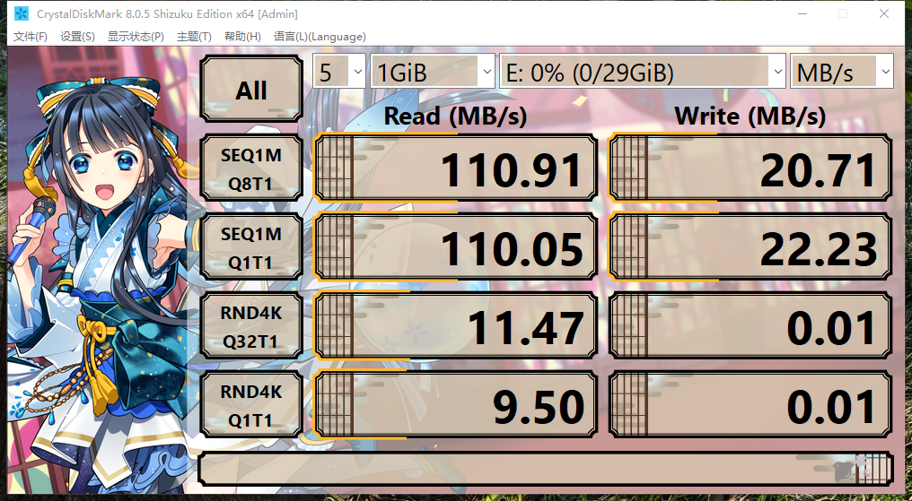
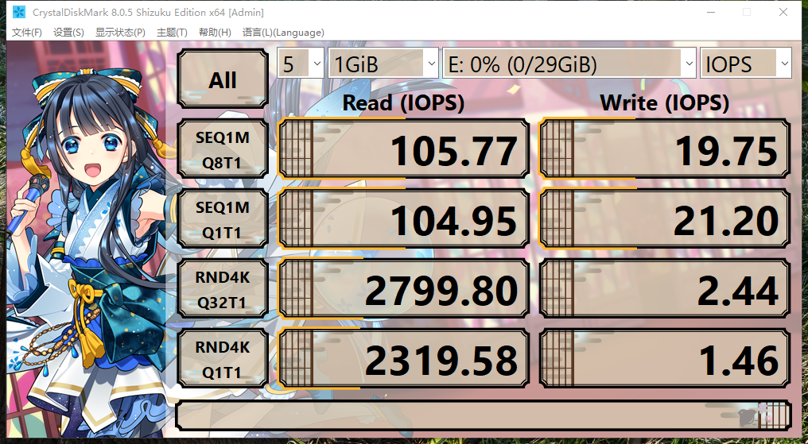

# 18.1 树莓派（Raspberry Pi）简介

## 树莓派是什么？

我们常见的 Android 安卓手机、最新款的 Apple MacBook、电视机顶盒处理器均基于 ARM 芯片。

树莓派就是一块基于 ARM 芯片的开发板，即一块接口丰富（HDMI、I²C、USB 2.0/3.0、I²S、CSI、GPIO、串口、RTC、PWM 风扇、DSI、PCIe（需要转接）、POE 模块等）的电路板，相当于同期的千元红米手机（高通款）。

手机能做的事情，树莓派都能做；手机做不了的事，树莓派大都也能做。一般用于嵌入式开发，如机器人，路由器和监控等等。

在美剧《黑客军团》（*Mr. Robot*）中，树莓派还充当了渗透工具。当然，上述并非树莓派的初衷——树莓派是英国树莓派基金会的计算机教育产物。

---

据称，树莓派最初的目标是为了拯救面临废系的剑桥大学计算机科学与技术系。经分析论证，教学主管认为主要原因是现在的小孩子没有便宜且开放的电脑可玩。

~~“为了守护我们最爱的院系——我们所能做的，就是开发一块每个人都买得起的电路板！！”~~

尽管《LoveLive!》以失败告终，但树莓派取得了巨大成功！

## 有必要先测试 U 盘/存储卡的 4K 读写速度

测试方法见其他章节。

自树莓派 3B+ 以降，无需任何改动，系统即可从 U 盘启动：经测试，FreeBSD 12/13/14 均支持，但是速度非常慢：一方面树莓派受到了总线速度极大的限制，本身接口也并非最高速——树莓派到了树莓派 5，才支持了 SDR104（UHS-I）。之前的老款树莓派最高支持 SDR50（UHS-I）。另一方面，某些 U 盘的质量堪忧。

树莓派的 SD 卡接口限制了存储卡的速率，并不会太高，因此使用标称 100MB+ 的存储卡毫无体验——且他们的速度也是无意义的，必须使用所谓的超频读卡器。除此以外，没有任何设备能支持他们所宣称的速度。

对于树莓派来说，4K 随机读写速率才是最重要的。测试标准必须至少达到存储卡的 [A2 级别（读 4000 IOPS、写 2000 IOPS）](https://www.kingston.com/cn/blog/personal-storage/microsd-sd-memory-card-naming-conventions)。

## 部分 U 盘的 4K 速写速度可能还不如正常的 A2 存储卡

最离谱的是金士顿 DataTraveler 100 G3 USB 3.0 Flash Drive（即 DT100G3），4K 随机竟然是 `0`。使用起来也非常卡慢。

测试数据没有问题，他 4K 写入就是 0。使用起来也符合这个预期水平。

## 参考文献

- [Raspberry Pi 树莓派中文文档](https://rpicn.bsdcn.org)
- [【教學/基礎】實測 Raspberry Pi 5 上的 SD 卡效能](https://piepie.com.tw/52880/sd-card-performance-in-raspberry-pi-5)
- [Default Setting for the UHSMODE?](https://forums.raspberrypi.com/viewtopic.php?t=75464)
- [DataTraveler 100 G3 USB 3.0 Flash Drive - 技术支持](https://www.kingston.com/cn/support/technical/products/dt100g3)
- IOPS-MB 在线转换器：[IOPS, MB/s, GB/day Converter](https://wintelguy.com/iops-mbs-gbday-calc.pl)

