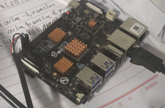
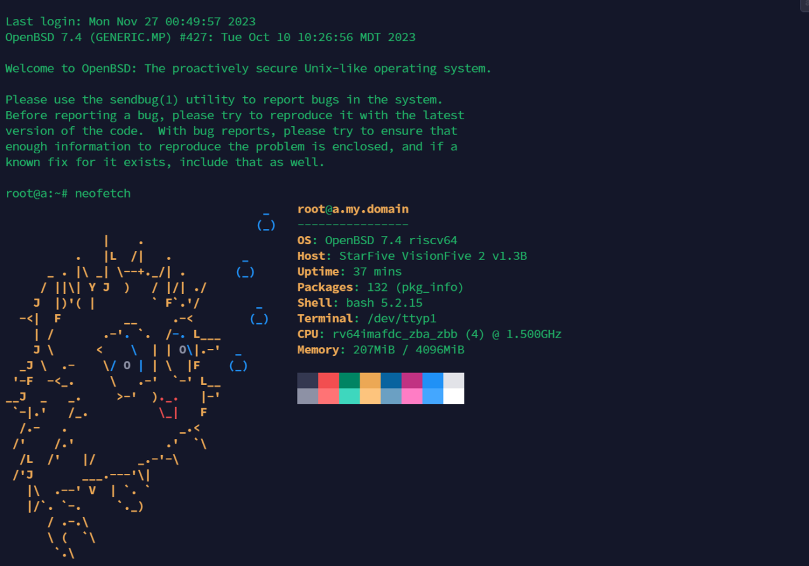

# 第 18.8 节 在 RISCV 开发板上安装 OpenBSD

本文基于 StarFive VisionFive 2 与 OpenBSD 7.4

**在进行本文之前，请务必先阅读一下 <https://doc.rvspace.org/VisionFive2/PDF/VisionFive2_QSG.pdf> 否则你大概率是看不懂本文的。** 




## 安装准备

- 一块支持 OpenBSD 的 RISC-V 开发板，本文以 StarFive VisionFive 2 为例
- 一块 SD 卡，至少 8GB
- 一根 USB TTL 串口线，本文使用 FT232 芯片
- 通过串口线与 StarFive VisionFive 2 交互的计算机
- 一台 tftp 服务器（可以是虚拟机，搭建方法参考前面的 PDF）

riscv 启动与树莓派不同（树莓派都在那个 EFI 分区中），一般来说需要先通过 opensbi 系统（相当于 Android 手机的 fastboot）将设备树（DTB）、SPI、uboot 刷进开发板的闪存（opensbi 本身也在闪存中，也可以自己升级自己，方法见前面的 PDF），然后才能启动正常的系统。

## 镜像准备

从 OpenBSD 官网下载 [miniroot.img 7.4](https://cdn.openbsd.org/pub/OpenBSD/7.4/riscv64/miniroot74.img)

从 <https://github.com/starfive-tech/VisionFive2/releases> 下载 `jh7110-starfive-visionfive-2-v1.3b.dtb` 并上传到 tftp 服务器。

将此 `miniroot.img` 烧录到 SD 卡中。本文使用 [BalenaEtcher](https://www.balena.io/etcher/)。

启动 VisionFive 2 并在串口输出期间（即 `Hit any key to stop autoboot` 时）在电脑的串口软件上按任意键输入，只有终止 autoboot 才能进入 opensbi。

串口输出如下：

```shell-session
U-Boot SPL 2021.10 (Dec 25 2022 - 20:59:18 +0800)
DDR version: dc2e84f0.
Trying to boot from SPI

OpenSBI v1.0
   ____                    _____ ____ _____
  / __ \                  / ____|  _ \_   _|
 | |  | |_ __   ___ _ __ | (___ | |_) || |
 | |  | | '_ \ / _ \ '_ \ \___ \|  _ < | |
 | |__| | |_) |  __/ | | |____) | |_) || |_
  \____/| .__/ \___|_| |_|_____/|____/_____|
        | |
        |_|

Platform Name             : StarFive VisionFive V2
Platform Features         : medeleg
Platform HART Count       : 5
Platform IPI Device       : aclint-mswi
Platform Timer Device     : aclint-mtimer @ 4000000Hz
Platform Console Device   : uart8250
Platform HSM Device       : ---
Platform Reboot Device    : ---
Platform Shutdown Device  : ---
Firmware Base             : 0x40000000
Firmware Size             : 360 KB
Runtime SBI Version       : 0.3

Domain0 Name              : root
Domain0 Boot HART         : 1
Domain0 HARTs             : 0*,1*,2*,3*,4*
Domain0 Region00          : 0x0000000002000000-0x000000000200ffff (I)
Domain0 Region01          : 0x0000000040000000-0x000000004007ffff ()
Domain0 Region02          : 0x0000000000000000-0xffffffffffffffff (R,W,X)
Domain0 Next Address      : 0x0000000040200000
Domain0 Next Arg1         : 0x0000000042200000
Domain0 Next Mode         : S-mode
Domain0 SysReset          : yes

Boot HART ID              : 1
Boot HART Domain          : root
Boot HART Priv Version    : v1.11
Boot HART Base ISA        : rv64imafdcbx
Boot HART ISA Extensions  : none
Boot HART PMP Count       : 8
Boot HART PMP Granularity : 4096
Boot HART PMP Address Bits: 34
Boot HART MHPM Count      : 2
Boot HART MIDELEG         : 0x0000000000000222
Boot HART MEDELEG         : 0x000000000000b109


U-Boot 2021.10 (Dec 25 2022 - 20:59:18 +0800), Build: jenkins-github_visionfive2-4

CPU:   rv64imacu
Model: StarFive VisionFive V2
DRAM:  4 GiB
MMC:   sdio0@16010000: 0, sdio1@16020000: 1
Loading Environment from SPIFlash... SF: Detected gd25lq128 with page size 256 Bytes, erase size 4 KiB, total 16 MiB
*** Warning - bad CRC, using default environment

StarFive EEPROM format v2

--------EEPROM INFO--------
Vendor : StarFive Technology Co., Ltd.
Product full SN: VF7110B1-2310-D004E000-00001875
data version: 0x2
PCB revision: 0xb2
BOM revision: A
Ethernet MAC0 address: 6c:cf:39:00:53:14
Ethernet MAC1 address: 6c:cf:39:00:53:15
--------EEPROM INFO--------

In:    serial@10000000
Out:   serial@10000000
Err:   serial@10000000
Model: StarFive VisionFive V2
Net:   eth0: ethernet@16030000, eth1: ethernet@16040000
switch to partitions #0, OK
mmc1 is current device
found device 1
bootmode flash device 1
** Invalid partition 3 **
Couldn't find partition mmc 1:3
Can't set block device
** Invalid partition 3 **
Couldn't find partition mmc 1:3
Can't set block device
Hit any key to stop autoboot:  0  # 在电脑的串口软件上按任意键输入，否则会启动没有准备好的 OpenBSD
StarFive #  # 已经进入 opensbi
```

## Uboot 设置 IP 并加载 DTB 文件

在 opensbi 中：

```shell-session
StarFive # dhcp
StarFive # setenv serverip 192.168.1.169 # 192.168.1.169 仅作示例，这里需要填你 tftp 服务器真实的 IP 地址
StarFive # tftpboot ${fdt_addr_r} jh7110-starfive-visionfive-2-v1.3b.dtb
StarFive # load mmc 1:1 ${kernel_addr_r} efi/boot/bootriscv64.efi
StarFive # bootefi ${kernel_addr_r} ${fdt_addr_r}  # 输入完成后自动引导 OpenBSD 的 uboot，OpenBSD 开机
```

重启后若出现 `root device:` 请重新从 tftp 服务器下载文件。




## 在 OpenBSD 中启用性能模式

若不设置默认参数为 `hw.cpuspeed=750`。

临时生效：`sysctl hw.perfpolicy=high`。

永久生效（若提示不存在请自行新建）：

```shell-session
echo "hw.perfpolicy=high" >> /etc/sysctl.conf
```

## 参考教程

- [Installing OpenBSD 7.3-current on a VisionFive2](https://gist.github.com/csgordon/74658096f7838382b40bd64e11f6983e)
- [Installing OpenBSD 7.4 on a MilkV Mars](https://mzh.io/installing-openbsd-7-4-on-a-milkv-mars)
