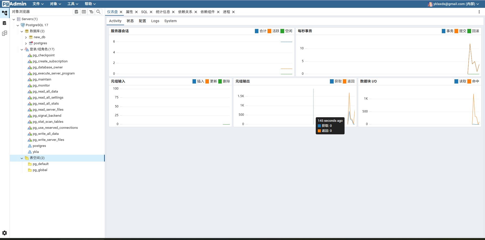

# 19.2 pgAdmin4

>**警告**
>
>请注意 [Bug 7836](https://github.com/pgadmin-org/pgadmin4/issues/7836)、[Bug 8869](https://github.com/pgadmin-org/pgadmin4/issues/8869)。

本文基于 FreeBSD 14.3-RELEASE。

pgAdmin4 是一款用于管理 PostgreSQL 数据库服务器的开源软件。pgAdmin4 提供了功能丰富的图形用户界面，轻松管理数据库。它是用 Python 和 Javascript/jQuery 编写的。它支持多种环境（如 Windows、Unix、Linux 等），亦可在桌面和服务器模式下使用。

>**注意**
>
>在安装 pgAdmin4 前，请先行安装 PostgreSQL 数据库，否则 pgAdmin4 会安装失败。

pgAdmin4 需要在 python 环境下运行，并且安装时要通过 python 的 pip 进行安装，所以先安装 python。本文用的默认版本是 Python3.8，请注意，FreeBSD 13 系统上默认没有 python 环境。可通过以下命令查看：

```sh
# python
python: Command not found   # 说明当前未安装 python 环境
```

>**技巧**
>
>你可使用以下命令查看已安装的 Python 版本。
>
>```sh
>$ python3 -V
>Python 3.11.12
>```

## 安装 Python 及 pip

- 使用 pkg 安装：

```sh
# pkg install python devel/py-pip
```

- 或者使用 Ports：

```sh
# cd /usr/ports/lang/python/ && make install clean
# cd /usr/ports/devel/py-pip/ && make install clean
```

说明：pip 是 Python 包的包管理器。它用于安装和管理 Python 包和依赖包的关系。

## 安装配置 virtualenv

virtualenv 的功能是用来建立虚拟的 python 环境——一个专属于项目的 python 环境。

本文实际安装过程中是通过 virtualenv 创建独立的 Python 环境来安装 pgAdmin4。

使用 virtualenv 创建独立的 Python 环境。Virtualenv 会创建一个自己的 Python 安装的环境，它不支持具有全局或另一个虚拟环境的库。运行以下命令来安装 Virtualenv。


- 使用 pkg 安装：

```sh
# pkg install devel/py-virtualenv
```

- 使用 Ports 安装：

```sh
# cd /usr/ports/devel/py-virtualenv/ 
# make install clean
```

通过运行以下命令为 pgAdmin4 创建虚拟环境

```sh
# virtualenv pgadmin4
```

如果创建完成则有如下显示：

```sh
root@ykla:~ # virtualenv pgadmin4
created virtual environment CPython3.11.12.final.0-64 in 607ms
  creator CPython3Posix(dest=/root/pgadmin4, clear=False, no_vcs_ignore=False, global=False)
  seeder FromAppData(download=False, pip=bundle, setuptools=bundle, via=copy, app_data_dir=/root/.local/share/virtualenv)
    added seed packages: pip==25.1.1, setuptools==80.3.1
  activators BashActivator,CShellActivator,FishActivator,NushellActivator,PowerShellActivator,PythonActivator
```

在 root 用户的根目录下生成了一个名为 `pgadmin4` 的虚拟环境（输出已省略其他文件）：

```sh
# ls 
pgadmin4
```

## 安装 sqlite3

- 使用 pkg 安装：

```sh
# pkg install py311-sqlite3
```

>**技巧**
>
>注意版本要和 Port `lang/python` 相同。

- 或者使用 Ports 安装：

```sh
# cd /usr/ports/databases/py-sqlite3/
# make install clean
```

激活创建的虚拟环境（注意有个点）：

```sh
# . pgadmin4/bin/activate
```

你会看到 shell 已经变为（pgadmin4）（以下操作均在该 shell 下进行）：

```sh
(pgadmin4) root@ykla:~ #

```

## 安装 pgAdmin4

现在 pip 源一律要求使用 https，由于缺少 SSL 证书还需要安装。

```python
(pgadmin4) root@ykla:~# pkg install ca_root_nss
```

由于网络问题，此处对 pip 进行换源，此处使用 TUNA 清华源：

```sh
(pgadmin4) root@ykla:~# pip config set global.index-url https://pypi.tuna.tsinghua.edu.cn/simple
Writing to /root/.config/pip/pip.conf
```

安装依赖：

```python
(pgadmin4) root@ykla:~# pkg install openjpeg rust
```

然后再安装 pgAdmin4：

```sh
(pgadmin4) root@ykla:~# pip install pgadmin4==9.4
```

>**注意**
>
>如果内存不足（小于 4GB）且没有 swap，会提示 `killed`，如出现该问题请先添加交换空间（swap）。

### 故障排除

如果报错：

```python
WARNING: Retrying (Retry(total=3, connect=None, read=None, redirect=None, status=None)) after connection broken by 'SSLError(SSLCertVerificationError(1, '[SSL: CERTIFICATE_VERIFY_FAILED] certificate verify failed: certificate is not yet valid (_ssl.c:1136)'))': /simple/pgadmin4/
```

是由于时间不正确引发的，先同步时间：

```sh
ntpdate ntp.api.bz
(pgadmin4) root@ykla:~#  ntpdate ntp.api.bz
17 Dec 16:35:36 ntpdate[1453]: step time server 114.118.7.161 offset +401965.911037 sec
```

## 配置并运行 pgAdmin4

安装完成后为 pgAdmin4 创建配置文件，复制 pgAdmin4 配置文件（注意 Python 版本）：

```python
(pgadmin4) root@ykla:~# touch  ./pgadmin4/lib/python3.11/site-packages/pgadmin4/config_local.py
```

>**警告**
>
>请不要直接将 `./pgadmin4/lib/python3.11/site-packages/pgadmin4/config.py` 复制为 `./pgadmin4/lib/python3.11/site-packages/pgadmin4/config_local.py`，这样再怎样改动也是无效的，请直接创建空文件。

编辑配置 `./pgadmin4/lib/python3.11/site-packages/pgadmin4/config_local.py`。实例如下：

```sh
DEFAULT_SERVER = '0.0.0.0'
DEFAULT_SERVER_PORT = 5050
```

- `DEFAULT_SERVER` 默认服务器侦听地址更改为 `0.0.0.0`。
- `DEFAULT_SERVER_PORT` 可改应用程序监听的端口。

手动创建软件目录：

```sh
(pgadmin4) root@ykla:~# mkdir -p /var/lib/pgadmin
(pgadmin4) root@ykla:~# mkdir /var/log/pgadmin
```

配置文件编辑完成后执行以下命令来初始化账号和登录密码。

```sh
(pgadmin4) root@ykla:~# pgadmin4
```

显示实例如下：

```python
NOTE: Configuring authentication for SERVER mode.
Enter the email address and password to use for the initial pgAdmin user account:
Email address: your_email		# 输入你的邮件地址
Password: your_new_password		# 输入你的登录密码，最少 6 位数；同样不会打印密码，也不会是 ***
Retype password:				# 再次输入密码
pgAdmin 4 - Application Initialisation
======================================

Starting pgAdmin 4. Please navigate to http://0.0.0.0:5050 in your browser.
 * Serving Flask app 'pgadmin'
 * Debug mode: off
```

现在我们已经安装并运行了 pgAdmin4，并可以通过 `http://ip:5050` 访问 Web 控制面板：


箭头所指方向可以切换语言。




## 保持 pgAdmin4 后台运行

如果服务关闭下次要运行时需使用 pgadmin4 的安装用户（此处是 `root`）进入根目录，执行如下命令：

```sh
root@ykla:~# . pgadmin4/bin/activate
(pgadmin4) root@ykla:~# pgadmin4 &
```

提示：`&` 表示后台运行

服务启动后在当前界面中输入 `&` 按回车键，可切换至前台命令行，让服务程序在后台运行。

## 升级 pgAdmin4

本文测试如果直接使用 pip 升级后还是提示旧版本。

pgadmin4 更新频率较高，如需升级要先删除原有用 virtualenv 创建的 pgadmin4 目录然后用安装用户再次执行如下指令：

```python
root@ykla:~# virtualenv pgadmin4
```

虚拟目录创建完成后激活

```python
root@ykla:~# . pgadmin4/bin/activate
```

激活后不要开启服务，直接执行升级

```python
(pgadmin4) root@ykla:~# pip install --upgrade pgadmin4
```

完成升级后启动服务

```python
(pgadmin4) root@ykla:~# pgadmin4
```

登录账户和密码还是原来的 (登录后再无更新提示，查看版本已是为最新)。

## 参考文献

- [PostgreSQL WIKI FreeBSD](https://wiki.freebsd.org/PostgreSQL/Setup)
