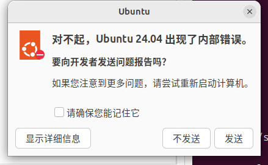
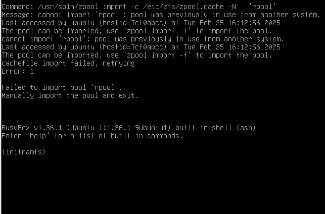

# 第 19.7 节  各大 GNU/Linux 发行版缺陷对比

我发现一件事：既然 BSD 是 UNIX 直接后裔。那么许多概念只是被 Linux 鸠占鹊巢罢了。常见概念真正的提出者其实是 BSD。比如“容器”的概念（可参考[什么是 Linux 容器？](https://www.redhat.com/zh/topics/containers/whats-a-linux-container)）、“发行版”的概念（参见[《FreeBSD：原始操作系统发行版的火炬传承者》](https://book.bsdcn.org/fan-yi-wen-zhang-cun-dang/2025-nian-1-yue/bsd)）、Gentoo Ports 的方法。乃至于开源的理念，也是 BSD 首先提出的，世界上第一款开源许可证就是 BSD 许可证。

由于 GNU 开源运动的大规模开展和 Linux 的蓬勃发展，大部分人对于开源的理解被囿于 GPL 与 Linux，无法走进 FreeBSD 这片 BSD 世界。某些自诩为 **开源** 社团的组织，其实际活动主要集中于 Linux，鲜有超越这一范畴的探索。为此特撰写本文。


---

请你走进 Linux，一片真实的 Linux 世界。

以下分析可能会触及一些人的灵魂，但这都是基于实际使用经验的真实反馈。

## Ubuntu

[Ubuntu 是著名的内部错误（internal error）发行版](https://www.google.com/search?q=internal+error+ubuntu+site:askubuntu.com)有些人为此争辩“那是 Ubuntu 太谦虚了，[他把不属于自己的报错也揽到自己身上](https://linux.cn/article-4660-1.html)”，但无可辩驳的是 Ubuntu 基于 Debian 的 SID（不稳定版本的代号），本身稳定性是没有保证的（无论普通版本还是 LTS）：一是内部错误，二是无法跨大、小版本升级（必挂，即使纯净系统也大概率会挂）

 ```bash
 ykla@ykla-ubuntu:~$ cat /etc/debian_version
 trixie/sid #trixie 即 Debian 13。但是在当前时间点，最新 stable 版本是 Debian 12 bookworm
 ykla@ykla-ubuntu:~$ cat /etc/lsb-release
 DISTRIB_ID=Ubuntu
 DISTRIB_RELEASE=24.04
 DISTRIB_CODENAME=noble
 DISTRIB_DESCRIPTION="Ubuntu 24.04 LTS"
 ```

最近在 VMware Workstation 17 Pro 虚拟机上测试了 Ubuntu 24.04 LTS（伦敦当地时间 2024 年 4 月 25 日发布），可以说一代不如一代，安装的时候就开始不断地报错，并且 Bug 不断，窗口溢出、找不到鼠标光标、定位不到输入框……费劲安装后，开机更是各种内部错误接连不断（掐表数过了大概每 10 分钟会有 1 次）

 
 
 
 

## Fedora

Fedora 俗称“[地沟油](https://zh.moegirl.org.cn/zh-hans/Fedora%E5%A8%98)”，是基于 RHEL 的上游系统，我愿称其为小白鼠发行版，其发行的根本目的是为了测试 RHEL 系统的新设计和新架构（[该社区由 RedHat 红帽公司完全控制](https://docs.fedoraproject.org/en-US/council/)），待稳定后迁移到 RHEL。

稳定性是绝对谈不上的，无法跨大版本升级（必挂，除非纯净系统），意味着你基本上每几个月就必须完全重装一次系统以及配置你的环境。在这里得不到稳定性和长期支持。与 deb 系不同，即使是细微差别的大版本，软件源亦无法通用（依赖变动极为频繁）这个系统没有事实上的稳定版，所有版本和 [nightly](https://openqa.fedoraproject.org/nightlies.html) 版本无差别。这个系统的稳定性堪比 ArchLinux。反正不如 Ubuntu：具体测试就是把屏幕保护和锁屏休眠都关掉，然后开始编译软件，比如 Chromium，没几个小时整个 Fedora 系统就会白屏卡死，而 Ubuntu 一点事没有。

由此可见 Linux 所谓成功的商业模式就是开源社区免费测试，测试稳定了引入企业版。更多地例如 wine 与 crossover？

这个系统这几年以来，非常地消耗资源，在 VMware 虚拟机中分配的 4G 内存根本无法满足它，必须给更多内存（6-8G）才能进行安装。否则在安装中就会 hang 住。

## CentOS/Rocky Linux/RHEL

目前，CentOS 已经不再是以往的基于 RHEL 源代码构建的操作系统，而是 RHEL 的中游测试系统（CentOS Stream），和 Fedora 差不多了。其替代品五花八门，甚至还有取得了 UNIX 认证的所谓 **欧拉系统**。但是我认为 Rocky Linux 更加有前景。

尽管这些系统在服务器上被广泛部署，但具体缺点就是以牺牲软件的“新”来换取“稳”，软件版本非常陈旧。亦无法跨大版本升级（必挂，而且他们认为安全漏洞无所谓，也不用升级）

## Debian


Debian 俗称“大便”（[谐音](https://www.debian.org/intro/about)“/ˈde.bi.ən/”+Logo 长得像。~~很多人连 Debian 叫“大便”这种常识也没了吗……为此我必须附上一张大图让你自己看~~）有个[很奇怪的事情](https://lists.debian.org/debian-cd/2020/02/msg00000.html)，设置了 root 密码就不会安装 sudo，他们社区似乎认为这是一件合理的事情，但是你不知道 Gnome 和大多数的登录管理器都默认禁止 root 登录？另外影响远不止此，截止 Debian 12.6，会安装 sudo，但未加入 `wheel` 组，这太搞笑了，都没法重启网络，只能进 tty 自己登录 root 来动手，那还默认安个 GUI 干什么呢。

> ```sh
> ykla@debian:~$ sudo su
> [sudo]ykla 的密码：
> ykla 不是 sudoers 文件。
> ykla@debian:~$ id
> uid=1000(ykla) gid=1000(ykla) 组=1000(ykla),24(cdrom),25(floppy),29(audio),30(dip),44(video),46(plugdev),100(users),106(netdev),111(bluetooth),113(Lpadmin),116(scanner)
> ykla@debian:~$ hostnamectl
> Static hostname: debian
>       Icon name: computer-vm
>         Chassis: vm
>      Machine ID: 9b3107b788dd461f94ca93150474946e
>         Boot ID: 081c39d5ac4748fa9ec0b2157c9a5beb
>  Virtualization: vmware
> Operating System: Debian GNU/Linux 12(bookworm)
>          Kernel: Linux 6.1.0-22-amd64
>    Architecture: x86-64
> Hardware Vendor: VMware, Inc.
>  Hardware Model: VMware Virtual Platform
> Firmware Version: 6.00
> ```

上述这种肉眼可见的 Bug 随手可拾——必须断网或者用高级用户安装才能把这款系统装上——因为他在安装时进行系统的换源不会换 `debian-security` 源，却要在安装时有网络的情况下进行更新（Ubuntu 也有这个毛病）；他的 [NetworkManager](https://wiki.debian.org/NetworkManager) 一直在和 Systemd 打架。这种反人类设计数不胜数，即使你报告了 Bug 他们也不会改，甚至不会有人回复你——另外我至今也不知道这玩意怎么报告 Bug。看起来，Debian 的 [Bug 收集平台](https://www.debian.org/Bugs/Reporting)就没想着让普通用户报告 Bug？这套流程比常见开源开发系统的都要离谱的多。~~果然看不到问题就是没有了吗。~~

Debian 的软件包也不甚更新（此处仅指 stable）：Debian stable 大部分的软件包在发布后就版本号几乎不会变了。会锁死。除非你切到 unstable（sid）之类的，但是那等同于把自己变成 Ubuntu。

不得不说这个系统很稳定，同时软件包也相当旧。几乎是 deb 版本的 CentOS。

## OpenSUSE

完整的 OpenSUSE 在物理机上安装后系统非常的卡顿，据说是 btrfs 文件系统的某个特性，也许特别卡就是特性之一吧。此处拿的是三台不同时期的英特尔平台的物理机测试的。无论是 3 代、还是 6 代都卡的不要不要的。绝非硬件问题。装上去不到一个小时就卡的鼠标都移动不了了，只能强制断电。故，我严重怀疑那些吹嘘 openSUSE 的人，自己到底有没有用过？亦或者是直接把 btrfs 改成了 ext4？真的是有很多人都是云用户，你但凡谷歌搜索“OpenSUSE btrfs hang”就知道这不是孤证。

OpenSUSE 俗称大蜥蜴（Logo）他所做的最迷惑的一件事是他的版本号：为了纪念英国作家道格拉斯·亚当斯在《银河系漫游指南》中写到的这个数字“42”，（被称作 “the answer to life, the universe and everything”，生命、宇宙以及任何事情的终极答案），OpenSUSE 把版本号从 13 蹦到了 42，然后又从 42 降回到了 15。然后搞笑的一件事是：从 42 到 15 本应是升级的过程，但是 42 的版本号比 15 大，于是你到了 15 再升级就会再反向升级到 42。 那么现在问题来了，到了 41 再升级是到 42 还是 43 呢？能做出如此搞笑又迷惑事情的发行版，据我所知，仅此一家（如果有别的也这么离谱，欢迎 PR）

openSUSE 有时会往整个正在使用的软件包里加入测试性功能，而不进行任何警告与提示。直到你去给他提交 bug，他才会告诉你那是他们故意那么搞得，然后再把测试功能关掉。

他们的原生包管理器命令 `zypper` 和 `dnf` 一直在打架。目前不知道谁打赢了。但我估计 dnf 会赢，因为 zypper 各种反人类（~~比如你数数这有几个字母？~~ `zypper` 相比 `dnf` 存在明显的卡顿和延迟）

## Gentoo

Gentoo [自称](https://www.gentoo.org/get-started/about/)是“元发行版（_metadistribution_）”。一切软件都要通过 **编译** 的方式来进行安装（最近好像有了[官方二进制源了](https://www.gentoo.org/news/2023/12/29/Gentoo-binary.html)，但是很遗憾，这除了让他的依赖更加混乱以外好像没有别的用处……）其缺点也很明显，如果一个程序编译不过去就无法安装了，实际上这种软件非常多。有人会抬杠说 Gentoo 有二进制安装方式，但是自己制作也不具备通用性。一旦你一段时间不更新，Gentoo 会告诉你什么叫做 **循环依赖**。而且 Gentoo 难以大规模部署，也难以在服务器上部署。

另外 Gentoo 的 portage（包管理器）是[纯 Python 语言编写的（92.5 %）](https://github.com/gentoo/portage)，这直接导致了计算依赖的时间延迟：在树莓派 4 上，安装 KDE 5 往往要计算几个小时……即使是在英特尔 i7-6700HQ 处理器上，也要算上个几分钟，如此离谱的包管理器，只此一家，别无分号。你不要以为只算一次就算完事了，你忘了什么叫 **循环依赖** 了吗？每回少则计算三四回，多则七八回，或者压根就操作不了，只能放弃。随着你安装的包越多，你花在包管理器上的时间将明显呈几何增长。

简而言之，Gentoo 用自己的哲学捆绑了用户，简单问题复杂化，自己折磨自己；USE 过于复杂，对于一些常用软件，都经常出现循环依赖问题，破坏系统稳定性，软件安装升级卸载困难。如果说 Arch Linux 是滚着滚着就挂了，那么 Gentoo Linux 则是根本不让你滚，你想滚也滚不动。一旦过了几天乃至几星期，你就再也不需要滚动了——你再也动不了任何软件了，无论是卸载、安装还是更新。复杂的 USE，以致于每天都在用 Gentoo 的人也在和这套哲学体系搏斗。Gentoo 社区的日常话题就是依赖问题如何解决。

Gentoo 哲学和 C++ 哲学有异曲同工之妙：“C++ 是一种语言，而不是一个完整的系统。为每种应该支持的风格提供全面支持，**不试图去强迫别人做什么。**”“如果工具 **强迫用户** 按照特定的方式操作，那么工具实际上是在与用户对抗，而不是为用户服务。**我们都经历过工具强加自己意愿的情况。** 这是错误的，违背了 Gentoo 的哲学。”正如世界上无人敢声称自己熟练掌握 C++ 一样，Gentoo 亦如此。自由的选择固然是人类向往的本性，但也带给人们无尽的焦虑和抑郁。

Gentoo 平台几乎没有任何 Bug 跟踪回馈机制。对于使系统完全没法用的包管理器 app-portage/layman 的相关 Bug，他们只会在七八年后，那个软件被删除时告诉你问题不存在了。或者在 [3 年后](https://bugs.gentoo.org/700744)再回复你。他们这个 Bug 报告平台非常难用。各种搜索不到。虽然看上去是和 FreeBSD 用的是一个平台，但还不如直接谷歌“xxx site:bugs.gentoo.org”。现在你去他的 Bug 报告平台[去搜](https://bugs.gentoo.org/buglist.cgi?quicksearch=app-portage%2Flayman&list_id=7231000)“app-portage/layman”，居然是“Zarro Boogs found.（没有找到任何 Bug）”。~~果然看不到问题就是没有了吗。~~ [高级搜索](https://bugs.gentoo.org/query.cgi)也一样乱七八糟，找不到泛查询。

## Deepin/UOS/中标麒麟

UOS 和 Deepin 的关系就好比 RHEL 之于 Fedora。本质上是一种东西。Deepin 系统似乎[从不进行软件测试](https://bbs.deepin.org/post/218041)（更严重的或者骂的比较厉害的帖子早被删了，目前整个论坛只能搜到 15 个相关的，看不到就是不存在问题啦），直接就将更新包推送给用户，最直接结果就是他知道更新会导致系统崩溃也不撤回当次更新，而是在官网一个小角落里写个帖子和你讲怎么修复？这是令人迷惑的思路和解决方案（无独有偶，如果你用过他们的商业性 UOS 系统，这种类似的迷惑行为和解决思路亦只多不少，到处都是）是的，我刚安装好系统就升级，然后就挂了，这也不是一次两次了，我从未再用过——要知道，Arch Linux 都没有这么离谱。

Deepin 这个系统仅仅是复制文件就会导致桌面卡死，无法理解他的系统是怎么做出来的，难道他自己的开发者不需要复制文件吗？

> 有些人一直在 **云** 这个东西，反驳说他这么垃圾怎么可能还卖得出去，还会有人买。那么**你到底用过没有呢？** 系统的市场表现可能不错，但这并不一定能反映其技术质量——比如 Linux。多说也没用，你用过吗？

这种不测试就推更新的行为不仅发生在开源的 Deepin 上，UOS 也经常如此。而且不是一次两次了，他们好像和微软一样没有测试团队。即使是 UOS 更新服务器全部宕机，或者是测试时写错配置导致用户主机自带 UOS 浏览器无限打开几十上百个 UOS 主页，也不会发任何公告。这点和国内的大多数互联网企业都比较像，连最基本的服务状态查看网站都没有。

如果说育碧的服务器是“土豆服务器”，那么 UOS 的服务器就是“土豆泥服务器”，几乎没有一天不崩溃。UOS 还对镜像下载做了小小的限制，使得普通人无法使用迅雷下载。其实，经过测试，UOS 下载服务器的总带宽不会超过 100Mbps。并且移动宽带是绝对连不上的。而问题在于 UOS 操作系统很多常见功能都是和他们的服务器紧密耦合的，这就造成了很多麻烦—无法打开开发者模式（其实有 root 包安装了可以直接获取 root，但是一般不会发给你），因为无法登陆。但是这是很容易解决的问题：在 BT 网络没有中 PCDN 毒之前，使用 BT 分发镜像即可。而他们采取的方案是使用百度云进行分发。这就看你是选择 100K/s 还是 101K/s 啦……

其实我们可以以小见大：UOS 默认安装的系统盘大小只有区区 20 G，没有多少天就会被塞满。用户只能自学成才，在拿到电脑没几周后就被迫重装系统，学习如何自定义分区。而剩下的 50% 还多的备份空间，不知道是拿来备份什么的，也并未真正起到应有的备份功能，更类似于 Ghost 系统还原，一键初始化。而一旦自定义分区，备份功能就又没有了。这是一个悖论。在很久以后才支持调整系统盘的大小，但是默认安装的机制仍旧是系统盘只有 20G……

对于中标麒麟无话可说，甚至连最基本的 zip 乱码问题都没打补丁……

一个现实问题就是[漏洞](https://src.uniontech.com/#/security_advisory_detail?utsa_id=UTSA-2024-003941)根本打不上补丁，尤其对于内网机器来说。因为 Linux 的机制是滚动更新，即使阶段版本亦如此。但是内网必定是停留在某版本内的，就存在无穷尽的依赖问题。而这是根本上无法解决的一个悖论。有一说一，这个漏洞报告页面起码改了七八回才勉强标准了起来能让人看。

> **思考题**
>
> 什么是 Linux 操作系统根社区？
>
> - 从 Linux kernel 和其他开源组件而构建，不依赖上游发行版社区
>
> - 采用开源社区运行模式，有大量的外部个人贡献者与企业参与
>
> - 被广泛认可，衍生出不同分支或下游社区
>
> - 与各开源组件社区沟通畅通，并持续回馈自己的能力
>
>   ——[[社区新闻] 深度社区全新规划：打造中国主导的桌面系统根社区！](https://bbs.deepin.org/post/237175)
>
> > ① 如果一个操作系统，长得像 Debian，运行的软件也都来自 Debian，内核也一模一样，那么你凭什么说他是 Ubuntu？
> >
> > ② 根社区的“根”到底在哪？他们究竟维护着什么“根”？他们的“根”遵循 GPL 了吗？

## Arch Linux/Manjaro

Arch Linux 俗称“**[邪教](https://zh.moegirl.org.cn/zh-hans/Arch_Linux%E5%A8%98)、[洗发水](https://bbs.archlinuxcn.org/viewtopic.php?id=694)**”。这是我所见过的一个最不稳定的 Linux 发行版，也是被别人忽悠从而安装最多的一个。

我难以理解为什么有这么多人推崇如此不稳定的一个操作系统。你安装的软件越多，挂的越快（你不信你把完整的 gnome 安装上，看看你能维持几天不挂？）有人会说这是你不看软件发行注记的后果，此言差矣。一个需要看发行注记才能更新的系统，本身就是有问题——和 Deepin 把解决方案写在墙角有区别？

Arch Linux 唯一优点就是软件新（但是也不是所有的都新，一些工具类、尤其是大部分 **实用工具** 就不怎么新，例如大部分 R 包还没有 FreeBSD 新）似乎随处可见的就是 Arch Linux。Arch Linux 似乎是与苦难哲学挂钩的。

Arch Linux 官方源里基本上没有什么软件，不导入 aur 源（ Arch User Repository，Arch 用户软件仓库）就完全没法用。而 aur 源是[未经过任何代码审查的](https://wiki.archlinux.org/title/Arch_User_Repository)（`Warning: AUR packages are user-produced content. These PKGBUILDs are completely unofficial and have not been thoroughly vetted. Any use of the provided files is at your own risk.`，`警告： AUR 中的软件包是由其他用户编写的，这些 PKGBUILD 完全是非官方的，未经彻底审查。使用这些文件的风险由您自行承担。`）实际上不是未经彻底审查，是根本没有任何审查：也就是说有人往里面塞 `rm -rf /*` 也是可以的。虽然 fakeroot 在一定程度上限制了恶意软件的执行权限，但它并不能完全防止用户因安装未审查的软件包而面临的安全风险——你忘记[安卓的格机模块](https://www.bilibili.com/read/cv19088202/)了？即使是谷歌市场也有一堆恶意软件，更何况现在压根没有审查。这并非危言耸听，Arch Linux [之前](https://www.linuxuprising.com/2018/07/malware-found-on-arch-user-repository.html?m=1)就出现过这种事情。

正如 FreeBSD 开发者 Warner Losh 所说，“如今，在开源项目处于日益恶劣的工作环境下，一些看似多余的步骤却往往是必要的。”

## 参考文献

- [Benefits of Gentoo](https://wiki.gentoo.org/wiki/Benefits_of_Gentoo)
- [The philosophy of Gentoo](https://www.gentoo.org/get-started/philosophy/)，Gentoo 设计哲学
- [Arch compared to other distributions](https://wiki.archlinux.org/title/Arch_compared_to_other_distributions)，翻译[在这里](https://wiki.archlinuxcn.org/wiki/Arch_%E4%B8%8E%E5%85%B6%E4%BB%96%E5%8F%91%E8%A1%8C%E7%89%88%E7%9A%84%E6%AF%94%E8%BE%83)
- 《C++ 语言的设计和演化》，[美] Bjarne Stroustrup，译者: 裘宗燕，人民邮电出版社，ISBN 9787115497116
