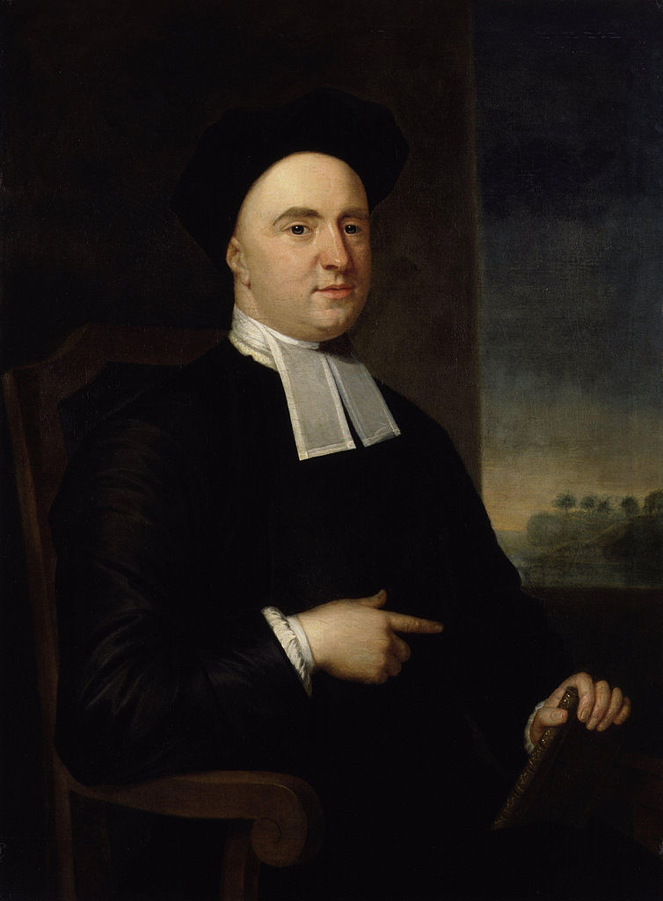
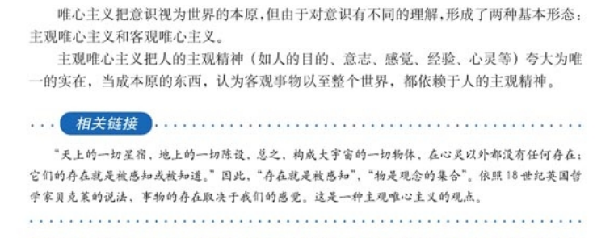

# 第 19.1 节 BSD 与哲学家 George Berkeley（乔治·贝克莱）

值得注意地是，BSD（Berkeley Software Distribution，伯克利软件发行版）之名根源于英国（爱尔兰）近代伟大的经验论哲学家 George Berkeley（乔治·贝克莱，1685－1753）。在各种著作中，他一般被称为 Bishop of Cloyne（克洛因主教），或贝克莱主教。

无论是 FreeBSD 及各种 BSD，还是伯克利市（Berkeley）和加州大学伯克利分校（University of California, Berkeley），其名字均源于他。

Berkeley 在中文音译上存在不同写法，美音和英音发音亦不同（英 /ˈbɑ:kli,ˈbə:kli/ 美 /ˈbɚkli/），仅“Berkeley”的拼写在英文中是统一的。

[由于政治正确（黑奴问题）](https://www.lib.berkeley.edu/about/news/george-berkeley-portrait)和翻译习惯（曾译为巴克莱等等）的影响，这一关联不仅在汉语世界中鲜有人知，恐怕在英语世界当中亦如此。

## 乔治·贝克莱生平简介

图片出处：[George Berkeley](https://www.npg.org.uk/collections/search/portrait.php?search=ap&npgno=653&eDate=&lDate=)

George Berkeley（1685.3.12—1753.1.14），2023 年是他逝世 270 周年。2025 年是其冥诞 340 周年。

- 1685.3.12 出生于爱尔兰的基尔肯尼，乡绅家庭，是家中长子
- 1696 年，11 岁时进入基尔肯尼学院
- 1700 年，15 岁时进入都柏林圣三一学院
- 1704 年，19 岁时被授予文学学士学位
- 1707 年，22 岁时被授予文学硕士学位，同年留校任特别研究员，讲授希腊语
- 1709 年，24 岁时任爱尔兰教会执事（为满足学院规定）。同年发表第一篇著作《视觉新论》，哲学思想基本成形
- 1710 年，25 岁时任爱尔兰教会牧师。同年发表《人类知识原理》，此处已经有许多关于运动的论述了
- 1713 年，28 岁时发表《海拉斯与斐洛诺斯对话三篇》
- 1717 年，32 岁时被任命为圣三一学院高级研究员，但他选择离开学院，旅欧 4 年
- 1721 年，36 岁时被授予神学博士学位，同年（或次年）任爱尔兰教会德罗莫尔教区座堂主任牧师（Dean）；并再次选择留在都柏林圣三一学院，讲授神学和希伯来语。发表 *De Motu*（论运动），表示牛顿的许多基本思想都是错误的，抨击了牛顿的绝对时空观
- 1723 年，37 岁时获得了一笔来自朋友的巨额遗产
- 1724 年，39 岁时任爱尔兰教会德里教区座堂主任牧师（Dean），但从未到职
- 1725 年，40 岁时准备在百慕大筹建一所神学院，但他一生从未去过百慕大。同年为筹款放弃了先前的座堂主任牧师职位
- 1728 年，43 岁时与 Anne Forster 结婚。6 周后前往美洲，希望获得赞助办学。他们在罗德岛度过了几年，买下了一座种植园，又买了几名非洲黑奴在种植园里工作（存在争议）
- 1729 年，44 岁时有了自己的第一个孩子
- 1731 年，46 岁时因建学无望，返回伦敦。后将罗德岛的地产和图书馆捐赠给了耶鲁大学。在日后，他将大部分财产和用于筹备学校的物资都捐赠给了相关大学
- 1734.1.18 49 岁时被爱尔兰教会任命为克洛因主教（Bishop of Cloyne），同年 5 月 19 日祝胜；发表《分析家》一文。后专注于基督事业，淡出人们的视野
- 1739 伦敦育婴堂医院成立，他积极参与其中
- 1744 年，59 岁时出版《西利斯：关于焦油水的功效以及与之有关的、相互引发的其他课题的哲学反思和探讨之链》，他在书中主张将松焦油作为治疗疾病的万金油。该书是他生前销量最高的一本。但是很神奇，据记载，同他的书籍销量一样，他使用这种疗法为患者治疗也取得了同样显著的疗效（来源请求）
- 1752 年，67 岁时放弃克洛因主教职位，移居牛津
- 1753.1.14 67 岁时，在妻子 Anne Forster 诵读《圣经》的陪伴下，他在牛津安息，归于主怀
- 1786 年，妻子 Anne Forster 离世

注：爱尔兰教会，即爱尔兰圣公会，隶属于英国圣公会。

## 贝克莱悖论与数学基础

贝克莱大主教的著作还引发了数学史上关于无穷小量的数学哲学讨论（即贝克莱悖论，参见 1734，《分析学家；或一篇致一位不信神数学家的论文，其中审查一下近代分析学的对象、原则及论断是不是比宗教的神秘、信仰的要点有更清晰的表达，或更明显的推理》）。

>**思考题**
>
>>贝克莱悖论从未并未被解决。
>>
>>所谓的 ε-δ 语言的定义仅是使其在 ZFC 体系中自洽了而已（如证明 `0.9̇9̇ =1`）。那些认为悖论不存在，并劝人多看定义的人，仅仅是他们的数学基础（Foundation of Mathematics）太差而且不愿意承认自己无知罢了，但是他们往往指责别人是无知的，即是你基础数学太差。他们的数学甚至没有迈出 17 世纪，更遑论 20 世纪。
>>
>>这些人不仅数学基础相当差，而且物理更差。他们往往会用上述定义去解决[芝诺（Zeno of Elea）悖论](https://plato.stanford.edu/entries/paradox-zeno/)。
>>
>>仅在纯粹数学范围内，这些人甚至认为一般的数学体系中，`1+1=2` 是定义的，而非构造的。甚至认为 `+-×*` 分数线 `-` 等等符号本身也无法在体系中得证，仅仅是定义罢了。即数学中的一切都是定义的，不需要也无法论证。
>
>问题一：这样的想法是否是将数学从纯粹的演绎体系转换为一般科学的归纳体系，从而在事实上破坏了数学的严密性与客观性？
>>
>>涉及这个问题的讨论而不涉足非标准分析和超实数的，必定是其本人数学基础太差，而不是旁人。
>
>问题二：究竟是有些人 **基础数学** 太差看不懂定义；还是某些人 **数学基础** 太差，以其昏昏，使人昭昭？

## 贝克莱与爱因斯坦

贝克莱主教以其形而上学思想，特别是对牛顿绝对时空观的反对，启发了包括爱因斯坦（其认为时间并非绝对，而是与观察者的运动状态密切相关）在内的一众 20 世纪科学家，在某种意义上引领了现代科技革命。

>**技巧**
>
>爱因斯坦信奉马赫主义，而马赫是贝克莱主义者。

>**逐渐地，哲学家和科学家们得出了一个令人震惊的结论**：既然每个物体仅仅是其性质的总和，而这些性质又只存在于心灵之中，那么整个由物质与能量、原子与星辰组成的客观宇宙，除了作为意识的建构外，并不存在——这是一个由人类感官塑造的常规符号体系。
>
>正如贝克莱——唯物主义的死敌——所表述的那样：  
>> “天上的浩瀚星辰与地下的山川草木，简而言之，所有构成这个宏伟世界框架的实体，离开心灵便毫无实体可言……只要它们没有被我实际感知，或不存在于我的心灵，或者其他被创造的灵魂之中，它们要么根本不存在，要么只能存在于某个永恒灵的心中。”  
>
>爱因斯坦将这一逻辑推向了极致，证明了即便是空间与时间，也只是直觉的形式，无法与意识分离，正如我们关于颜色、形状或大小的概念一样。空间除了作为我们感知中物体的排列和次序外，没有客观实在性；而时间也无法脱离我们用以衡量事件顺序的体系独立存在。  
>
>**意识到**我们对宇宙的全部认知不过是被我们不完美的感官所蒙蔽的印象残余，这让对现实的追求显得无望。如果一切的存在都必须以被感知为前提，那么世界似乎会分崩离析，沦为个体感知的无序状态。  
>
>然而，我们的感知中却存在一种奇特的秩序，仿佛确实存在某种客观现实的底层，而我们的感官将其翻译了出来。尽管没有人能够确定自己对红色或中央 C 的感受是否与他人相同，但我们仍然可以基于这样的假设行动：每个人对颜色和音调的感知大致相似。
>
>——《宇宙与爱因斯坦博士》林肯·巴尼特 1949 年伦敦版

## 贝克莱思想简介

>“esse est percipi, to be is to be perceived（存在就是被感知）”——【英】George Berkeley

>**注意**
>
>**上述命题绝不代表贝克莱主张主观唯心主义，也绝不代表他否认客观物质的存在。** 以上都是典型的错误认识。

参见《人类知识原理》等著作里是承认且论证过上帝必然存在的。在贝克莱哲学中，物质存在的客观性与上帝存在并不冲突。该著作也回应了各种误解和诘难。

这很好理解：不存在任何独立且不依赖于人的思想与知觉的客观物质（我们所理解的客观物质必然是我们的思想和知觉所能理解的，否则没有意义），如果有，那是不可知的，则等同于不存在，也就没有设定其存在的意义（另外，如果承认物质的不可知性，那将不是纯粹的唯物主义，和贝克莱哲学亦无太大分别）。故，我们认为的流俗的客观存在必定是要靠我们的知觉才能感知，即——存在就是被感知。除此以外的客观存在，是不可知的，也没有意义。所以，贝克莱认为，物质存在依赖于心灵的感知，没有正在被感知却存在着的物质，是不可设想的。但是众所周知，我们的世界是存在的（如果你否认此处，和贝克莱哲学亦无太大分别）。故，为了确保这一点，神是必然存在的。我们总是不言自明的暗含地把经过实践的东西肯定为物质性的，这是不对的。如果实践本身的物质性就有问题，那么非物质性的存在如何能赋予这种活动以物质属性（靠松果腺吗）？而这种实践性本身的物质性是无从证明的，因为人类无法认识超越于人类感知以外的存在，除非你借助上帝，但是如此又说明你本身就不存在这种属性了。

可以看到当代现象学与贝克莱哲学有异曲同工之妙——他们都强调直接经验和知觉的重要性。

>**思考题**
>
> 有关他的思想，最著名的一则哲学实验是：“假如一棵树在森林里倒下而没有人在附近听见，它有没有发出声音？”
>>
>>- 如果你认为没有。恭喜你，你现在是贝克莱者了。
>>
>>- 如果你认为有，并给出了物理学（或其他科学、数学上）的证明。恭喜你，你现在是贝克莱者了。
>>>
>问题一：你怎样理解量子力学中的“观察者”与树的存在关系？
>>
>>- 如果你认为有，因为世界是客观存在的，是不以人的意志为转移的。恭喜你，你现在是贝克莱者了。
>>
>>- 如果你认为有没有不一定或者不可知或者别的什么情况。恭喜你，你现在是贝克莱者了。
>>
>问题二：请结合上文或进一步阅读贝克莱著作，分别说说以上是为什么。

贝克莱还认为货币的价值并不取决于其中金属含量的多寡，货币只是一种用于商品交换的手段。货币的价值来自信用和社会共识。他认为应该使收入在国民间平均分配以实现经济公平。

他还主张通过教育、培训，依靠人民来发展经济。他认为应该通过开展大型工程建设来改善贫困问题。

贝克莱主张各个宗教团体放下纷争，为共同的利益而团结。在他淡出人们的视野后，专注为当地人民做公益事业，无论是天主教徒还是新教徒。

虽然在贝克莱有生之年，他的思想并未被广泛认同，但在几百年后，大放异彩。

几乎在每一本合格的哲学史著作中[旧版人教版思想政治必修四（生活与哲学）第 13 页就有（ISBN  9787107327100）。]

~~虽然写的是错的，部编版思想政治必修四[《哲学与文化》](https://v4.cecdn.yun300.cn/100001_2201115008/%E6%99%AE%E9%80%9A%E9%AB%98%E4%B8%AD%E6%95%99%E7%A7%91%E4%B9%A6%C2%B7%E6%80%9D%E6%83%B3%E6%94%BF%E6%B2%BB%E5%BF%85%E4%BF%AE4%20%E5%93%B2%E5%AD%A6%E4%B8%8E%E6%96%87%E5%8C%96.pdf) ISBN 9787107341953 已经删掉了~~，你都能找到有关他的身影，有关他的哲学实验也是哲学考试中经久不衰的论述大题。

## 参考文献

- [英] 乔治·贝克莱。人类知识原理和三篇对话[M]. 译者：张桂权，人民出版社，2022-11.（ISBN 9787010236841）
- 阎吉达。贝克莱思想新探[M]. 复旦大学出版社，1987-10.（附录部分有《论运动》的翻译）
- Downing, Lisa, "George Berkeley", The Stanford Encyclopedia of Philosophy (Fall 2021 Edition), Edward N. Zalta (ed.), URL = <https://plato.stanford.edu/archives/fall2021/entries/berkeley/>. SEP 贝克莱条目
- Easwaran, Kenny, Alan Hájek, Paolo Mancosu, and Graham Oppy, "Infinity", The Stanford Encyclopedia of Philosophy (Summer 2024 Edition), Edward N. Zalta & Uri Nodelman (eds.), URL = <https://plato.stanford.edu/archives/sum2024/entries/infinity/>. SEP 无穷条目
- [美] 布鲁斯·乌姆鲍。贝克莱[M]. 译者：孟令朋，清华大学出版社，2019-5.（ISBN 9787302525554）
- 汪芳庭。数学基础 (修订版)[M]. 高等教育出版社，2018-10.（ISBN 9787040502428）
- [美] Abraham Robinson. 非标准分析[M]. 译者：申又根 / 王世强 / 张锦文，科学出版社，1980-9.（已绝版，统一书号：13031-1267）
- [澳] 陶哲轩。陶哲轩实分析[M]. 译者：李馨，第 3 版。人民邮电出版社，2018-5.（ISBN 9787115480255）
- George Berkeley. *The Querist, containing several queries proposed to the consideration of the public*[M]. Gale ECCO, Print Editions, April 23, 2018（ISBN 9781385411018）
- Schabas, Margaret, "Economics in Early Modern Philosophy", The Stanford Encyclopedia of Philosophy (Summer 2022 Edition), Edward N. Zalta (ed.), URL = <https://plato.stanford.edu/archives/sum2022/entries/economics-early-modern/>. SEP 早期现代经济哲学条目
- [George Berkeley, Bishop of Cloyne/Philosopher](http://cloyne.ie/about/george-berkeley-bishop-of-cloyne/)，Cloyne District Community Council
- [George Berkeley](https://www.britannica.com/biography/George-Berkeley)，大英百科全书贝克莱条目
- 胡化凯。20 世纪 50-70 年代中国科学批判资料选（上下）[M]. 2009 年 10 月第 9 版第 1 次印刷。山东教育出版社，2009-10 :472.（已绝版，ISBN 7532853861）整本下册都在批判爱因斯坦
