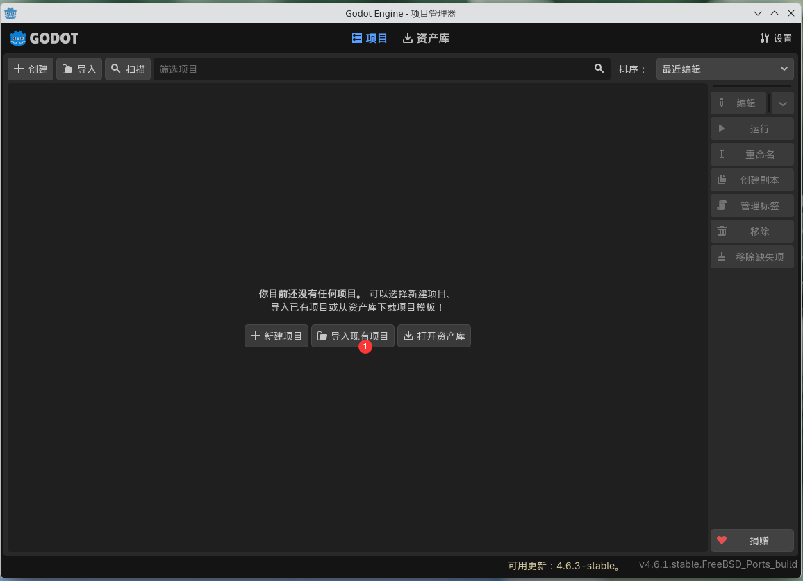
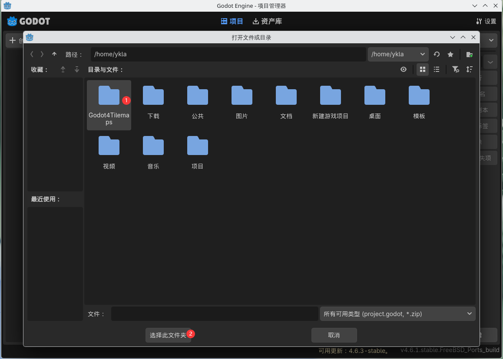
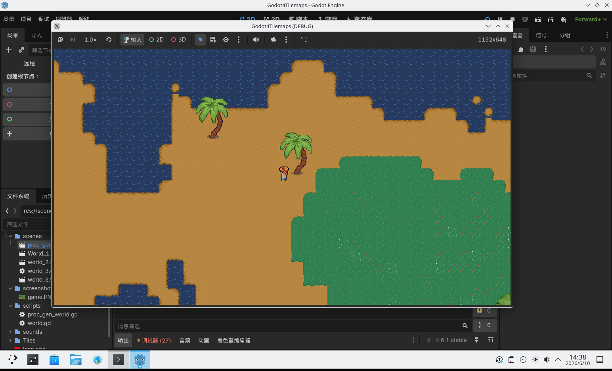

# 19.1 Godot 开源游戏引擎

## 概述

Godot 是一款开源 2D/3D 游戏引擎。FreeBSD 通过 Ports 提供 Godot-tools（编辑器）和 Godot（运行时）两个软件包。

## 安装 Godot

使用 pkg 安装：

```sh
# pkg install godot godot-tools 
```

或者使用 Ports 安装：

```sh
# cd /usr/ports/devel/godot-tools/ && make install clean
# cd /usr/ports/devel/godot/ && make install clean
```

## 使用 Godot

本节介绍 Godot 引擎的基本使用方法与性能优化技巧。

安装完成后新建项目并进入编辑器，界面响应有延迟且 CPU 占用率较高。FreeBSD 默认配置下，Godot 依赖 CPU 软件光栅化渲染（通过 llvmpipe），性能开销较大。

此时需为 `godot-tools` 添加启动参数，以启用硬件加速渲染。OpenGL 兼容模式可启用 GPU 硬件加速。使用 OpenGL 3 驱动启动 Godot 工具：

```sh
$ godot-tools --rendering-driver opengl3
```

打开项目并进入 Godot 编辑器后，缩放 Godot 窗口时 CPU 占用率没有明显变化，表明渲染工作已由 GPU 分载。

此外，还需注意项目的创建方式。如果遇到上述卡顿问题并使用了 OpenGL 参数，在创建项目时应选择“兼容”，而非 Forward+ 或“移动”。Forward+ 和“移动”模式使用 RenderingDevice（一种更现代的渲染抽象层），其特性与兼容性要求可在创建窗口的说明中查看。只有“兼容”模式使用 OpenGL 3 后端。


Godot 创建项目的默认界面如下：


## 项目演示

Godot4Tilemaps 是一款附有源代码（非标准开源）的模拟农场游戏，本小节以 Godot4Tilemaps 游戏为例进行演示：

```sh
$ git clone https://github.com/anonomity/Godot4Tilemaps.git
```

打开 Godot 主界面，点击“导入现有项目”。



导航到 git 克隆的项目文件夹，选中即可。



Godot 提示“路径处存在有效项目”，点击“导入”。


Godot 提示上次编辑的是旧版本的 Godot 工具，选中“确定”。


点击右上角的三角符号，主场景选择 **scenes/proc_gen_world.tscn** 文件。游戏演示画面如下。



## 参考文献

- Godot Engine. Godot documentation — Rendering drivers[EB/OL]. [2026-04-17]. <https://docs.godotengine.org/en/stable/tutorials/rendering/renderers.html>. Godot 4.x 渲染驱动说明，兼容模式使用 OpenGL 3 后端，Forward+ 和移动模式使用 Vulkan 后端。
