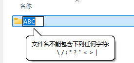
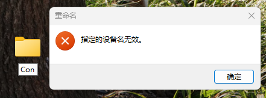
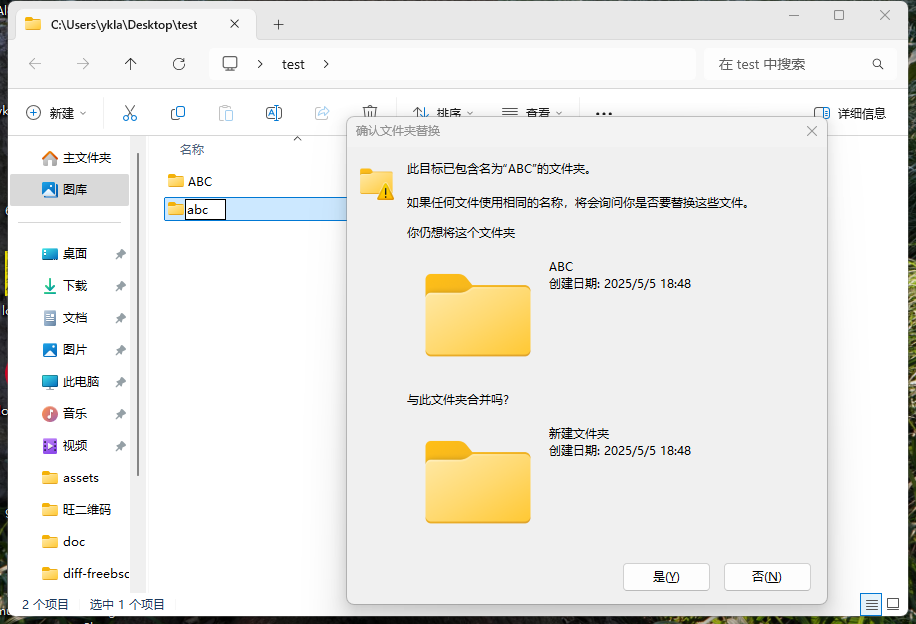

# 第 2.3 节 UNIX 基础（新手入门版本）

## UNIX 目录与 Windows 目录的区别

首先我们欣赏以下两张照片：


前一张图是竹子，第二张图是若干棵行道树。

亚里士多德认为种子之所以能长成大树，是因为种子暗含着一种潜能，并且在环境满足的情况下，有实现为长成一棵树的可能性。而人的不同就在于人没有固定不变的潜能，这也契合了儒家学说“君子不器”（《论语·为政》）。理解 UNIX 目录与 Windows 目录的异同，对于深入理解操作系统的设计与实现是很重要的。

我们都听说过一个故事，竹子（Bambusoideae）开花意味着大片竹林的死亡。这是因为，大部分看似茂密繁盛的竹林，极有可能到头来只有一棵竹子真实存活。这些竹子都是从相同的地下根系生长出来的，虽然看起来是多个竹子，它们其实是一个整体。这也是雨后春笋的来历。无论他们相隔多远，仍旧一荣俱荣，一损俱损。这就是 UNIX 的目录——系统中的所有目录都依赖于根（root）。根（`/`）是一切目录的起点。比如 `/home/ykla/nihao`、`/bin/sh`、`/etc/fstab` 他们追根溯源，都是从根出发的。换言之，如果你删除 `/`，那么等于删除了整个系统，所有设备上的目录都会被删除。

行道树则不然，每棵普通的行道树都是独立生长的。无论他们靠的多么紧密，他们仍然是独立的。行道树与 Windows 目录类似，都是独立的——`C:\Program Files (x86)\Google\Update`、`D:\BaiduNetdiskDownload\工具列表`、`E:\123\app`：`C`、`D`、`E` 盘都是独立的，互不干扰。你格式化 `D` 盘，并不会影响 `E` 盘存储的文件。甚至，即使你在 PE 中格式化了 `C` 盘（可能不会叫 `C` 盘），也不会影响 `E` 盘中的文件。

事实上 Windows 的“盘符”根本不存在，有经验的装机人员会发现，在 PE 中，`C` 盘会变成其他诸如 `X` 等盘符。正在使用中的 Windows，其盘符也可以随意分配。Windows 下真正判断一个分区是不是 `C` 盘，是靠 GPT 分区类型的 UUID（如我的 `C` 盘分区类型 UUID 是 `EBD0A0A2-B9E5-4433-87C0-68B6B72699C7` ）以及唯一 ID 来判断的（配置写入 EFI 文件），而不是靠盘符。盘符是抽象出来的，实际上没有意义。这也就是为什么你在其他操作系统上包括 Windows 自己（如双系统）都看不到 `C` 盘的根本原因，因为不存在一个硬编码的，写入文件系统的 `C` 盘标识。只有在真正启动系统时，Windows 才会知道到底谁是 `C` 盘，并写入注册表。至于其他盘符的分配，则完全靠运气，出现 `D` 盘变 `E` 盘的问题也屡见不鲜：因为某虚拟光驱可能在开机时突然插入了等等……

>**思考题**
>
>阅读《深入解析 Windows 操作系统 （第7版）（卷2）》（9787115619747，人民邮电出版社）及其他相关文献资料，回答问题：在以往传统的 BIOS + MBR 引导下，Windows 如何识别 `C` 盘？

## 如何理解 UNIX 挂载与卸载


小时候住在花木场的人们都知道，经常需要从树 A 上裁剪一段枝条，将其斜插到树 B 上，并包裹起来，愈合后就成为一体：比如在苹果树（UNIX）上可以长出桃子（挂载 Windows 的 `C` 盘）。这种方法称为“嫁接”。实际上，就是将树 A 的枝条（文件系统）挂载到树 B 上（嫁接点即某个挂载点，归根结底依赖于根目录 `/`）。


而对园艺有所了解的人们想必对“扦插”这种培育植物的方法并不陌生：把一棵树新发的侧枝掰下来，插到土里。精心照料一段时间，就会得到一株新的幼苗。实际上，这和“卸载”的原理有异曲同工之妙：将某文件系统（如 `/mnt/test`）从完整的根（`/`）上“掰”（卸载）下来。


## UNIX 与 Windows 文件名规范之差异

### 非法字符

许多在 FreeBSD 中可用的文件或文件名在 Windows 中都是不被允许的（即非法字符）。这些你经常会碰到——如果你使用 Git 在 Windows 上拉取项目。

在这里仅列出一些笔者遇到过的：

- 不能出现英文冒号 `:`



- 不能叫 `con`




更多要求，参见微软官方文档[命名文件、路径和命名空间](https://learn.microsoft.com/zh-cn/windows/win32/fileio/naming-a-file)。

>**技巧**
>
>你可以在 Windows 下使用 git 工具拉取 [freebsd-doc](https://github.com/freebsd/freebsd-doc) 项目试试看能否成功。我已经报告过 Bug。
>
>[The colon in the file name of the security report of the FreeBSD doc is not compatible with Microsoft Windows](https://bugs.freebsd.org/bugzilla/show_bug.cgi?id=267636)

### 大小写敏感

FreeBSD 的 ZFS 和 UFS 都是 **大小写敏感** 的文件系统。而 macOS 的 HFS+（默认不支持）、APFS（默认不支持）以及 Windows 的 FAT32、NTFS 文件系统都是 **大小写不敏感** 的。

- Windows 下 **大小写不敏感**



可见，abc 和 ABC 无法共存，文件系统认为这是同一个文件。

>**技巧**
>
>判断访问网站服务器类型，最简单的办法就是看网址路径是否是大小写敏感的：如果网站 `https://abc.com/abc` 和 `https://abc.com/ABC` 都能打开且内容一样，那么该网站多半是由 Windows 驱动的。

- FreeBSD 下 **大小写敏感**

```sh
$ touch ABC
$ touch abc
$ ls
abc	ABC
```

可见，abc 和 ABC 可以共存，文件系统认为这是两个不同的文件。


#### 参考文献

- [调整区分大小写](https://learn.microsoft.com/zh-cn/windows/wsl/case-sensitivity)，Windows 文件系统支持使用属性标志按目录设置区分大小写

## Windows 与 Unix 换行符/回车之差异

回车（Carriage Return，CR）和“换行”（Line Feed，LF）是不同的概念，均产生于电传打字机（真 TTY）时代。

- 回车 CR：将光标移动到当前行的开头部分；
- 换行 LF：将光标竖直向下移动到下一行。

可以看到在早期二者是独立的，否则 CRLF 会导致当前行“下沉”一行。

Windows 操作系统默认的文本换行符为 CRLF（即 \\r\\n，0x0D 0x0A，`^M$`），而 Unix（早期 macOS 是 \\r，0x0D）默认使用 LF（即 \\n，0x0A，`$`）。

当然，现在这些符号都出现在每行文本的末尾处（即每行都存在）。

二者是互不兼容的，如果你把 Windows 换行符的文件放到 Unix 下面，可能导致每行末尾多出一个 `^M` 字符，对于某些工具，会造成识别错误，对于 FreeBSD Port 相关文件来说，则会把多行识别为一行。

但是两种换行符可以互相转换。在 FreeBSD 下可以用 Port `converters/dos2unix` 来实现，该软件包含 2 个命令：`dos2unix`（Windows 换行符到 Unix）、`unix2dos`（Unix 换行符到 Windows）。基本用法是 `$ dos2unix -n a.txt b.txt`，如果不需要保留源文件，可以直接 `$ dos2unix a.txt b.txt c.txt`（一次转换多个文件）。可以用命令 `file a.txt` 来判断文件的换行符：

- 使用普通的 Unix 换行符文本文件

```sh
$ file a.txt
a.txt: Unicode text, UTF-8 text
```

- 使用 Windows 换行符的文本文件

```sh
$ file b.txt 
b.txt: Unicode text, UTF-8 text, with very long lines (314), with CRLF line terminators
```

## Windows 与 Unix 字符编码的差异

由于计算机只识别 `0` 和 `1`，故字符编码是一种用于将字符转换为数字表示的规则体系。字符可以是屏幕上可见的文字，也可以是不可见的控制标记，如换行符（LF）、回车符（CR）等，涵盖文本中常见的元素，如数字、Emoji 表情符号、汉字、拉丁字母等。编码方式则是为这些字符分配唯一数字标识（通常是整数），即代码点（code point）的过程。

例如，在 ASCII（American Standard Code for Information Interchange，美国信息交换标准代码，ISO/IEC 646）编码中，`0x41`（即二进制 `0100 0001`）代表大写字母 `A`。ASCII 编码仅支持英文字母、数字及常见英文标点符号——共计支持 128 个字符。

而在 Unicode 编码体系中，“你”这个汉字的代码点是 U+4F60。在 UTF-8（8-bit Unicode Transformation Format，8 位 Unicode 转换格式）编码方式下，它被编码为字节序列 `0xE4 0xBD 0xA0`（二进制为 `11100100 10111101 10100000`）。UTF-8 编码涵盖的字符范围远超 GBK（国家 `G` 标准 `B` 扩展 `K`），里面甚至还有埃及圣书体——如果现在你的屏幕上能看到 “𓀀”“𓃕”“𓌊” 这三个字符，那么你很可能正在使用 UTF-8 编码（如果你使用的是 UTF-8 编码但仍无法显示这些字符，很可能是字体不支持这些字符集，而非编码问题）。

那么程序如何识别文本的编码呢？通常，有些文件会在开头使用特定的字节序列（即 BOM，byte order mark，字节顺序标记）来标明编码。例如 UTF-8 的 BOM 是 `0xEF 0xBB 0xBF`。但在实际中，很多文本文件并没有 BOM，因此读取程序需要通过上下文猜测编码格式，这往往导致乱码。虽然可以通过程序分析文本内容（如统计字符分布或抽取字符计算）来猜测编码，但这种方法并不总是可靠。编码问题本质上源于系统间默认编码不同或未明确指定编码。

 Windows 默认使用 GBK（如系统语言是简体中文），而 Linux 或 UNIX 则使用 UTF-8。

 - Windows 11 24H2

```powershell
PS C:\Users\ykla> chcp
活动代码页: 936 # 即 GBK
```

- Ubuntu 24.04/FreeBSD

```sh
root@ykla:/home/ykla# locale charmap
UTF-8
```

其中，FreeBSD 的编码是在 [main/usr.bin/login/login.conf](https://github.com/freebsd/freebsd-src/blob/main/usr.bin/login/login.conf) 这个源文件中设置的，编译出来路径即 `/etc/login.conf`。

自然，也可以把 Windows 10 及后续版本的字符编码设置为 UTF-8。当然，这除了造成更多地编码问题外并不能有效的解决问题。

## Windows 与 Unix 时间设置的差异

中国统一使用一个时区，东八区，即 UTC+8，UTC（Coordinated Universal Time，协调世界时）时间几乎等同于 GMT（Greenwich Mean Time，格林尼治时间）。UTC 以国际原子时（temps atomique international，TAI）的秒长为基础（并不完全一致）：当铯（Cs）频率 ΔνCs，也就是铯 133 原子不受干扰的基态超精细跃迁频率，以单位 Hz 即 s-1 表示时，取其固定数值为 9 192 631 770 来定义秒——后续又对国际原子时进行了各种修正。

有过 Windows 和 Unix 双系统安装经验的人会发现，Windows 和 Unix 的时间总是差 8 个小时。在现代计算机上（一般在主板上），都有一颗由纽扣电池供电的 RTC（Real-time clock，实时时钟芯片）芯片，用来维护系统断电后的计时。

计算机操作系统在开机时会读取 RTC 的时间来设定系统的时间。localtime 即默认的本地时间，即直接读取 RTC 的结果（Windows 如此做）；UTC 则会把 RTC 的数据视为 UTC 时间（Unix 如此做）：于是你会发现双系统的时间倒流了 8 个小时。

对于现代计算机网络来说，时间至关重要，我们可以做个小实验，把时间调慢 5 分钟，打开浏览器，你会发现绝大部分网站都打不开了（HTTPS）。

计算机中的时区是由 IANA 时区数据库规范的，历史悠久。

中华民国二十八年（1939），民国政府将中国划分为五个时区，分为哈尔滨（`Asia/Harbin`）、上海（`Asia/Shanghai`）、重庆（`Asia/Chongqing`）、乌鲁木齐（`Asia/Urumqi`）和喀什（`Asia/Kashgar`）时间。

我们知道，按照时区来说，重庆（`Asia/Chongqing`）是东七区。所以某些人说（Asia/Chongqing）等同于北京时间也是不对的。从地理上看，重庆与北京时间实际上相差了一个小时。

但在 2025b 中，`Asia/Harbin`、`Asia/Chongqing`、`Asia/Shanghai` 均等同于北京时间。`Asia/Urumqi` 和 `Asia/Kashgar` 则均为 `UTC+6` 东六区时间。

在 FreeBSD 中，北京时间同样为 `Asia/Shanghai`（东八区）。有些所谓国产操作系统会无中生有一个 `Asia/beijing`，这不仅是不尊重规范的行为，并且会造成严重后果，如退回到 UTC 时间。

>**技巧**
>
>中国也曾实行过夏令时（在夏天把表调慢几个小时，因为天亮的早）。

### 参考文献

- [秒的定义](https://www.nim.ac.cn/520/node/4.html)，中国计量科学院载秒的定义
- [Time Zone Database](https://www.iana.org/time-zones)，时区数据库
