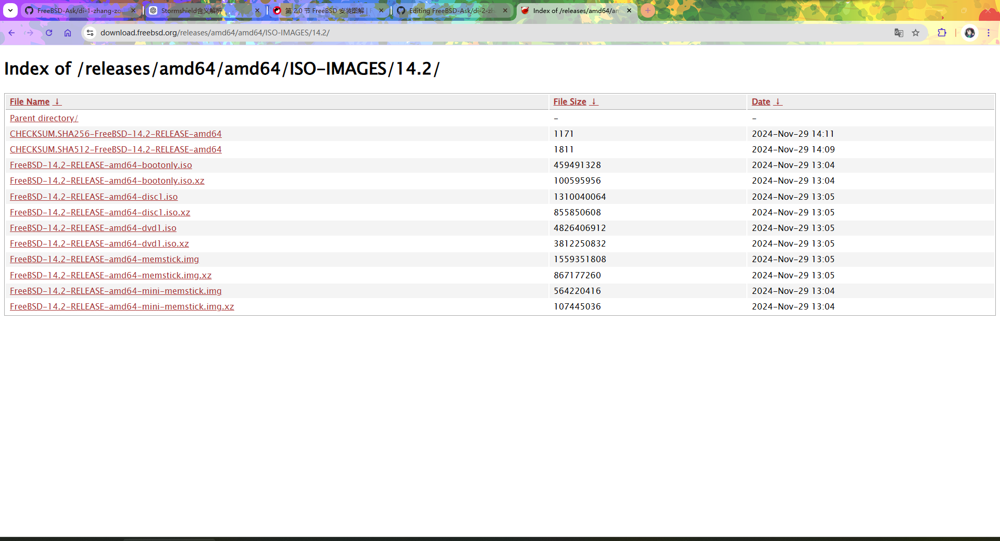

# 第 2.0 节 FreeBSD 安装图解

>**技巧**
>
>视频教程见 [002-VMware17 安装 FreeBSD14.2](https://www.bilibili.com/video/BV1gji2YLEoC)

## FreeBSD 版本概述

已知 FreeBSD 有如下版本（或阶段）： alpha、rc、beta、release、current、stable。

**release** 是可以日常/服务器使用的，即一般意义上的 **稳定版** 或者说 LTS。而 ***stable*** 和 ***current*** 都是开发分支，都是 **不稳定的**（稳定与不稳定是相对的，[Netflix 几乎所有节点都运行着 **current**](https://freebsdfoundation.org/netflix-case-study/)）。

>**注意**
>
>FreeBSD 的 ***stable*** 与一般 Linux 发行版的“稳定版”之概念并不一致，反而是一种 **不稳定** 的“开发版”。
>
>FreeBSD 的 ***stable*** 的真实意思是该分支的 ABI（Application Binary Interface，应用程序二进制接口）是稳定的。
>
>    ——参见 [FreeBSD Glossary STABLE](https://wiki.freebsd.org/Glossary#STABLE)

alpha 是 current 进入 release 的第一步。具体过程是 current --> alpha（进入 stable 分支）--> beta --> rc --> release。

current 相对稳定后（即 MFC 最短三天，MFC 即 `Merge From Head`，类似向后移植 `backporting`）会推送到 stable，但是不保证二者没有大的 bug。参见 [FreeBSD Release Engineering](https://docs.freebsd.org/en/articles/freebsd-releng/)。

>**注意**
>
>只有 alpha、rc、beta 和 release（[且是一级架构](https://www.freebsd.org/platforms/)）才能使用命令 `freebsd-update` 更新系统，其余版本系统均需要通过源代码编译的方式（或使用二进制的 pkgbase）更新系统。
>
>FreeBSD 开发计划准备删除命令 `freebsd-update`，一律改用 pkgbase。
>
>    ——参见 [FreeBSD Manual Pages freebsd-update](https://man.freebsd.org/cgi/man.cgi?freebsd-update)

### FreeBSD 镜像说明

首先我们打开 FreeBSD 项目官网：<https://www.freebsd.org/>：


我们点击黄底红字 `Download FreeBSD`，会跳转如下：


>**注意**
>
>随着岁月的流逝，在你下载的时候就不一定要下，也不一定就有 14.2。你只需要选择最顶部的一个 `FreeBSD-X-RELEASE` 即可。`X` 是比 `14.2` 大的值。

|Installer|VM|SD Card|Documentation|
|:---:|:---:|:---:|:---:|
|安装镜像|虚拟机预安装镜像|存储卡镜像|文档|
|一般安装使用|需要自己扩容|单板机/嵌入式用|就是文档|

>**技巧**
>
>如果你不知道选哪个，请你选择 `Installer`（普通家用电脑，苹果除外）。

>**技巧**
>
>如果你不知道 `amd64` `i386` `aarch64` `armv7` 是什么意思，请你选择 `amd64`（普通家用电脑，苹果除外）。




```sh
File Name  ↓ 	                                  File Size  ↓ 	Date  ↓ 
Parent directory/	-	-
CHECKSUM.SHA256-FreeBSD-14.2-RELEASE-amd64	    1171	       2024-Nov-29 14:11
CHECKSUM.SHA512-FreeBSD-14.2-RELEASE-amd64    	1811	       2024-Nov-29 14:09
FreeBSD-14.2-RELEASE-amd64-bootonly.iso	        459491328	   2024-Nov-29 13:04
FreeBSD-14.2-RELEASE-amd64-bootonly.iso.xz	    100595956	   2024-Nov-29 13:04
FreeBSD-14.2-RELEASE-amd64-disc1.iso	          1310040064   2024-Nov-29 13:05
FreeBSD-14.2-RELEASE-amd64-disc1.iso.xz	        855850608	   2024-Nov-29 13:05
FreeBSD-14.2-RELEASE-amd64-dvd1.iso	            4826406912	 2024-Nov-29 13:05
FreeBSD-14.2-RELEASE-amd64-dvd1.iso.xz	        3812250832	 2024-Nov-29 13:05
FreeBSD-14.2-RELEASE-amd64-memstick.img	        1559351808	 2024-Nov-29 13:05
FreeBSD-14.2-RELEASE-amd64-memstick.img.xz	    867177260	   2024-Nov-29 13:05
FreeBSD-14.2-RELEASE-amd64-mini-memstick.img	  564220416	   2024-Nov-29 13:04
FreeBSD-14.2-RELEASE-amd64-mini-memstick.img.xz	107445036	   2024-Nov-29 13:04
```

以上：第一列代表文件名，第二列是文件大小，第三列是发布日期。

|第一列|说明|
|:---|:---|
|Parent directory/	-	-|点击后返回上级目录|
|CHECKSUM.SHA256-FreeBSD-14.2-RELEASE-amd64	  | 本页所有镜像的 SHA256 校验值 |
|CHECKSUM.SHA512-FreeBSD-14.2-RELEASE-amd64   |  本页所有镜像的 SHA512 校验值 |
|FreeBSD-14.2-RELEASE-amd64-bootonly.iso	      | 网络安装镜像，安装时需联网 |
|FreeBSD-14.2-RELEASE-amd64-bootonly.iso.xz	    | 压缩的网络安装镜像，安装时需联网|
|FreeBSD-14.2-RELEASE-amd64-disc1.iso	 | cd 镜像    |     
|FreeBSD-14.2-RELEASE-amd64-disc1.iso.xz	|  压缩的 cd 镜像 |    
|FreeBSD-14.2-RELEASE-amd64-dvd1.iso	 | dvd 镜像，相比 cd 镜像多了一些没用的 pkg 包    |      
|FreeBSD-14.2-RELEASE-amd64-dvd1.iso.xz	  | 压缩的 dvd 镜像，相比 cd 镜像多了一些没用的 pkg 包  |     
|FreeBSD-14.2-RELEASE-amd64-memstick.img	| U 盘用的镜像（可以使用 Rufus 制作 U 盘启动盘）   |     
|FreeBSD-14.2-RELEASE-amd64-memstick.img.xz	 | 压缩的 U 盘用的镜像（无需解压缩，可以使用 Rufus 制作 U 盘启动盘）   | 
|FreeBSD-14.2-RELEASE-amd64-mini-memstick.img	 | U 盘用的网络安装镜像，安装时需联网 |
|FreeBSD-14.2-RELEASE-amd64-mini-memstick.img.xz|压缩的 U 盘用的网络安装镜像，安装时需联网 |

>**技巧**
>
>网络是随时波动的，因此下载的文件时而会与源文件有差异，产生错误。~~百度网盘就经常这样~~。因此我们需要一种机制确保你获取的文件与 FreeBSD 项目发布的镜像是完全一致的。就需要用到 **校验值**。Windows 10、11 均自带命令行工具 `CertUtil`，无需额外的软件。你还可以参考[如何确定用于安全应用程序的文件 SHA-256 哈希](https://www.dell.com/support/kbdoc/en-bs/000130826/%E5%A6%82%E4%BD%95-%E7%A1%AE%E5%AE%9A-%E7%94%A8%E4%BA%8E-%E9%98%B2-%E7%97%85%E6%AF%92-%E5%92%8C-%E6%81%B6%E6%84%8F%E8%BD%AF%E4%BB%B6-%E9%98%B2%E6%8A%A4-%E5%BA%94%E7%94%A8%E7%A8%8B%E5%BA%8F-%E7%9A%84-%E6%96%87%E4%BB%B6-sha-256-%E5%93%88%E5%B8%8C?lang=zh)这篇文章。


> **注意**
>
>FreeBSD 所有安装介质包括不限于虚拟机文件都没有提供图形界面（DVD 有 pkg 包，但是会出问题），均需要自行安装。


>**技巧**
>
>FreeBSD 14.1 RELEASE 两个 ISO 均在 Ventoy 下测试通过（英特尔三代处理器下的 UEFI）。但是仍不排除出现问题的可能性。如果出现问题，请首先考虑下载 `img` 正常刻录。


>**技巧**
>
>U 盘安装最好使用 `-img` 或 `-img.xz`。因为 `.iso` 镜像没做 Hybrid 混合启动，写入 U 盘会产生错误。见 [FreeBSD -.iso files not support written to USB drive](https://bugs.freebsd.org/bugzilla/show\_bug.cgi?id=236786)。
>
>
>只有当使用 **光盘/虚拟机** 安装时才应选用 `iso` 结尾的镜像。
>
>但事无绝对，某些机器使用 `.iso` 刻录 U 盘启动盘，仍然可以顺利进入安装界面。部分机器（如老款神舟电脑）就支持 ISO 下的 UEFI 启动。但并非所有机器（比如小米就不支持）都如此。

- 我该如何刻录 FreeBSD 镜像到 U 盘？

Windows 上的刻录工具应首选 **Rufus**，Linux 直接使用 `dd`命令即可。

rufus 下载地址：[https://rufus.ie/zh](https://rufus.ie/zh)

> **警告**
>
> **不建议** 使用 FreeBSD 手册推荐的 win32diskimager，有时会出现校验码错误的情况（实际上文件校验码正常）。**应仅在 rufus 无效的情况下才应使用 win32diskimager。** win32diskimager 下载地址 <https://sourceforge.net/projects/win32diskimager/files/Archive/>，点击 `win32diskimager-1.0.0-install.exe` 即可下载。


>**技巧**
>
>无需解压缩，rufus 刻录镜像时，直接选择 `-img.xz` 亦可进行启动盘制作的过程。
>
>


>**技巧**
>
>FreeBSD 镜像 BT 种子下载地址
>
><https://fosstorrents.com/distributions/freebsd/>

- RELEASE 正式版镜像下载地址
  - 虚拟机用：<https://download.freebsd.org/ftp/releases/amd64/amd64/ISO-IMAGES/14.2/FreeBSD-14.2-RELEASE-amd64-disc1.iso>
  - 物理机用：<https://download.freebsd.org/releases/amd64/amd64/ISO-IMAGES/14.2/FreeBSD-14.2-RELEASE-amd64-memstick.img>
- CURRENT 测试版下载地址（仅限专业用户）
  - 虚拟机用：[https://download.freebsd.org/snapshots/amd64/amd64/ISO-IMAGES/15.0/](https://download.freebsd.org/snapshots/amd64/amd64/ISO-IMAGES/15.0/)
  - 物理机下载 `-amd64-memstick.img` 或 `-amd64-memstick.img.xz` 结尾的文件

旧版本 FreeBSD 下载地址: 

- 5.1-9.2 <http://ftp-archive.freebsd.org/pub/FreeBSD-Archive/old-releases/amd64/ISO-IMAGES>
- 9.3-最新 <http://ftp-archive.freebsd.org/pub/FreeBSD-Archive/old-releases/ISO-IMAGES/>


## 怎么看你的硬件支持不支持呢？

更多硬件请参考：

[Hardware for BSD](https://bsd-hardware.info/?view=search)


> 如果你也想上传你的数据到该网站上，请：
>安装：
> ```sh
> # pkg install hw-probe
> ```
>或者
>
> ```sh
> # cd /usr/ports/sysutils/hw-probe/
> # make install clean
> ```
> 
> 然后
> 
> ```sh
> # hw-probe -all -upload
> ```
>
> 其他系统见 [INSTALL HOWTO FOR BSD](https://github.com/linuxhw/hw-probe/blob/master/INSTALL.BSD.md)

---

以下安装说明基于 `FreeBSD-14.2-RELEASE-amd64-disc1.iso`。`-dvd1.iso` 和 `-memstick.img`大同小异。

>**警告**
>
>本文基于 VMware 17 进行演示（使用 UEFI）。
>
>若是物理机，请考虑使用 [rufus](https://rufus.ie/zh/) + [img 镜像](https://download.freebsd.org/ftp/releases/ISO-IMAGES/14.1/FreeBSD-14.1-RELEASE-amd64-memstick.img)。


> **警告**
>
> 如果要在 VMware 虚拟机使用 UEFI，必须使用 FreeBSD 13.0-RELEASE 及以上，否则启动会花屏。

## 启动安装盘


此界面无需任何操作，等待十秒，可自动进入 `1. Boot Installer [Enter]`；亦可以直接按 **回车键** 进入。

按 **空格键** 可暂停，可选定以下选项。

>**技巧**
>
>如果按其他任意键盘会进入提示符 `OK`，可输入 `menu` 再按 **回车键** 返回菜单。

以下操作：按最开头的数字可进行选定。`on` 代表已开启，`off` 代表已关闭。

|     选项     |                                   解释                                    |
| :----------: | :----------------------------------------------------------------------- |
|`1. Boot Installer [Enter]`|用于安装系统|
| `2. Boot Single user` |  单用户模式，找回 root 密码和修复磁盘时会用到 |
|  `3.Escape to loader prompt`   |           离开菜单，进入命令模式，进入后输入 `reboot` 回车可重启                                |
| `4.Reboot`  |        重启                      |
|  `5. Cons: Video`    |    选择输出模式：视频（`Video`）、串口（`Serial`）、同时输出，但串口优先（`Dual (Serial primary)`、同时输出，但视频优先（`Dual (Video primary)` 可选）                         |
|`6. Lernel: default/kernal (1 of 1)`|选择要启动的内核|


|**`7. Boot Options`**|启动参数|
| :----------: | :----------------------------------------------------------------------- |
|`1. Back to main menu [Backspace]`|按 **删除键** 可返回上级菜单 |
|`2. Load System Defaults`|恢复默认配置|
|`3. ACPI`|高级配置和电源接口|
|`4. Safe Mode`|安全模式|
|`5. Single user`|单用户模式|
|`6. Verbose`|啰嗦模式，增加更多调试信息输出|


欢迎菜单。

`欢迎使用 FreeBSD！您想要开始安装还是使用 Live 系统？`

选中 `install`，按下 **回车键** 可进行安装。中间 `Shell` 是命令行，左右侧 `Live System` 是 LiveCD 模式。

>**技巧**
>
>以下若无特别说明，按 **TAB 键** 或者 **方向键** 可选择不同条目；按 **回车键** 可以选定高亮条目；

>**技巧**
>
>注意观察图片中的红色加粗大写首字母，如 `Install`、`Shell` 和 `Live System` 中的 **`I`**、**`S`**、**`L`** 分别是红色加粗大写的。若你直接按键盘上面的对应按键（无论大小写），均会选定并直接进入该界面。


>**警告**
>
>无论在任何步骤，按 **ESC 键** 均 **不能** 返回上一菜单，都会直接跳到下一步直至退出安装或结束安装。

## 设定键盘布局


`FreeBSD 系统控制台驱动程序默认使用标准 `US`（美式）键盘布局。可以在下面选择别的键盘布局。`

这里是键盘布局菜单，直接按 **回车键** 使用默认键盘布局即可（因目前中国使用美式键盘布局）。

## 设定主机名


`请选择此机器的主机名。如果您正运行在受管理的网络上，请向您的网络管理员询问合适的名称。`

此处为设置主机名菜单。

>**警告**
>
>**不要** 在这一步直接按 **回车键**！这样会导致主机名为空！登录管理器 sddm 会无法启动。

## 选择要安装的组件


`选择要安装的可选系统组件`

>**技巧**
>
>以下若无特别说明，按 **空格键** 可以选中条目——就是让 `[ ]` 变成 `[ * ]`。
>
>推荐：在默认的基础上，**额外** 选中 `src` 即可。因为部分显卡驱动（如 `drm`）和其他程序需要 `src`，经测试 `lib32` 后天安装无效。

>**警告**
>
>**不要** 选择 `kernel-dbg`、`lib32`、`src` 以外的组件，需要联网安装，极慢。如有需要可以自己后天安装。
>
> 如果在安装中出现应该选用哪个镜像站这个问题，是因为你全选了组件，请不要这样做。


|    选项    |                                 解释                                  |
| :--------: | :------------------------------------------------------------------- |
|  `base-dbg`  |                 基本系统调试工具                |
| `kernel-dbg` |                       内核调试工具                        |
| `lib32-dbg`  | 32 位应用程序的兼容库的调试工具 |
|   `lib32`    |        用于在 64 位 FreeBSD 上运行 32 位应用程序的兼容库        |
|   `ports`    |                                 ports                                 |
|    `src`     |                              系统源代码                               |
|   `tests`    |                               测试工具                                |

## 磁盘分区 

FreeBSD 14.2 RELEASE 的 `/` 分区支持 UFS 和 ZFS 两种文件系统。旧版 FreeBSD 系统 root 分区仅支持 UFS 一种文件系统。


分区菜单。`您希望如何分区您的磁盘？`

|配置选项|中文说明|
|---|---|
|`Auto (ZFS) – Guided Root-on-ZFS`|自动 (ZFS) – 引导式 ZFS root 分区|
|`Auto (UFS) – Guided UFS Disk Setup`|自动 (UFS) – 引导式 UFS 磁盘设置|
|`Manual – Manual Disk Setup (experts)`|手动 – 手动磁盘设置（适合专家）|
|`Shell – Open a shell and partition by hand`|Shell – 打开 Shell 并手动分区|

文件系统详解见其他章节（可手动分区解压 `txz` 文件以自定义，参见其他章节）。这里，推荐选择默认选项 `auto ZFS`：一般来说，内存小于 8GB 的应该选择 UFS，内存 8G 及以上的应该选用 ZFS。


手动分区和 Shell 分区参见手动安装 FreeBSD 相关章节。


### Auto (ZFS)（使用 ZFS 作为 `	/` 文件系统）

>**技巧**
>
>经过测试，实际上 256M 内存也能用 ZFS（UEFI）；若使用旧的 BIOS，128M 内存足矣。

> **注意**
>
>如果使用手动分区一直提示分区表损坏（`corrupted`）或类似字样，请先退出重启，进入 shell 模式，刷新分区表：
>
> ```sh
> # gpart recover ada0
> ```
>
> 你在手动安装的时候可以判断是哪块硬盘，以确定 `ada0` 这个参数是多少。
> 
>如果不确定自己的硬盘是哪块（比如分不清是 `da0` 还是 `nv0` 之类的）：可使用图片中的命令查看。
>
>
>
>
> 刷新后，输入 `bsdinstall` 即可进入安装模式。
>
> 原因详情见 [FreeBSD 手册](https://handbook.bsdcn.org/di-18-zhang-cun-chu/18.3.-tiao-zheng-he-zeng-jia-ci-pan-da-xiao.html)，但是我认为这是一个 bug。


`正在探测设备，请稍候（这可能需要一些时间）……`


现代计算机应该选择 `GPT+UEFI`。较老的计算机（比如 2013 年以前的）应该选择选项 `GPT(BIOS)`——此默认选项同时兼容二者。


|配置选项|中文|说明|
|---|---|---|
|`>> Install Proceed with Installation`| >> 安装 继续安装||
|`T Pool Type/Disks: stripe: 0 disks` |存储池类型/磁盘： 条带化：0 块磁盘|详细说明见下|
|`- Rescan Devices *` |- 重新扫描设备 *||
|`- Disk Info *` |- 磁盘信息 *||
|`N Pool Name zroot` |存储池名称 `zroot`|默认池名 `zroot`|
|`4 Force 4K Sectors? YES` |强制 4K 扇区？ 是|4K 对齐|
|`E Encrypt Disks? NO` |加密磁盘？ 否|加密后的登录系统方案请参照本书其他文章|
|`P Partition Scheme` |GPT (UEFI) 分区方案 GPT (UEFI)|只有老电脑才需要 `GPT (BIOS+UEFI)` 等选项|
|`S Swap Size 2g` |交换分区大小 2g|如果你的确不需要 Swap，`Swap Size` 输入 `0` 或 `0G` 即可不设置交换分区。|
|`M Mirror Swap? NO`| 交换分区镜像？ 否|是否在多个磁盘之间镜像交换分区，若选否，则每个磁盘的交换分区是独立的|
|`W Encrypt Swap? NO` |加密交换分区？ 否|  |


>**技巧**
>
>如果在此处设置 `P Partition Scheme` 为 `GPT (UEFI)` 而非其他，后续分区与系统更新过程会更加简单。

>**注意**
>
>最好想清楚再设置 `Swap Size`（即交换分区）的大小（一般理论是内存的两倍，但由于设计问题，不应超过 64G），因为 zfs、ufs 文件系统都是不能缩小文件系统的，而 `dd` 一个 swap 文件或文件系统会有负面作用。

>**技巧**
>
>如果分不清应该后续选择哪块磁盘，可以在此步选择 `- Disk Info *`，查看磁盘信息：
>
>
>
>此界面，选中磁盘按 **回车键** 可查看详情；选中 `<Back>` 可返回上一菜单。
>
>
>
>此界面按 **上下方向键** 可浏览。按 **回车键** 可返回到上一菜单。


`选择虚拟设备类型：`

|配置选项|中文|特点|
|---|---|---|
|`Stripe` |条带化 |无冗余，一块硬盘即可|
|`mirror` |镜像| n 路镜像，最少需要 2 块硬盘|
|`raid10` |RAID 1+0 | n 组 2 路镜像，最少需要 2 块硬盘（要求偶数块硬盘）|
|`raidz1`| RAID-Z1 | 单冗余 RAID，最少需要 3 块硬盘|
|`raidz2` |RAID-Z2 | 双冗余 RAID，最少需要 4 块硬盘|
|`raidz3` |RAID-Z3 | 三重冗余 RAID，最少需要 5 块硬盘|

我们直接按 **回车键** 使用默认的 `Stripe` 即可。


选中你的硬盘，直接按 **回车键** 即可。

>**技巧**
>
>如果你要把系统安装到 U 盘或移动硬盘，但系统并未识别出来，请重新插拔一下存储设备。然后按上面的 `- Rescan Devices *`，重新扫描下设备，应该就可以了。

>**注意**
>
>如果你的硬盘是 eMMC，可能会出现三个选项，类似于 `mmcsd0`、`mmcsd0boot0` 和 `mmcboot1`。请选择 `mmcsd0`。另外如果多硬盘与 eMMC 共存，若另一块硬盘分区量大于 5 个，eMMC 中的 FreeBSD 会卡在 `Mounting from zfs:zroot/ROOT/default failed with error 22: retrying for 3 more seconds`。且若手动指定，会直接 Panic。疑似 Bug，但我不知道如何报告，无法获取进一步的细节。


`最后机会！您确定要销毁以下磁盘的当下内容吗：`

这是最后一次警告与确认。你的确已经备份完成，指定磁盘全盘都会被格式化。按 **方向键** 和 **Tab 键** 可左右切换到 `<YES>`，按 **回车键** 可选定之。

>**警告**
>
>这是全盘安装，会丢失所有数据！非全盘安装请参考本书其他文章。

### Auto (UFS)（使用 UFS 作为 `	/` 文件系统）


`您想如何对您的磁盘进行分区？`

>**技巧**
>
>若选择 `Partition`（分区），选项同下文。


`您是想使用整个磁盘还是将其分区以与其他操作系统共享？使用整个磁盘将擦除当前存储在那里的所有目录。`


`为该卷选择分区方案`

|英文|中文|注释|
|---|---|---|
|`APM Apple Partition Map`|苹果分区表|苹果 `PowerPC` 用（2006 以前）|
|`BSD BSD Labels`|BSD 磁盘标签|仅 BSD 可识别|
|`GPT GUID Partition Table`|GPT 全局唯一标识分区表|现代计算机使用（2013+）|
|`MBR DOS Partitions`|MBR 主引导记录分区表|老式计算机使用（XP、Win7 年代）|


`请审查磁盘设置。若无问题，可点击 “Finish”（完成）按钮`

|英文|中文|
|---|---|
|`Create`|创建|
|`Delete`|删除|
|`Modify`|调整|
|`Revert`|还原|
|`Auto`|自动|
|`Finish`|完成|


`您的更改不会被保存到磁盘。如果您选择了覆盖现有数据。它将被删除。您确定要提交您的更改吗？`

|英文|中文|
|---|---|
|`Commit`|提交|
|`Revert & Exit`|还原并退出|
|`Back`|返回|


初始化磁盘——此界面一闪而过

---


## 设置 root 密码


`请选择系统管理账户（root）的密码：输入的字符不可见。正在更改要安装的系统的 root 密码。`

此处输入 root 密码，密码不会显示在屏幕上，输入后就是 **什么也没有**，其他地方的密码亦如此。要求重复输入两次以确认一致性。密码强度默认无要求。

## 网络设置

### 以太网卡设置


`请选择一个网络接口进行配置`

即选择网卡。按 **方向键** 可切换，按 **回车键** 可选定。


`您希望为此接口配置 IPv4 吗？`

配置 IPv4。按 **回车键** 可选定。


`您希望使用 DHCP 配置此接口吗？`

配置使用 DHCP。按 **回车键** 可选定。


`您希望为此接口配置 IPv6 吗？`

配置 IPv6。因本教程未使用 IPv6，故选 `No`，按 **回车键** 可选定。如有需要可自行配置 IPv6。


`配置解析器`

一般保持 DHCP 获取的 DNS 即可，也可以使用其他 DNS。此处使用了阿里 DNS `223.5.5.5`。按 **方向键** 可切换，按 **回车键** 可选定。

### 无线网卡/ WiFi 设置

>**注意**
>
>博通网卡请安装后再参照 WiFi 章节进行处理。


`请选择网络接口进行配置`


`更改地区/国家（FCC/US）？`

修改 WiFi 区域码，按回车确认。


`选择您的区域码`

我们应该选 `NONE ROW`。


`选择您的地区`

选择区域：


`等待 5 秒钟，正在扫描无线网络……`

扫描。

>**技巧**
>
>只要能识别出来网卡，肯定就是能用的，但是在安装系统的时候不一定能够正确搜索出 WiFi。请你置空，安装完成后重启到新系统，再参照 WiFi 章节进行处理。


`选择您要链接的无线网络`

在列表中找寻你的 WiFi，找不到的话请你换下路由器的信道。


`您想要为此接口配置 IPv4 吗`

配置 IPv4。按 **回车键** 可选定。


`您希望使用 DHCP 配置此接口吗？`

配置使用 DHCP。按 **回车键** 可选定。


`您希望为此接口配置 IPv6 吗？`

配置 IPv6。因本教程未使用 IPv6，故选 `No`，按 **回车键** 可选定。如有需要可自行配置 IPv6。


`配置解析器`

一般保持 DHCP 获取的 DNS 即可，也可以使用其他 DNS。此处使用了阿里 DNS `223.5.5.5`。按 **方向键** 可切换，按 **回车键** 可选定。

#### 参考文献

- [Regulatory Domain Support](https://wiki.freebsd.org/WiFi/RegulatoryDomainSupport)
- [regdomain.xml --	802.11 wireless	regulatory definitions](https://man.freebsd.org/cgi/man.cgi?query=regdomain&sektion=5)，对应编码请参考系统中的 `/etc/regdomain.xml` 文件。
- [阿里公共DNS](https://www.alidns.com/)


## 时区设置


`选择地区`

设置时区。中国位于 `5 Asia`（亚洲）。按 **方向键** 可切换，按 **回车键** 可选定。


`设置国家或区域`

中国选择 `9 China`（中国）。按 **方向键** 可切换，按 **回车键** 可选定。


中国统一使用东八区时间，即北京时间，请选择 `1 Beijing Time`（北京时间）。按 **方向键** 可切换，按 **回车键** 可选定。


`时区缩写 'CST' 看起来合理吗？`

我们使用中国标准时间：China Standard Time（CST），没有问题，按 **回车键** 选定 `Yes`。


`时间与日期`

按 **回车键** 即可。


`时间与日期`

按 **回车键** 即可。

## 启动服务设置


`选择您希望在开机时启动的服务`

>**警告**
>
>**不要全选！**
>
>**不要** 选 `local_unbound`，会影响 DNS，见 [https://bugs.freebsd.org/bugzilla/show_bug.cgi?id=262290](https://bugs.freebsd.org/bugzilla/show_bug.cgi?id=262290)。除非你知道这是什么。


|     选项      |                                                                                  解释                                                                                   |
| :-----------: | :------------------------ |
| `local_unbound` | 启用 Unbound。这是基本系统预置的 unbound，仅用于本地缓存转发解析器使用。注意：如果开启，你的系统将不会正确联网，需要手动配置 DNS。如果你不知道这是什么不建议开启 |
|     `sshd`      |                                                                              开启 ssh 服务                                                                              |
|    `moused`     |                                                                           在 tty 界面显示鼠标                                                                           |
|     `ntpd`      |                                                              用于自动时钟同步的网络时间协议（NTP）守护程序                                                              |
|`ntpd_sync_on_start`|开机同步时间|
|    `powerd`     |                                                                                电源管理，CPU 频率动态调整                                                                                 |
|    `dumpdev`    |                                                                       启用崩溃转储，用于调试系统                                                                        |

## 安全加固


`选择系统安全加固选项`

这里是安全加固部分，可根据需要自行选定。

>**技巧**
>
>在 FreeBSD 14 以前版本的安装中，在这一步会出现 `disable_sendmail`，请选定之，如果不禁止这个服务会使你在每次开机的时候卡上几分钟，而且这个服务本身没什么用，发邮件用的。

|选项|解释|
| :-----------: | :------------------------ |
|`0 hild_uids`|隐藏其他用户的进程|
|`1 hide_gids`|隐藏其他组的进程|
|`2 hide_jail`|隐藏 jail 中的进程|
|`3 read_msgbuf`|禁止非特权用户读取内核消息缓冲区（一般用 `dmesg` 查看）|
|`4 proc_debug`|禁用非特权用户的进程调试功能|
|`5 random_pid`|进程的 PID 随机化|
|`6 clear_tmp`|在开机时清除 `/tpm`|
|`7 disable_syslogd`|禁用 Syslogd 网络套接字（禁用远程日志记录）|
|`8 secure_console`|启用控制台密码（单用户模式下也需要 root 密码）|
|`9 disable_ddttrace`|禁止 DTrace 破坏性（destructive）模式|


## 安装固件


自动检测安装所需固件（14.2 [引入](https://cgit.freebsd.org/src/commit/?id=03c07bdc8b31)）。

**此图片来自虚拟机安装界面**


**此图片来自物理机安装界面（使用采集卡）**

经过实际测试（无线网卡 rtl8852be），这一步可能并不起作用。如果你在安装时有无线网络，重启后丢失，`dmesg` 发现有很多关于无线网卡的报错，如 `failed with error -2`（rtw89），你会发现 `/boot/firmware` 是空的，请你安装对应固件（本例中应该使用 pkg 或者 port `net/wifi-firmware-rtw89-kmod`（安装至路径 `/boot/modules`）。如果你不记得需要安装什么，可以用命令 `fwget` 看一下。

>**技巧**
>
>如果这一步你回车直接出现了 Panic 重启，请再来一次，全部取消勾选之。即不安装。可以参考其他章节文章安装显卡驱动和网卡驱动。
>
>
>
>**此图片来自物理机安装界面（使用采集卡）**

## 创建普通用户


`您现在希望向已安装的系统添加用户吗？`

如需创建，请按 **回车键** 选 `Yes`；如果不需要普通用户，~~是 root 敢死队~~，请用 **方向键** 选 `No`。


>**技巧**
>
>绝大多数登录管理器都是默认禁止 root 用户登录。换言之，如果不进行一定的修改（参见其他章节），在默认状态下，你可能无法用 root 登录桌面。~~虽然在默认状态下 FreeBSD 不带桌面，或者还可以直接 `startx`~~。


>**注意**
>
>如果你要创建普通用户，请务必将其加入到 `wheel` 组中（请参见箭头位置）。


```sh
FreeBSD Installer
========================
Add Users

Username: ykla # 此处输入用户名
Full name: # 此处输入用户全名
Uid (Leave empty for default):  # 用户 UID
Login group [ykla]: # 用户组
Login group is ykla. Invite ykla into other groups? []: wheel # 此处输入“wheel”，邀请用户“ykla”加入“wheel”以便于使用
Login class [default]: # 用户分级
Shell (sh csh tcsh nologin) [sh]: # 用户默认 shell
Home directory [/home/ykla]: # 用户家目录
Home directory permissions (Leave empty for default): # 用户家目录权限
Use password-based authentication? [yes]:  # 是否启用密码验证
Use an empty password? (yes/no) [no]:  # 是否使用空密码
Use a random password? (yes/no) [no]:  # 是否使用随机密码
Enter password:  # 输入密码，密码不显示在屏幕上，也不会是 ****，就是什么也没有
Enter password again:  # 重复输入密码，密码不显示在屏幕上，也不会是 ****，就是什么也没有
Lock out the account after creation? [no]: # 创建账户后锁定账户
Username    : ykla
Password    : *****
Full Name   : 
Uid         : 1001
Class       : 
Groups      : ykla wheel
Home        : /home/ykla
Home Mode   : 
Shell       : /bin/sh
Locked      : no
OK? (yes/no) [yes]: # 看起来正常吗
adduser: INFO: Successfully added (ykla) to the user database. # 已成功将 ykla 添加到用户数据库
Add another user? (yes/no) [no]: # 是否还要再添加一位用户
```


其他参数可以保持默认设置不变。在 FreeBSD 14 及以后，所有用户的默认 shell 都被统一为了 `sh`。

最后会询问 `Add another user？ (yes/no) [no]`，按 **回车键** 即可完成创建；

若输入 `yes`，按 **回车键** 可创建第二个普通用户。

## 结束安装


`您的 FreeBSD 系统设置即将完成。您现在可以修改您的配置选项。此菜单之后，您可使用 shell 进行更复杂的更改。`

按 **回车键** 可结束安装。


`安装现已完成。在退出安装程序前，您是否想在新系统中打开 shell 以进行最后的手动修改？`

按 **回车键** 可完成安装。


`FreeBSD 安装完成！您现在是否希望重新启动并进入已安装的系统？`

按 **回车键** 可重启进入新安装的系统。


## 欢迎来到 FreeBSD 世界！

安装后重启到 FreeBSD 新系统：


完全启动后：

>**技巧**
>
>FreeBSD 基本系统并无图形界面，亦未安装 Xorg，所以就是这个样子的。


输入用户名 `root` 和安装的时候设置的 `root` 密码登录到系统。

>**技巧**
>
>密码是不会显示在屏幕上的，也不会是 `***`，就是什么也没有，输入了回车即可。


## 故障排除

- 无法进入安装界面

　　若是虚拟机，请检查自己的配置；

　　若是物理机：

>请依次检查如下列表：
>
>- 你是普通家用电脑吗？
>  - 处理器是 intel 或 amd？
>- 是否关闭了 BIOS 里的安全启动（（Secure Boot）？
>- 是否从 <https://freebsd.org> 下载的镜像？
>  - 是否下载了最新版本的 RELEASE 镜像？
>  - 你下载的镜像后缀名是不是 `img`？
>  - 镜像校验（sha256）是否通过？
>  - 你下载的镜像带有 `amd64`（普通家用电脑）字样吗？
>    - 看清楚是 `amd64` **不是** `arm64`（开发板用）！
>- 你的 U 盘是扩容的吗？
>  - 你是否使用了 Ventoy？
>    - 刻录软件请使用 [Rufus](https://rufus.ie/zh/)，不要用 [Ventoy](https://www.ventoy.net/cn/index.html)


若仍出现问题，请先在[官方论坛](https://forums.freebsd.org/)使用英语询问；若无果，可按其他章节指引提交 bug。

- 重启后又进入了安装界面

　　若是虚拟机，请主动弹出/断开 DVD 开机自动连接，然后重启；若是物理机，请拔出 U 盘或弹出安装光盘，然后重启。

- 卡在某项服务

　　在以前的版本安装中，可能在启动时长期卡在 sendmail 等服务，或者需要配置静态 IP 地址，但是系统一直在尝试 DHCP。

　　可以尝试输入 **ctrl** + **c** 中断该服务，以启动系统。

- 联想笔记本无电池如何升级 BIOS？

　　如果找不到电池，请解压缩`78cn25ww.exe`文件（BIOS 文件请自行去联想美国官网获取），用记事本打开`platform.ini`，查找：

```sh
[AC_Adapter]
Flag=1
BatteryCheck=1
BatteryBound=30
```

将以上所有数值都修改为`0`：

```sh
[AC_Adapter]
Flag=0
BatteryCheck=0
BatteryBound=0
```

保存后，双击`InsydeFlash.exe`即可。

**如果断电，后果自负**
