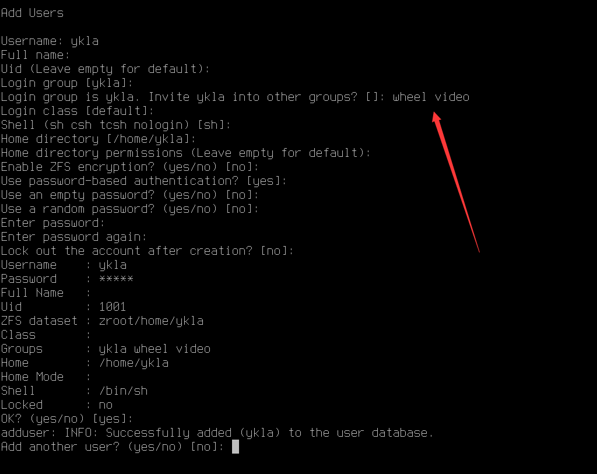

# 第 2.0 节 图解安装

以下安装说明基于 UEFI 下的 `FreeBSD-14.1-RELEASE-amd64-disc1.iso`。`-dvd1.iso` 大同小异。

## 启动安装盘、设定键盘布局与主机名


此界面无需任何操作，等待十秒，可自动进入 `1. Boot Installer [Enter]`；亦可以直接按 **回车键** 进入。

按 **空格键** 可暂停，可选定以下选项。

以下操作：按最开头的数字可进行选定。`on` 代表已开启，`off` 代表已关闭。

|     选项     |                                   解释                                    |
| :----------: | :----------------------------------------------------------------------- |
|`1. Boot Installer [Enter]`|用于安装系统|
| `2. Boot Single user` |  单用户模式，找回 root 密码和修复磁盘时会用到 |
|  `3.Escape to loader prompt`   |           离开菜单，进入命令模式，进入后输入 `reboot` 回车可重启                                |
| `4.Reboot`  |        重启                      |
|  `5. Cons: Video`    |    选择输出模式：视频（`Video`）、串口（`Serial`）、同时输出，但串口优先（`Dual (Serial primary)`、同时输出，但视频优先（`Dual (Video primary)` 可选）                         |
|`6. Lernel: default/kernal (1 of 1)`|选择要启动的内核|


|**`7. Boot Options`**|启动参数|
| :----------: | :----------------------------------------------------------------------- |
|`1. Back to main menu [Backspace]`|按 **删除键** 可返回上级菜单 |
|`2. Load System Defaults`|恢复默认配置|
|`3. ACPI`|高级配置和电源接口|
|`4. Safe Mode`|安全模式|
|`5. Single user`|单用户模式|
|`6. Verbose`|啰嗦模式，增加更多调试信息输出|


选中 `install`，按下 **回车键** 可进行安装。中间 `Shell` 是命令行，左右侧 `Live System` 是 LiveCD 模式。

>**技巧**
>
>如果不确定自己的硬盘是哪块（比如分不清是 `da0` 还是 `nv0` 之类的），可选择 `Shell` 使用命令查看：
>
>
>
>查看完成后输入 `exit` 回车可继续以下安装过程。


这里是设置键盘，直接按 **回车键** 即可（因目前中国使用美式键盘布局）。


此处设置主机名。

>**警告**
>
>**不要** 在这一步直接按 **回车键**！这样会导致主机名为空！Xorg 会无法启动。

## 选择要安装的组件


推荐：在默认的基础上，**额外** 选中 `src` 即可。因为部分显卡驱动（如 `drm`）和其他程序需要 `src`，经测试 `lib32` 后天安装无效。不推荐选 `ports`，因为太老了，还不如直接从源里拉取最新的。

>**警告**
>
>**不要** 全选，全选组件会使用网络进行安装，极慢。

|    选项    |                                 解释                                  |
| :--------: | :------------------------------------------------------------------- |
|  `base-dbg`  |                 基本系统调试工具                |
| `kernel-dbg` |                       内核调试工具                        |
| `lib32-dbg`  | 32 位应用程序的兼容库的调试工具 |
|   `lib32`    |        用于在 64 位 FreeBSD 上运行 32 位应用程序的兼容库        |
|   `ports`    |                                 ports                                 |
|    `src`     |                              系统源代码                               |
|   `tests`    |                               测试工具                                |

## 文件系统分区与 root 密码设置


推荐：文件分区详解见其他章节。这里推荐选择默认选项 `auto ZFS`，一般来说内存小于 8GB 的应该选择 UFS，内存 8G 及以上的应该选用 ZFS。可手动分区解压 `txz` 文件以自定义，参加其他章节。

>**技巧**
>
>经过测试，实际上 256M 内存也能用 ZFS（UEFI）；若使用旧的 BIOS，128M 内存足矣。

> **注意**
>
>如果使用手动分区一直提示分区表损坏（`corrupted`）或类似字样，请先退出重启，进入 shell 模式，刷新分区表：
>
> ```sh
> # gpart recover ada0
> ```
>
> 你在手动安装的时候可以判断是哪块硬盘，以确定 `ada0` 这个参数是多少。
>
> 刷新后，输入 `bsdinstall` 即可进入安装模式。
>
> 原因详情见 [FreeBSD 手册](https://handbook.bsdcn.org/di-18-zhang-cun-chu/18.3.-tiao-zheng-he-zeng-jia-ci-pan-da-xiao.html)，但是我认为这是一个 bug。


现代计算机应该选择 `GPT+UEFI`。较老的计算机（比如 2013 年以前的）应该选择保持与图片一致的选项（`GPT(BIOS)`）——默认选项同时兼容二者。

>**注意**
>
>最好想清楚再设定 `Swap Size`（即交换分区）的大小（一般理论是内存的两倍，但由于设计问题，不应超过 64G），因为 zfs、ufs 文件系统都是不能缩小文件系统的，而 `dd` 一个 swap 文件或文件系统会有负面作用。


直接按 **回车键** 即可


选中你的硬盘，直接按 **回车键** 即可。

>**技巧**
>
>如不确定，请按 **ctrl** + **c** 选择 `Restart`，再按两次 `ESC` 退回最开始，选择 `Shell` 使用命令查看即可。

查看完成后输入 `exit` 回车可继续上述安装过程。


按 **方向键** 和 **Tab 键** 可左右切换，按 **回车键** 可选定。

>**警告**
>
>这是全盘安装，会丢失所有数据！


此处输入 root 密码，密码不会显示在屏幕上，输入后就是 **什么也没有**，其他地方的密码亦如此。要求重复输入两次以确认一致性。密码强度默认无要求。

## 网络设置

### 以太网卡设置


选择网卡。按 **方向键** 可切换，按 **回车键** 可选定。


配置 IPv4。按 **回车键** 可选定。


配置使用 DHCP。按 **回车键** 可选定。


配置 IPv6。因本教程未使用 IPv6，故选 `No`，按 **回车键** 可选定。如有需要可自行配置 IPv6。


一般保持 DHCP 获取的 DNS 即可，也可以使用其他 DNS。此处使用了阿里 DNS `223.5.5.5`。按 **方向键** 可切换，按 **回车键** 可选定。

### 无线网卡/ WiFi 设置

>**注意**
>
>博通网卡请安装后参参照 WiFi 章节进行处理。


修改 WiFi 区域码：


我们应该选 `NONE ROW`：


选择区域：


扫描：


>**技巧**
>
>只要能识别出来网卡，肯定就是能用的，但是在安装系统的时候不一定能够正确搜索出 WiFi。请你置空，安装完成后重启到新系统，再参照 WiFi 章节进行处理。


在列表中找寻你的 WiFi，找不到的话请你换下路由器的信道。


配置 IPv4。按 **回车键** 可选定。


配置使用 DHCP。按 **回车键** 可选定。


配置 IPv6。因本教程未使用 IPv6，故选 `No`，按 **回车键** 可选定。如有需要可自行配置 IPv6。


一般保持 DHCP 获取的 DNS 即可，也可以使用其他 DNS。此处使用了阿里 DNS `223.5.5.5`。按 **方向键** 可切换，按 **回车键** 可选定。

#### 参考文献

- [Regulatory Domain Support](https://wiki.freebsd.org/WiFi/RegulatoryDomainSupport)
- [regdomain.xml --	802.11 wireless	regulatory definitions](https://man.freebsd.org/cgi/man.cgi?query=regdomain&sektion=5)，对应编码请参考系统中的 `/etc/regdomain.xml` 文件。

## 时区设置


设置时区。中国位于 `5 Asia`（亚洲）。按 **方向键** 可切换，按 **回车键** 可选定。


设置国家或区域。中国选择 `9 China`（中国）。按 **方向键** 可切换，按 **回车键** 可选定。


中国统一使用东八区时间，即北京时间，请选择 `1 Beijing Time`（北京时间）。按 **方向键** 可切换，按 **回车键** 可选定。


我们使用中国标准时间：China Standard Time（CST），没有问题，按 **回车键** 选定 `Yes`。


按 **回车键** 即可。


按 **回车键** 即可。

## 启动服务设置


>**警告**
>
>**不要全选！**
>
>**不要** 选 `local_unbound`，会影响 DNS，见 [https://bugs.freebsd.org/bugzilla/show_bug.cgi?id=262290](https://bugs.freebsd.org/bugzilla/show_bug.cgi?id=262290)。除非你知道这是什么。


|     选项      |                                                                                  解释                                                                                   |
| :-----------: | :------------------------ |
| `local_unbound` | 启用 Unbound。这是基本系统预置的 unbound，仅用于本地缓存转发解析器使用。注意：如果开启，你的系统将不会正确联网，需要手动配置 DNS。如果你不知道这是什么不建议开启 |
|     `sshd`      |                                                                              开启 ssh 服务                                                                              |
|    `moused`     |                                                                           在 tty 界面显示鼠标                                                                           |
|    `ntpdate`    |                                                                      启用启动时的自动时钟同步功能                                                                       |
|     `ntpd`      |                                                              用于自动时钟同步的网络时间协议（NTP）守护程序                                                              |
|`ntpd_sync_on_start`|开机同步时间|
|    `powerd`     |                                                                                电源管理，CPU 频率动态调整                                                                                 |
|    `dumpdev`    |                                                                       启用崩溃转储，用于调试系统                                                                        |

## 安全加固、创建普通用户


这里是安全加固部分，可根据需要自行选定。

>**技巧**
>
>在 FreeBSD 14 以前版本的安装中，在这一步会出现 `disable_sendmail`，请选定之，如果不禁止这个服务会使你在每次开机的时候卡上几分钟，而且这个服务本身没什么用，发邮件用的。

|选项|解释|
| :-----------: | :------------------------ |
|`0 hild_uids`|隐藏其他用户的进程|
|`1 hide_gids`|隐藏其他组的进程|
|`2 hide_jail`|隐藏 jail 中的进程|
|`3 read_msgbuf`|禁止非特权用户读取内核消息缓冲区（一般用 `dmesg` 查看）|
|`4 proc_debug`|禁用非特权用户的进程调试功能|
|`5 random_pid`|进程的 PID 随机化|
|`6 clear_tmp`|在开机时清除 `/tpm`|
|`7 disable_syslogd`|禁用 Syslogd 网络套接字（禁用远程日志记录）|
|`8 secure_console`|启用控制台密码（单用户模式下也需要 root 密码）|
|`9 disable_ddttrace`|禁止 DTrace 破坏性（destructive）模式|


询问你是否需要创建普通用户。如需创建，请按 **回车键** 选 `Yes`；如果不需要普通用户，~~是 root 敢死队~~，请用 **方向键** 选 `No`。


>**技巧**
>
>绝大多数登录管理器都是默认禁止 root 用户登录。换言之，如果不进行一定的修改（参见其他章节），在默认状态下，你可能无法用 root 登录桌面。~~虽然在默认状态下 FreeBSD 不带桌面，或者还可以直接 `startx`~~。



>**注意**
>
>如果你要创建普通用户，请务必将其加入到 `wheel` 组中（请参见箭头位置）。

其他参数可以保持默认设置不变。在 FreeBSD 14 及以后，所有用户的默认 shell 都被统一为了 `sh`。

最后会询问 `Add another user？ (yes/no) [no]`，按 **回车键** 即可完成创建；

若输入 `yes`，按 **回车键** 可创建第二个普通用户。

## 结束安装


按 **回车键** 可结束安装。


按 **回车键** 可完成安装。


按 **回车键** 可重启进入新安装的系统。

欢迎你来到 FreeBSD 世界！
