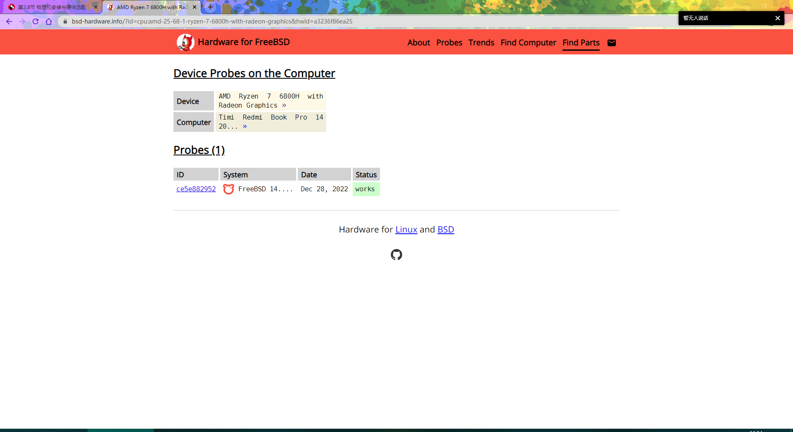
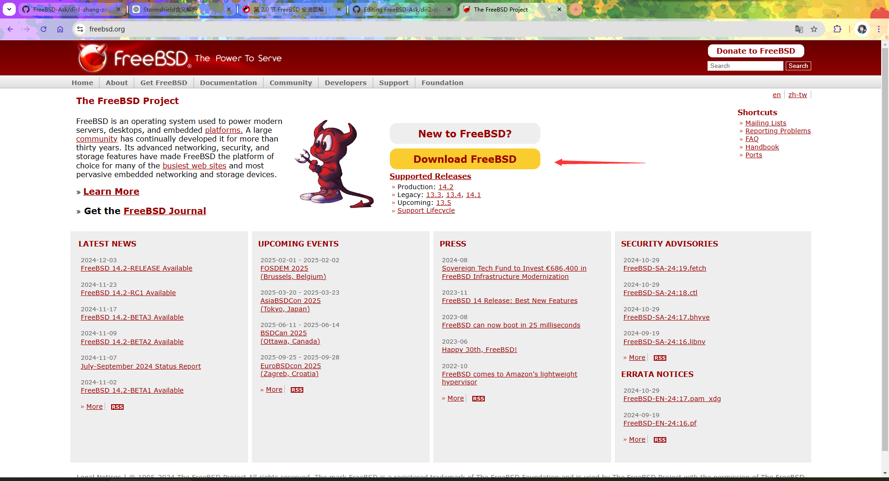
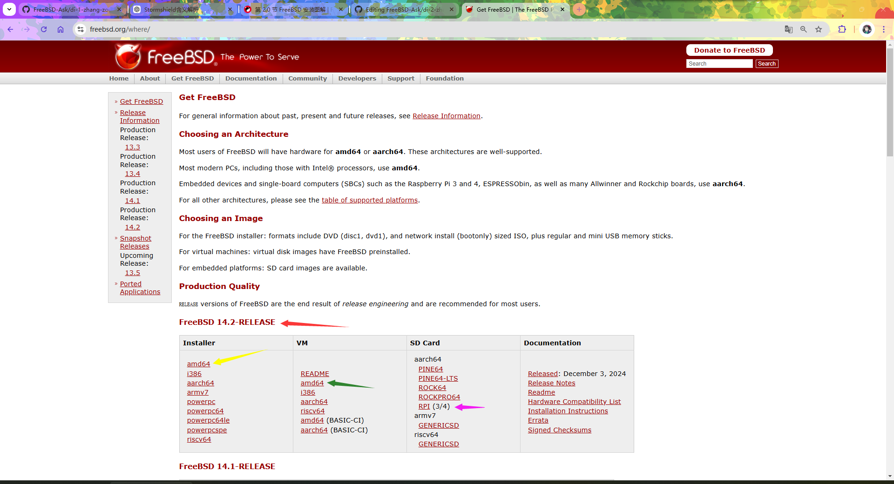
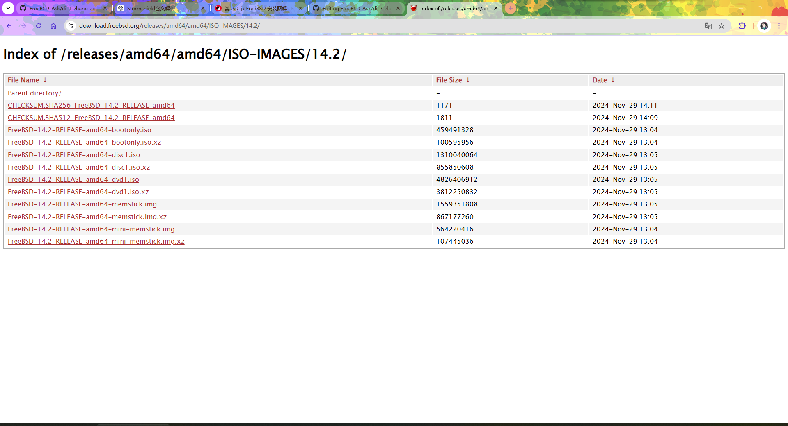

# 2.1 安装前的准备工作


## 硬件支持情况

### 最低硬件需求

针对 amd64 架构，14.2-RELEASE 版本在虚拟机环境中测得：

- 硬盘：
  - 仅基本系统（安装后）：550MB
  - KDE 桌面（通过 pkg 安装后）：15 GB
- 内存：
  - 统一可扩展固件接口（Unified Extensible Firmware Interface，UEFI）模式下，最小内存需求为 128 MB
  - 基本输入/输出系统（Basic Input/Output System，BIOS）模式下，最小内存需求为 64 MB

### 实测硬件支持


| 硬件类别  | 系列        | 实测型号                                         | 备注                                                                                                          |
| --------- | ------------ | -------------------------------------------- | ----------------------------------------------------------------------------------------------------------- |
| CPU       | Intel 混合架构（大小核）    | i7-1260P、N100                                | 实测可启动运行，但调度机制不完善，睿频功能受限                   |
| NVMe 固态硬盘 | M.2 接口       | 英睿达 P310，Intel 600P，梵想 S530Q、S500Pro、S542PRO | 正常工作                                                                                                        |
| 无线网卡      | Intel AX 系列  | AX200                                        | Wi-Fi 5 速率与 Windows 11 IoT Enterprise 24H2 相当（使用 iperf2 测得）                                                                     |
| 有线网卡      | Realtek 2.5G | RTL8125B                                     | 需要额外安装驱动，参见全书附录                                                                                             |
| 有线网卡      | Intel 2.5G   | i226-V                                       | 正常工作                                                                                                        |
| 显卡   | 近十年的 Intel 及 AMD 集成/独立显卡  |   英特尔锐炬 ® Xe 显卡、Intel HD Graphics 4000       | 支持程度与 DRM 驱动移植进度相关；截至写作时，其代码状态约相当于 Linux 内核 6.10，最新进展请参见 [freebsd/drm-kmod](https://github.com/freebsd/drm-kmod/pulls) [备份](https://web.archive.org/web/20260115143641/https://github.com/freebsd/drm-kmod/pulls) |
| NVIDIA 显卡 | 近十多年的显卡   | GTX 850M  | 受 NVIDIA 官方显卡驱动支持     |

>**注意**
>
>FreeBSD 不支持 [安全启动](https://wiki.freebsd.org/SecureBoot) [备份](https://web.archive.org/web/20260115143726/https://wiki.freebsd.org/SecureBoot)，在安装 FreeBSD 前请务必关闭安全启动（Secure Boot）；FreeBSD 也不支持 Fake RAID（伪 RAID），请将其控制器修改为 AHCI。
>
>操作方法请咨询购机厂商技术售后。

### 特定硬件支持情况查询

更多硬件请参考：

[Hardware for BSD](https://bsd-hardware.info/?view=search)




>**注意**
>
>仍建议进行实际测试，因为该网站也可能出现错误，例如将 LPDDR5 误识别为 LPDDR4。

## 下载 FreeBSD 镜像

首先打开 FreeBSD 项目官网：<https://www.freebsd.org/>：



点击黄底红字的 `Download FreeBSD`，页面将跳转如下：



>**技巧**
>
>随着时间的推移，当读者进行下载时，可能已经没有 14.2-RELEASE 版本了。你只需选择列表最顶部的 `FreeBSD-X.Y-RELEASE`（推荐用于生产环境）即可。其中，`X.Y` 应是一个比 `14.2` 更大的版本号，如 `15.0`、`22.4` 等，但需要注意，它们都应该是以 `RELEASE` 结尾的，而不是 `CURRENT`。

>**警告**
>
>使用非 RELEASE 版本的用户应有意愿和时间关注开发动态，浏览邮件列表与问题追踪系统，例如 [freebsd-src/UPDATING](https://github.com/freebsd/freebsd-src/blob/main/UPDATING) [备份](https://web.archive.org/web/20260115143917/https://github.com/freebsd/freebsd-src/blob/main/UPDATING) 及 [freebsd-src/RELNOTES](https://github.com/freebsd/freebsd-src/blob/main/RELNOTES) [备份](https://web.archive.org/web/20260119051314/https://github.com/freebsd/freebsd-src/blob/main/RELNOTES) 等文档。同时要求用户具备一定的探索和动手能力。否则，建议使用 RELEASE 版本。

|Installer|VM|SD Card|Documentation|
|:---:|:---:|:---:|:---:|
|安装镜像 | 虚拟机预安装镜像 | 存储卡镜像 | 文档|
|适用于常规安装 | 适用于云平台和虚拟机 |适用于单板机/嵌入式设备 | 发行说明等文档   |

>**技巧**
>
>如果你不知道选哪个，请你选择 `Installer`（普通家用电脑，苹果除外）。

>**技巧**
>
>如果读者不清楚 `amd64`、`i386`、`aarch64`、`armv7` 这些架构的区别，请选择 `amd64`（适用于大多数普通家用电脑，苹果电脑除外）。



```sh
File Name                                          File Size      Date                 
Parent directory/                                  -              -                     
CHECKSUM.SHA256-FreeBSD-14.2-RELEASE-amd64         1171           2024-Nov-29 14:11     
CHECKSUM.SHA512-FreeBSD-14.2-RELEASE-amd64         1811           2024-Nov-29 14:09     
FreeBSD-14.2-RELEASE-amd64-bootonly.iso            459491328      2024-Nov-29 13:04     
FreeBSD-14.2-RELEASE-amd64-bootonly.iso.xz         100595956      2024-Nov-29 13:04     
FreeBSD-14.2-RELEASE-amd64-disc1.iso               1310040064     2024-Nov-29 13:05     
FreeBSD-14.2-RELEASE-amd64-disc1.iso.xz            855850608      2024-Nov-29 13:05     
FreeBSD-14.2-RELEASE-amd64-dvd1.iso                4826406912     2024-Nov-29 13:05     
FreeBSD-14.2-RELEASE-amd64-dvd1.iso.xz             3812250832     2024-Nov-29 13:05     
FreeBSD-14.2-RELEASE-amd64-memstick.img            1559351808     2024-Nov-29 13:05     
FreeBSD-14.2-RELEASE-amd64-memstick.img.xz         867177260      2024-Nov-29 13:05     
FreeBSD-14.2-RELEASE-amd64-mini-memstick.img       564220416      2024-Nov-29 13:04     
FreeBSD-14.2-RELEASE-amd64-mini-memstick.img.xz    107445036      2024-Nov-29 13:04     
```

以上：第一列代表文件名，第二列是文件大小，第三列是发布日期。

|首列 | 说明|
|:---|:---|
|Parent directory/	-	-|指向上级目录|
|CHECKSUM.SHA256-FreeBSD-14.2-RELEASE-amd64	  | 本页所有镜像的 SHA256 校验值 |
|CHECKSUM.SHA512-FreeBSD-14.2-RELEASE-amd64   |  本页所有镜像的 SHA512 校验值 |
|FreeBSD-14.2-RELEASE-amd64-bootonly.iso	      | 网络安装镜像，安装时需联网 |
|FreeBSD-14.2-RELEASE-amd64-bootonly.iso.xz	    | 压缩的网络安装镜像，安装时需联网|
|FreeBSD-14.2-RELEASE-amd64-disc1.iso	 | CD 镜像    |
|FreeBSD-14.2-RELEASE-amd64-disc1.iso.xz	|  压缩的 CD 镜像 |
|FreeBSD-14.2-RELEASE-amd64-dvd1.iso	 | DVD 镜像，相比 CD 镜像包含了更多的软件包（pkg）   |
|FreeBSD-14.2-RELEASE-amd64-dvd1.iso.xz	  | 压缩的 DVD 镜像，相比 CD 镜像包含了更多软件包（pkg）  |
|FreeBSD-14.2-RELEASE-amd64-memstick.img	| U 盘用的镜像（可以使用 Rufus 制作 U 盘启动盘）   |
|FreeBSD-14.2-RELEASE-amd64-memstick.img.xz	 | 压缩的 U 盘用的镜像（无需解压缩，可以使用 Rufus 制作 U 盘启动盘）   |
|FreeBSD-14.2-RELEASE-amd64-mini-memstick.img	 | U 盘用的网络安装镜像，安装时需联网 |
|FreeBSD-14.2-RELEASE-amd64-mini-memstick.img.xz|压缩的 U 盘用的网络安装镜像，安装时需联网 |

需要注意的是，DVD 镜像并不包含一切离线软件包，仅精选了若干软件包，具体清单可参见源代码文件 [release/scripts/pkg-stage.sh](https://github.com/freebsd/freebsd-src/blob/main/release/scripts/pkg-stage.sh) [备份](https://web.archive.org/web/20260115143613/https://github.com/freebsd/freebsd-src/blob/main/release/scripts/pkg-stage.sh)。

FreeBSD 的所有安装介质（包括但不限于虚拟机镜像）默认均不提供图形界面，需要用户自行安装和配置。DVD 镜像虽包含更多软件包，但由于依赖问题，在安装图形界面时仍可能遇到问题，不建议使用 DVD 镜像。

>**技巧**
>


FreeBSD 镜像 BT 种子下载地址（非官方，建议检查文件校验和后使用）：<https://fosstorrents.com/distributions/freebsd/>

- RELEASE 正式版镜像下载地址
  - 虚拟机用：<https://download.freebsd.org/ftp/releases/amd64/amd64/ISO-IMAGES/15.0/FreeBSD-15.0-RELEASE-amd64-disc1.iso>
  - 物理机用：<https://download.freebsd.org/releases/amd64/amd64/ISO-IMAGES/15.0/FreeBSD-15.0-RELEASE-amd64-memstick.img>
- CURRENT 开发版下载地址（仅限专业用户）
  - 虚拟机用：[https://download.freebsd.org/snapshots/amd64/amd64/ISO-IMAGES/16.0/](https://download.freebsd.org/snapshots/amd64/amd64/ISO-IMAGES/16.0/)
  - 物理机下载 `-amd64-memstick.img` 或 `-amd64-memstick.img.xz` 结尾的文件

当读者浏览到此处的时候，事情已并非原貌，还请读者自行查阅，选择合适的 RELEASE 版本用于生产。

FreeBSD `-RELEASE` 历史版本下载地址：

- 5.1-RELEASE 至 9.2-RELEASE <http://ftp-archive.freebsd.org/pub/FreeBSD-Archive/old-releases/amd64/ISO-IMAGES>
- 9.3-RELEASE 至最新的 `-RELEASE` 版本 <http://ftp-archive.freebsd.org/pub/FreeBSD-Archive/old-releases/ISO-IMAGES/>


## 刻录 FreeBSD 镜像

我该如何刻录 FreeBSD 镜像到 U 盘？

### 建议使用 `-img` 或 `-img.xz` 格式的镜像

制作 U 盘安装介质时，最好使用 `-img` 或 `-img.xz` 格式的镜像。因为 `.iso` 镜像采用的 Hybrid 混合启动模式可能未完全遵循 UEFI 规范，直接写入 U 盘可能导致错误。见 [FreeBSD -.iso files not support written to USB drive](https://bugs.freebsd.org/bugzilla/show\_bug.cgi?id=236786)。建议读者应仅在使用 **光学介质/虚拟机/云平台** 安装时选用 `iso` 结尾的镜像。

当然，也存在例外情况。部分机器的 UEFI 固件支持从 `.iso` 镜像刻录的 U 盘启动（例如一些老款神舟电脑），但并非所有机器都支持此方式（例如部分小米电脑可能无法引导）。

由于设备类型多样，即使在某台机器上测试通过，FreeBSD 的两个 ISO 镜像仍无法排除出现兼容性问题的可能性。若遇到引导问题，请首先尝试使用 Rufus 对 `img` 镜像进行刻录。

### 在 Windows 平台建议优先使用 Rufus 工具来刻录镜像

Windows 平台建议优先使用 **Rufus**，Linux 平台可直接使用 `dd` 命令进行镜像刻录。

Rufus 下载地址为 [https://rufus.ie/zh](https://rufus.ie/zh) [备份](https://web.archive.org/web/20260115142915/https://rufus.ie/zh/)。

当使用 Rufus 刻录镜像时，无需解压缩文件，直接选择 `-img.xz` 即可制作启动盘。


**不建议** 使用 FreeBSD 手册中提到的 win32diskimager，因为有时会出现校验错误（尽管实际文件校验值是正确的）。类似地，**同样不建议** 使用 [Ventoy](https://www.ventoy.net/) [备份](https://web.archive.org/web/20260115143659/https://www.ventoy.net/en/index.html) 直接加载 ISO 或 IMG 镜像文件。

**读者应仅在 Rufus 无效的情况下再使用 win32diskimager 或 Ventoy。**

win32diskimager 的下载地址是 <https://sourceforge.net/projects/win32diskimager/files/Archive/>，点击 `win32diskimager-1.0.0-install.exe` 即可下载。

>**思考题**
## 附录：共享硬件数据到数据库

如果读者也想上传自己的数据到 <https://bsd-hardware.info>，与大家共享，可参照本节进行。

### 安装 hw-probe

- 使用 pkg 安装 hw-probe：

```sh
 # pkg install hw-probe
```

- 或者还可以使用 Ports 安装 hw-probe：

```sh
# cd /usr/ports/sysutils/hw-probe/
# make install clean
```

### 上传硬件数据

执行以下命令可采集硬件信息并上传到 hw-probe 数据库：

```sh
# hw-probe -all -upload
Probe for hardware ... Ok
Reading logs ... Ok
Uploaded to DB, Thank you!

Probe URL: https://bsd-hardware.info/?probe=f64606c4b1
```

打开上面的链接，即可看到你的设备。笔者这里上传的是 Radxa x4 的配置信息。

其他操作系统可参见 [INSTALL HOWTO FOR BSD](https://github.com/linuxhw/hw-probe/blob/master/INSTALL.BSD.md) [备份](https://web.archive.org/web/20260115143827/https://github.com/linuxhw/hw-probe/blob/master/INSTALL.BSD.md)。
