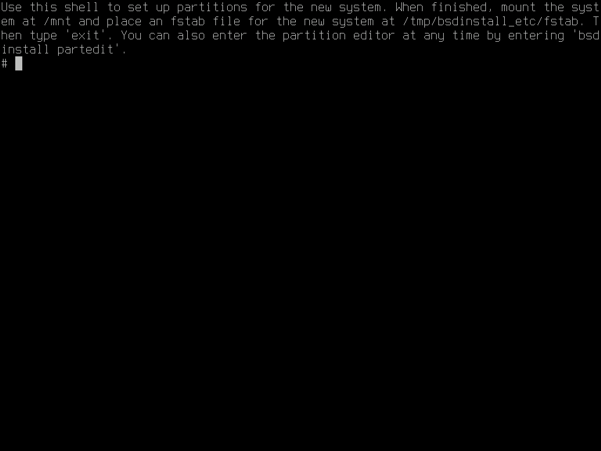
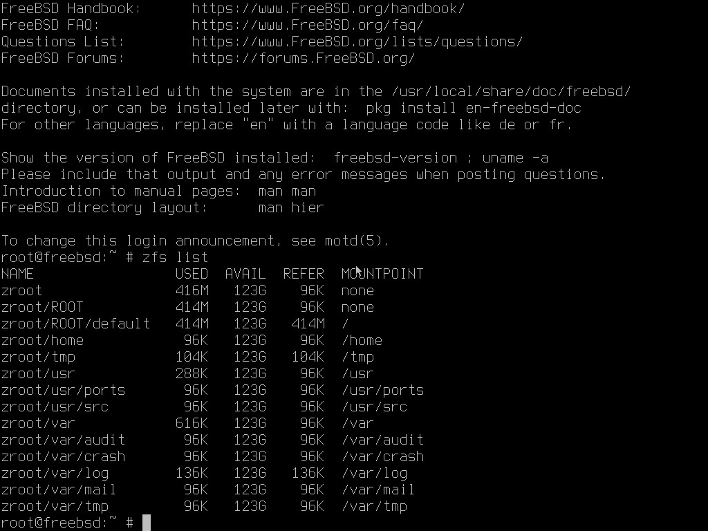

# 第 2.1 节 手动安装双系统

本节以“FreeBSD-14.0-RELEASE-amd64-disc1.iso”为例，在 `Hyper-V` 中演示 FreeBSD 14.0 RELEASE 与 Windows 11 在 UEFI 环境下的双系统安装。

> **注意**
>
> 以本文所述方法，在使用 ZFS 时，只会创建一个名为 `root` 的 zpool，并且直接挂载到 `/`，并不是像自动安装那样创建 `zroot/ROOT/default` 以及众多的数据集。你可以以后再创建数据集进行替换操作，但如果你想在安装开始就使用与自动安装相同的布局，请跳转到本节 Shell 分区部分。

首先需要为 FreeBSD 在硬盘末尾处留出空间，并且关闭安全启动和快速启动。这些操作在此不再赘述，请自行上网搜索。Linux 同理。

然后正常引导 FreeBSD 进行安装流程，直到分区选择。


此处选择 `Manual`


这里可以看到硬盘分区。仅有一块硬盘，有 300M 的 EFI 系统分区，16M 的 MSR 分区，64G 的 Windows 系统分区。未显示空闲空间。直接选择 `Create`


此处，第一行输入分区类型（即下方会列出的 `Filesystem type`）。如要添加 swap 分区，请首先添加，后添加难以控制分区大小。在添加 UFS、ZFS 时，需在 `Mountpoint` 处添加 `/`，表示分区挂载到 `/`。`Label` 是 FreeBSD 的卷标，方便识别分区，可以根据情况添加或不填。此处使用 ZFS，不添加 swap 分区，并且添加卷标 `zroot`。


用 **TAB 键** 选择到 OK 回车


这里会提示 ZFS 分区无法启动，但经过实测是可以正常启动的，选择 `yes` 忽略


选择 `Finish`


选择 `Commit`

之后会进入正常安装的流程。


进入系统后可以看到，仅有一个 `root` 数据集。可以逐渐将数据集改为自动安装的样子，也可以参照下文在安装时进入 shell 进行分区。

## Shell 分区


仍然进行到分区选择，选择 `Shell`



之后会进入终端，执行以下命令：

```sh
# kldload zfs  # 加载 ZFS 内核模块
# sysctl vfs.zfs.min_auto_ashift=12  # 强制 4K 对齐
# gpart add -a 4k -l swap -s 4G -t freebsd-swap da0  # 添加 swap 分区（-t），卷标为 swap（-l），大小为 4G（-s），对齐（-a），注意替换 da0
# gpart add -a 4k -l zroot -t freebsd-zfs da0  # 添加 ZFS 分区，卷标为 zroot，使用全部空余大小，注意替换 da0
# mount -t tmpfs tmpfs /mnt  # 挂载一个空文件系统准备安装
# zpool create -f -o altroot=/mnt -O compress=lz4 -O atime=off -m none zroot /dev/gpt/zroot  # 创建 ZFS 池，暂时挂载至 /mnt（-o altroot=/mnt），使用 lz4 压缩（-O compress=lz4，可以换成zstd等），关闭时间标签（-O atime=off），/dev/gpt/zroot 是我们刚建立的卷标
#创建数据集
# zfs create -o mountpoint=none zroot/ROOT
# zfs create -o mountpoint=/ zroot/ROOT/default
# zfs create -o mountpoint=/home zroot/home
# zfs create -o mountpoint=/tmp -o exec=on -o setuid=off zroot/tmp
# zfs create -o mountpoint=/usr -o canmount=off zroot/usr
# zfs create -o setuid=off zroot/usr/ports
# zfs create zroot/usr/src
# zfs create -o mountpoint=/var -o canmount=off zroot/var
# zfs create -o exec=off -o setuid=off zroot/var/audit
# zfs create -o exec=off -o setuid=off zroot/var/crash
# zfs create -o exec=off -o setuid=off zroot/var/log
# zfs create -o atime=on zroot/var/mail
# zfs create -o setuid=off zroot/var/tmp
# chmod 1777 /mnt/tmp
# chmod 1777 /mnt/var/tmp  # 修改 tmp 文件夹权限
# zpool set bootfs=zroot/ROOT/default zroot  # 设置启动路径
# printf 'zfs_enable="YES"\n' >> /tmp/bsdinstall_etc/rc.conf  # 设置 FreeBSD 启动时加载 ZFS
# printf "/dev/gpt/swap\tnone\tswap\tsw\n" >> /tmp/bsdinstall_etc/fstab  # 添加 swap 分区挂载，同理 /dev/gpt/swap 是我们刚建立的卷标
# mount -t msdosfs /dev/da0p1 /media  # 挂载现有 EFI 系统分区，注意替换 /dev/da0p1
# mkdir -p /media/efi/freebsd  # 在 EFI 系统分区创建启动目录
# cp /boot/loader.efi /media/efi/freebsd/loader.efi  # 复制 EFI 文件
# efibootmgr --create --activate --label "FreeBSD" --loader "/media/efi/freebsd/loader.efi"  # 添加 UEFI 启动项
# umount /media  # 卸载 EFI 系统分区
# exit  # 退出 shell，FreeBSD 会继续安装流程
```

这样我们就手动创建了一套与自动安装相同的结构



## 参考文献

- [How to manually install FreeBSD on a remote server (with UFS, ZFS, encryption...)](https://stanislas.blog/2018/12/how-to-install-freebsd-server/)
- [RootOnZFS/GPTZFSBoot](https://wiki.freebsd.org/RootOnZFS/GPTZFSBoot)
