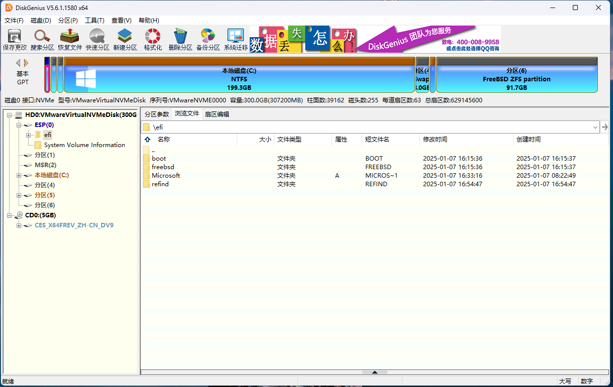

# 第 2.10 节 手动安装双系统（先安装 FreeBSD）

>**注意**
>
>本文要求先安装 FreeBSD，再安装 Windows 或其他操作系统。

## 安装 FreeBSD 14.2 RELEASE

本文未特别说明的，皆为正常设置与参数。


>**技巧**
>
>如果在此处设置 `P Partition Scheme` 为 `GPT (UEFI)` 而非其他（只有老电脑才需要 `GPT (BIOS+UEFI)` 等选项），后续分区与系统更新过程会更加简单，也能实现 4K 对齐。


在这一步修改 `S Swap Size` 的大小（计算方法为 swap 大小 + Windows 大小）。

本文中，交换分区（Swap）占 8G，其他的 200G 留给 Windows。


查看磁盘分区：

```sh
root@ykla:/home/ykla # gpart show
=>     9  639659  cd0  MBR  (1.2G)
       9  639659       - free -  (1.2G)

=>     9  639659  iso9660/14_2_RELEASE_AMD64_CD  MBR  (1.2G)
       9  639659                                 - free -  (1.2G)

=>       40  629145520  nda0 GPT  (300G)
         40     532480    1  efi  (260M)
     532520       1024    2  freebsd-boot  (512K)
     533544        984       - free -  (492K)
     534528  436207616    3  freebsd-swap  (208G)
  436742144  192401408    4  freebsd-zfs  (92G)
  629143552       2008       - free -  (1.0M)
  
```

查看交换分区：

```sh
root@ykla:/home/ykla # swapinfo -mh
Device              Size     Used    Avail Capacity
/dev/nda0p3          208G       0B     208G     0%
```

可以看到交换分区的大小是我们所设定的 208GB。

编辑 `/etc/fstab`，在 swap 一行最前面加上 `#`，在本例中如下第三行：

```sh
# Device                Mountpoint      FStype  Options         Dump    Pass#
/dev/gpt/efiboot0               /boot/efi       msdosfs rw              2       2
#/dev/nda0p3             none    swap    sw              0       0
```

## 安装 Windows 11

插入 Windows 启动盘，设置 BIOS 从中启动，开始安装 Windows。


在分区时，删除（Delete Partition）整个 208G 的交换分区（本例中为“磁盘 0 分区 3”）。


然后点击创建分区（Create Partition），如果提示出错，请点击刷新（Refresh）即可。

然后选中 208G 的“磁盘 0 未分配空间”，点击“下一步”进行安装。


## 还原交换分区（Swap）

我们设置了 208G，很明显有 8G 是为 swap 创设的。现在需要将其还原。需要用到 [diskgenius](https://www.diskgenius.com/)。


打开 diskgenius，压缩 C 盘，空出 8G 剩余空间。


将这 8G 剩余空间格式化为 `FreeBSD Swap partition`，然后点击“保存更改”。


回到 FreeBSD，查看磁盘：

```sh
root@ykla:/home/ykla # gpart show
=>       34  629145533  nda0  GPT  (300G)
         34          6        - free -  (3.0K)
         40     532480     1  efi  (260M)
     532520       1024     2  freebsd-boot  (512K)
     533544        984        - free -  (492K)
     534528      32768     3  ms-reserved  (16M)
     567296  417953792     4  ms-basic-data  (199G)
  418521088   16777216     5  freebsd-swap  (8.0G)
  435298304    1441792     6  ms-recovery  (704M)
  436740096       2048        - free -  (1.0M)
  436742144  192401408     7  freebsd-zfs  (92G)
  629143552       2015        - free -  (1.0M)

```

可以看到，nda0p5（分区 5）是我们新的 swap。

测试一下：

```sh
root@ykla:/home/ykla # swapon /dev/nda0p5
```

没有报错，也没有任何提示，说明正常。

编辑 `/etc/fstab`，在 swap 一行最前面去掉 `#`，并将分区改为正确的，在本例中如下第三行：

```sh
# Device                Mountpoint      FStype  Options         Dump    Pass#
/dev/gpt/efiboot0               /boot/efi       msdosfs rw              2       2
/dev/nda0p5             none    swap    sw              0       0
```

重启测试一下：

```sh
root@ykla:/home/ykla # swapinfo -mh
Device              Size     Used    Avail Capacity
/dev/nda0p5         8.0G       0B     8.0G     0%
```

查看 ZFS 卷：

```sh
root@ykla:/home/ykla # zpool list
NAME    SIZE  ALLOC   FREE  CKPOINT  EXPANDSZ   FRAG    CAP  DEDUP    HEALTH  ALTROOT
zroot  91.5G   922M  90.6G        -         -     0%     0%  1.00x    ONLINE  -
root@ykla:/home/ykla # zfs list
NAME                 USED  AVAIL  REFER  MOUNTPOINT
zroot                922M  87.8G    96K  /zroot
zroot/ROOT           919M  87.8G    96K  none
zroot/ROOT/default   919M  87.8G   919M  /
zroot/home           224K  87.8G    96K  /home
zroot/home/ykla      128K  87.8G   128K  /home/ykla
zroot/tmp            104K  87.8G   104K  /tmp
zroot/usr            288K  87.8G    96K  /usr
zroot/usr/ports       96K  87.8G    96K  /usr/ports
zroot/usr/src         96K  87.8G    96K  /usr/src
zroot/var            668K  87.8G    96K  /var
zroot/var/audit       96K  87.8G    96K  /var/audit
zroot/var/crash       96K  87.8G    96K  /var/crash
zroot/var/log        188K  87.8G   188K  /var/log
zroot/var/mail        96K  87.8G    96K  /var/mail
zroot/var/tmp         96K  87.8G    96K  /var/tmp
```

## 配置 rEFInd

在 BIOS 来回切换确实很麻烦，我们可以借助 [rEFInd](https://www.rodsbooks.com/refind/) 实现类似 Clover 的效果，在开机时选择我们要进入的操作系统。

打开下载页面 [Getting rEFInd from Sourceforge](https://www.rodsbooks.com/refind/getting.html)，点击 `A binary zip file` 即可自动转跳下载。写作本文使用到了 `refind-bin-0.14.2.zip`。

该文件中只有一部分是有用的启动文件。我们只需要其中的 `refind` 文件夹，其他的不需要。

在 `refind` 文件夹中只有一部分是有用的启动文件。所有带 `aa64`、`ia32` 字样的均可删除。

所有用到的文件如下图所示。


我们将 `refind.conf-sample` 复制一份，并重命名为 `refind.conf`。


>**技巧**
>
>一般来说无需手动配置。但事有例外，若无法识别现有的操作系统，请按以下方法操作：
>
>打开 `refind.conf`，在任意空白行加入：
>
>```json
>menuentry "FreeBSD" { 
>	icon \EFI\refind\icons\os_freebsd.png 
>	volume "FreeBSD"
>	loader \EFI\freebsd\loader.efi 
>}
>
>menuentry "Windows 10" { 
>	icon \EFI\refind\icons\os_win.png
>	volume "Windows 10"  
>	loader \EFI\Microsoft\Boot\bootmgfw.efi 
>}
>```



使用 [diskgenius](https://www.diskgenius.com/) 将 `refind` 文件夹复制到 EFI 文件系统下的 efi 文件夹下。

### 添加启动项

使用 [diskgenius](https://www.diskgenius.com/) 创建启动项。


点击“工具”——"设置UEFI BIOS启动项"。


点击“添加”。


选中“refind_x64.efi”。


将其移动至顶部，设置为第一启动项。重启后测试效果。


两个选项都能进入。

### 主题美化（可选）

rEFInd 有多款主题可选。

本例采用 Matrix-rEFInd 进行说明。

项目地址：[Matrix-rEFInd](https://github.com/Yannis4444/Matrix-rEFInd/)

将项目下载下来解压缩 `Matrix-rEFInd-master.zip`。将解压出的文件夹 `Matrix-rEFInd-master` 重命名为 `Matrix-rEFInd`。

再新建目录 `themes`，将 `Matrix-rEFInd` 放到 `themes` 里面。

将 `themes` 复制到 EFI 分区的 efi 文件夹下的 `refind` 文件夹中。

再编辑 `refind.conf`（无法直接编辑可先复制到桌面，编辑后再覆盖回去），在此文件的最后一行加入 `include themes/Matrix-rEFInd/theme.conf`。

重启：


>**技巧**
>
>如果你在虚拟机复现本实验，受制于虚拟机（VMware、VirtualBox）的 UEFI 屏幕分辨率，你可能只能看到一个操作系统，可通过按钮切换而非上图中的两个。物理机是正常的。
