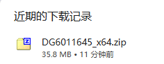
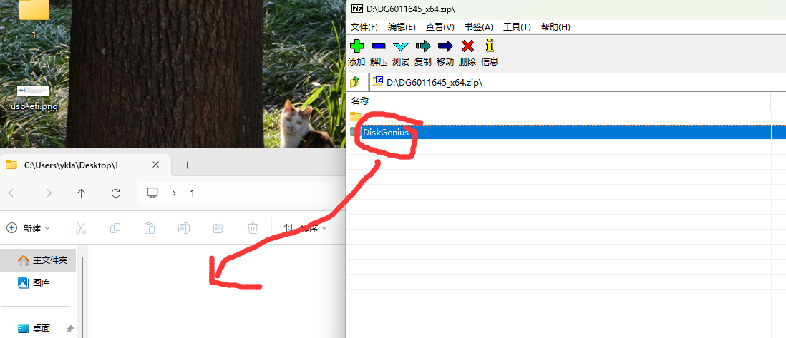
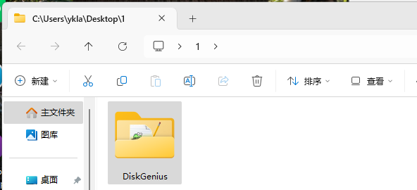
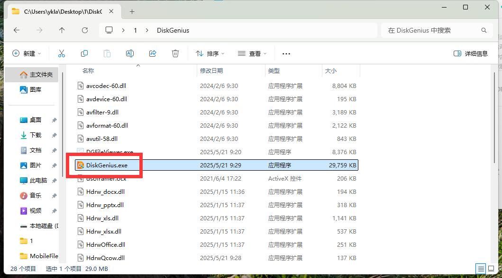
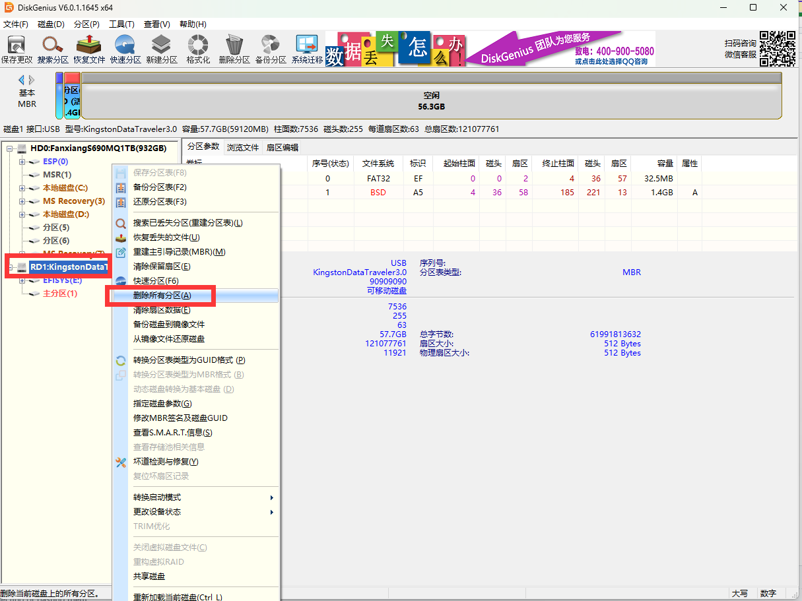
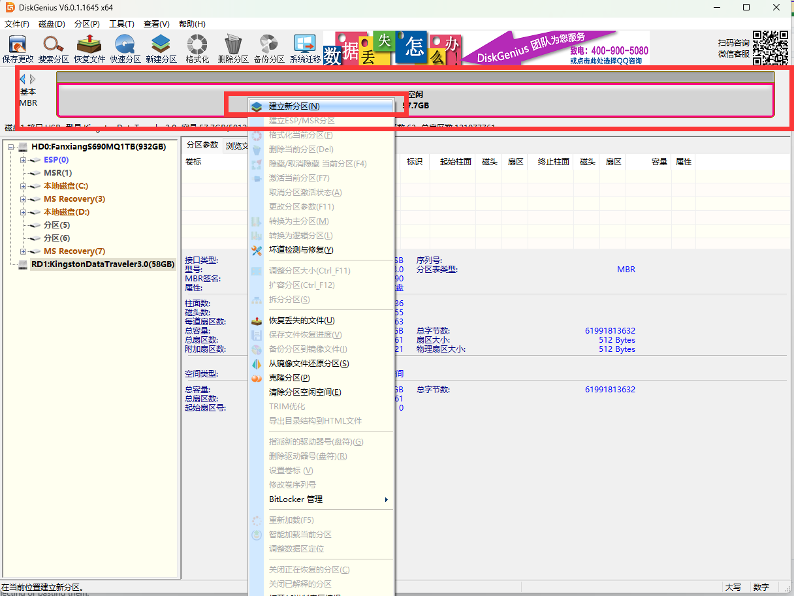
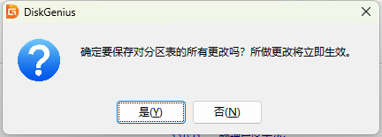
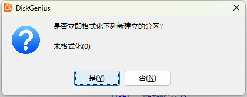

# 2.11 将 U 盘启动盘恢复为普通 U 盘

>**警告**
>
>本文所述操作具有高风险性，可能会损坏部分或全部的数据。除非你已经明确可接受的最坏结果、做好完整可验证的备份、并有可用的回滚方案，否则不要执行。你已经被警告过了。
>
>如果你无力解决，可以尝试在电商平台购买有偿服务来解决。

当使用 Rufus、win32diskimager 等软件制作了 U 盘启动盘用于安装系统后，你会发现 U 盘的可见容量可能只有 31.9 MB（即 EFI）。

这是一款 64G 的 U 盘，因此我们往往需要恢复还原 U 盘。

## 使用 diskgenius 恢复 U 盘启动盘

DiskGenius 官网：<https://www.diskgenius.cn/>，该软件有收费功能，但是免费功能已足够用。

### 下载 DiskGenius

在下载时，大部分人应该[下载](https://www.diskgenius.cn/download.php) 64 位。

下载后，发现是个 zip 压缩包。

需要在桌面新建文件夹 `1`（即 `C:\Users\ykla\Desktop\1`），全选压缩包内所有文件，提取至新建的文件夹 `1`（即 `C:\Users\ykla\Desktop\1\DiskGenius`）。

验证结果：

### 启动 DiskGenius

启动 DiskGenius，需要点击 `DiskGenius.exe`（即 `C:\Users\ykla\Desktop\1\DiskGenius\DiskGenius.exe`）才能启动。

同意许可证：

### 判断哪个是 U 盘

判断哪个是你的 U 盘，一般我们可以通过 U 盘容量来判断。如果你不记得自己的 U 盘容量，可以查询你的购买记录或拔下来 U 盘看一下，上面一般有标记。

- 通过容量判断：64G U 盘一般在 Windows/Linux 中显示为 58G（macOS 中为 64G）。
- 通过盘符判断：在下图中，你也可以通过“EFISYS(E:)”来判断（E 盘），这就是使用 Rufus 制作的 U 盘启动盘。
- 通过 DiskGenius 显示的接口判断：在下图中，你从顶部的“硬盘 1 接口 USB”中的“USB”也可以看出这是 USB 设备，即可能是 U 盘。

### 恢复 U 盘

在确认了哪个是 U 盘后，右键单击，选中“删除所有分区”。

在确认后才选择“是”。

删除后的 U 盘状态：

鼠标放到顶部空白区，右键单击，点击“建立新分区”。

设置如下：文件系统我们选择 `exFAT`（具有通用性，一般操作系统都能读写，且不存在单文件不能大于 4GB 的限制），底下选择对齐到 4096 扇区（4K 对齐）。

点击左上角的“保存更改”。

在确认后才选择“是”。

在确认后才选择“是”。

最后结果：

恢复完成。
