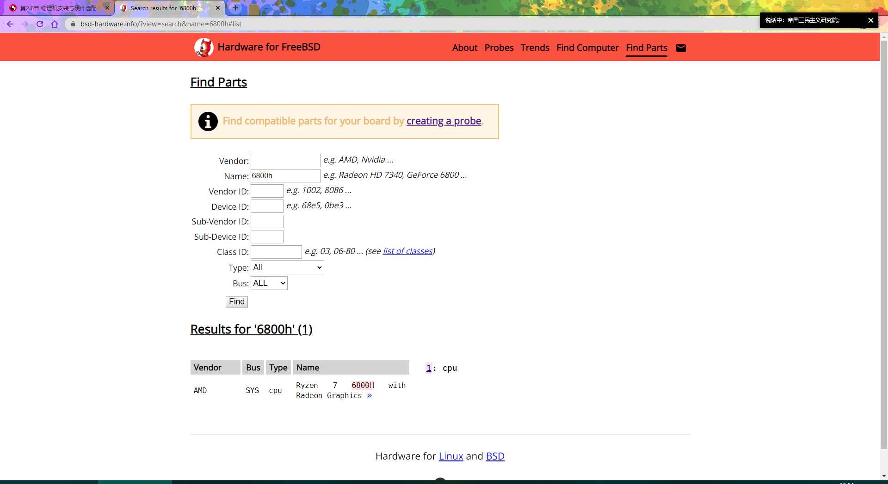
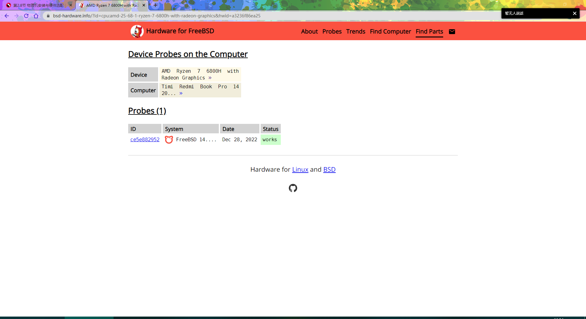

# 第 2.13 节 FreeBSD 硬件选择

## 怎么看我的硬件支持不支持呢？

更多硬件请参考：

[Hardware for BSD](https://bsd-hardware.info/?view=search)

<figure><figcaption></figcaption></figure>

<figure><figcaption></figcaption></figure>

> 如果你也想上传你的数据到该网站上，请：
>
> ```shell-session
> # pkg install hw-probe
> # hw-probe -all -upload
> ```
>
> 其他系统见 [INSTALL HOWTO FOR BSD](https://github.com/linuxhw/hw-probe/blob/master/INSTALL.BSD.md)

### 网卡推荐

> **警告**
>
> 千兆和 2.5G 网卡 **似乎都有时断时续的故障。** 如果你有更好的推荐（稳定不掉网）请联系我们。

|      类型     |         品牌/型号         |           芯片组/参数          | 售价（¥） |                          备注                          |
| :---------: | :-------------------: | :-----------------------: | :---: | :--------------------------------------------------: |
|   USB 无线网卡  |   COMFAST CF-WU810N   | RTL8188EUS 150M 2.4G 150M |   20  |                       由 rtwn 驱动                      |
|   USB 无线网卡  |    COMFAST CF-912AC   | RTL8812AU 2.4G & 5G 1200M |   60  |                       由 rtwn 驱动                      |
|   USB 无线网卡  |    COMFAST CF-915AC   |  RTL8811AU 2.4G & 5G 600M |   49  | 由 rtwn 驱动，套壳的，该型号为理论上支持，我没有实际测试过，如果不支持/支持，都请提交 issue |
|   USB 无线网卡  |        绿联 N300M       |    RTL8192EU 2.4G 300M    |   30  |   由 rtwn 驱动，该型号为理论上支持，我没有实际测试过，如果不支持/支持，都请提交 issue   |
|   USB 无线网卡  |     绿联 AC 1300M-双频    | RTL8812AU 2.4G & 5G 1300M |  129  |   由 rtwn 驱动，该型号为理论上支持，我没有实际测试过，如果不支持/支持，都请提交 issue   |
|   USB 以太网卡  |   绿联 USB 百兆网卡 CR110   |       AX88772A 100M       |   40  |                                                      |
|   USB 以太网卡  |   绿联 USB 千兆网卡 CM209   |       AX88179A 1000M      |   79  |                        【不建议购入，断流】                       |
|   USB 以太网卡  |  绿联 USB 2.5G 网卡 CM275 |        RTL8156 2.5G       |  189  |                           【不建议购入，断流】                               |
| Type-C 以太网卡 | 绿联 Type-C 转百兆网卡 30287 |       AX88772A 100M       |   59  |                                                      |
| Type-C 以太网卡 | 绿联 Type-C 转千兆网卡 CM199 |       AX88179A 1000M      |   99  |                       【不建议购入，断流】                                   |
| Type-C 以太网卡 |  绿联 Type-C 转 2.5G 网卡  |        RTL8156 2.5G       |  199  |                         【不建议购入，断流】                                 |

> RTL8156 网卡如果时断时续，请安装 `realtek-re-kmod` ？（此处存疑） 见
>
> * [net/realtek-re-kmod](https://www.freshports.org/net/realtek-re-kmod)
> * [Bug 166724 - if_re(4): watchdog timeout ](https://bugs.freebsd.org/bugzilla/show_bug.cgi?id=166724)

> \* 绿联 USB 千兆网卡 CM209 时断时续。不建议购买：
>
> * [Bug 267514 - AXGE(4) ASIX AX88179A ue0: link state changed to DOWN ](https://bugs.freebsd.org/bugzilla/show_bug.cgi?id=267514)

## 归档内容

* 联想 G400 ：处理器 i3-3110M/i5-3230M、显卡 HD4000、WIFI intel N135（联想 G400 网卡白名单支持三种网卡，如果是博通 BCM43142 建议更换为 N135，FUR 料号：04W3783，如果更换后提示不能读取，请先在 BIOS 里停用无线网卡，升级 BIOS 后恢复即可）。

**故障排除：**

Q：联想笔记本无电池如何升级 BIOS？

A：如果找不到电池，请解压缩`78cn25ww.exe`文件（BIOS 文件请自行去联想美国官网获取），用记事本打开`platform.ini`，查找：

```shell-session
[AC_Adapter]
Flag=1
BatteryCheck=1
BatteryBound=30
```

将以上所有数值都修改为`0`：

```shell-session
[AC_Adapter]
Flag=0
BatteryCheck=0
BatteryBound=0
```

保存后，双击`InsydeFlash.exe`即可。

**如果断电，后果自负**

