# 2.2 FreeBSD 15 安装指南


>**技巧**
>
>相关视频教程可参考：[FreeBSD 14.2 基础安装配置教程](https://www.bilibili.com/video/BV1STExzEEhh)（物理机）、[002-VMware17 安装 FreeBSD 14.2](https://www.bilibili.com/video/BV1gji2YLEoC)（虚拟机）。

---

以下安装说明基于 `FreeBSD-15.0-RELEASE-amd64-disc1.iso`。`-dvd1.iso` 和 `-memstick.img` 的安装流程与之类似。

>**注意**
>
>本文基于 VMware 17 进行演示（使用 UEFI）。
>
>若为物理机安装，可考虑使用 [rufus](https://rufus.ie/zh/) 工具配合 [img 镜像](https://download.freebsd.org/ftp/releases/ISO-IMAGES/15.0/FreeBSD-15.0-RELEASE-amd64-memstick.img)。

## 启动安装盘

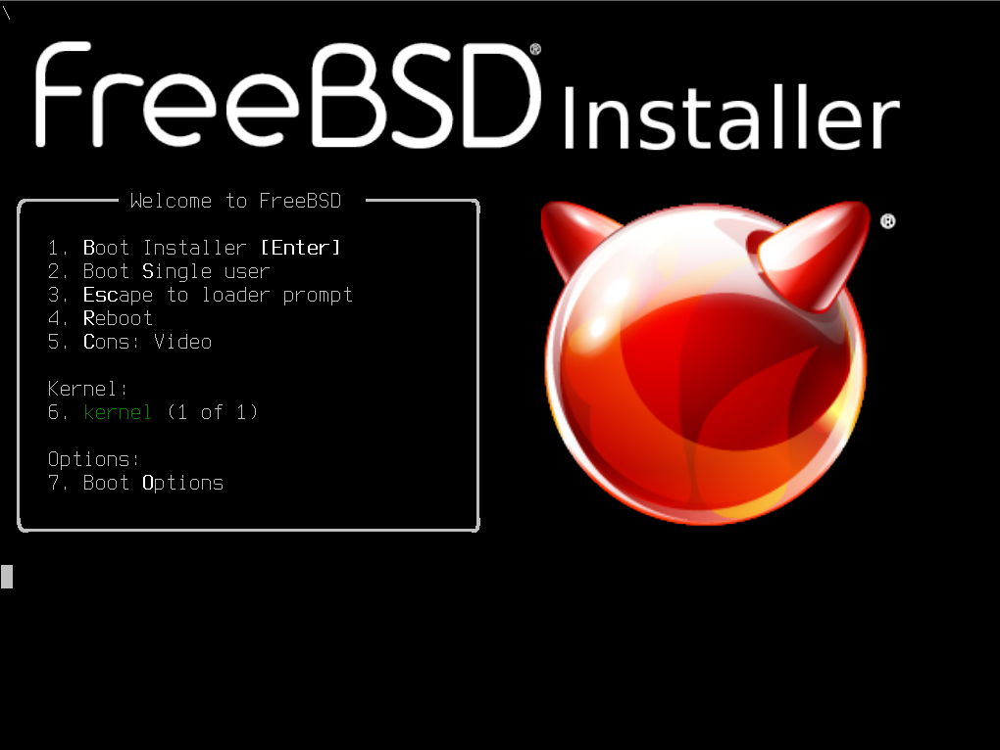

此界面无需任何操作，等待十秒，可自动进入 `1. Boot Installer [Enter]`；亦可以直接按 **回车键** 进入。

如果按下任意其他键将暂停启动流程，此时可按数字键继续，或者按 **ESC** 进入 ​**OK 提示符**​。

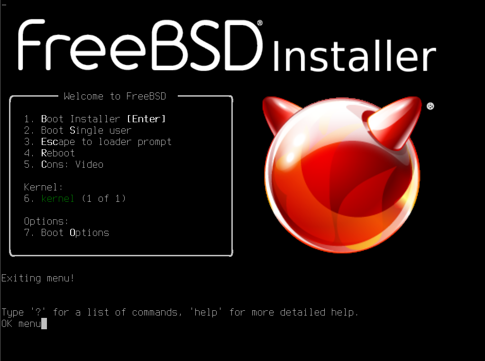

在此界面输入 `menu` 并按 **回车键** 可返回主菜单。输入 `?` 可查看所有可用命令。

操作方式：按选项开头的数字键即可选定。`on` 表示已开启，`off` 表示已关闭。

|     选项     |                                   解释                                    |
| :---------- | :----------------------------------------------------------------------- |
|`1. Boot Installer [Enter]`|用于安装系统|
| `2. Boot Single user` |  单用户模式，用于找回 root 密码或修复磁盘 |
|  `3.Escape to loader prompt`   |  退出菜单，进入加载器命令行，输入 `reboot` 并回车可重启系统
 |
| `4.Reboot`  |        重启                      |
|  `5. Cons: Video`    |    选择控制台输出模式：视频（`Video`）、串口（`Serial`）、串口优先的双模式（`Dual (Serial primary)`）或视频优先的双模式（`Dual (Video primary)`      |
|`6. kernel (1 of 1)`|选择要启动的内核|
|`7. Boot Options`|启动选项|


|**`7. Boot Options`**|默认值|说明 |
| :---------- | :-----:|:----------------------------------------------------------------------- |
|`1. Back to main menu [Backspace]`| On（开）  |按 **Backspace** 键可返回上级菜单 |
|`2. Load System Defaults`| off（关）  |恢复默认配置|
|`3. ACPI`| off（关）  | Advanced Configuration and Power Management Interface（高级配置与电源接口）|
|`4. Safe Mode`|  off（关） |安全模式|
|`5. Single user`|  off（关） |单用户模式|
|`6. Verbose`|  off（关） |啰嗦模式，增加更多调试信息输出|


>**警告**
>
>需要指出，某些教程建议用户关闭 ACPI，这种做法目前已缺乏依据。除非不是 x86 架构，否则对于现代计算机没有关闭的理由。ACPI 与电源状态管理、设备节能、多处理器支持等功能密切相关。应将该选项视为遗留功能，仅在不支持 UEFI 的旧式计算机上才需要考虑。
>
>如果出现 ACPI 报错，也是非常正常的事情。大多数情况下不会影响正常使用。一般通过更新 BIOS 即可解决。在极个别情况下可能需要修补 SSDT 和 DSDT，黑苹果的玩家对此应该并不陌生，甚至是家常便饭。

## 使用 `bsdinstall` 进行安装流程

按回车键或等待十秒后，将自动进入以下界面。


>**技巧**
>
>这个界面是由工具 `bsdinstall` 提供的。
>
>本章将指导用户如何使用该工具来进行 FreeBSD 的安装。该工具不仅存在于安装镜像中，安装完成后你在新装系统中依然可以找到它，并且还可用它来执行普通的安装流程（请记住这一点，在高级的安装方式中很有用）。
>
> `bsdinstall` 工具本质上是由一系列 sh 脚本构成的，其源代码位于 [usr.sbin/bsdinstall](https://github.com/freebsd/freebsd-src/tree/main/usr.sbin/bsdinstall)，脚本在“scripts”文件夹下。

欢迎菜单。

`欢迎使用 FreeBSD！您希望开始安装，还是使用 Live 系统？`

选中左侧的 `Install` 并按 **回车键** 开始安装；中间的 `Shell` 可进入命令行；右侧的 `Live System` 则为 LiveCD 模式。

>**技巧**
>
>若无特别说明，以下操作中可使用 **Tab 键** 或 **方向键** 切换选项，按 **回车键** 确认当前高亮选项。

>**技巧**
>
>请注意界面中选项的红色加粗首字母（例如 `Install`、`Shell`、`Live System` 中的 ​**I**​、​**S**​、​**L**​）。直接按下键盘上对应的字母键（不区分大小写）即可快速选定并进入相应界面。


>**警告**
>
>在任何步骤按下 **Esc 键** 均 **无法** 返回上一级菜单，而是会直接跳至后续步骤，直至退出或完成安装流程。


## 设定键盘布局

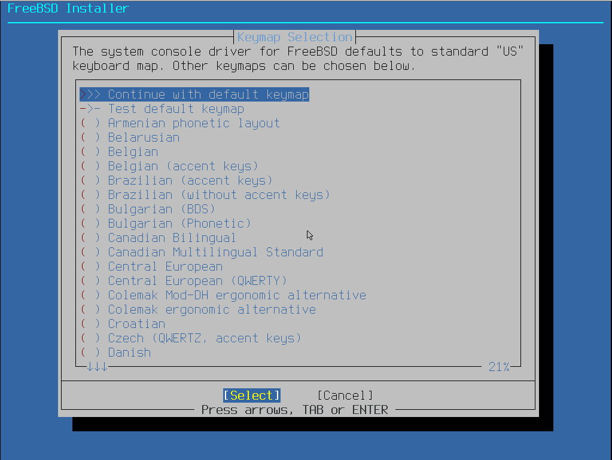

`FreeBSD 系统控制台驱动程序默认使用标准` US `（美式）键盘布局。可以在下面选择别的键盘布局。`

此为键盘布局菜单，直接按 **回车键** 使用默认的美式（US）键盘布局即可（目前中国普遍使用美式键盘布局）。

## 设定主机名


`请选择此机器的主机名。如果你正运行在受管理的网络上，请向你的网络管理员询问合适的名称。`

此步骤用于设置系统主机名。

>**警告**
>
>**请勿** 在此步骤直接按 ​**回车键**​！这将导致主机名为空，进而可能使登录管理器（如 SDDM）无法正常启动。

>**警告**
>
>官方手册中关于 `Amnesiac` 的说法有误。若不设置主机名，系统不会自动分配任何值（包括 `Amnesiac`）。因为 FreeBSD 源码默认假设将通过 DHCP 获取主机名。根据当前源码逻辑，使用 DHCP 时不会有空主机名提示；仅当无网络连接时，登录信息中才会显示 `Amnesiac` 并伴随一条错误信息。

### 参考信息

- [If the hostname is not set for the host, the value "Amnesiac" should be written to rc.conf.](https://bugs.freebsd.org/bugzilla/show_bug.cgi?id=286847)，笔者发现的 bug
- [libexec/getty/main.c](https://github.com/freebsd/freebsd-src/blob/80c12959679ab203459dc20eb9ece3a7328b7de5/libexec/getty/main.c#L178)，`Amnesiac` 源码
- [bsdinstall: Warn if hostname is empty](https://github.com/freebsd/freebsd-src/pull/1700)，笔者的 PR

## 选择安装类型

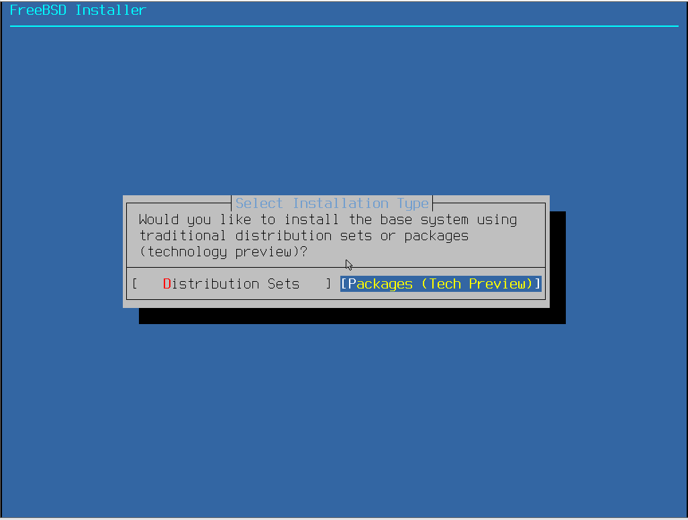

`您希望使用传统的发行组件（Distribution Sets）还是软件包（Packages，技术预览）来安装基本系统？`

### 软件包（pkgbase，技术预览）

>**警告**
>
>网络与分区配置详见下文。请在通读相关章节后再进行选择。


你想从互联网获取软件包，还是使用此安装介质内包含的有限软件包？

pkgbase 是 TrueOS 留给 FreeBSD 项目的技术遗产，旨在以软件包形式管理基本系统（内核与用户空间），将其拆分为可由 `pkg` 工具管理的独立二进制包。

此设计思路与常见 Linux 发行版较为接近。值得注意的是，pkgbase 在系统稳定性与使用便利性之间存在一定张力：

- 可能影响稳定性：基本系统被破坏的风险有所增加（此问题曾一度被开发者低估，直到社区广泛使用后反馈增多才被进一步重视）；
- 提升了易用性：降低了在 FreeBSD 不同版本分支间切换的成本，开发者能更便捷地在 stable、current 等分支间更新，普通用户也无需经历 freebsd-update 工具较长的等待时间。

#### 在线安装（Network）

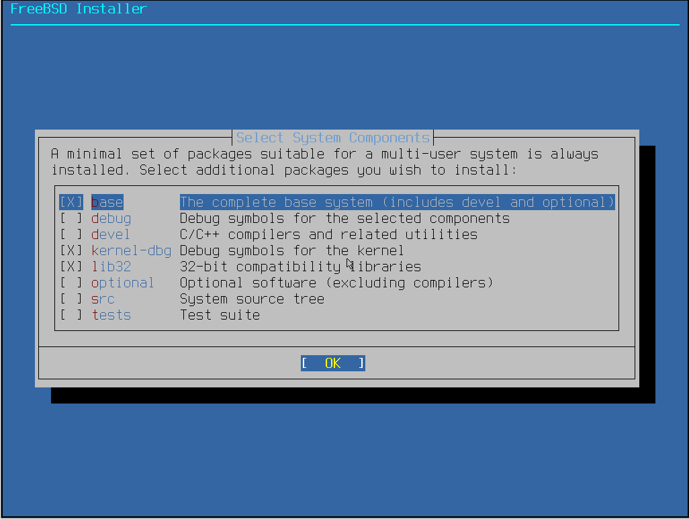

`适用于多用户系统的最小软件包集将被默认安装。请选择您希望额外安装的软件包。`

| 组件             | 说明                           |
| :-------------- | :---------------------------- |
| `[X] base`       | 完整的基本系统（包含 devel 和 optional） |
| `[ ] debug`      | 所选组件的调试符号                    |
|`[ ] devel`      | C/C++ 编译器及相关工具               |
| `[X] kernel-dbg` | 内核调试符号                 |
| `[X] lib32`      | 32 位兼容库                   |
| `[ ] optional`   | 可选软件（不含编译器）                  |
| `[ ] src`        | 系统源码树                  |
| `[ ] tests`      | 测试套件                         |


#### 离线安装【Offline（Limited Packages）】


`适用于多用户系统的最小软件包集始终会被安装。请选择你想安装的其他软件包。`


| 组件             | 说明                           |
| :-------------- | :---------------------------- |
| `[X] base`       | 完整的基本系统（包含 devel 和 optional） |
| `[ ] debug`      | 所选组件的调试符号                    |
|`[ ] devel`      | C/C++ 编译器及相关工具               |
| `[X] kernel-dbg` | 内核调试符号                 |
| `[X] lib32`      | 32 位兼容库                   |
| `[ ] optional`   | 可选软件（不含编译器）                  |
| `[ ] src`        | 系统源码树                  |
| `[ ] tests`      | 测试套件                         |


经过测试，即使全部选中，也可以实现完全离线安装。

### 发行组件（Distribution Sets）

此为传统的安装方式。

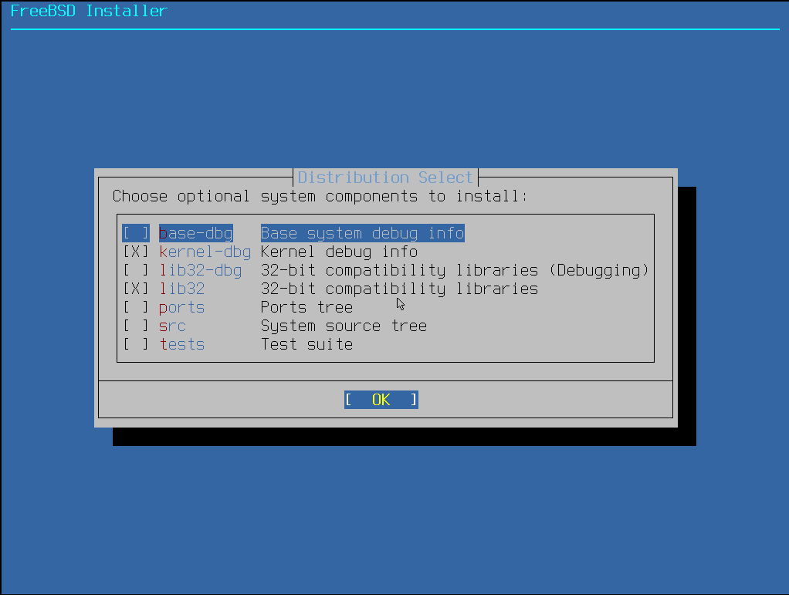

`选择要安装的可选系统组件`

>**技巧**
>
>若无特别说明，以下操作中按 **空格键** 可选中或取消选中条目（`[ ]` 变为 `[ * ]`）。
>
>推荐在默认选项基础上，**额外** 选中 `src`。因为部分显卡驱动（如 `drm`）及其他程序需要源码，且经测试 `lib32` 组件在系统安装后单独安装可能无效。

>**警告**
>
>**请勿** 选择 `kernel-dbg`、`lib32`、`src` 之外的组件，这些组件需要从网络下载安装，速度可能很慢。如有需要可在系统安装完成后另行安装。
>
> 若在安装过程中出现选择镜像站的提示，通常是因为您选择了需要联网下载的额外组件，请避免此操作。


|    选项    |                                 解释                                  |
| :-------- | :------------------------------------------------------------------- |
|  `base-dbg`  |                基本系统的调试符号文件            |
| `kernel-dbg` |                       内核调试符号文件                 |
| `lib32-dbg`  | 32 位兼容库的调试符号文件 |
|   `lib32`    |        用于在 64 位系统上运行 32 位应用程序的兼容库     |
|   `ports`    |        FreeBSD Ports 集合                     |
|    `src`     |                           系统源代码树                        |
|   `tests`    |           操作系统测试套件                         |

## 分配磁盘空间

FreeBSD 15.0-RELEASE 支持选择 UFS 或 ZFS 作为根文件系统。旧版本中，`bsdinstall` 工具仅支持 UFS；[自 10.0 版本起](http://svn.freebsd.org/viewvc/base?view=revision&revision=256361)，`bsdinstall` 开始支持 ZFS。通过手动安装方式，则早在 [8.0 版本](https://blog.delphij.net/posts/2008/11/zfs-1/)即可将 ZFS 用作根分区。

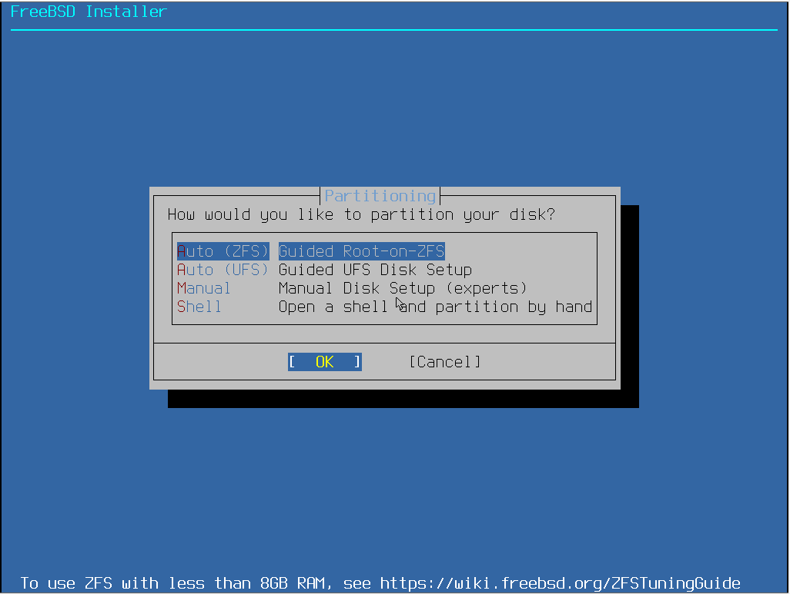

分区菜单。`您希望如何对磁盘进行分区？`

|配置选项 | 中文说明|
|---|---|
|`Auto (ZFS) – Guided Root-on-ZFS`|自动 (ZFS) – 引导式 ZFS root 分区|
|`Auto (UFS) – Guided UFS Disk Setup`|自动 (UFS) – 引导式 UFS 磁盘设置|
|`Manual – Manual Disk Setup (experts)`|手动 – 手动磁盘设置（适合专家）|
|`Shell – Open a shell and partition by hand`|Shell – 打开 Shell 并手动分区|

文件系统详情请参阅其他章节（可手动分区解压 `txz` 文件以自定义）。此处推荐选择默认的 `Auto (ZFS)` 选项。通常建议内存不小于 8GB 时选用 ZFS，小于 8GB 时选用 UFS，以获得更佳性能。


手动分区及通过 Shell 分区的详细方法，请参见本书手动安装 FreeBSD 的相关章节。


### Auto (ZFS)（使用 ZFS 作为 `/` 文件系统）

>**技巧**
>
>经测试，在 UEFI 环境下，256MB 内存亦可运行 ZFS；若使用传统 BIOS，128MB 内存即可。

> **注意**
>
>若手动分区时反复提示分区表“损坏”（`corrupted`）等错误，请先退出安装程序，重启后进入 Shell 模式，尝试刷新分区表：
>
> ```sh
> # gpart recover ada0
> ```
>
> 请根据您的实际硬盘设备确定 `ada0` 参数（如可能是 `da0`、`nvme0` 等）。
>
>若不明确当前硬盘设备名，可参考图示命令进行查看。
>
>
>
>
> 刷新后，执行 `bsdinstall` 命令可重新进入安装程序界面。
>
> 此问题可能与分区表调整有关（参见 [FreeBSD 手册](https://handbook.bsdcn.org/di-18-zhang-cun-chu/18.3.-tiao-zheng-he-zeng-jia-ci-pan-da-xiao.html)），疑似一个程序缺陷。


`正在探测设备，请稍候（此过程可能需要一些时间）……`

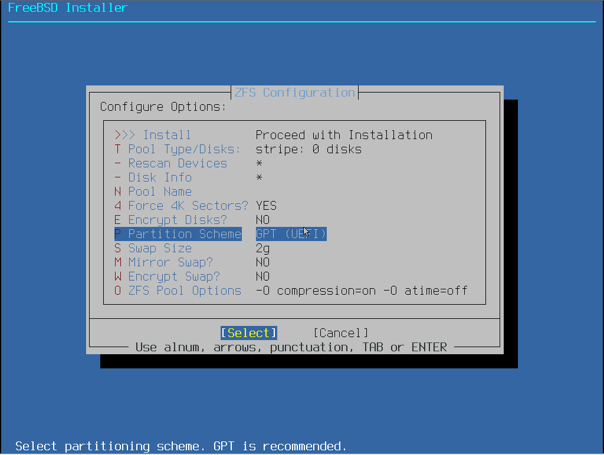

近十年的计算机通常应选择 `GPT (UEFI)`。请勿使用默认选项，否则会创建一个 512KB 的 `freebsd-boot` 分区（对于纯 UEFI 启动并非必需）。

较老的计算机（如 2013 年以前）才应考虑选择 `GPT (BIOS)` 选项，该默认选项同时兼容 BIOS 和 UEFI。

|配置选项 | 中文 | 说明|
|---|---|---|
|`>> Install Proceed with Installation`| >> 安装 继续安装||
|`T Pool Type/Disks: stripe: 0 disks` |存储池类型/磁盘：条带化：0 块磁盘 | 详细说明见下|
|`- Rescan Devices *` |- 重新扫描设备 *||
|`- Disk Info *` |- 磁盘信息 *||
|`N Pool Name zroot` |存储池名称 `zroot`|默认池名 `zroot`|
|`4 Force 4K Sectors? YES` |强制 4K 扇区？是|4K 对齐|
|`E Encrypt Disks? NO` |加密磁盘？否 | 加密后的登录系统方案请参照本书其他文章|
|`P Partition Scheme` |GPT (UEFI) 分区方案 GPT (UEFI)|只有老电脑才需要 `GPT (BIOS+UEFI)` 等选项|
|`S Swap Size 2g` |交换分区大小 2g|若确实不需要交换分区，可在 `Swap Size` 处输入 `0` 或 `0G` 以跳过创建|
|`M Mirror Swap? NO`| 交换分区镜像？否 | 是否在多个磁盘之间镜像交换分区，若选否，则每个磁盘的交换分区是独立的|
|`W Encrypt Swap? NO` |加密交换分区？否 |  |


>**技巧**
>
>如果在此处设置 `P Partition Scheme` 为 `GPT (UEFI)` 而非其他，后续分区与系统更新过程会更加简单。

>**注意**
>
>请慎重设置交换分区（`Swap Size`）的大小。通常建议为物理内存的 1-2 倍，但考虑到设计限制，不建议超过 64GB。因为 ZFS 和 UFS 文件系统创建后不易缩小，而使用 `dd` 创建交换文件或后续调整可能带来性能开销或复杂度。

>**技巧**
>
>若无法确定后续应选择哪块磁盘，可在此步骤选择 `- Disk Info *` 查看各磁盘的详细信息：
>
>
>
>在此界面中，选中磁盘并按 **回车键** 可查看详情；选中 `<Back>` 可返回上一菜单。
>
>
>
>此界面按 **上下方向键** 可浏览。按 **回车键** 可返回到上一菜单。


`选择虚拟设备类型：`

|配置选项 | 中文 | 特点|
|---|---|---|
|`Stripe` |条带化，即 `RAID 0` |无冗余，一块硬盘即可|
|`mirror` |镜像，即 `RAID 1` | n 路镜像，最少需要 2 块硬盘|
|`raid10` |RAID 1+0 | n 组 2 路镜像，最少需要 4 块硬盘（要求偶数块硬盘）|
|`raidz1`| RAID-Z1 | 单冗余 RAID，最少需要 3 块硬盘|
|`raidz2` |RAID-Z2 | 双冗余 RAID，最少需要 4 块硬盘|
|`raidz3` |RAID-Z3 | 三重冗余 RAID，最少需要 5 块硬盘|

直接按 **回车键** 使用默认的 `Stripe` 类型即可。


选中目标硬盘，按 **回车键** 确认选择。

>**技巧**
>
>若要将系统安装到 U 盘或移动硬盘但未被识别，请尝试重新插拔该设备，然后选择上方的 `- Rescan Devices *` 重新扫描设备列表。

>**注意**
>
>若硬盘为 eMMC 类型，可能会出现 `mmcsd0`、`mmcsd0boot0`、`mmcboot1` 等选项，请选择 `mmcsd0`。此外，在多硬盘与 eMMC 共存的情况下，若另一块硬盘的分区数量超过 5 个，安装在 eMMC 中的 FreeBSD 可能会在启动时卡在 `Mounting from zfs:zroot/ROOT/default failed with error 22: retrying for 3 more seconds` 提示处。若手动指定参数，则可能导致内核恐慌（Panic）。这疑似一个程序缺陷，但暂无更详细的报告信息。


`最后确认！您确定要销毁以下磁盘上的所有现有数据吗：`

这是最终的警告与确认。请确保已备份重要数据，所选磁盘将被完全格式化。使用 **方向键** 或 **Tab 键** 将焦点切换至 `<YES>`，按 **回车键** 确认。

>**警告**
>
>此操作将执行全盘安装，目标磁盘上的所有数据都将丢失！如需非全盘安装（如双系统），请参考本书其他相关章节。

#### 附录：ZFS 加密根分区的挂载与解密

若在安装时对 ZFS 根分区启用了加密，后续如何挂载该磁盘？

以 NVMe 硬盘为例，启用 ZFS 加密（同时加密交换空间）后的磁盘结构如下：

|     分区类型      | 挂载点 |             设备              |
| :---------------| :---- | :---------------------------|
| freebsd-boot /EFI |        |          /dev/nda0p1          |
|    freebsd-zfs    |   /    | /dev/nda0p2、/dev/nda0p2.eli |
|   freebsd-swap    |        | /dev/nda0p3、/dev/nda0p3.eli  |

EFI 系统分区并无特殊变化，与正常安装相同。系统启动时将提示输入密码以解密并挂载根分区。
若需要在 LiveCD 环境中挂载该加密分区，操作亦较为简单（不需要密钥）。（假设根分区为 `/dev/nda0p2`），执行以下命令：
```sh
# geli attach /dev/nda0p2
```

输入正确的加密密码后，即可通过 `# zfs mount zroot/ROOT/default` 命令挂载根文件系统。

### Auto (UFS)（使用 UFS 作为 `/` 文件系统）


`您希望如何对磁盘进行分区？`

>**技巧**
>
>若选择 `Partition`（分区），选项同下文。


`您希望使用整个磁盘，还是对磁盘进行分区以与其他操作系统共存？使用整个磁盘将清除该磁盘上的所有现有数据。`


`为该卷选择分区方案`

|英文 | 中文 | 注释|
|---|---|---|
|`APM Apple Partition Map`| Apple 分区表 | Apple `PowerPC` 用（2006 以前）|
|`BSD BSD Labels`|BSD 磁盘标签 | 仅 BSD 可识别|
|`GPT GUID Partition Table`|GPT 全局唯一标识分区表 | 现代计算机使用（2013+）|
|`MBR DOS Partitions`|MBR 主引导记录分区表 | 老式计算机使用（XP、Win7 年代）|


`请审查当前的磁盘分区设置。确认无误后，可选择 “Finish”（完成）`

|英文 | 中文|
|---|---|
|`Create`|创建|
|`Delete`|删除|
|`Modify`|调整|
|`Revert`|还原|
|`Auto`|自动|
|`Finish`|完成|


`您的更改尚未写入磁盘。若您选择了覆盖现有数据，这些数据将被永久删除。确定要提交更改吗？`

|英文 | 中文|
|---|---|
|`Commit`|提交|
|`Revert & Exit`|还原并退出|
|`Back`|返回|


正在初始化磁盘——此界面通常一闪而过。

---
若之前选择了 pkgbase 安装方式：

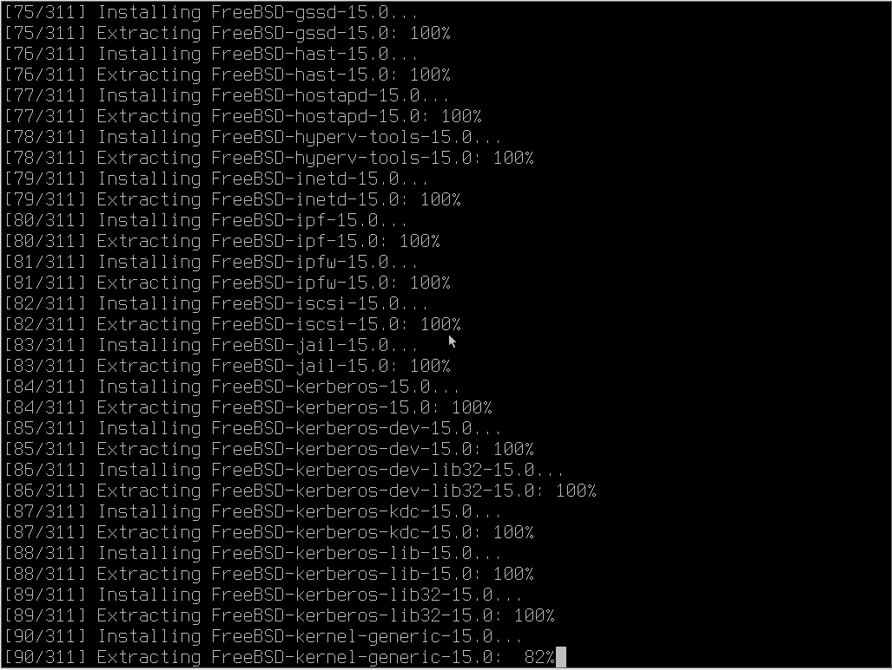

正在校验相关分发文件：


正在解压并安装相关分发文件：


## 设置 root 密码


`请为系统管理员账户（root）设置密码：输入的字符将不可见。正在修改待安装系统的 root 密码。`

>**技巧**
>
>在此界面，需使用 **上下方向键** 或 **Tab 键** 在不同密码输入框间移动焦点。输入完成后按 **回车键** 确认。

此处输入 root 密码，密码会在屏幕上显示为常见的 `*`。

要求重复输入两次以确认一致性，若两次输入的密码不同则提示 `The passwords do not match`（密码不匹配）。

root 密码强度无强制要求，但不可为空。若密码为空，将提示 `The password cannot be empty`，必须输入有效密码才能继续。

## 网络设置

### 以太网卡

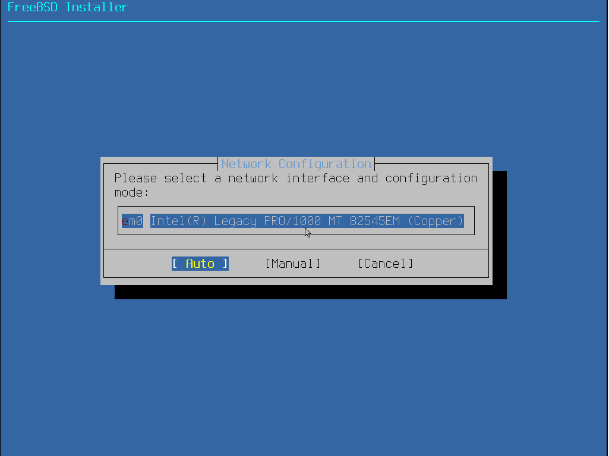

`请选择要配置的网络接口及其配置模式`

- `Auto`：自动
- `Manual`：手动
- `Cancel`：取消

此处选择要配置的网卡。使用 **方向键** 切换选项，按 **回车键** 确认选择。

#### 自动（`Auto`）


`正在发送路由器请求`，系统将自动检测并配置网络环境。

#### 手动（`Manual`）


`你希望为此接口配置 IPv4 吗？`

是否配置 IPv4。按 **回车键** 确认选择。


`你希望使用 DHCP 配置此接口吗？`

是否使用 DHCP 自动配置。按 **回车键** 确认选择。


`你希望为此接口配置 IPv6 吗？`

是否配置 IPv6。本教程不涉及 IPv6，因此选择 `No` 并按 ​**回车键**​。如有需要可自行配置。


`配置解析器`

通常可保留 DHCP 分配的 DNS 设置，也可手动指定。图中示例使用了阿里公共 DNS `223.5.5.5`。使用 **方向键** 切换选项，按 **回车键** 确认。

### 无线网卡/ WiFi 设置

>**警告**
>
>由于 [Missing CN regulatory domain and 11ac/DFS support in regdomain.xml](https://bugs.freebsd.org/bugzilla/show_bug.cgi?id=289202)，此部分功能目前存在问题，建议跳过。

>**注意**
>
>建议跳过此步骤的无线网络配置，待系统安装完成后重启，再参考本书无线网络章节进行设置（尤其对于博通等网卡）。否则安装程序可能长时间无响应或引发内核恐慌（Panic）。


`请选择要配置的无线网络接口`

>**警告**
>
>由于 [Bug 287538 - Installer error on setting regdomain](https://bugs.freebsd.org/bugzilla/show_bug.cgi?id=287538)，目前选择任何无线电区域，都会报错如下：
>
>```sh
>Error while applying chosen settings  
>(unknown regdomain Expected  eval: Use: not found)
>```


`更改无线管制区域/国家（当前为 FCC/US）？`

修改无线管制域，按回车键确认。


`请选择您的区域码`

此处应选择 `NONE ROW`。


`请选择您所在的地区`

选择对应的地区：


`请等待 5 秒，正在扫描可用的无线网络……`

扫描。

>**技巧**
>
>只要网卡能被识别，即表明其驱动可用。但安装程序可能无法正确扫描到所有 WiFi 网络。建议此处留空跳过，待系统安装完成后重启，再参考本书无线网络章节进行配置。

在列表中找到您的 WiFi 网络。若未找到，可尝试更改无线路由器的信道后重试。


`请选择要连接的无线网络`

输入 WiFi 密码以连接：


`你想要为此接口配置 IPv4 吗？`

配置 IPv4。按 **回车键** 可选定。


`你希望使用 DHCP 配置此接口吗？`

配置使用 DHCP。按 **回车键** 可选定。


`你希望为此接口配置 IPv6 吗？`

配置 IPv6。因本教程未使用 IPv6，故选 `No`，按 **回车键** 可选定。如有需要可自行配置 IPv6。


`配置解析器`

通常可保留 DHCP 分配的 DNS 设置，也可手动指定。图中示例使用了阿里公共 DNS `223.5.5.5`。使用 **方向键** 切换选项，按 **回车键** 确认。

### 参考文献

- [Regulatory Domain Support](https://wiki.freebsd.org/WiFi/RegulatoryDomainSupport)
- [main/lib/lib80211/regdomain.xml](https://github.com/freebsd/freebsd-src/blob/main/lib/lib80211/regdomain.xml)，regdomain.xml 在源代码的位置
- [regdomain.xml --	802.11 wireless	regulatory definitions](https://man.freebsd.org/cgi/man.cgi?query=regdomain&sektion=5)，对应编码请参考系统中的 `/etc/regdomain.xml` 文件
- [阿里公共 DNS](https://www.alidns.com/)


## 时区设置


`请选择您所在的地区`

设置系统时区。中国属于 `5 Asia`（亚洲）。使用 **方向键** 选择，按 **回车键** 确认。


`设置国家或区域`

选择 `9 China`（中国）。使用 **方向键** 选择，按 **回车键** 确认。


中国统一使用东八区时间（北京时间），请选择 `1 Beijing Time`。使用 **方向键** 选择，按 **回车键** 确认。


`时区缩写 'CST' 是否合适？`

CST 为中国标准时间（China Standard Time）的缩写，确认无误后按 **回车键** 选择 `Yes`。


`设置时间与日期`

直接按 **回车键** 使用默认设置即可。


`时间与日期`

按 **回车键** 即可。

## 启动服务设置


`请选择您希望系统启动时自动运行的服务`

>**警告**
>
>**请勿全选！**
>
>**不要** 选择 `local_unbound`，否则可能影响系统 DNS 解析（参见 [Bug  262290 - After a normal FreeBSD installation and reboot, /etc/resolv.conf will be changed](https://bugs.freebsd.org/bugzilla/show_bug.cgi?id=262290)）。除非您明确了解其用途。


|     选项      |                                                                                  解释                                                                                   |
| :-----------: | :------------------------ |
|     `sshd`      |          启用 SSH 远程访问服务                                                    |
|     `ntpd`      |            启用 NTP 网络时间协议守护进程，用于自动时钟同步         |
|`ntpd_sync_on_start`|  系统启动时立即同步时间  |
| `local_unbound` | 	启用本地 Unbound DNS 缓存转发解析器。注意：启用后需手动配置 DNS，否则可能无法正常联网。不建议不了解的用户开启 |
|    `powerd`     |      	启用电源管理守护进程，动态调整 CPU 频率以节约能耗                                                                               |
|    `moused`     |                    在文本控制台（tty）中启用鼠标支持                                                        |
|    `dumpdev`    |                                                    启用内核崩溃转储功能，便于系统调试                                                        |

## 安全加固


`请选择系统安全加固方案`

此处为系统安全加固选项，可根据实际需求选择启用。

|选项 | 解释|
| :-----------: | :------------------------ |
|`0 hide_uids`|隐藏其他用户拥有的进程|
|`1 hide_gids`|隐藏其他组拥有的进程|
|`2 hide_jail`|隐藏 jail 内的进程|
|`3 read_msgbuf`|禁止非特权用户读取内核消息缓冲区（通常通过 `dmesg` 命令访问）|
|`4 proc_debug`|禁用非特权用户的进程调试功能|
|`5 random_pid`|启用进程 PID 随机化|
|`6 clear_tmp`|系统启动时自动清理 `/tmp` 目录|
|`7 disable_syslogd`|禁用 syslogd 的网络套接字（即禁用远程日志接收）|
|`8 secure_console`|启用控制台安全保护（单用户模式也需 root 密码）|
|`9 disable_ddtrace`|禁用 DTrace 的破坏性（destructive）操作模式|


## 安装固件


自动检测并安装所需的硬件固件（该功能自 14.2 版本[引入](https://cgit.freebsd.org/src/commit/?id=03c07bdc8b31)）。

（此图为虚拟机安装界面截图）


**（此图为使用采集卡获得的物理机安装界面截图）**


>**警告**
>
>建议在此步骤取消所有勾选，即不安装任何固件（在线安装可能因网络问题失败或耗时过长）。如需安装固件，可在系统安装完成后使用 `fwget` 命令另行获取。
>
>
>
>**此图片来自物理机安装界面（使用采集卡）**

## 创建普通用户


`你现在希望向已安装的系统添加用户吗？`

如需创建，请按 **回车键** 选择 `Yes`；如果不需要创建普通用户（仅使用 root，~~是 root 敢死队~~），请使用 **方向键** 选择 `No`。


>**技巧**
>
>绝大多数图形登录管理器默认禁止 root 用户直接登录。因此，若不进行额外配置（参见其他章节），默认情况下可能无法使用 root 账户登录桌面环境。~~虽然在默认状态下 FreeBSD 不带桌面，或者还可以直接 `startx`~~。

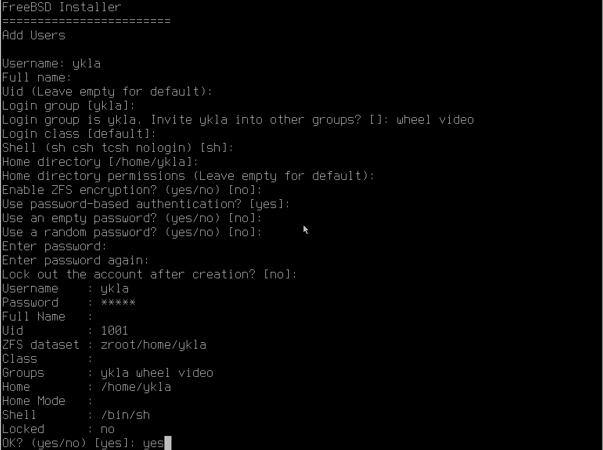


>**警告**
>
>若创建普通用户，请务必将其同时加入 `wheel` 组（用于 `su` 提权）和 `video` 组（用于图形加速）。仅加入 `wheel` 组可能无法正常调用 GPU。


```sh
FreeBSD Installer # FreeBSD 安装程序
========================
Add Users # 添加用户

Username: ykla # 输入用户名。只能使用小写字母（不支持非拉丁字符）或数字，不能以连字符开头。最大长度 16 个字符（历史原因）。
Full name: # 输入用户全名 ①。可留空。不能包含英文冒号 `:`。
Uid (Leave empty for default):  # 用户 UID，留空则使用默认值。手动设置需小于 32000。
Login group [ykla]: # 用户主组
Login group is ykla. Invite ykla into other groups? []: wheel video # 邀请用户加入其他组，输入“wheel video”（用空格分隔）
Login class [default]: # 用户分级
Shell (sh csh tcsh nologin) [sh]: # 用户默认 shell，默认是 sh
Home directory [/home/ykla]: # 用户家目录路径，普通用户默认在 /home 下面
Home directory permissions (Leave empty for default): # 用户家目录权限，留空使用默认值
Enable ZFS encryption? (yes/no) [no]: # 是否启用 ZFS 加密
Use password-based authentication? [yes]:  # 是否启用用户密码验证
Use an empty password? (yes/no) [no]:  # 是否使用空密码，即密码为空
Use a random password? (yes/no) [no]:  # 是否使用随机密码。若设置 yes 将生成随机字符串用作密码。该密码会回显到标准输出。②
Enter password:  # 输入密码，密码不显示在屏幕上，也不会是 ****，就是什么也没有
Enter password again:  # 重复输入密码，密码不显示在屏幕上，也不会是 ****，就是什么也没有
Lock out the account after creation? [no]: #  创建后是否立即锁定账户（禁用该账户）
Username    : ykla # 设定的用户名
Password    : ***** # 设定的用户密码
Full Name   : # 设定的用户全名
Uid         : 1001 # 设定的用户 UID
ZFS dataset : zroot/home/ykla # 家目录对应的 ZFS 数据集（15.0 新增）
Class       :  # 设定的用户分级
Groups      : ykla wheel video # 所属的用户组
Home        : /home/ykla # 设定的用户主（家）目录路径
Home Mode   :  # 设定的用户主（家）目录权限
Shell       : /bin/sh # 设定的用户默认的 shell
Locked      : no # 是否锁定（禁用）用户
OK? (yes/no) [yes]: #  确认上述设置是否正确
adduser: INFO: Successfully added (ykla) to the user database. # 用户 ykla 已成功添加至数据库
Add another user? (yes/no) [no]: # 是否继续添加其他用户
```

- ① 如果用户全名为空（即不设置），系统会分配一个默认值 `User &`。这是早期 Unix 系统 GECOS 字段的遗留行为。相关代码位于 [freebsd-src/usr.sbin/pw/pw_user.c](https://github.com/freebsd/freebsd-src/blob/main/usr.sbin/pw/pw_user.c) 的 `static struct passwd fakeuser` 结构中。

- ② 若选择使用随机密码，在最终确认信息前会显示一行：`adduser: INFO: Password for (ykla) is: D1MnujkWMv/m`，其中 `D1MnujkWMv/m` 即为生成的随机密码。

其余参数通常可保持默认。自 FreeBSD 14 起，所有新用户的默认 Shell 已统一为 `/bin/sh`。

最后会询问 `Add another user? (yes/no) [no]`，按 **回车键** 可结束用户添加流程；

若输入 `yes` 并按 ​**回车键**​，则可继续添加第二个用户。

### 参考文献

- [man adduser(8)](https://man.freebsd.org/cgi/man.cgi?adduser(8))


## 完成安装


`您的 FreeBSD 系统设置即将完成。现在可以返回修改先前的配置选项。在此菜单之后，您还可以进入 Shell 进行更复杂的调整。`

按 **回车键** 选择 `Finish` 以完成安装。


| 配置选项 | 功能描述 |
|:---------|:----------|
| `Finish` | 应用所有配置并退出安装程序 |
| `Add User` | 添加系统用户 |
| `Root Password` | 重新设置 root 密码 |
| `Hostname` | 修改系统主机名 |
| `Network` | 	重新配置网络 |
| `Services` | 调整系统启动时运行的服务 |
| `System Hardening` | 修改安全加固方案 |
| `Time Zone` | 重新设置时区 |
| `Firmware` | 安装固件（需要网络） |
| `Handbook` | 安装 FreeBSD 手册（需要网络） |


`安装现已完成。在退出安装程序前，您是否希望在新系统中打开 Shell 以进行最终的手动调整？`

按 **回车键** 选择 `No` 以直接完成安装（或选择 `Yes` 进入 Shell）。


`FreeBSD 安装完成！您现在是否希望重启并进入新安装的系统？`

按 **回车键** 确认重启。

## 欢迎来到 FreeBSD 世界

安装完成后重启，进入 FreeBSD 新系统：

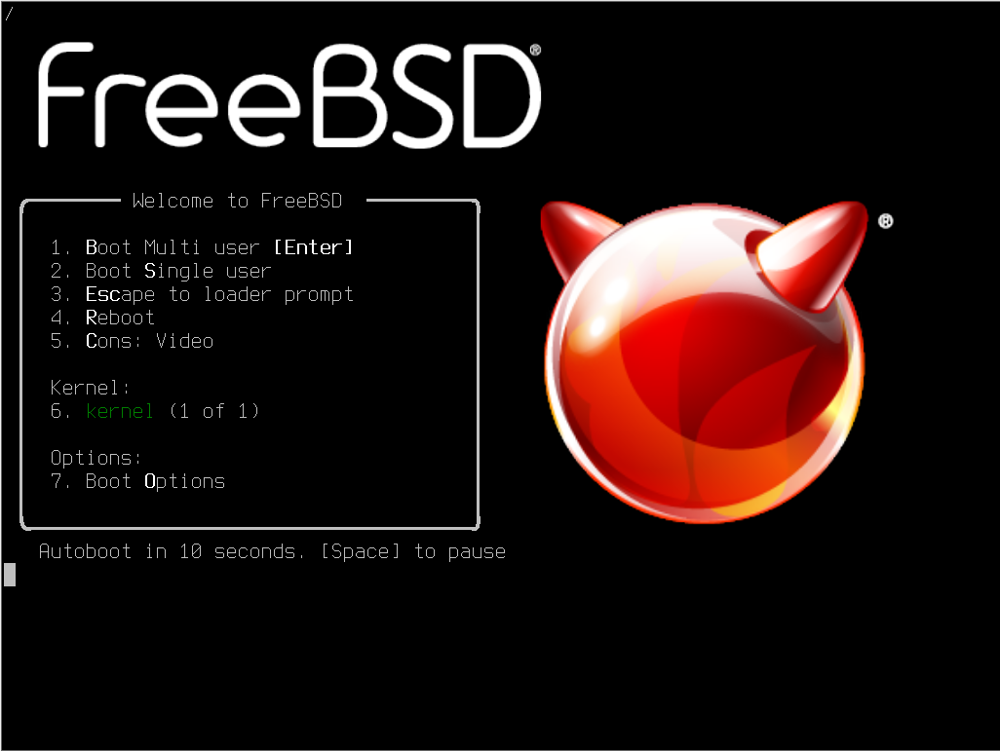

系统完全启动后：

>**技巧**
>
>FreeBSD 基本系统默认不包含图形界面（未安装 Xorg），因此启动后将进入文本控制台界面。

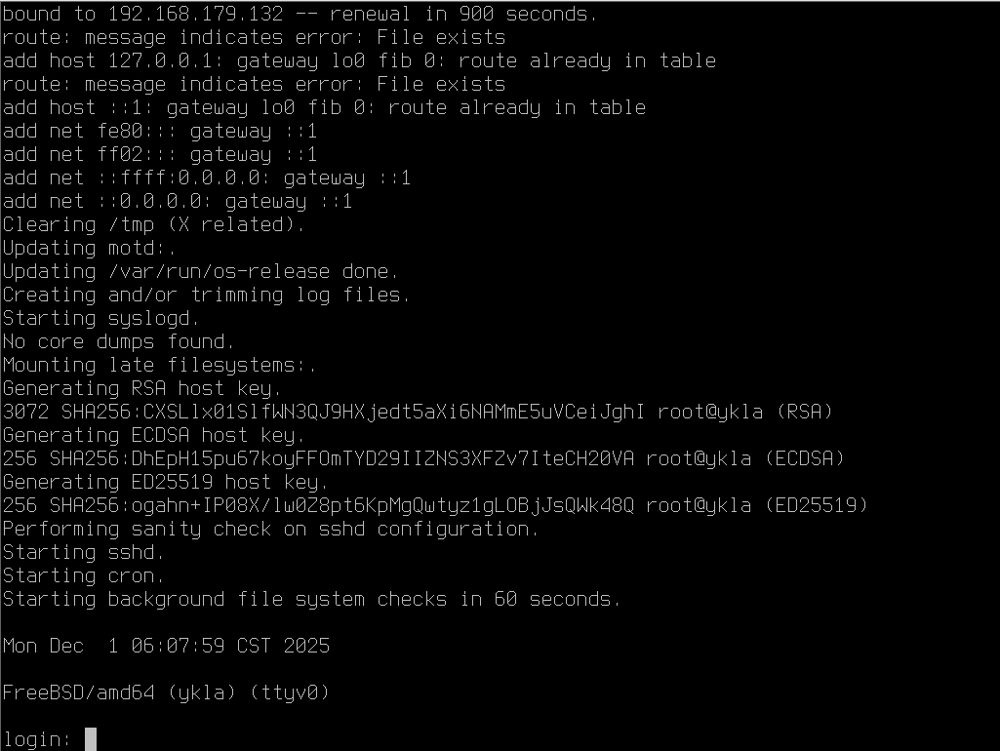

输入用户名 `root` 及安装时设置的 root 密码以登录系统。

>**技巧**
>
>密码是不会显示在屏幕上的（包括 `*` 号），就是什么也没有，输入完毕后直接按回车键即可。


