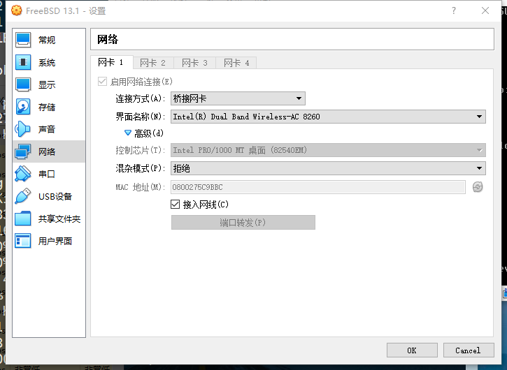
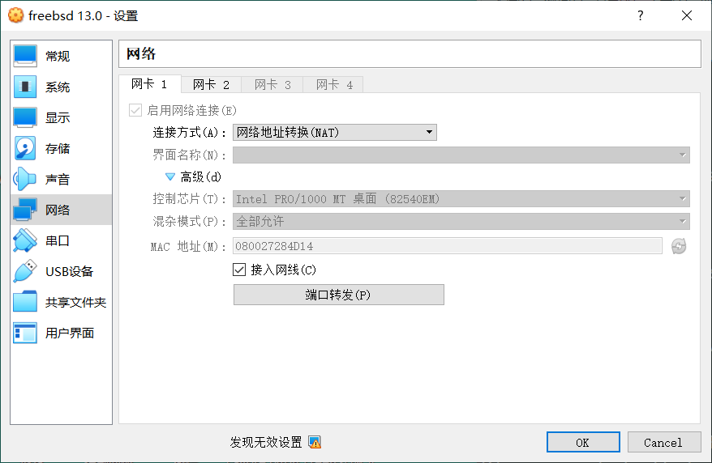
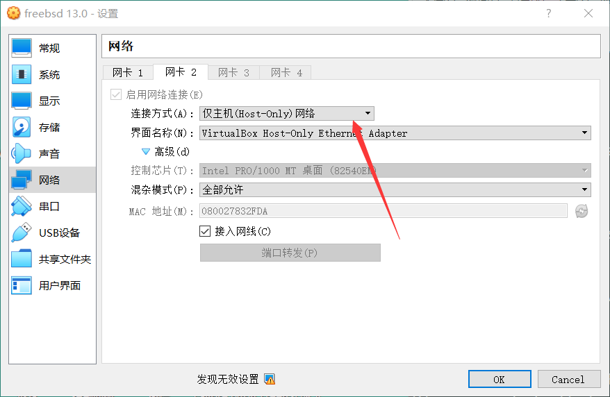

# 第 2.2 节 安装 FreeBSD——基于 Virtual Box

> **UEFI 下显卡也可以正常驱动。——2023.1.14 测试**
>
> ```shell-session
> # efibootmgr # 无需安装，自带
> Boot to FW : false
> BootCurrent: 0004
> Timeout    : 0 seconds
> BootOrder  : 0004, 0000, 0001, 0002, 0003
> +Boot0004* FreeBSD
> Boot0000* UiApp
> Boot0001* UEFI VBOX CD-ROM VB2-01700376
> Boot0002* UEFI VBOX HARDDISK VB7aff22ad-deb533d3
> Boot0003* EFI Internal Shell
> ```

## FreeBSD 镜像下载

> **警告**
>
> iso 镜像不适用于物理机，物理机请使用 img 镜像。


>**提示**
>
>虚拟机不推荐使用 FreeBSD 官方构建的[虚拟机镜像](https://download.freebsd.org/releases/VM-IMAGES/13.2-RELEASE/amd64/Latest/)，因为需要手动扩容，而且文件系统不能自由选择，默认是 UFS。
>
>虚拟机一般使用 `FreeBSD-13.2-RELEASE-amd64-disc1.iso` 等类似文件名和后缀的镜像，但是，`FreeBSD-13.2-RELEASE-amd64-memstick.img` 也并非只能用于 U 盘刻录，虚拟机也是可以用的，使用方法参考第 31.2 节。

RELEASE 正式版 镜像下载地址：[https://download.freebsd.org/ftp/releases/amd64/amd64/ISO-IMAGES/13.1/FreeBSD-13.1-RELEASE-amd64-disc1.iso](https://download.freebsd.org/ftp/releases/amd64/amd64/ISO-IMAGES/13.0/FreeBSD-13.0-RELEASE-amd64-disc1.iso)

CURRENT 测试版（仅限专业用户，对于该版本来说，无法启动，环境变量错误都是正常的事情！） 镜像下载地址: [https://download.freebsd.org/snapshots/amd64/amd64/ISO-IMAGES/14.0/](https://download.freebsd.org/snapshots/amd64/amd64/ISO-IMAGES/14.0/)

FreeBSD 旧版本下载地址: [http://ftp-archive.freebsd.org/pub/FreeBSD-Archive/old-releases/amd64/ISO-IMAGES/](http://ftp-archive.freebsd.org/pub/FreeBSD-Archive/old-releases/amd64/ISO-IMAGES/)


## 下载 VirtualBox

进入网页点击 `download` 即可下载：

[https://www.virtualbox.org](https://www.virtualbox.org)

## 安装设置

安装完成后请手动关机，卸载或删除安装光盘，否则还会进入安装界面。

## 网络设置

### 方法 ① 桥接

桥接是最简单的互通主机与虚拟机的方法，并且可以获取一个和宿主机在同一个 IP 段的 IP 地址，如主机是 192.168.31.123，则虚拟机的地址为 192.168.31.x。



设置后 `# dhclient em0` 即可（为了长期生效可在 `/etc/rc.conf` 中加入 `ifconfig_em0="DHCP"`）。

如果没有网络（互联网）请设置 DNS 为 `223.5.5.5`。如果不会，请看本章其他章节。

### 方法 ② NAT

网络设置比较复杂，有时桥接不一定可以生效。为了达到使用宿主机（如 Windows10 ）控制虚拟机里的 FreeBSD 系统的目的，需要设置两块网卡——一块是 NAT 网络模式的网卡用来上网、另一块是仅主机模式的网卡用来互通宿主机。如图所示：





使用命令 `# ifconfig` 看一下，如果第二块网卡 `em1` 没有获取到 ip 地址,请手动 DHCP 获取一下: `# dhclient em1` 即可（为了长期生效可在 `/etc/rc.conf` 中加入 `ifconfig_em1="DHCP"`）。

如果没有网络（互联网）请设置 DNS 为 `223.5.5.5`。如果不会，请看本章其他章节。

## 显卡驱动与增强工具

```shell-session
# pkg install virtualbox-ose-additions
```

xorg 可以自动识别驱动，**不需要** 手动配置 `/usr/local/etc/X11/xorg.conf`（经过测试手动配置反而更卡，点一下要用 5 秒钟……）。

显卡控制器用 `VBoxSVGA` 即可。

启动服务：

```shell-session
# sysrc vboxguest_enable="YES"
# sysrc vboxservice_enable="YES"
```

启动服务，调整权限（以普通用户 ykla 为例）：

```shell-session
# service vboxguest restart # 可能会提示找不到模块，但是不影响使用
# service vboxservice restart
# pw groupmod wheel -m ykla # sudo 权限
```

## 故障排除

### EFI 下无法正常关机

添加

```shell-session
hw.efi.poweroff=0
```

到 `/etc/sysctl.conf`，然后再重启，再关机就正常了。

参考文献：

- [12.0-U8.1 -> 13.0-U2 poweroff problem & solution](https://www.truenas.com/community/threads/12-0-u8-1-13-0-u2-poweroff-problem-solution.104813/)
- [EFI: VirtualBox computer non-stop after successful shutdown of FreeBSD](https://forums.freebsd.org/threads/efi-virtualbox-computer-non-stop-after-successful-shutdown-of-freebsd.84856/)

### 鼠标进去了出不来

请先按一下右边的 `ctrl`（正常键盘左右各有一个 `ctrl`，为默认设置）；如果自动缩放屏幕需要还原或者找不到菜单栏了请按 `home`+ 右 `ctrl`（提示：`Home` 键在 108 键盘上位于 `Scroll Lock` 的下边。）

### UEFI 固件设置

开机反复按 `Esc` 即可进入 VB 虚拟机的 UEFI 固件设置。

