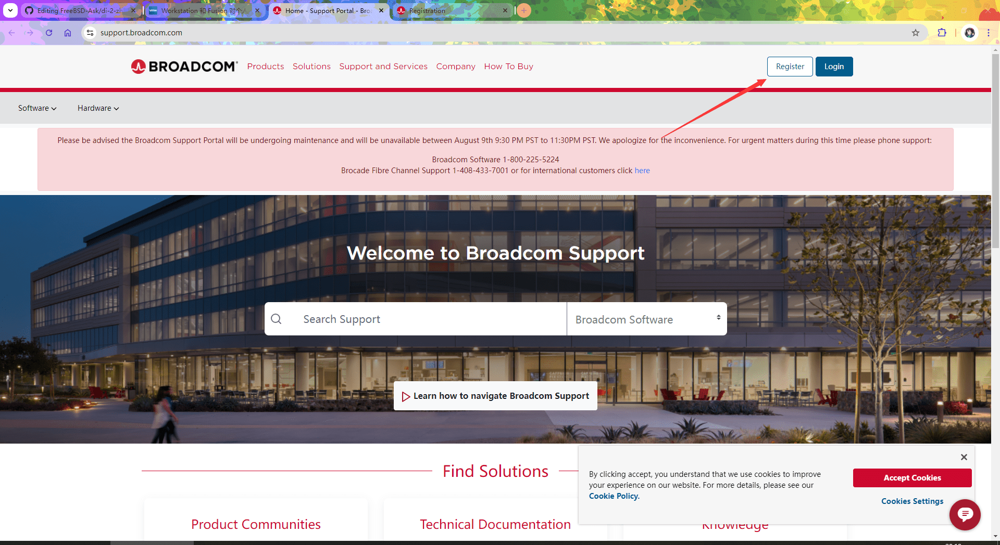
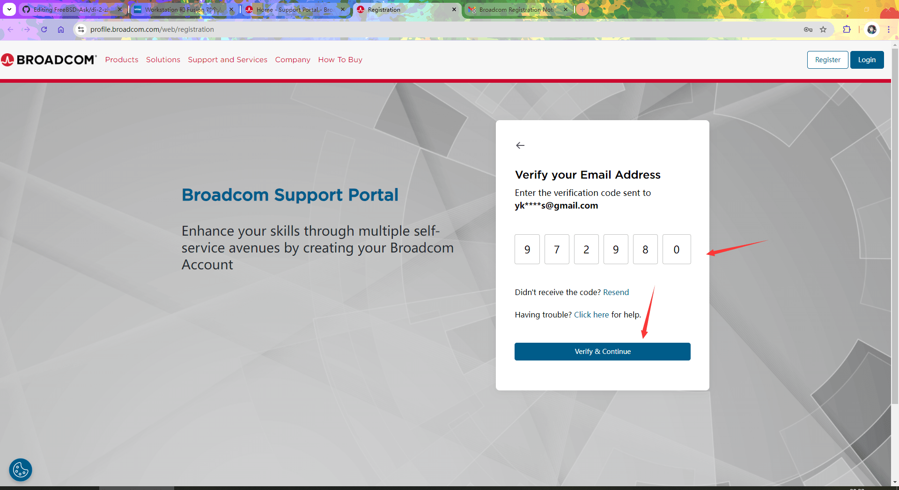
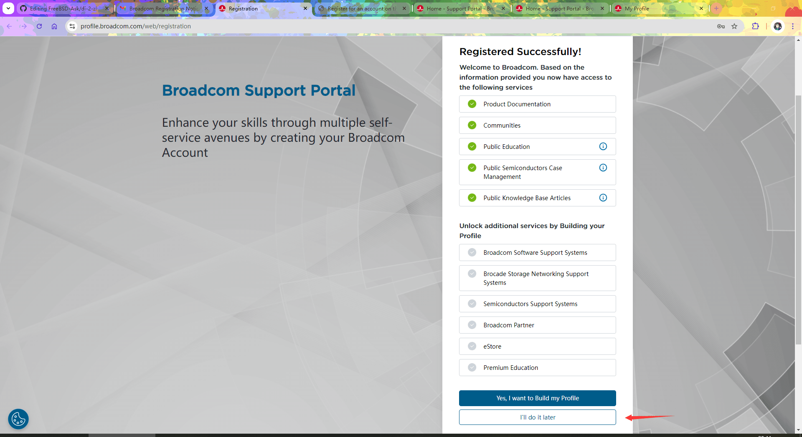
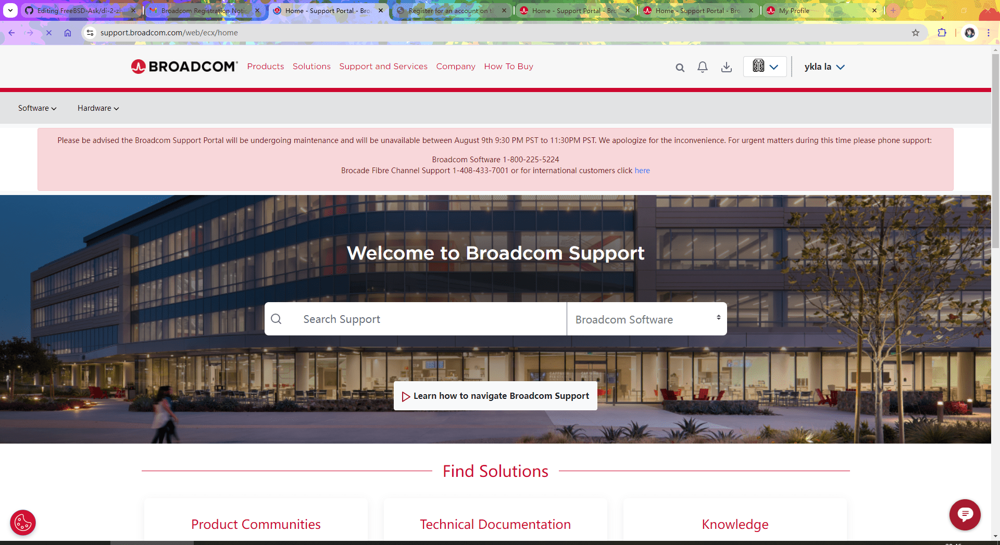

# 第 2.4 节 安装 FreeBSD——基于 Vmware Workstation Pro

> **BIOS 还是 UEFI**
>
> 经过测试，FreeBSD 也可以支持驱动 UEFI 下 VMware 的显卡。——2023.1.13
>
> 默认情况下 VMware 是 BIOS，会提示没有：
>
> ```sh
> # efibootmgr # 默认自带、无需安装。
> efibootmgr: efi variables not supported on this system. root? kldload efirt?
> ```
>
> 如果当前系统是 UEFI，efibootmgr 则输出：
>
> ```sh
> # efibootmgr # 默认自带、无需安装。
> Boot to FW : false
> BootCurrent: 0004
> BootOrder  : 0004, 0000, 0001, 0002, 0003
> +Boot0004* FreeBSD
> Boot0000* EFI VMware Virtual SCSI Hard Drive (0.0)
> Boot0001* EFI VMware Virtual IDE CDROM Drive (IDE 1:0)
> Boot0002* EFI Network
> Boot0003* EFI Internal Shell (Unsupported option)
> ```

> **警告**
>
> **注意：由于 [Bug 250580 - VMware UEFI guests crash in virtual hardware after r366691](https://bugs.freebsd.org/bugzilla/show_bug.cgi?id=250580)，FreeBSD 11/12 可能在 VMare 的 UEFI 环境下无法启动。经测试 13.0 正常启动。**

## 视频教程

[FreeBSD 13.1 安装 KDE5——基于 VMware 17](https://www.bilibili.com/video/BV1UR4y1U71T)

视频教程环境 VMware 17 + FreeBSD 13.1-RELEASE + BIOS +KDE 5。

## 镜像下载

> **警告**
>
> iso 镜像并不适用于物理机，物理机请使用 img 镜像。**除非你有光盘，否则不要下 ISO；也不要没事找事用 Ventoy，下载个 img 刻录并不费事。如果安装中出现任何问题，请回过头来看看这里这句话。**

>**提示**
>
>虚拟机不推荐使用 FreeBSD 官方构建的[虚拟机镜像](https://download.freebsd.org/releases/VM-IMAGES/14.1-RELEASE/amd64/Latest/)，因为需要手动扩容，而且文件系统不能自由选择，默认是 UFS。
>
>虚拟机一般使用 `FreeBSD-13.2-RELEASE-amd64-disc1.iso` 等类似文件名和后缀的镜像，但是，`FreeBSD-14.1-RELEASE-amd64-memstick.img` 也并非只能用于 U 盘刻录，虚拟机也是可以用的，使用方法参考第 31.2 节。

RELEASE 正式版 镜像下载地址：[https://download.freebsd.org/ftp/releases/amd64/amd64/ISO-IMAGES/14.1/FreeBSD-14.1-RELEASE-amd64-disc1.iso](https://download.freebsd.org/ftp/releases/amd64/amd64/ISO-IMAGES/14.1/FreeBSD-14.1-RELEASE-amd64-disc1.iso)

CURRENT 测试版（仅限专业用户，对于该版本来说，无法启动，环境变量错误都是正常的事情！） 镜像下载地址: [https://download.freebsd.org/snapshots/amd64/amd64/ISO-IMAGES/15.0/](https://download.freebsd.org/snapshots/amd64/amd64/ISO-IMAGES/14.1/)

FreeBSD 旧版本下载地址: [http://ftp-archive.freebsd.org/pub/FreeBSD-Archive/old-releases/amd64/ISO-IMAGES/](http://ftp-archive.freebsd.org/pub/FreeBSD-Archive/old-releases/amd64/ISO-IMAGES/)


## 博通（broadcom）账号

### 博通（broadcom）账号注册

VMware 已被博通收购。**故目前下载任何博通产品均须先注册、登录博通账号。** 目前任何非此域名（`broadcom.com`）教程均无效。

>**博通（broadcom）账号的注册流程**
>
>- 打开 <https://support.broadcom.com/>
>
> 
>
>- 点击右上角的“Register”（注册）（或者直接打开 <https://profile.broadcom.com/web/registration>）
>>
>>在页面“Email Address”（电子邮件）处输入你的电子邮箱。如果没有的话，可以用你的 QQ 号，然后直接加上一个`@qq.com`——比如你的 QQ 号是 `1212111111`，那么你的 QQ 邮箱则为 `1212111111@qq.com`
>>
>>在页面“Enter text from image”（输入图片上的文本）处输入图片上的文本信息（实际上是验证码）。如果看不清或者不认识，可以点 `Enter text from image` 右侧的🔁
>>点击“Next”（继续）
>>
>>如果你使用的是 QQ号生成的邮箱，请打开 <https://wx.mail.qq.com/>。其他邮箱请在各自网站打开，如果不知道，请使用 QQ 邮箱。
>
>
>
>- 把第五步得到的“Verification Code: 972980”，中的 972980（你的和我不一样，找你自己的）填到“Enter text from image” 里面。
>
>
>
>- 点击“Verify & Continue”（确认并继续）
>
>
>
>- 完成注册
>
>
>
>- 结束注册流程
>  
>


### 博通（broadcom）账号登录

>**博通（broadcom）账号登录流程**
>
>- 打开 <https://support.broadcom.com/>
>>
>>点击右上角的“Login”（登录）（或者直接打开 <https://support.broadcom.com/c/portal/login>）
>
>
>
>- Username（用户名）就是你注册时候的邮箱。然后点“Next”（下一步）
>
>
>
>- 点击下一步
>
>
>
>- 点击登录
>
>
>
>- 登录完成
>
>

## 博通（broadcom）产品下载

### VMware Workstation Pro 下载（推荐）

>**VMware Workstation Pro 下载流程**
>
>- 点击右上角对应图标（名字左侧第一个），选择“VMware Cloud Foundation”（VMware 云计算基础架构）
>  
>
>
>- 点击右侧的“My Downloads”（我的下载）
>
>
>
>- 往下翻，点击“VMware Workstation Pro“
>
>
>
>- 点击“Release”（发行版），选择最顶部的那个，你看到的不一定和我一样。
>
>
>
>**或者跳过上述步骤，直接打开 <https://support.broadcom.com/group/ecx/productdownloads?subfamily=VMware+Workstation+Pro>**
>
>
>
>- 把红色的 `*`项目填写完成，不会写的自己编，最好不要抄我的。
>  
>
>
>- 勾选“I agree to Terms and Conditions”（我同意条款及条件）左侧的方框 ⬜，让他变成 🟦。
>  
>
>
>- 点击右侧箭头的云朵图片 ☁️ 即可下载
>  
>


VMware Workstation Pro 目前对于个人用户来说是 **免费下载、免费使用、免费授权的。** **请勿从任何第三方站点下载。** 否则会造成一些未知的后果——90% 的问题都是由此产生的。


### 博通开源/社区产品

博通所有开源/社区产品都被整合到了这里进行下载。

如：Community Network Driver for ESXi、ESXi Arm Edition 等。

访问地址：<https://community.broadcom.com/flings/home>。目前任何非此域名教程（`community.broadcom.com`）均无效。

## VMware Workstation Player（已弃用，不要用）

VMware Workstation Player 目前已弃用。且功能相对 VMware Workstation Pro 非常有缺失。不建议使用，非要下载，请点击 <https://support.broadcom.com/group/ecx/productdownloads?subfamily=VMware%20Workstation%20Player>。目前所有包含该软件的教程均为旧教程。

### 参考文献

- 中文：[Workstation 和 Fusion 对个人使用完全免费，企业许可转向订阅](https://blogs.vmware.com/china/2024/05/16/workstation-%E5%92%8C-fusion-%E5%AF%B9%E4%B8%AA%E4%BA%BA%E4%BD%BF%E7%94%A8%E5%AE%8C%E5%85%A8%E5%85%8D%E8%B4%B9%EF%BC%8C%E4%BC%81%E4%B8%9A%E8%AE%B8%E5%8F%AF%E8%BD%AC%E5%90%91%E8%AE%A2%E9%98%85/)

## 网络设置

请使用 NAT 模式，如果不能与宿主机（物理机）互通，请打开 VMware 编辑-虚拟网络管理器，“还原默认设置”，直至出现类似下图的配置：


以上请不要手动设置，如果虚拟机内部一直提示 `no link`，请重启物理机，再打开虚拟机：VMware 编辑-虚拟网络管理器，“还原默认设置”，直至出现上述配置。（请不要尝试手动配置，那是无效的）

如果没有网络请设置 DNS 为`223.5.5.5`。请看本章其余章节。

## 显卡驱动以及虚拟机增强工具

### 显卡驱动

VMware 自动缩放屏幕请安装显卡驱动和虚拟机增强工具，即：

```sh
# pkg install xf86-video-vmware open-vm-tools xf86-input-vmmouse
```

或者

```
# cd /usr/ports/x11-drivers/xf86-video-vmware/ 
# make install clean
# cd /usr/ports/emulators/open-vm-tools/
# make install clean
# cd /usr/ports/x11-drivers/xf86-input-vmmouse/
# make install clean
```

安装完毕后无需任何多余配置即可实现屏幕自动缩放。

> 对于显卡来说，请勿做多余配置，比如去修改创建 `xorg.conf`，这会造成虚拟机卡死等问题。

> wayland 下也需要安装该驱动。即使 wayland 暂不可用。

> 如果屏幕显示不正常（过大），请尝试：编辑虚拟机设置——>硬件、设备——>显示器——>监视器、指定监视器设置——>任意监视器的最大分辨率，设置为主机的分辨率或者略低于主机分辨率均可。


### 鼠标集成（主机虚拟机鼠标自由切换）

```sh
# pkg install xf86-video-vmware xf86-input-vmmouse open-vm-tools
# sysrc moused_enable=YES
# Xorg -configure
# mv /root/xorg.conf.new /usr/local/share/X11/xorg.conf.d/xorg.conf
```

编辑 `/usr/local/share/X11/xorg.conf.d/xorg.conf` 修改以下段落为（其他部分不需要动，保留原样即可）：

```sh
…………此处省略一部分…………

Section "ServerLayout"
        Identifier     "X.org Configured"
        Screen          0  "Screen0" 0 0
        InputDevice    "Mouse0" "CorePointer"
        InputDevice    "Keyboard0" "CoreKeyboard"
        Option          "AutoAddDevices" "Off"  # 添加此行到此处
EndSection

…………此处省略一部分…………

Section "InputDevice"
      Identifier  "Mouse0"
      Driver      "vmmouse"  # 修改 mouse 为 vmmouse
      Option      "Protocol" "auto"
      Option      "Device" "/dev/sysmouse"
      Option      "ZAxisMapping" "4 5 6 7"
EndSection

…………此处省略一部分…………
```


### 虚拟机增强工具

如果有桌面

```sh
# pkg install open-vm-tools xf86-input-vmmouse
```

如果没有桌面：

```sh
# pkg install open-vm-tools-nox11
```

或者 

```
# cd /usr/ports/emulators/open-vm-tools/
# make install clean
```

具体配置

编辑 `/boot/loader.conf`

写入

```sh
fusefs_load="YES"
```

### 共享文件夹

请先安装虚拟机增强工具。

```sh
# vmhgfs-fuse .host:/selfsharefold /mnt/hgfs
```

查看共享文件夹

```sh
# ls /mnt/hgfs
```

> **提示**
>
> 在使用 Windows 远程桌面或者其他 XRDP 工具远程另一台 Windows 桌面，并使用其上面运行的 Vmware 虚拟机操作 FreeBSD 时，鼠标通常会变得难以控制。

