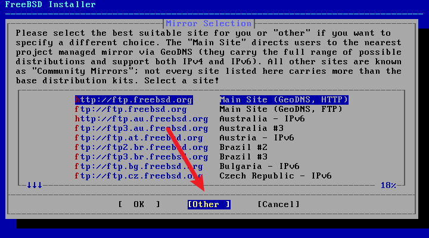
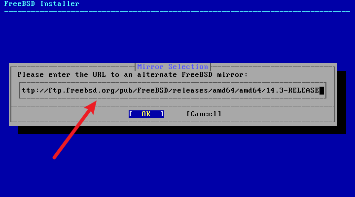
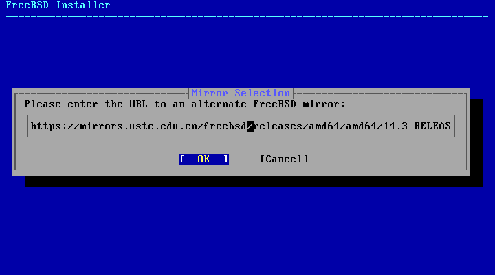
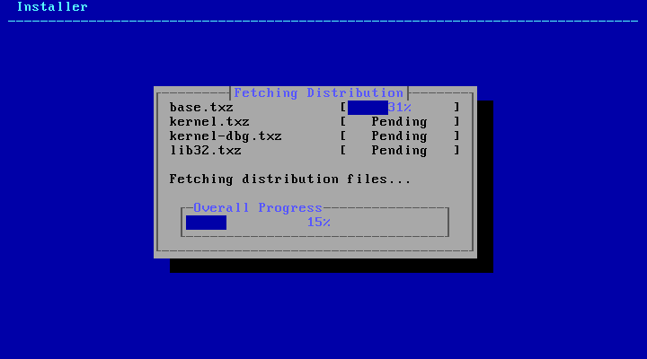

# 2.5 分配磁盘空间

FreeBSD 14.2 RELEASE 的 `/` 分区支持 UFS 和 ZFS 两种文件系统。旧版 FreeBSD 系统 root 分区仅支持 UFS 一种文件系统：`bsdinstall` 从 10.0 [开始](http://svn.freebsd.org/viewvc/base?view=revision&revision=256361)支持 zfs，手动安装的话至迟 8.0 就[可以](https://blog.delphij.net/posts/2008/11/zfs-1/)用 zfs 作为根分区了。


分区菜单。`你希望如何分区你的磁盘？`

|配置选项 | 中文说明|
|---|---|
|`Auto (ZFS) – Guided Root-on-ZFS`|自动 (ZFS) – 引导式 ZFS root 分区|
|`Auto (UFS) – Guided UFS Disk Setup`|自动 (UFS) – 引导式 UFS 磁盘设置|
|`Manual – Manual Disk Setup (experts)`|手动 – 手动磁盘设置（适合专家）|
|`Shell – Open a shell and partition by hand`|Shell – 打开 Shell 并手动分区|

文件系统详解见其他章节（可手动分区解压 `txz` 文件以自定义，参见其他章节）。这里，推荐选择默认选项 `auto ZFS`：一般来说，内存小于 8GB 的应该选择 UFS，内存 8G 及以上的应该选用 ZFS。


手动分区和 Shell 分区参见手动安装 FreeBSD 相关章节。


## Auto (ZFS)（使用 ZFS 作为 `/` 文件系统）

>**技巧**
>
>经过测试，实际上 256M 内存也能用 ZFS（UEFI）；若使用旧的 BIOS，128M 内存足矣。

> **注意**
>
>如果使用手动分区一直提示分区表损坏（`corrupted`）或类似字样，请先退出重启，进入 shell 模式，刷新分区表：
>
> ```sh
> # gpart recover ada0
> ```
>
> 你在手动安装的时候可以判断是哪块硬盘，以确定 `ada0` 这个参数是多少。
>
>如果不确定自己的硬盘是哪块（比如分不清是 `da0` 还是 `nv0` 之类的）：可使用图片中的命令查看。
>
>
>
>
> 刷新后，输入 `bsdinstall` 即可进入安装模式。
>
> 原因详情见 [FreeBSD 手册](https://handbook.bsdcn.org/di-18-zhang-cun-chu/18.3.-tiao-zheng-he-zeng-jia-ci-pan-da-xiao.html)，但是我认为这是一个 bug。


`正在探测设备，请稍候（这可能需要一些时间）……`


现代计算机应该选择 `GPT+UEFI`。较老的计算机（比如 2013 年以前的）应该选择选项 `GPT(BIOS)`——此默认选项同时兼容二者。


|配置选项 | 中文 | 说明|
|---|---|---|
|`>> Install Proceed with Installation`| >> 安装 继续安装||
|`T Pool Type/Disks: stripe: 0 disks` |存储池类型/磁盘：条带化：0 块磁盘 | 详细说明见下|
|`- Rescan Devices *` |- 重新扫描设备 *||
|`- Disk Info *` |- 磁盘信息 *||
|`N Pool Name zroot` |存储池名称 `zroot`|默认池名 `zroot`|
|`4 Force 4K Sectors? YES` |强制 4K 扇区？是|4K 对齐|
|`E Encrypt Disks? NO` |加密磁盘？否 | 加密后的登录系统方案请参照本书其他文章|
|`P Partition Scheme` |GPT (UEFI) 分区方案 GPT (UEFI)|只有老电脑才需要 `GPT (BIOS+UEFI)` 等选项|
|`S Swap Size 2g` |交换分区大小 2g|如果你的确不需要 Swap，`Swap Size` 输入 `0` 或 `0G` 即可不设置交换分区。|
|`M Mirror Swap? NO`| 交换分区镜像？否 | 是否在多个磁盘之间镜像交换分区，若选否，则每个磁盘的交换分区是独立的|
|`W Encrypt Swap? NO` |加密交换分区？否 |  |


>**技巧**
>
>如果在此处设置 `P Partition Scheme` 为 `GPT (UEFI)` 而非其他，后续分区与系统更新过程会更加简单。

>**注意**
>
>最好想清楚再设置 `Swap Size`（即交换分区）的大小（一般理论是内存的两倍，但由于设计问题，不应超过 64G），因为 zfs、ufs 文件系统都是不能缩小文件系统的，而 `dd` 一个 swap 文件或文件系统会有负面作用。

>**技巧**
>
>如果分不清应该后续选择哪块磁盘，可以在此步选择 `- Disk Info *`，查看磁盘信息：
>
>
>
>此界面，选中磁盘按 **回车键** 可查看详情；选中 `<Back>` 可返回上一菜单。
>
>
>
>此界面按 **上下方向键** 可浏览。按 **回车键** 可返回到上一菜单。


`选择虚拟设备类型：`

|配置选项 | 中文 | 特点|
|---|---|---|
|`Stripe` |条带化，即 `RAID 0` |无冗余，一块硬盘即可|
|`mirror` |镜像，即 `RAID 1` | n 路镜像，最少需要 2 块硬盘|
|`raid10` |RAID 1+0 | n 组 2 路镜像，最少需要 4 块硬盘（要求偶数块硬盘）|
|`raidz1`| RAID-Z1 | 单冗余 RAID，最少需要 3 块硬盘|
|`raidz2` |RAID-Z2 | 双冗余 RAID，最少需要 4 块硬盘|
|`raidz3` |RAID-Z3 | 三重冗余 RAID，最少需要 5 块硬盘|

我们直接按 **回车键** 使用默认的 `Stripe` 即可。


选中你的硬盘，直接按 **回车键** 即可。

>**技巧**
>
>如果你要把系统安装到 U 盘或移动硬盘，但系统并未识别出来，请重新插拔一下存储设备。然后按上面的 `- Rescan Devices *`，重新扫描下设备，应该就可以了。

>**注意**
>
>如果你的硬盘是 eMMC，可能会出现三个选项，类似于 `mmcsd0`、`mmcsd0boot0` 和 `mmcboot1`。请选择 `mmcsd0`。另外如果多硬盘与 eMMC 共存，若另一块硬盘分区量大于 5 个，eMMC 中的 FreeBSD 会卡在 `Mounting from zfs:zroot/ROOT/default failed with error 22: retrying for 3 more seconds`。且若手动指定，会直接 Panic。疑似 Bug，但我不知道如何报告，无法获取进一步的细节。


`最后机会！你确定要销毁以下磁盘的当下内容吗：`

这是最后一次警告与确认。你的确已经备份完成，指定磁盘全盘都会被格式化。按 **方向键** 和 **Tab 键** 可左右切换到 `<YES>`，按 **回车键** 可选定之。

>**警告**
>
>这是全盘安装，会丢失所有数据！非全盘安装请参考本书其他文章。

### ZFS 加密分区后如何解密

如果在安装 FreeBSD 的时候选择了 ZFS 磁盘加密，那么如何挂载该磁盘呢？

NVMe 硬盘 ZFS 加密后的磁盘结构：

|     分区类型      | 挂载点 |             设备              |
| :---------------: | :----: | :---------------------------: |
| freebsd-boot /EFI |        |          /dev/nda0p1          |
|    freebsd-zfs    |   /    | /dev/nda0p2/、/dev/nda0p2.eli |
|   freebsd-swap    |        | /dev/nda0p3、/dev/nda0p3.eli  |


很简单，也不需要密钥。执行命令

```sh
# geli attach /dev/nda0p3
```

然后输入正确的密码即可通过命令 `# zfs mount zroot/ROOT/default` 导入磁盘。

## Auto (UFS)（使用 UFS 作为 `/` 文件系统）


`你想如何对你的磁盘进行分区？`

>**技巧**
>
>若选择 `Partition`（分区），选项同下文。


`你是想使用整个磁盘还是将其分区以与其他操作系统共享？使用整个磁盘将擦除当前存储在那里的所有目录。`


`为该卷选择分区方案`

|英文 | 中文 | 注释|
|---|---|---|
|`APM Apple Partition Map`|苹果分区表 | 苹果 `PowerPC` 用（2006 以前）|
|`BSD BSD Labels`|BSD 磁盘标签 | 仅 BSD 可识别|
|`GPT GUID Partition Table`|GPT 全局唯一标识分区表 | 现代计算机使用（2013+）|
|`MBR DOS Partitions`|MBR 主引导记录分区表 | 老式计算机使用（XP、Win7 年代）|


`请审查磁盘设置。若无问题，可点击 “Finish”（完成）按钮`

|英文 | 中文|
|---|---|
|`Create`|创建|
|`Delete`|删除|
|`Modify`|调整|
|`Revert`|还原|
|`Auto`|自动|
|`Finish`|完成|


`你的更改不会被保存到磁盘。如果你选择了覆盖现有数据。它将被删除。你确定要提交你的更改吗？`

|英文 | 中文|
|---|---|
|`Commit`|提交|
|`Revert & Exit`|还原并退出|
|`Back`|返回|


初始化磁盘——此界面一闪而过

---

解压相关软件包并安装。


## 附加：`bootonly` 和 `PXE` 安装时，让下载更快的方法。

如果你和我一样，需要在工控机等场景通过实体刻录光盘(因为容量有限，不得不使用 `bootonly` 镜像)或者使用 PXE 网络启动形式安装 FreeBSD 的话，则需要配置 Pub 镜像。

1. 在 `mirror-selection` 处选择 `other`



2. 在 `enter URL` 处，修改原来的镜像至 USTC 的 Pub 镜像。





3. 点击OK，开始Fetch


