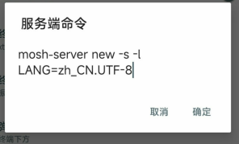
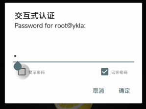
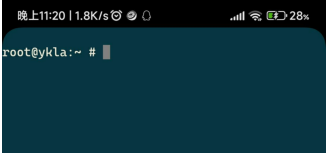

# 第 2.7 节 SSH 相关软件推荐与 SSH 配置

## WinSCP 下载

WinSCP 是对 `scp` 命令的图形化封装的软件，并同时支持 FTP 等多种协议。可以快捷的传输文件与 Windows 系统和 Linux 或 BSD 之间。

下载地址：

[https://winscp.net/eng/download.php](https://winscp.net/eng/download.php)


自 OpenSSH 9.0 起，scp 命令默认使用 `SFTP` 协议进行文件传输。WinSCP 默认即是 `SFTP`。

但是，这个版本号和远程被控的操作系统相关。

FreeBSD 查看内置的 OpenSSH 版本：

```sh
root@ykla:~ # ssh -V
OpenSSH_9.7p1, OpenSSL 3.0.14 4 Jun 2024
```

上面的输出，OpenSSH 的主要版本号为 9.7。

- 如果你的输出大于等于 9.0，**你可无视下图**，什么也不用改。`SFTP`、`SCP` 都能用，且 WinSCP 默认即是 `SFTP`；
>根据 [FreeBSD 官方信息](https://www.freebsd.org/status/report-2022-10-2022-12/openssh/)，FreeBSD 13.2-RELEASE 及以后的操作系统应该都不需要此项变更。
- 如果你的输出小于 9.0，请按下图执行操作，将 `SFTP` 改成 `SCP`；
>
>请按下图设置协议为 `scp`，然后其他的和 ssh 信息一模一样。因为 scp 是 ssh 的子项目实现。
>
>

## SSH 工具

 
### Xshell 

Xshell 是 Windows 平台上的强大的 shell 工具。支持 **串口**、SSH、Telnet！

Xshell 下载地址（输入用户名和邮件即可）：

[https://www.netsarang.com/zh/free-for-home-school](https://www.netsarang.com/zh/free-for-home-school)

如果提示需要重新验证，请打开上面的网站重装一遍，即可。


### MobaXterm


MobaXterm 目前不支持中文，下载地址 <https://mobaxterm.mobatek.net/download-home-edition.html>，左右任选。

在选择鼠标后，行为和 Xshell 一致。

MobaXterm 是一款集成了 SCP 功能的软件。

### PuTTY

下载地址：<https://www.chiark.greenend.org.uk/~sgtatham/putty/latest.html>

PuTTY 界面反人类。一般被集成到其他软件间接使用。


>**思考题**
>
>PuTTY 没有任何好处：
>
>- PuTTY 安全？请看看新闻（[中文版注入木马等](https://safe.it168.com/a2012/0201/1305/000001305829.shtml)）和漏洞（[CVE-2024-31497](https://nvd.nist.gov/vuln/detail/CVE-2024-31497))。
>- PuTTY 轻量化？
>   - SSH：[Windows 10、11 已经自带 SSH 了（客户端和服务端）](https://learn.microsoft.com/zh-cn/windows/terminal/tutorials/ssh)，cmd/powershell 就能用，岂不是更轻量化？
>   - 串口：正经人不会用这玩意吧？串口调试助手都比这个强；
>   - Telnet：Windows 自带（无服务端）。自己控制面板安装。
>- PuTTY 界面简单？
>   - 反人类才是真的。你自己用鼠标随意选择，再鼠标复制粘贴看看（无论哪个选择模式都是反人类，鼠标和按键只能二选一）；
>   - 如果输入错误 IP，除了提示超时以外，界面没变化，也不会退出，完全就是黑的。必须自己退出再开。
>- 另外，你真的知道 PuTTY 官网在哪吗？你真的用过 PuTTY 吗？<https://www.chiark.greenend.org.uk/~sgtatham/putty/mirrors.html> 这里所列才是，你是在这些里面下载的吗？
>- PuTTY 官方版本目前 **没有[任何其他语言的支持，仅支持英语](https://www.chiark.greenend.org.uk/~sgtatham/putty/wishlist/i18n.html)**
>  
>>PuTTY 官方页面所列的所有第三方的项目实质上也是不存在的。
>>
>>**PuTTY 项目从一开始就没有为 i18n 做设计上的打算。**
>>
>>虽然只是复制粘贴的工作，但是很遗憾就是没有人做（会翻译的不会编译，也找不到要翻译的字符串在哪；会编译的找得到的又懒得翻译，这本质上是软件设计缺陷），即使做了也是一锤子买卖，这在开源项目中很常见。
>>
>>如果你的是不知道从哪下的中文（Github 上面有一些开源中文客户端实现，但同样未经代码审查），必定是被篡改过的版本。就存在第一条新闻中的风险。
>
>以上，是否符合现实？为什么？

### Termius


Termius 下载地址：<https://termius.com/download/>

目前不支持中文，使用需要登录和注册。

Termius 鼠标行为和 PuTTY 接近，一样的反人类（无论选择快捷键还是鼠标）。右键出不来 Xshell 那种行为。

## 配置 SSH

### 允许 root ssh

```sh
# ee /etc/ssh/sshd_config    #（删去前边的 #，并将 yes 或 no 修改为如下）
PermitRootLogin yes          #允许 root 登录
PasswordAuthentication yes   #（可选）设置是否使用普通密码验证，如果不设置此参数则使用 PAM 认证登录，安全性更高
```

> 提示：删去前边的 `#` 是什么意思？`#` 在 UNIX 当中一般是起到一个注释作用，相当于 C 语言里面的 `//`。意味着后边的文字只起到说明作用，不起实际作用。

> **故障排除**
>
> 如果你实在是找不到 `PasswordAuthentication no`，请你看看你改的究竟是 `/etc/ssh/`ssh***d***`_config` 还是 `/etc/ssh/`***ssh***`_config`。ssh***d*** 才是我们真正要改的文件。

### 开启 SSH 服务

```sh
# service sshd restart
```

如果提示找不到 `sshd`,请执行下一命令:

```sh
# sysrc sshd_enable="YES"
```

然后再

```sh
# service sshd restart
```

### 保持 SSH 在线

服务端设置：

编辑 `# ee /etc/ssh/sshd_config`，调整 `ClientAlive` 的设置：

```sh
ClientAliveInterval 10
ClientAliveCountMax 3
```

10 秒给客户端发一次检测，客户端如果 3 次都不回应，则认为客户端已断开连接。

`ClientAliveInterval` 默认是 `0`，表示禁用检测。

客户端设置：

全局用户生效：`# ee /etc/ssh/ssh_config`，仅对当前用户生效：`~/.ssh/config`。

```sh
Host *
ServerAliveInterval 10
ServerAliveCountMax 3
```

或者在连接的时候使用 `-o` 指定参数：

```sh
# ssh user@server -p 22 -o ServerAliveInterval=10 -o ServerAliveCountMax=3
```

客户端和服务端任一开启检测即可。

## SSH 密钥登录

### 生成密钥

```sh
# ssh-keygen
```

> OpenSSH 7.0 及以上版本默认禁用了 ssh-dss(DSA) 公钥算法。FreeBSD 13.0 采用 OpenSSH\_7.9。因此使用默认值即可。

```sh
root@ykla:~ # ssh-keygen
Generating public/private rsa key pair.
Enter file in which to save the key (/root/.ssh/id_rsa): #此处回车
Created directory '/root/.ssh'.
Enter passphrase (empty for no passphrase):    #此处输入密码（为了安全建议设置密码）
Enter same passphrase again:     #此处重复输入密码
Your identification has been saved in /root/.ssh/id_rsa.
Your public key has been saved in /root/.ssh/id_rsa.pub.
The key fingerprint is:
SHA256:MkcEjGhWCv6P/8y62JfbpEws9OnRN1W0adxmpceNny8 root@ykla
The key's randomart image is:
+---[RSA 2048]----+
|.  o.o...      ..|
|..+.. ..      o+*|
| +.     .     o*B|
|  .    .      o=.|
|   . .o S    . ..|
|    + o+o   .   .|
|   . o *.o o  E .|
|    + Bo= . .  . |
|   . ==O..       |
+----[SHA256]-----+
root@ykla:~ #
```

### 配置密钥

检查权限（默认创建的权限如下）：

```sh
drwx------  2 root  wheel   512 Mar 22 18:27 /root/.ssh #权限为 700
-rw-------  1 root  wheel  1856 Mar 22 18:27 /root/.ssh/id_rsa  #私钥，权限为 600
-rw-r--r--  1 root  wheel  391 Mar 22 18:27 /root/.ssh/id_rsa.pub #公钥，权限为 644
```

生成验证公钥：

```sh
# cat /root/.ssh/id_rsa.pub >> /root/.ssh/authorized_keys
-rw-r--r--  1 root  wheel  391 Mar 22 18:39 /root/.ssh/authorized_keys #检查权限 644
```

使用 winscp 把私钥和公钥保存到本地后，删除服务器上的多余文件：

```sh
# rm /root/.ssh/id_rsa*
```

### 修改 /etc/ssh/sshd\_config

```sh
# ee /etc/ssh/sshd_config
```

**逐个找到（分散于 `sshd_config`）**，并按需修改配置如下（删去前边的 `#`，并将 `yes` 或 `no` 的状态修改为如下）：

```sh
PermitRootLogin yes                          #允许 ROOT 用户直接登陆系统

AuthorizedKeysFile     .ssh/authorized_keys  #修改使用用户目录下密钥文件，默认已经正确配置，可再检查下

PasswordAuthentication no                    #不允许用户使用密码方式登录

ChallengeResponseAuthentication no           #禁止密码登录验证

PermitEmptyPasswords no                      #禁止空密码的用户进行登录
```

### 重启服务

```sh
# service sshd restart
```

使用 xshell 登录即可，输入密钥密码，导入私钥`id_rsa`，即可登录。

> 如果使用其他 ssh 软件无法登陆请自行转换密钥格式。

## 保持 SSH 不断线

### 传统的 screen

安装：

```sh
# pkg install screen
```

或者：

```sh
# cd /usr/ports/sysutils/screen/
# make install clean
```

使用方法：

```sh
# screen -S xxx
```

使用 `-S` 可以指定 `xxx` 为名字，方便找到。

然后就可以进行 ssh 连接了，后续可以关闭这个窗口或软件，不影响 ssh。

查看有哪些正在运行的 screen？

```sh
root@ykla:/ # screen -ls
There are screens on:
	18380.pts-0.ykla	(Attached)
	70812.xxx	(Detached)
	67169.pts-0.ykla	(Detached)
3 Sockets in /tmp/screens/S-root.
```

`Detached` 的可以直接 `-r` 恢复。

```sh
screen -r xxx
```

`Attached` 的必须先离线再恢复：

```sh
root@ykla:/ # screen -d 18380
[18380.pts-0.ykla detached.]

root@ykla:/ # screen -r 18380
```

### mosh：移动的 shell

>个人认为，mosh 真的只适合在户外用手机、平板通过流量远程控制服务器使用。


>Mosh 不支持多窗口、分屏模式、多个客户端连接到同一服务器。Mosh 也不支持在客户端重启（或用户切换到不同机器）时重新连接。要实现上述功能，用户通常须在 Mosh 会话中使用 GNU screen、OpenBSD tmux 等终端多路复用器。
>
>——[Mosh: A State-of-the-Art Good Old-Fashioned Mobile Shell](https://www.usenix.org/system/files/login/articles/winstein.pdf)


要使用 mosh：①服务端和客户端都需要配置相同的 UTF-8 编码，②双方都需要安装 mosh。


```sh
# pkg install mosh
```

或者：

```sh
# cd /usr/ports/net/mosh/
# make install clean
```

编辑 `~/.login_conf`，加入：


- 默认的系统：

```sh
me:\
        :charset=UTF-8:\
        :lang=en_US.UTF-8:\
        :setenv=LC_COLLATE=C:
```

- 已中文化的系统：

```sh
me:\
        :charset=UTF-8:\
        :lang=zh_US.CN-8:\
        :setenv=LC_COLLATE=zh_CN.UTF-8:
```

你的客户端也需要同样的设置，因为是移动的 shell，所以我们使用安卓上的 [JuiceSSH](https://juicessh.com/) 进行测试。

下载地址：<https://play.google.com/store/apps/details?id=com.sonelli.juicessh>




点击“服务端命令”，设置如下：

```sh
mosh-server new -s -l LANG=zh_CN.UTF-8
```

其他不用变，密码也是用户账户密码需要 22 端口进行验证。

可以看到，所以我主机的端口 60001。[而你需要放通 60000-61000](https://mosh.org/#usage)。

FreeBSD 开放端口：

```sh
root@ykla:~ # sockstat -4l
USER     COMMAND    PID   FD  PROTO  LOCAL ADDRESS         FOREIGN ADDRESS      
root     mosh-serve 19493 4   udp4   192.168.31.187:60001  *:*
root     sshd        1140 4   tcp4   *:22                  *:*
ntpd     ntpd        1068 21  udp4   *:123                 *:*
ntpd     ntpd        1068 24  udp4   127.0.0.1:123         *:*
ntpd     ntpd        1068 26  udp4   192.168.31.187:123    *:*
root     syslogd     1017 7   udp4   *:514                 *:*
```

测试连接：






## 参考文献


- [mosh FAQ](https://mosh.org/#faq)
- [ssh && mosh](https://silbertmonaphia.github.io/ssh%E7%99%BB%E5%BD%95%E3%81%AE%E5%91%A8%E8%BE%BA-&&-Mosh.html)
- [scp — OpenSSH secure file copy](https://man.openbsd.org/scp.1)
