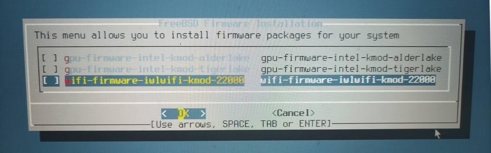

# 第 2.8 节 时区、服务、安全、固件和账户

## 时区设置


`选择地区`

设置时区。中国位于 `5 Asia`（亚洲）。按 **方向键** 可切换，按 **回车键** 可选定。


`设置国家或区域`

中国选择 `9 China`（中国）。按 **方向键** 可切换，按 **回车键** 可选定。


中国统一使用东八区时间，即北京时间，请选择 `1 Beijing Time`（北京时间）。按 **方向键** 可切换，按 **回车键** 可选定。


`时区缩写 'CST' 看起来合理吗？`

我们使用中国标准时间：China Standard Time（CST），没有问题，按 **回车键** 选定 `Yes`。


`时间与日期`

按 **回车键** 即可。


`时间与日期`

按 **回车键** 即可。

## 启动服务设置


`选择你希望在开机时启动的服务`

>**警告**
>
>**不要全选！**
>
>**不要** 选 `local_unbound`，会影响 DNS，见 [https://bugs.freebsd.org/bugzilla/show_bug.cgi?id = 262290](https://bugs.freebsd.org/bugzilla/show_bug.cgi?id=262290)。除非你知道这是什么。


|     选项      |                                                                                  解释                                                                                   |
| :-----------: | :------------------------ |
| `local_unbound` | 启用 Unbound。这是基本系统预置的 unbound，仅用于本地缓存转发解析器使用。注意：如果开启，你的系统将不会正确联网，需要手动配置 DNS。如果你不知道这是什么不建议开启 |
|     `sshd`      |                                                                              开启 ssh 服务                                                                              |
|    `moused`     |                                                                           在 tty 界面显示鼠标                                                                           |
|     `ntpd`      |                                                              用于自动时钟同步的网络时间协议（NTP）守护程序                                                              |
|`ntpd_sync_on_start`|开机同步时间|
|    `powerd`     |                                                                                电源管理，CPU 频率动态调整                                                                                 |
|    `dumpdev`    |                                                                       启用崩溃转储，用于调试系统                                                                        |

## 安全加固


`选择系统安全加固选项`

这里是安全加固部分，可根据需要自行选定。

>**技巧**
>
>在 FreeBSD 14 以前版本的安装中，在这一步会出现 `disable_sendmail`，请选定之，如果不禁止这个服务会使你在每次开机的时候卡上几分钟，而且这个服务本身没什么用，发邮件用的。

|选项 | 解释|
| :-----------: | :------------------------ |
|`0 hide_uids`|隐藏其他用户的进程|
|`1 hide_gids`|隐藏其他组的进程|
|`2 hide_jail`|隐藏 jail 中的进程|
|`3 read_msgbuf`|禁止非特权用户读取内核消息缓冲区（一般用 `dmesg` 查看）|
|`4 proc_debug`|禁用非特权用户的进程调试功能|
|`5 random_pid`|进程的 PID 随机化|
|`6 clear_tmp`|在开机时清除 `/tpm`|
|`7 disable_syslogd`|禁用 Syslogd 网络套接字（禁用远程日志记录）|
|`8 secure_console`|启用控制台密码（单用户模式下也需要 root 密码）|
|`9 disable_ddttrace`|禁止 DTrace 破坏性（destructive）模式|


## 安装固件


自动检测安装所需固件（14.2 [引入](https://cgit.freebsd.org/src/commit/?id=03c07bdc8b31)）。

**此图片来自虚拟机安装界面**。


**此图片来自物理机安装界面（使用采集卡）**


>**警告**
>
>你最好在这一步取消勾选，即不安装任何固件（安装了也是有问题的），否则你会无限期卡在这里，因为网络问题。如果你不记得需要安装什么，可以在安装好后用命令 `fwget` 看一下。
>
>
>
>**此图片来自物理机安装界面（使用采集卡）**

## 创建普通用户


`你现在希望向已安装的系统添加用户吗？`

如需创建，请按 **回车键** 选 `Yes`；如果不需要普通用户，~~是 root 敢死队~~，请用 **方向键** 选 `No`。


>**技巧**
>
>绝大多数登录管理器都是默认禁止 root 用户登录。换言之，如果不进行一定的修改（参见其他章节），在默认状态下，你可能无法用 root 登录桌面。~~虽然在默认状态下 FreeBSD 不带桌面，或者还可以直接 `startx`~~。


>**注意**
>
>如果你要创建普通用户，请务必将其加入到 `wheel` 组中（请参见箭头位置）。


```sh
FreeBSD Installer
========================
Add Users

Username: ykla # 此处输入用户名
Full name: # 此处输入用户全名 ①
Uid (Leave empty for default):  # 用户 UID
Login group [ykla]: # 用户主组
Login group is ykla. Invite ykla into other groups? []: wheel # 此处输入“wheel”，邀请用户“ykla”加入附加组“wheel”以便于使用命令 su
Login class [default]: # 用户分级
Shell (sh csh tcsh nologin) [sh]: # 用户默认 shell
Home directory [/home/ykla]: # 用户家目录
Home directory permissions (Leave empty for default): # 用户家目录权限
Use password-based authentication? [yes]:  # 是否启用密码验证
Use an empty password? (yes/no) [no]:  # 是否使用空密码
Use a random password? (yes/no) [no]:  # 是否使用随机密码
Enter password:  # 输入密码，密码不显示在屏幕上，也不会是 ****，就是什么也没有
Enter password again:  # 重复输入密码，密码不显示在屏幕上，也不会是 ****，就是什么也没有
Lock out the account after creation? [no]: # 创建账户后锁定账户
Username    : ykla
Password    : *****
Full Name   : 
Uid         : 1001
Class       : 
Groups      : ykla wheel
Home        : /home/ykla
Home Mode   : 
Shell       : /bin/sh
Locked      : no
OK? (yes/no) [yes]: # 看起来正常吗
adduser: INFO: Successfully added (ykla) to the user database. # 已成功将 ykla 添加到用户数据库
Add another user? (yes/no) [no]: # 是否还要再添加一位用户
```

- ① 如果用户全名为空（即不设置），系统会分配一个默认值 `User &`。这是早期 Unix 的行为（Gecos 字段）。由 [freebsd-src/blob/main/usr.sbin/pw/pw_user.c](https://github.com/freebsd/freebsd-src/blob/main/usr.sbin/pw/pw_user.c)，文件中的 `static struct passwd fakeuser` 这部分代码实现。

其他参数可以保持默认设置不变。在 FreeBSD 14 及以后，所有用户的默认 shell 都被统一为了 `sh`。

最后会询问 `Add another user？ (yes/no) [no]`，按 **回车键** 即可完成创建；

若输入 `yes`，按 **回车键** 可创建第二个普通用户。
