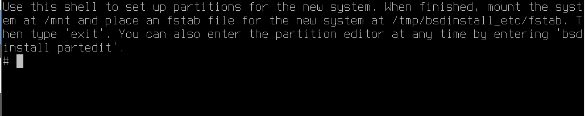

# 第 2.8 节 手动安装双系统（后安装 FreeBSD）

本节以“FreeBSD-14.0-RELEASE-amd64-disc1.iso”为例，在 `Hyper-V` 中演示 FreeBSD 14.0 RELEASE 与 Windows 11 在 UEFI 环境下的双系统安装。

>**技巧**
>
>本文示例要求先安装其他操作系统，再安装 FreeBSD。

## 简单方法

> **注意**
>
> 以本文所述方法，在使用 ZFS 时，只会创建一个名为 `root` 的 zpool，并且直接挂载到 `/`，并不是像自动安装那样创建 `zroot/ROOT/default` 以及众多的数据集。你可以以后再创建数据集进行替换操作，但如果你想在安装开始就使用与自动安装相同的布局，请跳转到本节 Shell 分区部分。

首先需要为 FreeBSD 在硬盘末尾处留出空间，并且关闭安全启动和快速启动。

然后正常引导 FreeBSD 进行安装流程，直到分区选择。


此处选择 `Manual`

>**技巧**
>
>其实这里调用的是软件 `sade`（sysadmins disk editor，系统管理员磁盘编辑器），`bsdconfig` 亦同。


这里可以看到硬盘分区。仅有一块硬盘，有 300M 的 EFI 系统分区，16M 的 MSR 分区，64G 的 Windows 系统分区。未显示空闲空间。直接选择 `Create`


此处，第一行输入分区类型（即下方会列出的 `Filesystem type`）。如要添加 swap 分区，请首先添加，后添加难以控制分区大小。在添加 UFS、ZFS 时，需在 `Mountpoint` 处添加 `/`，表示分区挂载到 `/`。`Label` 是 FreeBSD 的卷标，方便识别分区，可以根据情况添加或不填。此处使用 ZFS，不添加 swap 分区，并且添加卷标 `zroot`。


用 **TAB 键** 选择到 OK 回车


这里会提示 ZFS 分区无法启动，但经过实测是可以正常启动的，选择 `yes` 忽略


选择 `Finish`


选择 `Commit`

之后会进入正常安装的流程。


进入系统后可以看到，仅有一个 `root` 数据集。可以逐渐将数据集改为自动安装的样子，也可以参照下文在安装时进入 shell 进行分区。

## Shell 分区


仍然进行到分区选择，选择 `Shell`



之后会进入终端，执行以下命令：

- 加载 ZFS 内核模块

```sh
# kldload zfs
```

- 配置 ZFS 对齐方式

```sh
# 强制 4K 对齐
# sysctl vfs.zfs.min_auto_ashift=12
```

- 创建分区

```sh
# 创建 swap 分区（-t），卷标为 swap（-l），大小为 4G（-s），对齐（-a），注意替换 da0
# gpart add -a 4k -l swap -s 4G -t freebsd-swap da0

# 创建 ZFS 分区，卷标为 zroot，使用全部空余空间，注意替换 da0
# gpart add -a 4k -l zroot -t freebsd-zfs da0
```

- 挂载临时文件系统准备安装：
  
```sh
# mount -t tmpfs tmpfs /mnt
```

- 创建 ZFS 池

```sh
# 创建 ZFS 池，暂时挂载至 /mnt（-o altroot=/mnt），使用 lz4 压缩（-O compress=lz4。可换成 zstd 等），关闭时间标签（-O atime=off），/dev/gpt/zroot 是我们刚建立的卷标
# zpool create -f -o altroot=/mnt -O compress=lz4 -O atime=off -m none zroot /dev/gpt/zroot
```

- 创建 ZFS 数据集

```
# 创建根数据集
# zfs create -o mountpoint=none zroot/ROOT
# 创建一个名为 `zroot/ROOT` 的数据集，不设置挂载点（`mountpoint=none`），通常用于作为系统底层的根数据集，可以用于创建下面的子数据集。

# 创建默认根数据集
# zfs create -o mountpoint=/ zroot/ROOT/default
# 创建一个名为 `zroot/ROOT/default` 的数据集，并将其挂载到根目录 `/`，用于系统的默认根文件系统。

# 创建 /home 数据集
# zfs create -o mountpoint=/home zroot/home
# 创建一个名为 `zroot/home` 的数据集，并挂载到 `/home`，通常用于存储用户主目录。

# 创建 /tmp 数据集，设置 exec 为 on，setuid 为 off
# zfs create -o mountpoint=/tmp -o exec=on -o setuid=off zroot/tmp
# 创建 `zroot/tmp` 数据集并挂载到 `/tmp`，允许执行文件（`exec=on`），但禁用 setuid（`setuid=off`）防止该目录中的文件使用 setuid 提升权限。

# 创建 /usr 数据集，并设置 canmount 为 off
# zfs create -o mountpoint=/usr -o canmount=off zroot/usr
# 创建 `zroot/usr` 数据集并挂载到 `/usr`，但由于设置 `canmount=off`，该数据集不会被自动挂载，通常用于特定的系统配置。

# 创建 /usr/ports 数据集，设置 setuid 为 off
# zfs create -o setuid=off zroot/usr/ports

# 创建 /usr/src 数据集
# zfs create zroot/usr/src

# 创建 /var 数据集，设置 canmount 为 off
# zfs create -o mountpoint=/var -o canmount=off zroot/var

# 创建 /var/audit 数据集，设置 exec 和 setuid 为 off
# zfs create -o exec=off -o setuid=off zroot/var/audit

# 创建 /var/crash 数据集，设置 exec 和 setuid 为 off
# zfs create -o exec=off -o setuid=off zroot/var/crash

# 创建 /var/log 数据集，设置 exec 和 setuid 为 off
# zfs create -o exec=off -o setuid=off zroot/var/log

# 创建 /var/mail 数据集，设置 atime 为 on
# zfs create -o atime=on zroot/var/mail
# 创建 `zroot/var/mail` 数据集并设置 `atime=on`，意味着每次读取文件时都会更新访问时间，通常用于存放邮件数据。

# 创建 /var/tmp 数据集，设置 setuid 为 off
# zfs create -o setuid=off zroot/var/tmp
```

- 修改文件夹权限

```sh
# 修改 /mnt/tmp 和 /mnt/var/tmp 权限为 1777，保证临时目录权限正确
# chmod 1777 /mnt/tmp
# chmod 1777 /mnt/var/tmp
```

- 设置交换分区到 `fstab`

```
# 配置 swap 分区挂载，注意替换 /dev/nad0p3
# printf "/dev/nad0p3\tnone\tswap\tsw\t0\t0\n" >> /tmp/bsdinstall_etc/fstab
```
>**技巧**
>
>`\t` 是一个转义字符，表示按了一次 Tab 键，此处用于对齐分割，换成空格也是一样的效果。

- 设置启动项与 UEFI

```
# 设置 ZFS 启动路径为 zroot/ROOT/default
# zpool set bootfs=zroot/ROOT/default zroot

# 配置 FreeBSD 启动时加载 ZFS①
# printf 'zfs_enable="YES"\n' >> /tmp/bsdinstall_etc/rc.conf

# 挂载 EFI 系统分区
# 挂载现有 EFI 系统分区，注意替换 /dev/da0p1
# mount -t msdosfs /dev/da0p1 /media

# 在 EFI 系统分区创建启动目录
# mkdir -p /media/efi/freebsd

# 复制 EFI 启动文件到 EFI 系统分区
# cp /boot/loader.efi /media/efi/freebsd/loader.efi

# 使用 efibootmgr 添加 UEFI 启动项
# efibootmgr --create --activate --label "FreeBSD" --loader "/media/efi/freebsd/loader.efi"

# 卸载 EFI 系统分区
# umount /media
# 退出 shell，FreeBSD 会继续安装流程
# exit  
```

- ①：`\n` 代表 Unix 换行。Windows 中每段结尾实际是 `\r\n`——即先回车再换行。

这样我们就手动创建了一套与自动安装相同的结构


## 参考文献

- [How to manually install FreeBSD on a remote server (with UFS, ZFS, encryption...)](https://stanislas.blog/2018/12/how-to-install-freebsd-server/)
- [RootOnZFS/GPTZFSBoot](https://wiki.freebsd.org/RootOnZFS/GPTZFSBoot)
