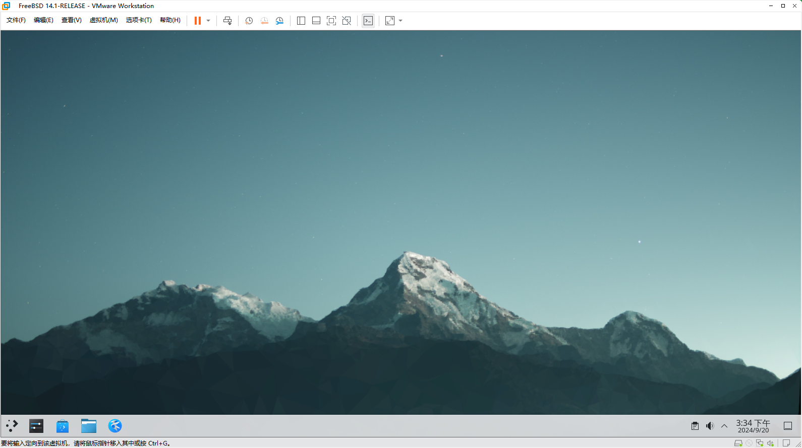
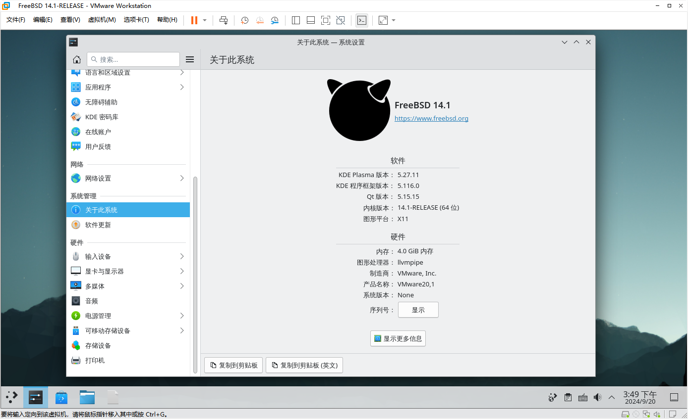
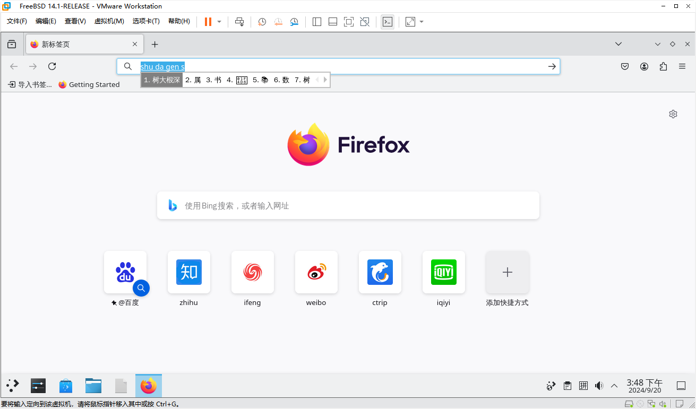

# 第 2.9 节 虚拟机预安装镜像

## 环境

公共部分：

- 虚拟机版本：VMware® Workstation 17 Pro 17.5.2 build-23775571
- 主机版本：Windows 10 企业版 21H2
- BIOS+UEFI
- SWAP 8G + ZFS on root
- DNS：`223.5.5.5`（阿里 DNS）
- 主机名：`ykla`
- 用户名：`root`、`ykla`
- 密码：`root`、`ykla` 均为 `z`
- pkg 源已经配置为 latest 版本的 NJU Mirror（南京大学开源镜像站），如不喜欢可以删除自定义文件 `/usr/local/etc/pkg/repos/ustc.nju`，即可切换回官方源。
- 推荐内存 4-8G；CPU 4。
- 已经安装虚拟机工具，屏幕可自由拖动缩放，鼠标可无缝切换。
- 已经关闭锁屏，可以到设置中自行开启。
- 已经设置 KDE5 为中文，可以到设置中自行修改。
- 已经允许 root ssh，但未允许 root 登录 sddm，如有需要可参照其他章节教程自行修改。
- 预设置了 `/etc/make.conf`，可自行查看内容。已经配置了多线程编译，使用 USTC 的 Port 源。
- 预拉取了 USTC 镜像站的的 ports，如需使用，请先更新：`cd /usr/ports/ && git pull`
- 安装了火狐浏览器和 fcitx5 输入法框架及输入法（输入法已为 `root` 用户进行配置）


FreeBSD 14.1：

- 已经更新至 `14.1-RELEASE-p5`。

## 图片

### FreeBSD 14.1







## 预装软件


预装软件一览表（不含依赖包）：

|软件|备注|
|:---:|:---:|
|pkg||
|xorg||
|sddm||
|kde5||
| plasma5-sddm-kcm||
|wqy-fonts||
|xdg-user-dirs||
|xf86-video-vmware||
| open-vm-tools||
| xf86-input-vmmouse||
|git||
|firefox-esr||
|fcitx5||
| fcitx5-qt5 ||
|fcitx5-qt6||
| fcitx5-gtk2 ||
|fcitx5-gtk3 ||
|fcitx5-gtk4||
| fcitx5-configtool ||
|zh-fcitx5-chinese-addons||


FreeBSD 14.1 预装的所有第三方软件清单：

```sh
root@ykla:/home/ykla # pkg info
7-zip-24.08                    Console version of the 7-Zip file archiver
AppStream-1.0.1                Machine-readable software metadata for desktop environments
AppStreamQt5-1.0.1             Qt bindings to AppStream
Imath-3.1.12                   C++/Python lib of 2D/3D vector, matrix, math ops for computer graphics
PackageKit-Qt5-1.1.2           DBUS packaging abstraction layer (Qt bindings)
abseil-20240722.0              Abseil Common Libraries (C++)
accounts-qml-module-0.7_4      Expose the Online Accounts API to QML applications
accountsservice-23.13.9_1      D-Bus interface for user account query and manipulation
adwaita-icon-theme-42.0        GNOME Symbolic Icons
akonadi-23.08.5_1              Storage server for KDE-Pim
akonadi-calendar-23.08.5       Akonadi Calendar Integration
akonadi-contacts-23.08.5_1     Libraries and daemons to implement Contact Management in Akonadi
akonadi-import-wizard-23.08.5_1 Import data from other mail clients to KMail
akonadi-mime-23.08.5           Libraries and daemons to implement basic email handling
akonadi-notes-23.08.5          KDE library for accessing mail storages in MBox format
akonadi-search-23.08.5         Libraries and daemons to implement searching in Akonadi
akonadiconsole-23.08.5_1       Akonadi management and debugging console
akregator-23.08.5_1            Feed reader for KDE
alsa-lib-1.2.12                ALSA compatibility library
alsa-plugins-1.2.12            ALSA compatibility library plugins
analitza-23.08.5               Library from KDE Education project
aom-3.10.0_1                   AV1 reference encoder/decoder
appres-1.0.5_1                 Program to list application's resources
ark-23.08.5_1                  Archiving tool for KDE
artikulate-23.08.5             Pronunciation trainer for KDE
aspell-0.60.8.1_1,1            Spelling checker with better suggestion logic than ispell
at-spi2-core-2.52.0            Assistive Technology Service Provider Interface
atkmm-2.28.4                   C++ wrapper for ATK API library
audiocd-kio-23.08.5            KDE IOSlave for accessing audio CDs
avahi-app-0.8_2                Service discovery on a local network
avahi-libdns-0.8_2             mDNSResponder compatibility from Avahi
baloo-widgets-23.08.5          BalooWidgets library
basu-0.2.1                     sd-bus library, extracted from systemd
binutils-2.43,1                GNU binary tools
bitmap-1.1.1                   Bitmap editor and converter utilities for X
black-hole-solver-1.12.0       Black Hole Solitaire Solver
blas-3.12.0_1                  Basic Linear Algebra Subroutines
blinken-23.08.5                Memory enhancement game
bomber-23.08.5                 Arcade Bombing game
boost-libs-1.84.0              Free portable C++ libraries (without Boost.Python)
bovo-23.08.5                   Five-in-a-row Board game
brotli-1.1.0,1                 Generic-purpose lossless compression algorithm
bsdisks-0.35_1                 UDisks2 service implementation for FreeBSD
ca_root_nss-3.93_2             Root certificate bundle from the Mozilla Project
cairo-1.17.4_2,3               Vector graphics library with cross-device output support
cairomm-1.14.5                 C++ interface to cairo
calendarsupport-23.08.5        Calendar support libraries for KDEPim
cantor-23.08.5_4               Mathematical software frontend by KDE
cdparanoia-3.10.2              CDDA extraction tool (also known as ripper)
cdrtools-2024.03.21            Tools for ripping from and recording to CDs and DVDs
chmlib-0.40_1                  Library for dealing with Microsoft ITSS/CHM format files
clinfo-3.0.23.01.25_1          Print information about all available OpenCL platforms/devices
cln-1.3.7_1                    Class Library for Numbers
colord-1.4.7                   Manage color profiles to accurately color input/output devices
consolekit2-1.2.6_3            Framework for defining and tracking users
coreutils-9.5                  Free Software Foundation core utilities
cups-2.4.10_1                  Common UNIX Printing System
curl-8.9.1_1                   Command line tool and library for transferring data with URLs
cyrus-sasl-2.1.28_5            RFC 2222 SASL (Simple Authentication and Security Layer)
dav1d-1.4.3_1                  Small and fast AV1 decoder
dbus-1.14.10_5,1               Message bus system for inter-application communication
dbus-glib-0.112_1              GLib bindings for the D-BUS messaging system
dejavu-2.37_3                  Bitstream Vera Fonts clone with a wider range of characters
desktop-file-utils-0.27        Couple of command line utilities for working with desktop entries
discount-2.2.7d                C implementation of the Markdown markup language
djvulibre-3.5.28_4             DjVu base libraries and utilities
dmidecode-3.6                  Tool for dumping DMI (SMBIOS) contents in human-readable format
docbook-1.5                    Meta-port for the different versions of the DocBook DTD
docbook-sgml-4.5_1             DocBook SGML DTD
docbook-xml-5.0_3              DocBook XML DTD
docbook-xsl-1.79.1_1,1         XSL DocBook stylesheets
dolphin-23.08.5                KDE filemanager dolphin
dotconf-1.3_1                  Simple, powerful configuration-file parser
double-conversion-3.3.0        Binary-decimal and decimal-binary routines for IEEE doubles
dragon-player-23.08.5_1        KDE multimedia player with a focus on simplicity
duktape-lib-2.7.0              Embeddable Javascript engine (shared lib)
dvdauthor-0.7.2.20211105_4     Makes a DVD file structure from one or more MPEG2 streams
e2fsprogs-libuuid-1.47.1       UUID library from e2fsprogs package
ebook-tools-0.2.2_8            Accesses and converts various ebook file formats
ebur128-0.1.9_2                Library implementing the EBU R128 loudness standard
editorconfig-core-c-0.12.9     EditorConfig core library and executable written in C
eigen-3.4.0_3                  Lightweight library for vector and matrix math
enchant2-2.2.15_5              Dictionary/spellchecking framework
encodings-1.1.0,1              X.Org Encoding fonts
espeak-ng-1.51.1_5             Software speech synthesizer
eventviews-23.08.5             Event view libraries for KDEPim
exiv2-0.28.3,1                 Exif, IPTC, and XMP metadata manipulation library and tools
expat-2.6.2                    XML 1.0 parser written in C
fcitx5-5.1.10                  New implementation of the Fcitx IME framework
fcitx5-configtool-5.1.6        Fcitx5 IM framework configuration tool
fcitx5-gtk-common-5.1.3        Fcitx support for GTK (common files)
fcitx5-gtk2-5.1.3              Fcitx support for GTK (gtk2)
fcitx5-gtk3-5.1.3              Fcitx support for GTK (gtk3)
fcitx5-gtk4-5.1.3              Fcitx support for GTK (gtk4)
fcitx5-lua-5.0.13              Lua support for Fcitx5
fcitx5-qt-common-5.1.6         Fcitx support for Qt (common files)
fcitx5-qt5-5.1.6               Fcitx support for Qt (qt5)
fcitx5-qt6-5.1.6               Fcitx support for Qt (qt6)
ffmpeg-6.1.2_1,1               Realtime audio/video encoder/converter and streaming server
fftw3-3.3.10_5                 Fast C routines to compute the Discrete Fourier Transform
fftw3-float-3.3.10_5           Fast Discrete Fourier Transform (Single Precision C Routines)
filelight-23.08.5              Map of concentric segmented-rings representing file system
firefox-esr-128.2.0_2,1        Web browser based on the browser portion of Mozilla
flac-1.4.3_1,1                 Free lossless audio codec
font-adobe-100dpi-1.0.3_4      X.Org Adobe 100dpi font
font-adobe-75dpi-1.0.3_4       X.Org Adobe 75dpi font
font-adobe-utopia-100dpi-1.0.4_4 X.Org Adobe Utopia 100dpi font
font-adobe-utopia-75dpi-1.0.4_4 X.Org Adobe Utopia 75dpi font
font-adobe-utopia-type1-1.0.4_4 X.Org Adobe Utopia Type1 font
font-alias-1.0.4               X.Org Font aliases
font-arabic-misc-1.0.3_4       X.Org miscellaneous Arabic fonts
font-bh-100dpi-1.0.3_4         X.Org Bigelow Holmes 100dpi font
font-bh-75dpi-1.0.3_4          X.Org Bigelow Holmes 75dpi font
font-bh-lucidatypewriter-100dpi-1.0.3_4 X.Org Bigelow Holmes Lucida TypeWriter 100dpi font
font-bh-lucidatypewriter-75dpi-1.0.3_4 X.Org Bigelow Holmes Lucida TypeWriter 75dpi font
font-bh-ttf-1.0.3_5            X.Org Bigelow & Holmes TTF font
font-bh-type1-1.0.3_4          X.Org Bigelow Holmes Type1 font
font-bitstream-100dpi-1.0.3_4  X.Org Bitstream Vera 100dpi font
font-bitstream-75dpi-1.0.3_4   X.Org Bitstream Vera 75dpi font
font-bitstream-type1-1.0.3_4   X.Org Bitstream Vera Type1 font
font-cronyx-cyrillic-1.0.3_4   X.Org Cronyx Cyrillic font
font-cursor-misc-1.0.3_4       X.Org miscellaneous Cursor fonts
font-daewoo-misc-1.0.3_4       X.Org miscellaneous Daewoo fonts
font-dec-misc-1.0.3_4          X.Org miscellaneous Dec fonts
font-ibm-type1-1.0.3_4         X.Org IBM Type1 font
font-isas-misc-1.0.3_4         X.Org miscellaneous ISAS fonts
font-jis-misc-1.0.3_4          X.Org miscellaneous JIS fonts
font-micro-misc-1.0.3_4        X.Org miscellaneous Micro fonts
font-misc-cyrillic-1.0.3_4     X.Org miscellaneous Cyrillic font
font-misc-ethiopic-1.0.4       X.Org miscellaneous Ethiopic font
font-misc-meltho-1.0.3_5       X.Org miscellaneous Meltho font
font-misc-misc-1.1.2_4         X.Org miscellaneous Misc fonts
font-mutt-misc-1.0.3_4         X.Org miscellaneous Mutt fonts
font-schumacher-misc-1.1.2_4   X.Org miscellaneous Schumacher fonts
font-screen-cyrillic-1.0.4_4   X.Org Screen Cyrillic font
font-sony-misc-1.0.3_4         X.Org miscellaneous Sony fonts
font-sun-misc-1.0.3_4          X.Org miscellaneous Sun fonts
font-winitzki-cyrillic-1.0.3_4 X.Org Winitzki Cyrillic font
font-xfree86-type1-1.0.4_4     X.Org XFree86 Type1 font
fontconfig-2.15.0_3,1          XML-based font configuration API for X Windows
freecell-solver-6.2.0_1        Open source framework for solving Freecell
freedesktop-sound-theme-0.8    Sound theme based on the FreeDesktop specification
freeglut-3.2.1                 Open source implementation of GLUT library
freerdp-2.11.7                 Free implementation of Remote Desktop Protocol
freetype2-2.13.2               Free and portable TrueType font rendering engine
freexl-2.0.0                   Library to extract valid data from within an Excel (.xls) spreadsheet
frei0r-2.3.3                   Minimalistic plugin API for video effects
frei0r-plugins-2.3.3           The "meta-port" for frei0r and additional plugins
frei0r-plugins-cairo-2.3.3     Frei0r cairo plugins
frei0r-plugins-gavl-2.3.3      Frei0r gavl plugins
frei0r-plugins-opencv-2.3.3_1  Frei0r OpenCV plugins
fribidi-1.0.15                 Free Implementation of the Unicode Bidirectional Algorithm
fusefs-libs-2.9.9_2            FUSE allows filesystem implementation in userspace
gamin-0.1.10_10                File and directory monitoring system
gavl-1.4.0_4                   Library for handling uncompressed video and audio data
gcc13-13.3.0                   GNU Compiler Collection 13
gdal-3.9.2_1                   Translator library for raster geospatial data formats
gdbm-1.24                      GNU database manager
gdcm-3.0.24                    Grassroots DICOM library
gdk-pixbuf-xlib-2.40.2_1       deprecated API for integrating Xlib and GdkPixbuf
gdk-pixbuf2-2.42.10_3          Graphic library for GTK
geos-3.12.2                    Geometry Engine, Open Source
gettext-runtime-0.22.5         GNU gettext runtime libraries and programs
gettext-tools-0.22.5           GNU gettext development and translation tools
gflags-2.2.2_2                 Commandline flags module for C++
ghostscript10-10.03.1          PostScript and PDF interpreter
giflib-5.2.2                   Tools and library routines for working with GIF images
git-2.46.0                     Distributed source code management tool 
glib-2.80.5,2                  Some useful routines of C programming (current stable version)
glibmm-2.66.7,1                C++ interfaces for glib2
glog-0.7.1                     Library of C++ classes for flexible logging
gmp-6.3.0                      Free library for arbitrary precision arithmetic
gnome_subr-1.0                 Common startup and shutdown subroutines used by GNOME scripts
gnuchess-6.2.9_1               Classic Gnu Chess
gnupg-2.4.5_1                  Complete and free PGP implementation
gnutls-3.8.7.1                 GNU Transport Layer Security library
gobject-introspection-1.78.1_2,1 Generate interface introspection data for GObject libraries
gpgme-1.23.2_1                 Library to make access to GnuPG easier
gpgme-cpp-1.23.2_1             Gpgme C++ bindings
gpgme-qt-headers-1.23.2        Shared headers for the Gpgme Qt bindings
gpgme-qt5-1.23.2_1             Gpgme Qt5 bindings
gpsd-3.25                      Daemon that monitors one or more GPSes attached to a host computer
granatier-23.08.5              Bomberman clone
grantlee-editor-23.08.5_1      Editor for Grantlee themes
grantlee5-5.3.0                String template engine for Qt 5
grantleetheme-23.08.5          KDE PIM grantleetheme
graphene-1.10.8                Optimizations for speeding up vector operations
graphite2-1.3.14               Rendering capabilities for complex non-Roman writing systems
groff-1.23.0_3                 Software typesetting package
gsettings-desktop-schemas-42.0 Collection of globally shared GSetting schemas
gsl-2.7.1_1                    The GNU Scientific Library - mathematical libs
gsm-1.0.22_1                   Audio converter and library for converting u-law to gsm encoding
gstreamer1-1.22.10             Media applications framework
gstreamer1-plugins-1.22.10_2   GStreamer written collection of plugins handling several media types
gstreamer1-plugins-bad-1.22.10_3 GStreamer-plugins that need more quality, testing or documentation
gstreamer1-plugins-curl-1.22.10 GStreamer curl based output plugin
gstreamer1-plugins-gl-1.22.10  GStreamer GL graphics plugin
gstreamer1-plugins-good-1.22.10 GStreamer-plugins good-quality plug-ins
gstreamer1-plugins-openh264-1.22.10 GStreamer (openh264) plugin
gstreamer1-plugins-vpx-1.22.10_1 GStreamer vp8 codec plugin
gtk-update-icon-cache-3.24.31_1 Gtk-update-icon-cache utility from the Gtk+ toolkit
gtk2-2.24.33_1                 Gimp Toolkit for X11 GUI (previous stable version)
gtk3-3.24.43                   Gimp Toolkit for X11 GUI (current stable version)
gtk4-4.14.5                    Gimp Toolkit for X11 GUI (current stable version)
gtkmm30-3.24.9                 C++ wrapper for Gtk+3
gwenview-23.08.5_3             Image viewer and browser for KDE
hack-font-3.003_1              Typeface designed for source code
harfbuzz-9.0.0                 OpenType text shaping engine
hdf5-1.12.2_2,1                Hierarchical Data Format library (from NCSA) (latest)
hicolor-icon-theme-0.18        High-color icon theme shell from the FreeDesktop project
hidapi-0.14.0                  Library to access USB HID-class devices
highway-1.2.0                  Performance-portable, length-agnostic SIMD with runtime dispatch
http-parser-2.9.4              HTTP request/response parser written in C
hunspell-1.7.2_1               Improved spell-checker for Hungarian and other languages
hwdata-0.387,1                 Database of IDs used in PCI, PNP and USB devices
iceauth-1.0.8_3                ICE authority file utility for X
icu-74.2_1,1                   International Components for Unicode (from IBM)
incidenceeditor-23.08.5        Incidence editor libraries for KDEPim
indexinfo-0.3.1                Utility to regenerate the GNU info page index
inih-58                        Simple .INI file parser written in C
iso-codes-4.15.0               Lists of the country, language, and currency iso names
iso8879-1986_3                 Character entity sets from ISO 8879:1986 (SGML)
ja-kiten-23.08.5               Japanese reference/study tool for KDE
jackit-1.9.22_2                Low latency audio server
jansson-2.14                   C library for encoding, decoding, and manipulating JSON data
jasper-4.2.4                   Implementation of the codec specified in the JPEG-2000 standard
jbig2dec-0.20_1                Decoder implementation of the JBIG2 image compression format
jbigkit-2.1_3                  Lossless compression for bi-level images such as scanned pages, faxes
jpeg-turbo-3.0.3               SIMD-accelerated JPEG codec which replaces libjpeg
json-c-0.17                    JSON (JavaScript Object Notation) implementation in C
json-glib-1.8.0                JSON (RFC 4627) interface for Glib
jsoncpp-1.9.6_1                JSON reader and writer library for C++
kColorPicker-qt5-0.3.1         Qt-based color picker library with popup menu
kImageAnnotator-qt5-0.7.1      Library for image-annotation tools
kaccounts-integration-23.08.5_5 System to administer web accounts for the KDE desktop
kaddressbook-23.08.5_1         KDE contact manager
kalarm-23.08.5                 Personal alarm scheduler
kalgebra-23.08.5               KDE graph calculator
kamera-23.08.5                 Digital camera manager for KDE
kanagram-23.08.5               Letter order game for KDE
kapman-23.08.5                 Pac-Man Clone
kate-23.08.5_2                 Basic editor framework for the KDE system
katomic-23.08.5                Sokoban-like Logic game
kblackbox-23.08.5              Blackbox Logic game
kblocks-23.08.5                Falling Blocks game
kbounce-23.08.5                Ball Bouncing game
kbreakout-23.08.5              Breakout-like game
kbruch-23.08.5_1               KDE 4 application to exercise fractions
kcalc-23.08.5                  Scientific calculator for KDE
kcalutils-23.08.5              KDE utility and user interface functions for accessing calendar
kcharselect-23.08.5            Character selector for KDE
kcolorchooser-23.08.5          KDE application to select colors from the screen or from a palette
kcron-23.08.5                  KDE task scheduler
kde-baseapps-23.08.5_2         KDE5 baseapps meta port
kde5-5.27.11.23.08.5_2         KDE Plasma Desktop and Applications (current)
kdeadmin-23.08.5_1             KDE Administration applications (meta port)
kdebugsettings-23.08.5         KDE application to enable/disable qCDebug
kdeedu-23.08.5_1               Entertaining and educational programs for KDE (meta port)
kdegames-23.08.5_1             Games for KDE (meta port)
kdegraphics-23.08.5_1          Graphics utilities for KDE (meta port)
kdegraphics-mobipocket-23.08.5 Mobipocket plugins for Strigi indexing and thumbnails
kdegraphics-svgpart-23.08.5    SVG KPart
kdegraphics-thumbnailers-23.08.5_1 Thumbnailers for various graphics file formats
kdemultimedia-23.08.5_3        KDE Multimedia applications (meta port)
kdemultimedia-ffmpegthumbs-23.08.5_1 FFmpeg-based thumbnail generator for video files
kdenetwork-23.08.5_1           KDE Network applications (meta port)
kdenetwork-filesharing-23.08.5_1 KDE Filesharing via Samba
kdenlive-23.08.5_1             KDE professional quality non-linear video editing suite
kdepim-23.08.5_2               KDE PIM applications metaport
kdepim-addons-23.08.5_1        KDE PIM addons
kdepim-runtime-23.08.5_1       KDE PIM tools and services
kdeutils-23.08.5_2             Collection of utilities for KDE
kdf-23.08.5                    Shows free space of devices for KDE
kdiagram-2.8.0_1               Library to create business diagrams
kdialog-23.08.5                Show nice dialog boxes from shell scripts
kdiamond-23.08.5               Three-in-a-row game
kdsoap-qt5-2.1.1_1             C++/Qt SOAP framework
keditbookmarks-23.08.5_1       Bookmark Organizer and Editor
kf5-attica-5.116.0             Open Collaboration Services API library KDE5 version
kf5-baloo-5.116.0              KF5 Framework for searching and managing user metadata
kf5-breeze-icons-5.116.0       Breeze icon theme for KDE
kf5-frameworkintegration-5.116.0 KF5 workspace and cross-framework integration plugins
kf5-kactivities-5.116.0        KF5 runtime and library to organize work in separate activities
kf5-kactivities-stats-5.116.0  KF5 statistics for activities
kf5-karchive-5.116.0           KF5 library that provides classes for handling archive formats
kf5-kauth-5.116.0              KF5 abstraction to system policy and authentication features
kf5-kbookmarks-5.116.0         KF5 library for bookmarks and the XBEL format
kf5-kcalendarcore-5.116.0,1    KDE calendar access library
kf5-kcmutils-5.116.0           KF5 utilities for working with KCModules
kf5-kcodecs-5.116.0            KF5 library for string manipulation
kf5-kcompletion-5.116.0        KF5 text completion helpers and widgets
kf5-kconfig-5.116.0            KF5 widgets for configuration dialogs
kf5-kconfigwidgets-5.116.0     KF5 widgets for configuration dialogs
kf5-kcontacts-5.116.0,1        KDE api to manage contact information
kf5-kcoreaddons-5.116.0        KF5 addons to QtCore
kf5-kcrash-5.116.0             KF5 library to handle crash analysis and bug report from apps
kf5-kdav-5.116.0,1             DAV protocol implementation with KJobs
kf5-kdbusaddons-5.116.0        KF5 addons to QtDBus
kf5-kdeclarative-5.116.0       KF5 library providing integration of QML and KDE Frameworks
kf5-kded-5.116.0               KF5 extensible daemon for providing system level services
kf5-kdelibs4support-5.116.0    KF5 porting aid from KDELibs4
kf5-kdesignerplugin-5.116.0    KF5 integration of Frameworks widgets in Qt Designer/Creator
kf5-kdesu-5.116.0              KF5 integration with su for elevated privileges
kf5-kdnssd-5.116.0             KF5 abstraction to system DNSSD features
kf5-kdoctools-5.116.0          KF5 documentation generation from docbook
kf5-kemoticons-5.116.0         KF5 library to convert emoticons
kf5-kfilemetadata-5.116.0      KF5 library for extracting file metadata
kf5-kglobalaccel-5.116.0       KF5 library to add support for global workspace shortcuts
kf5-kguiaddons-5.116.0         KF5 addons to QtGui
kf5-kholidays-5.116.0          KDE library for calendar holidays
kf5-khtml-5.116.0              KF5 KTHML rendering engine
kf5-ki18n-5.116.0              KF5 advanced internationalization framework
kf5-kiconthemes-5.116.0        KF5 library for handling icons in applications
kf5-kidletime-5.116.0          KF5 library for monitoring user activity
kf5-kimageformats-5.116.0_1    KF5 library providing support for additional image formats
kf5-kinit-5.116.0              KF5 process launcher to speed up launching KDE applications
kf5-kio-5.116.0                KF5 resource and network access abstraction
kf5-kirigami2-5.116.0          QtQuick based components set
kf5-kitemmodels-5.116.0        KF5 models for Qt Model/View system
kf5-kitemviews-5.116.0         KF5 widget addons for Qt Model/View
kf5-kjobwidgets-5.116.0        KF5 widgets for tracking KJob instance
kf5-kjs-5.116.0                KF5 library providing an ECMAScript interpreter
kf5-kjsembed-5.116.0           KF5 library for binding JavaScript objects to QObjects
kf5-knewstuff-5.116.0          KF5 library for downloading application assets from the network
kf5-knotifications-5.116.0     KF5 abstraction for system notifications
kf5-knotifyconfig-5.116.0      KF5 configuration system for KNotify
kf5-kpackage-5.116.0           KF5 library to load and install packages
kf5-kparts-5.116.0             KF5 document centric plugin system
kf5-kpeople-5.116.0            KF5 library providing access to contacts
kf5-kplotting-5.116.0          KF5 lightweight plotting framework
kf5-kpty-5.116.0               KF5 pty abstraction
kf5-kquickcharts-5.116.0       KF5 QtQuick plugin providing high-performance charts
kf5-kross-5.116.0              KF5 multi-language application scripting
kf5-krunner-5.116.0            KF5 parallelized query system
kf5-kservice-5.116.0           KF5 advanced plugin and service introspection
kf5-ktexteditor-5.116.0        KF5 advanced embeddable text editor
kf5-ktextwidgets-5.116.0       KF5 advanced text editing widgets
kf5-kunitconversion-5.116.0    KF5 library for unit conversion
kf5-kwallet-5.116.0_1          KF5 secure and unified container for user passwords
kf5-kwayland-5.116.0           KF5 Client and Server library wrapper for the Wayland libraries
kf5-kwidgetsaddons-5.116.0     KF5 addons to QtWidgets
kf5-kwindowsystem-5.116.0      KF5 library for access to the windowing system
kf5-kxmlgui-5.116.0            KF5 user configurable main windows
kf5-kxmlrpcclient-5.116.0      KF5 interaction with XMLRPC services
kf5-oxygen-icons-5.116.0       The Oxygen icon theme for KDE
kf5-plasma-framework-5.116.0   KF5 plugin based UI runtime used to write user interfaces
kf5-prison-5.116.0             API to produce barcodes
kf5-purpose-5.116.0            Offers available actions for a specific purpose
kf5-qqc2-desktop-style-5.116.0 Qt QuickControl2 style for KDE
kf5-solid-5.116.0              KF5 hardware integration and detection
kf5-sonnet-5.116.0             KF5 plugin-based spell checking library
kf5-syndication-5.116.0,1      KDE RSS feed handling library
kf5-syntax-highlighting-5.116.0 KF5 syntax highlighting engine for structured text and code
kf5-threadweaver-5.116.0       KF5 helper for multithreaded programming
kf6-extra-cmake-modules-6.3.0  Extra modules and scripts for CMake
kfourinline-23.08.5            Four-in-a-row Board game
kgeography-23.08.5             KDE geography trainer
kgpg-23.08.5                   Encryption tool for KDE
khangman-23.08.5_1             Hangman game for KDE 4
khelpcenter-23.08.5            Plasma5 application to show KDE application documentation
kidentitymanagement-23.08.5    KDE pim identities
kig-23.08.5_2                  KDE interactive geometry application
killbots-23.08.5               Evade killer robots
kimap-23.08.5                  KDE API for IMAP support
kio-extras-23.08.5_2           Plasma5 library to increase the functionality of KIO
kipi-plugins-23.08.5           Plugin architecture for image applications
kirigami-addons-0.11.0         Component library for KDE Kirigami
kiriki-23.08.5                 Yahtzee-like Dice game
kitinerary-23.08.5_2           Data Model and Extraction System for Travel Reservation information
kjumpingcube-23.08.5           Territory Capture game
kldap-23.08.5                  LDAP access API for KDE
klettres-23.08.5               Alphabet learning tool for KDE
klickety-23.08.5               Tetris themed solitaire
klines-23.08.5                 Tactical game
kmahjongg-23.08.5              Mahjongg Solitaire
kmail-23.08.5_1                KDE mail client
kmail-account-wizard-23.08.5_1 KDE mail account wizard
kmailtransport-23.08.5         KDE library to managing mail transport
kmbox-23.08.5                  KDE library for accessing mail storages in MBox format
kmime-23.08.5                  Library for handling MIME data
kmines-23.08.5                 Minesweeper-like game
kmplot-23.08.5_1               Mathematical function plotter for KDE
knavalbattle-23.08.5           Ship Sinking game
knetwalk-23.08.5               Network Construction game
knights-23.08.5                KDE chess interface
kolf-23.08.5                   Miniature Golf
kollision-23.08.5              Simple ball dodging game
kolourpaint-23.08.5            KDE paint program
konquest-23.08.5               Galactic Strategy game
konsole-23.08.5_1              KDE terminal emulator
kontact-23.08.5                KDE Personal Information Manager
kontactinterface-23.08.5       KDE glue for embedding KParts into Kontact
kopete-23.08.5_1               KDE multi-protocol instant messenger
korganizer-23.08.5             Calendar and scheduling Program
kpat-23.08.5_1                 Patience Card game
kpimtextedit-23.08.5           KDE library for PIM-specific text editing utilities
kpkpass-23.08.5                Library to deal with Apple Wallet pass files
krdc-23.08.5                   RDP and VNC client for KDE
kreversi-23.08.5               Reversi Board game
krfb-23.08.5                   VNC server for KDE
kruler-23.08.5                 KDE screen ruler
ksanecore-23.08.5              Library providing logic to interface scanners
kshisen-23.08.5                Shisen-Sho Mahjongg-like Tile game
ksirk-23.08.5                  World Domination Strategy game
ksmtp-23.08.5                  Job-based library to send email through an SMTP server
ksnakeduel-23.08.5             Snake-like game
kspaceduel-23.08.5             Space Arcade game
ksquares-23.08.5               Connect the dots to create squares
ksudoku-23.08.5                Sudoku game
ksystemlog-23.08.5             KDE system log application
kteatime-23.08.5               Handy timer for steeping tea
ktextaddons-1.5.4              Various text handling addons
ktimer-23.08.5                 Countdown launcher for KDE
ktnef-23.08.5                  KDE API for the handling of TNEF data
ktuberling-23.08.5             Picture game for Children
kturtle-23.08.5                Educational programming environment for KDE
kubrick-23.08.5                3-D game based on Rubik's Cube
kuserfeedback-1.3.0            Framework for collecting user feedback
kwalletmanager-23.08.5         Password manager for KDE
kwordquiz-23.08.5              Flash card trainer for KDE Applications
lame-3.100_5                   Fast MP3 encoder kit
lapack-3.12.0_2                Linear Algebra PACKage
lcms-1.19_9,1                  Light Color Management System -- a color management library
lcms2-2.16_2                   Accurate, fast, and small-footprint color management engine
lerc-4.0.0                     C++ library for Limited Error Raster Compression
libFS-1.0.9                    The FS library
libGLU-9.0.3                   OpenGL utility library
libICE-1.1.1,1                 Inter Client Exchange library for X11
libSM-1.2.4,1                  Session Management library for X11
libX11-1.8.9,1                 X11 library
libXScrnSaver-1.2.4_1          The XScrnSaver library
libXau-1.0.11                  Authentication Protocol library for X11
libXaw-1.0.16,2                X Athena Widgets library
libXcomposite-0.4.6_1,1        X Composite extension library
libXcursor-1.2.2               X client-side cursor loading library
libXdamage-1.1.6               X Damage extension library
libXdmcp-1.1.5                 X Display Manager Control Protocol library
libXext-1.3.6,1                X11 Extension library
libXfixes-6.0.1                X Fixes extension library
libXfont-1.5.4_3,2             X font library
libXfont2-2.0.6                X font library
libXft-2.3.8                   Client-sided font API for X applications
libXi-1.8.1,1                  X Input extension library
libXinerama-1.1.5,1            X11 Xinerama library
libXmu-1.1.4,1                 X Miscellaneous Utilities libraries
libXpm-3.5.17_1                X Pixmap library
libXrandr-1.5.4                X Resize and Rotate extension library
libXrender-0.9.11              X Render extension library
libXres-1.2.2_1                X Resource usage library
libXt-1.3.0,1                  X Toolkit library
libXtst-1.2.4                  X Test extension
libXv-1.0.12_1,1               X Video Extension library
libXvMC-1.0.14                 X Video Extension Motion Compensation library
libXxf86dga-1.1.6_1            X DGA Extension
libXxf86vm-1.1.5               X Vidmode Extension
libaccounts-glib-1.27          Accounts and SSO framework for Linux and POSIX based platforms
libaccounts-qt5-1.17           Qt5 wrapper for SSO framework
libaec-1.1.3                   Adaptive entropy coding library
libao-1.2.0_7                  Portable audio output library
libarchive-3.7.4,1             Library to create and read several streaming archive formats
libass-0.17.3                  Portable ASS/SSA subtitle renderer
libassuan-3.0.1                IPC library used by GnuPG and gpgme
libavif-1.1.1                  Library for encoding and decoding .avif files
libcanberra-0.30_10            Implementation of the Freedesktop sound theme spec
libcanberra-gtk3-0.30_10       Implementation of the Freedesktop sound theme spec
libcbor-0.11.0                 CBOR protocol implementation for C and others
libcjson-1.7.18_2              Ultralightweight JSON parser in ANSI C
libdaemon-0.14_1               Lightweight C library that eases the writing of UNIX daemons
libdatrie-0.2.13_2             Double-array trie implementation library
libdbusmenu-qt5-0.9.3.160420160218_13 Qt5 implementation of the DBusMenu protocol
libdc1394-2.2.6_1              1394-based DC Control Library
libdecor-0.2.2_3               Client-side decorations library for Wayland client
libdeflate-1.21                Fast, whole-buffer DEFLATE-based compression library
libdmtx-0.7.5_1                Library for reading and writing Data Matrix barcodes
libdnet-1.13_5                 Simple interface to low level networking routines
libdrm-2.4.123,1               Direct Rendering Manager library and headers
libdvbpsi-1.3.3                Library for MPEG TS and DVB PSI tables decoding and generation
libdvdnav-6.1.1                Videolan version of the libdvdnav project
libdvdread-6.1.3               Videolan version of the libdvdread project
libebml-1.4.5                  EBML (Extensible Binary Meta Language), sort of binary version of XML
libedit-3.1.20240808,1         Command line editor library
libei-1.3.0                    Library for Emulated Input
libepoll-shim-0.0.20240608     Small epoll implementation using kqueue
libepoxy-1.5.10                Library to handle OpenGL function pointer management
libevdev-1.13.2                Linux Event Device library
libevent-2.1.12                API for executing callback functions on events or timeouts
libexif-0.6.24                 Library to read digital camera file meta-data
libffi-3.4.6                   Foreign Function Interface
libfido2-1.15.0                Provides library functionality for FIDO 2.0
libfmt-10.2.1                  Formatting library for C++
libfontenc-1.1.8               The fontenc Library
libgcrypt-1.11.0               General purpose cryptographic library based on the code from GnuPG
libgd-2.3.3_13,1               Graphics library for fast creation of images
libgeotiff-1.7.3_1             Library for reading and writing GeoTIFF information tags
libgit2-1.7.2                  Portable, pure C implementation of the Git core
libglvnd-1.7.0                 GL Vendor-Neutral Dispatch library
libgpg-error-1.50              Common error values for all GnuPG components
libgphoto2-2.5.31              Universal digital camera control library
libgravatar-23.08.5            Library for gravatar support
libgudev-237                   GObject bindings for libudev
libgusb-0.4.9                  GUsb is a GObject wrapper for libusb1
libheif-1.18.2                 ISO/IEC 23008-12:2017 HEIF file format de- and encoder
libical-3.0.16_1               Implementation of the IETF Calendaring and Scheduling protocols
libiconv-1.17_1                Character set conversion library
libid3tag-0.16.3               ID3 tag manipulation library
libidn-1.42                    Internationalized Domain Names command line tool
libidn2-2.3.7                  Implementation of IDNA2008 internationalized domain names
libimobiledevice-1.3.0.241     Library to communicate with Apple iOS devices
libimobiledevice-glue-1.3.0    Common code used by the libimobiledevice project
libinotify-20240724            Kevent based inotify compatible library
libinput-1.26.2                Generic input library
libjxl-0.11.0                  JPEG XL reference encoder/decoder
libkcddb-23.08.5_1             KDE CDDB library
libkcompactdisc-23.08.5        KDE library for interfacing with audio CDs
libkdcraw-qt5-23.08.5_1        LibRaw interface for KDE
libkdegames-23.08.5            Libraries used by KDE games
libkdepim-23.08.5              KDE PIM Libraries
libkeduvocdocument-23.08.5     Library for reading and writing vocabulary files
libkexiv2-23.08.5              Exiv2 library interface for KDE
libkgapi-23.08.5               KDE based library to access google services
libkipi-23.08.5_1              KDE Image Plugin Interface
libkleo-23.08.5_1              Certificate manager for KDE
libkmahjongg-23.08.5           Library for the Mahjongg Solitaire for KDE 5
libkml-1.3.0_26                Reference implementation of OGC KML 2.2
libkolabxml-1.3.1              Kolab XML Format Schema Definitions Library
libksane-23.08.5               SANE library interface for KDE
libksba-1.6.7                  Library to make X.509 certificates
libksieve-23.08.5              Sieve libraries for KDEPim
libltdl-2.4.7                  System independent dlopen wrapper
liblz4-1.10.0,1                LZ4 compression library, lossless and very fast
libmad-0.16.4                  MPEG audio decoder library
libmatroska-1.7.1              Extensible Multimedia Container Format
libmediawiki-5.38.0_1          KDE library for accessing MediaWiki sites
libmtdev-1.1.7                 Multitouch Protocol Translation Library
libmtp-1.1.18                  Media Transfer Protocol (MTP) library
libmusicbrainz5-5.1.0.41       MusicBrainz client library for audio metadata lookup
libmysofa-1.3.2                SOFA (Spatially Oriented Format for Acoustics) file reader
libnghttp2-1.63.0              HTTP/2.0 C Library
libnice-0.1.21_2               Library and transmitter that implements ICE-19
libnotify-0.8.3                Library for desktop notifications
libogg-1.3.5,4                 Ogg bitstream library
libotr-4.1.1_1                 Portable OTR Messaging Library and toolkit
libpaper-1.1.28_1              Library providing routines for paper size management
libpci-3.13.0                  PCI configuration space I/O made easy
libpciaccess-0.18.1            Generic PCI access library
libpfctl-0.12                  Library for interaction with pf(4)
libphonenumber-8.13.45         Library for parsing, formatting, and validating phone numbers
libplacebo-7.349.0             Reusable library for GPU-accelerated video/image rendering
libplist-2.6.0                 Library to handle Apple Property List format
libproxy-0.4.18                Library that provides automatic proxy configuration management
libpsl-0.21.5_1                C library to handle the Public Suffix List
libqalculate-5.2.0             Multi-purpose desktop calculator (backend library)
libqrencode-4.1.1              C library for encoding data in a QR Code symbol
libraw-0.21.2                  Library for manipulating raw images
librsvg2-rust-2.58.4           Library for parsing and rendering SVG vector-graphic files
librttopo-1.1.0                RT Topology Library
libsamplerate-0.2.2_1          Secret Rabbit Code: a Sample Rate Converter for audio
libsecret-0.20.5_3             Library to access the secret service API
libsigc++-2.12.1               Callback Framework for C++
libsndfile-1.2.2_1             Reading and writing files containing sampled sound (like WAV or AIFF)
libsoxr-0.1.3_3                High quality, one-dimensional sample-rate conversion library
libspectre-0.2.12_1            Small library for rendering Postscript documents
libssh-0.11.1                  Library implementing the SSH2 protocol
libssh2-1.11.0_1,3             Library implementing the SSH2 protocol
libsunacl-1.0.1_1              Wrapper providing SunOS NFSv4 ACL API
libsysinfo-0.0.3_3             GNU libc's sysinfo port for FreeBSD
libtasn1-4.19.0_1              ASN.1 structure parser library
libtatsu-1.0.3                 Library for communicating with Apple's Tatsu Signing Server
libtextstyle-0.22.5            Text styling library
libthai-0.1.29_1               Thai language support library
libtheora-1.1.1_7              Theora video codec for the Ogg multimedia streaming system
libudev-devd-0.5.2             libudev-compatible interface for devd
libunibreak-6.1,1              Implementation of the line and word breaking algorithm for Unicode
libunistring-1.2               Unicode string library
libunwind-20240221             Generic stack unwinding library
libusbmuxd-2.1.0               Communication interface library for usbmuxd
libuv-1.48.0                   Multi-platform support library with a focus on asynchronous I/O
libv4l-1.23.0_5                Video4Linux library
libva-2.22.0                   VAAPI wrapper and dummy driver
libvdpau-1.5                   VDPAU wrapper and tracing library
libvncserver-0.9.14_1          Provide an easy API to a custom vnc server
libvorbis-1.3.7_2,3            Audio compression codec library
libvpx-1.14.1                  VP8/VP9 reference encoder/decoder
libwacom-1.5_1                 Adds tablet support to libinput
libx264-0.164.3095             H.264/MPEG-4 AVC Video Encoding (Library)
libxcb-1.17.0                  The X protocol C-language Binding (XCB) library
libxcvt-0.1.2_2                Calculate VESA CVT mode lines
libxkbcommon-1.7.0_1           Keymap handling library for toolkits and window systems
libxkbfile-1.1.3               XKB file library
libxml2-2.11.8                 XML parser library for GNOME
libxmlb-0.3.14_1               Library to help create and query binary XML blobs
libxshmfence-1.3.2             Shared memory 'SyncFence' synchronization primitive
libxslt-1.1.37_1               XML stylesheet transformation library
libyaml-0.2.5                  YAML 1.1 parser and emitter written in C
libyuv-0.0.1789_2              Library for freeswitch yuv graphics manipulation
libzip-1.10.1                  C library for reading, creating, and modifying ZIP archives
liveMedia-2022.06.16,2         LIVE.COM Streaming Media
llvm15-15.0.7_10               LLVM and Clang
lmdb-0.9.33,1                  OpenLDAP Lightning Memory-Mapped Database
lscpu-1.2.0_3                  Display information about the CPU architecture
lskat-23.08.5                  Card game
lua53-5.3.6_1                  Powerful, efficient, lightweight, embeddable scripting language
lua54-5.4.7                    Powerful, efficient, lightweight, embeddable scripting language
luit-20240102_1                Locale and ISO 2022 support for Unicode terminals
lzo2-2.10_1                    Portable speedy, lossless data compression library
mailcommon-23.08.5_1           Common libraries for KDEPim
mailimporter-23.08.5           Import mbox files to KMail
marble-23.08.5_2               Virtual globe and world atlas for KDE
mbox-importer-23.08.5_1        Import mbox files to KMail
mesa-demos-8.5.0               OpenGL demos distributed with Mesa
mesa-dri-24.1.7                OpenGL hardware acceleration drivers for DRI2+
mesa-gallium-xa-24.1.7         Mesa Gallium XA state tracker
mesa-libs-24.1.7               OpenGL libraries that support GLX and EGL clients
messagelib-23.08.5_1           Library for handling messages
minizip-1.3.1                  Zip library and programs from Zlib distribution
mkfontscale-1.2.3              Creates an index of scalable font files for X
mlt7-7.26.0                    Multimedia framework for TV broadcasting
mlt7-glaxnimate-qt5-7.26.0     2D animations plugin for the MLT multimedia framework
mlt7-qt5-7.26.0                Qt plugin for the MLT multimedia framework
movit-1.6.3_1                  High-performance video filters for the GPU
mpc-1.3.1_1                    Library of complex numbers with arbitrarily high precision
mpdecimal-4.0.0                C/C++ arbitrary precision decimal floating point libraries
mpfr-4.2.1,1                   Library for multiple-precision floating-point computations
mpg123-1.32.7                  Command-line player for MPEG Layer 1, 2, and 3 audio files
mysql80-client-8.0.39          Multithreaded SQL database (client)
mysql80-server-8.0.39_1        Multithreaded SQL database (server)
neon-0.32.5_3                  HTTP and WebDAV client library for Unix systems
netcdf-4.9.2_1                 C library for machine-independent, array-oriented data access
nettle-3.10_1                  Low-level cryptographic library
noto-basic-2.0_4               Google Noto Fonts family (Basic)
noto-sans-2.013                Google Noto Sans
noto-sans-mono-2.014_1         Google Noto Sans Mono
noto-sans-symbols-2.008_1      Google Noto Sans Symbols
noto-sans-symbols2-2.008       Google Noto Sans Symbols 2
noto-serif-2.013               Google Noto Serif
npth-1.7                       New GNU Portable Threads
nspr-4.35                      Platform-neutral API for system level and libc like functions
nss-3.103                      Libraries to support development of security-enabled applications
ocl-icd-2.3.1_2                OpenCL Installable Client Driver
okular-23.08.5_4               KDE universal document viewer
open-vm-tools-12.4.0,2         Open VMware tools for FreeBSD VMware guests 
openal-soft-1.23.1             Software implementation of the OpenAL specification
openblas-0.3.27,2              Optimized BLAS library based on GotoBLAS2
opencl-3.0.16                  Open Computing Language (OpenCL) specifications V3.0 (header files)
opencv-4.9.0_2                 Open Source Computer Vision library
openexr-3.2.4                  High dynamic-range (HDR) image file format
openh264-2.3.0,2               Cisco implementation of H.264 codec
openjpeg-2.5.2_1               Open-source JPEG 2000 codec
openldap26-client-2.6.8        Open source LDAP client implementation
openslp-2.0.0_1                Open-source implementation of the Service Location Protocol
opus-1.5.2                     IETF audio codec
opusfile-0.12_1                Opus playback library
orc-0.4.36                     Library and toolset to operate arrays of data
p11-kit-0.25.5                 Library for loading and enumerating of PKCS#11 modules
p5-Authen-SASL-2.17            Perl5 module for SASL authentication
p5-CGI-4.66                    Handle Common Gateway Interface requests and responses
p5-Clone-0.47                  Recursively copy Perl datatypes
p5-Digest-HMAC-1.04            Perl5 interface to HMAC Message-Digest Algorithms
p5-Encode-Locale-1.05          Determine the locale encoding
p5-Error-0.17029               Error/exception handling in object-oriented programming style
p5-GSSAPI-0.28_2               Perl extension providing access to the GSSAPIv2 library
p5-HTML-Parser-3.83            Perl5 module for parsing HTML documents
p5-HTML-Tagset-3.24            Some useful data table in parsing HTML
p5-HTTP-Date-6.06              Conversion routines for the HTTP protocol date formats
p5-HTTP-Message-6.46           Representation of HTTP style messages
p5-IO-HTML-1.004               Open an HTML file with automatic charset detection
p5-IO-Socket-IP-0.42           Drop-in replacement for IO::Socket::INET supporting IPv4 and IPv6
p5-IO-Socket-SSL-2.089         Perl5 interface to SSL sockets
p5-LWP-MediaTypes-6.04         Guess media type for a file or a URL
p5-Mozilla-CA-20240730         Perl extension for Mozilla CA cert bundle in PEM format
p5-Net-SSLeay-1.94             Perl5 interface to SSL
p5-TimeDate-2.33,1             Perl5 module containing a better/faster date parser for absolute dates
p5-URI-5.29                    Perl5 interface to Uniform Resource Identifier (URI) references
palapeli-23.08.5               Jigsaw puzzle game
pango-1.52.2_1                 Open-source framework for the layout and rendering of i18n text
pangomm-2.40.1_6               C++ wrapper for Pango
parley-23.08.5                 Vocabulary trainer for KDE
pcaudiolib-1.2_1               Portable C audio library
pciids-20240623                Database of all known IDs used in PCI devices
pcre-8.45_4                    Perl Compatible Regular Expressions library
pcre2-10.43                    Perl Compatible Regular Expressions library, version 2
perl5-5.36.3_2                 Practical Extraction and Report Language
phonon-qt5-4.12.0_2            KDE multimedia framework
phonon-vlc-qt5-0.12.0_1        VLC backend for Phonon
picmi-23.08.5                  Single player logic-based puzzle game
pim-data-exporter-23.08.5_1    Import and export KDE PIM settings
pim-sieve-editor-23.08.5       Mail sieve editor
pimcommon-23.08.5              Common libraries for KDEPim
pinentry-1.3.1                 Collection of simple PIN or passphrase entry dialogs
pinentry-curses-1.3.1          Curses version of the GnuPG password dialog
pinentry-qt5-1.3.1             Qt 5 version of the GnuPG password dialog
pipewire-1.2.1_1               Server and user space API to deal with multimedia pipelines
pixman-0.42.2                  Low-level pixel manipulation library
pkg-1.21.3                     Package manager
pkgconf-2.3.0,1                Utility to help to configure compiler and linker flags
plasma-wayland-protocols-1.13.0 Plasma Specific Protocols for Wayland
plasma5-breeze-5.27.11_1       Plasma5 artwork, styles and assets for the Breeze visual style
plasma5-breeze-gtk-5.27.11     Plasma5 Breeze visual style for Gtk
plasma5-discover-5.27.11_1     Plasma5 package management tools
plasma5-drkonqi-5.27.11        Plasma5 crash handler
plasma5-kactivitymanagerd-5.27.11 System service to manage user's activities, track the usage patterns
plasma5-kde-cli-tools-5.27.11  Plasma5 non-interactive system tools
plasma5-kde-gtk-config-5.27.11 Plasma5 GTK2 and GTK3 configurator
plasma5-kdecoration-5.27.11    Plasma5 library to create window decorations
plasma5-kdeplasma-addons-5.27.11 Plasma5 addons to improve the Plasma experience
plasma5-kgamma-5.27.11         Plasma5 display gamma settings
plasma5-khotkeys-5.27.11       Plasma5 library for hotkeys
plasma5-kinfocenter-5.27.11    Plasma5 utility providing system information
plasma5-kmenuedit-5.27.11      Plasma5 menu editor
plasma5-kpipewire-5.27.11      Plasma5 Plasma pipewire plugin
plasma5-kscreen-5.27.11        Plasma5 screen management library
plasma5-kscreenlocker-5.27.11  Plasma5 secure lock screen architecture
plasma5-ksshaskpass-5.27.11    Plasma5 ssh-add frontend
plasma5-ksysguard-5.22.0_5     Plasma5 utility to track and control the running processes
plasma5-ksystemstats-5.27.11   Plasma5 library to report system activity
plasma5-kwallet-pam-5.27.11    Plasma5 KWallet PAM Integration
plasma5-kwayland-integration-5.27.11 Integration plugins for a Wayland-based desktop
plasma5-kwin-5.27.11_1         Plasma5 window manager
plasma5-kwrited-5.27.11        Plasma5 daemon listening for wall and write messages
plasma5-layer-shell-qt-5.27.11 Qt component to make use of the Wayland wl-layer-shell protoco
plasma5-libkscreen-5.27.11     Plasma5 screen management library
plasma5-libksysguard-5.27.11   Plasma5 library to track and control running processes
plasma5-milou-5.27.11          Plasma5 Plasmoid for search
plasma5-oxygen-5.27.11         Plasma5 Oxygen style
plasma5-oxygen-sounds-5.27.11  Plasma5 Oxygen sounds
plasma5-plasma-5.27.11         KDE5 plasma meta port
plasma5-plasma-browser-integration-5.27.11 Plasma5 components to integrate browsers into the desktop
plasma5-plasma-desktop-5.27.11 Plasma5 plasma desktop
plasma5-plasma-disks-5.27.11   Monitors S.M.A.R.T. capable devices for imminent failure
plasma5-plasma-integration-5.27.11 Qt Platform Theme integration plugins for the Plasma workspaces
plasma5-plasma-pa-5.27.11      Plasma5 Plasma pulse audio mixer
plasma5-plasma-sdk-5.27.11.1   Plasma5 applications useful for Plasma development
plasma5-plasma-workspace-5.27.11.1_1 Plasma5 Plasma workspace
plasma5-plasma-workspace-wallpapers-5.27.11 Plasma5 wallpapers
plasma5-polkit-kde-agent-1-5.27.11 Plasma5 daemon providing a polkit authentication UI
plasma5-powerdevil-5.27.11     Plasma5 tool to manage the power consumption settings
plasma5-sddm-kcm-5.27.11       Plasma5 config module for SDDM
plasma5-systemsettings-5.27.11 Plasma5 system settings
plasma5-xdg-desktop-portal-kde-5.27.11 Backend implementation for xdg-desktop-portal
png-1.6.43                     Library for manipulating PNG images
polkit-125                     Framework for controlling access to system-wide components
polkit-qt-1-qt5-0.200.0        Qt wrapper around Polkit libraries
polkit-qt-1-qt6-0.200.0        Qt wrapper around Polkit libraries
poppler-24.02.0_1              PDF rendering library
poppler-data-0.4.12            Poppler encoding data
poppler-glib-24.02.0_1         GLib bindings to poppler
poppler-qt5-24.02.0_1          Qt 5 bindings to poppler
popt-1.19_1                    Getopt(3) like library with a number of enhancements, from Redhat
postgresql16-client-16.4       PostgreSQL database (client)
print-manager-23.08.5          Printer manager for KDE
proj-9.4.1,1                   Cartographic Projections library
protobuf-27.3_1,1              Data interchange format library
psutils-1.17_6                 Utilities for manipulating PostScript documents
pulseaudio-16.1_4              Sound server for UNIX
py311-aioquic-1.2.0            Implementation of QUIC and HTTP/3
py311-anyio-4.4.0              High level compatibility layer for multiple asynchronous event loop implementations
py311-async_generator-1.10     Tiny library to add async generators to Python 3.5
py311-attrs-24.2.0             Python attributes without boilerplate
py311-boost-libs-1.84.0        Framework for interfacing Python and C++
py311-cairo-1.21.0,1           Python bindings for Cairo
py311-certifi-2024.8.30        Mozilla SSL certificates
py311-cffi-1.17.1              Foreign Function Interface for Python calling C code
py311-cryptography-42.0.8_3,1  Cryptographic recipes and primitives for Python developers
py311-dbus-1.3.2               Python bindings for the D-BUS messaging system
py311-dnspython-2.6.1,1        DNS toolkit for Python
py311-evdev-1.7.0              Bindings to the Linux input handling subsystem
py311-gobject3-3.42.2          Python 3.11 bindings for GObject
py311-h11-0.14.0               Pure-Python, bring-your-own-I/O implementation of HTTP/1.1
py311-h2-4.1.0                 HTTP/2 State-Machine based protocol implementation
py311-hpack-4.0.0              HTTP/2 header encoding (HPACK) logic implementation
py311-httpcore-1.0.5           Minimal low-level HTTP client
py311-httpx-0.27.2             Next generation HTTP client
py311-hyperframe-6.0.0         Python module that decodes binary streams into HTTP/2 frames
py311-idna-3.8                 Internationalized Domain Names in Applications (IDNA)
py311-markdown-3.6             Python implementation of Markdown
py311-numpy-1.26.4_2,1         The New Numeric Extension to Python
py311-openssl-24.1.0,1         Python interface to the OpenSSL library
py311-outcome-1.3.0_1          Capture the outcome of Python function calls
py311-packaging-24.1           Core utilities for Python packages
py311-pyasn1-0.6.0             ASN.1 toolkit for Python
py311-pyasn1-modules-0.4.0     Collection of ASN.1 data structures for py-pyasn1
py311-pycparser-2.22           C parser in Python
py311-pylsqpack-0.3.18         Python wrapper for the ls-qpack QPACK library
py311-pyserial-3.5_2           Serial port encapsulation library for Python
py311-pysol-cards-0.14.3       Deal PySol FC Cards
py311-pyudev-0.24.1            Pure Python libudev binding
py311-random2-1.0.1            Python 3 compatible Python 2 random module
py311-service-identity-24.1.0  Service identity verification for pyOpenSSL & cryptography
py311-setuptools-63.1.0_1      Python packages installer
py311-six-1.16.0_1             Python 2 and 3 compatibility utilities
py311-sniffio-1.3.1            Sniff out which async library your code is running under
py311-socksio-1.0.0_1          Sans-I/O implementation of SOCKS4, SOCKS4A, and SOCKS5
py311-sortedcontainers-2.4.0   Python Sorted Container Types: SortedList, SortedDict, and SortedSet
py311-trio-0.26.2              Library for async concurrency and I/O
pydbus-common-1.3.2            Common files for the Python bindings for the D-BUS messaging system
pygobject3-common-3.42.2       Common files for the Python bindings for GObject
python311-3.11.10              Interpreted object-oriented programming language
qca-qt5-2.3.9                  Cross-platform crypto API for Qt 5
qcoro-qt5-0.10.0_1             Coroutines for Qt
qhull-8.0.2_3,1                Qhull computes convex hulls, Delaunay triangulations, and halfspaces
qt5-assistant-5.15.15p3        Qt 5 documentation browser (KDE patched)
qt5-charts-5.15.15p0           Qt 5 charts module (KDE patched)
qt5-concurrent-5.15.15p127     Qt multi-threading module (KDE patched)
qt5-core-5.15.15p127           Qt core non-graphical module (KDE patched)
qt5-dbus-5.15.15p127           Qt D-Bus inter-process communication module (KDE patched)
qt5-declarative-5.15.15p25     Qt declarative framework for dynamic user interfaces (KDE patched)
qt5-designer-5.15.15p3         Qt 5 graphical user interface designer (KDE patched)
qt5-graphicaleffects-5.15.15p0 Qt Quick graphical effects (KDE patched)
qt5-gui-5.15.15p127            Qt graphical user interface module (KDE patched)
qt5-help-5.15.15p3             Qt online help integration module (KDE patched)
qt5-linguisttools-5.15.15p3    Qt localization tools (KDE patched)
qt5-location-5.15.15p7         Qt location module (KDE patched)
qt5-multimedia-5.15.15p2       Qt audio, video, radio and camera support module (KDE patched)
qt5-network-5.15.15p127        Qt network module (KDE patched)
qt5-networkauth-5.15.15p1      Qt network auth module (KDE patched)
qt5-opengl-5.15.15p127         Qt 5-compatible OpenGL support module (KDE patched)
qt5-printsupport-5.15.15p127   Qt print support module (KDE patched)
qt5-qdbus-5.15.15p3            Qt command-line interface to D-Bus (KDE patched)
qt5-qtpaths-5.15.15p3          Command line client to QStandardPaths (KDE patched)
qt5-quickcontrols-5.15.15p0    Set of controls for building complete interfaces in Qt Quick (KDE patched)
qt5-quickcontrols2-5.15.15p5   Set of controls for building complete interfaces in Qt Quick (KDE patched)
qt5-script-5.15.17p0_1         Qt 4-compatible scripting module
qt5-scripttools-5.15.17p0_1    Qt Script additional components
qt5-sensors-5.15.15p0          Qt sensors module (KDE patched)
qt5-serialport-5.15.15p0       Qt functions to access serial ports (KDE patched)
qt5-speech-5.15.15p1           Accessibilty features for Qt5 (KDE patched)
qt5-sql-5.15.15p127            Qt SQL database integration module (KDE patched)
qt5-sqldrivers-mysql-5.15.15p127 Qt MySQL database plugin (KDE patched)
qt5-sqldrivers-sqlite3-5.15.15p127 Qt SQLite 3 database plugin (KDE patched)
qt5-svg-5.15.15p5              Qt SVG support module (KDE patched)
qt5-testlib-5.15.15p127        Qt unit testing module (KDE patched)
qt5-uiplugin-5.15.15p3         Custom Qt widget plugin interface for Qt Designer (KDE patched)
qt5-uitools-5.15.15p3          Qt Designer UI forms support module (KDE patched)
qt5-virtualkeyboard-5.15.15p0  Qt 5 Virtual Keyboard Module (KDE patched)
qt5-wayland-5.15.15p59         Qt5 wrapper for Wayland (KDE patched)
qt5-webchannel-5.15.15p3       Qt 5 library for integration of C++/QML with HTML/js clients (KDE patched)
qt5-webengine-5.15.17.p3_1     Qt 5 library to render web content
qt5-websockets-5.15.15p2       Qt implementation of WebSocket protocol (KDE patched)
qt5-webview-5.15.15p0          Qt component for displaying web content (KDE patched)
qt5-widgets-5.15.15p127        Qt C++ widgets module (KDE patched)
qt5-x11extras-5.15.15p0        Qt platform-specific features for X11-based systems (KDE patched)
qt5-xml-5.15.15p127            Qt SAX and DOM implementations (KDE patched)
qt5-xmlpatterns-5.15.15p0      Qt support for XPath, XQuery, XSLT and XML Schema (KDE patched)
qt6-base-6.7.2_1               Qt base (core, gui, widgets, network,...)
qt6-declarative-6.7.2_1        Qt declarative framework for dynamic user interfaces
qt6-languageserver-6.7.2       Qt 6 implementation of the Language Server Protocol
qt6-svg-6.7.2                  Qt6 classes for displaying the contents of SVG files
qt6-wayland-6.7.2_1            Qt6 wrapper for Wayland
qtkeychain-qt5-0.14.3          Platform independent Qt API for storing passwords
quazip-qt5-1.4_1               Qt/C++ wrapper for ZIP/UNZIP package
rar-7.01,3                     File archiver (binary port)
re2-20240702                   Fast C++ regex library
readline-8.2.13                Library for editing command lines as they are typed
recordmydesktop-0.3.8.1_9      Record desktop sessions to an Ogg-Theora-Vorbis file
rocs-23.08.5                   KDE Graph theory IDE
rttr-0.9.6.16_3                Run Time Type Reflection
samba416-4.16.11_5             Free SMB/CIFS and AD/DC server and client for Unix
sane-backends-1.3.1            API for accessing scanners, digital cameras, frame grabbers, etc
schilybase-2024.03.21          Support files and libraries for the schilytools
sddm-0.21.0                    QML based login manager
sdl2-2.30.6                    Cross-platform multimedia development API
sdl2_image-2.8.2_2             Simple library to load images of various formats as SDL surfaces
sdocbook-xml-1.1_2,2           "Simplified" DocBook XML DTD
sessreg-1.1.2_1                Manage utmp/wtmp entries for non-init X clients
setxkbmap-1.3.2_1              Set the keyboard using the X Keyboard Extension
sfcgal-1.5.2                   Wrapper library around CGAL for PostGIS
shaderc-2024.2                 GLSL/HLSL to SPIR-V shader compiler
shared-mime-info-2.2_3         MIME types database from the freedesktop.org project
signon-qt5-8.61                D-Bus service performing user authentication
signon-ui-0.17.355_4           Component for handling accounts-sso user interactions
skanlite-23.08.5               Simple image scanning application
smartmontools-7.4_2            S.M.A.R.T. disk monitoring tools
smproxy-1.0.6_1                Session Manager Proxy
snappy-1.2.1_1                 Fast compressor/decompressor library
snowballstemmer-2.2.0          Snowball stemmer library for C
sox-14.4.2.20210509_5          SOund eXchange - universal sound sample translator
spatialite-5.1.0_2             Spatial Extensions for SQLite
spectacle-23.08.5_2            KDE screen capture program
speech-dispatcher-0.11.5       Common interface to speech synthesis
speex-1.2.1_1,1                Audio compression format designed for speech
speexdsp-1.2.1                 Audio compression format designed for speech
spirv-llvm-translator-llvm15-15.0.4 Bi-directional translation between SPIR-V and LLVM IR
spirv-tools-2024.3             Tools for processing SPIR-V intermediate shader language modules
sqlite3-3.46.1,1               SQL database engine in a C library
step-23.08.5_2                 KDE interactive physics simulator
suitesparse-amd-3.3.2          Symmetric approximate minimum degree
suitesparse-camd-3.3.2         Symmetric approximate minimum degree
suitesparse-ccolamd-3.3.3      Constrained column approximate minimum degree ordering
suitesparse-cholmod-5.2.1_1    Sparse CHOLesky MODification package
suitesparse-colamd-3.3.3       Column approximate minimum degree ordering algorithm
suitesparse-config-7.7.0_1     Common library for SuiteSparse
suitesparse-umfpack-6.3.3_1    Sparse multifrontal LU factorization
svt-av1-2.2.0                  Scalable AV1 encoder
swhplugins-0.4.17              Steve Harris' huge Collection of LADSPA Plugins
taglib-2.0.2                   Library for manipulating ID3 tags and Ogg comments
talloc-2.4.1                   Hierarchical pool based memory allocator
tdb-1.4.9,1                    Trivial Database
tevent-0.15.0                  Talloc based event loop library
tiff-4.6.0                     Tools and library routines for working with TIFF images
twm-1.0.12_1                   Tab Window Manager for the X Window System
twolame-0.4.0_4                MPEG Audio Layer 2 encoder
uchardet-0.0.8_1               Universal charset detection library
unix-selfauth-helper-1.1_1     Local self-authentication for pam_exec
unrar-7.01,6                   Extract, view & test RAR archives
upnp-1.14.19,1                 Universal Plug and Play Software Development Kit
upower-1.90.2_1                D-Bus daemon for simplifying power management tasks
uriparser-0.9.6                URI parsing library
urw-base35-fonts-20200910      URW core35 fonts in various formats
vid.stab-0.98.2                Video stabilization library
vlc-3.0.21_4,4                 Qt based multimedia player and streaming server
vmaf-3.0.0                     Perceptual video quality assessment based on multi-method fusion
vorbis-tools-1.4.2_5,3         Play, encode, and manage Ogg Vorbis files
vulkan-headers-1.3.295         Headers for the Vulkan graphics API
vulkan-loader-1.3.295          Driver loader for the Vulkan graphics API
vulkan-tools-1.3.295           Tools and demos for the Vulkan graphics API
wayland-1.23.1                 Core Wayland window system code and protocol
wayland-protocols-1.37         Wayland protocols
wayland-utils-1.2.0_1          Display information about protocols supported by Wayland compositor
webcamd-5.17.1.2_2             Port of Linux USB webcam and DVB drivers into userspace
webp-1.4.0_1                   Google WebP image format conversion tool
webrtc-audio-processing0-0.3.1_3 AudioProcessing module from WebRTC project (legacy version)
wqy-fonts-20100803_10,1        GNU GPL-licensed font set covering CJK and other Unicode characters
x11perf-1.6.1_1                X11 server performance test program
x265-3.5_3                     H.265/High Efficiency Video Coding (HEVC) format
xapian-core-1.4.26,1           Probabilistic text search database engine
xauth-1.1.3                    X authority file utility
xbacklight-1.2.3_1             Program to adjust backlight brightness
xbitmaps-1.1.2                 X.Org bitmaps data
xcalc-1.1.2_1                  Scientific calculator for X
xcb-imdkit-1.0.5               Input method development support for XCB
xcb-util-0.4.1,1               Module with libxcb/libX11 extension/replacement libraries
xcb-util-cursor-0.1.3          XCB cursor library
xcb-util-image-0.4.1           Port of Xlib's XImage and XShmImage functions
xcb-util-keysyms-0.4.1         Standard X key constants and conversion to/from keycodes
xcb-util-renderutil-0.3.10     Convenience functions for the Render extension
xcb-util-wm-0.4.2              Framework for window manager implementation
xclock-1.0.9_1                 Analog and digital clock for X
xcmsdb-1.0.5_1                 Device Color Characterization utility for X
xconsole-1.0.8_1               Monitor system console messages with X
xcursor-themes-1.0.6           X.org cursors themes
xcursorgen-1.0.8_1             Create an X cursor file from a collection of PNG images
xdg-user-dirs-0.18_1           Tool to help manage personal user directories
xdg-utils-1.1.3_4              Tools to allow all applications to integrate with the free desktop
xdpyinfo-1.3.2_5               Display information utility for X
xdriinfo-1.0.6_5               Query configuration information of DRI drivers
xerces-c3-3.2.5                Validating XML parser from the Apache XML Project
xev-1.2.6                      Print contents of X events
xf86-input-evdev-2.10.6_8      X.Org event device input driver
xf86-input-keyboard-1.9.0_6    X.Org keyboard input driver
xf86-input-libinput-1.3.0_1    X.Org libinput input driver
xf86-input-mouse-1.9.3_5       X.Org mouse input driver
xf86-input-vmmouse-13.1.0_7    X.Org vmmouse input driver
xf86-video-scfb-0.0.7_2        X.Org syscons display driver
xf86-video-vesa-2.5.0_3        X.Org vesa display driver
xf86-video-vmware-13.3.0_8     X.Org vmware display driver
xf86dga-1.0.3_2                Test program for the XFree86-DGA extension
xgamma-1.0.7_1                 Gamma correction through the X server
xgc-1.0.5_1                    X graphics demo
xhost-1.0.8_1                  Server access control program for X
xinit-1.4.2_1,1                X Window System initializer
xinput-1.6.3_1                 Very useful utility for configuring and testing XInput devices
xkbcomp-1.4.7                  Compile XKB keyboard description
xkbevd-1.1.4_1                 X Keyboard Extension event daemon
xkbutils-1.0.6                 Collection of small X Keyboard Extension utilities
xkeyboard-config-2.41_4        X Keyboard Configuration Database
xkill-1.0.5_1                  Utility for killing a client by its X resource
xlsatoms-1.1.4_1               List interned atoms defined on a server
xlsclients-1.1.5_1             List client applications running on a display
xmessage-1.0.7                 Display message or query in a X window
xmlcatmgr-2.2_4                SGML and XML catalog manager
xmlcharent-0.3_2               XML character entities
xmodmap-1.0.10_1               Utility for modifying keymaps and pointer button mappings in X
xorg-7.7_3                     X.Org complete distribution metaport
xorg-apps-7.7_4                X.org apps meta-port
xorg-docs-1.7.2_1,1            X.org documentation files
xorg-drivers-7.7_7             X.org drivers meta-port
xorg-fonts-7.7_1               X.org fonts meta-port
xorg-fonts-100dpi-7.7          X.Org 100dpi bitmap fonts
xorg-fonts-75dpi-7.7           X.Org 75dpi bitmap fonts
xorg-fonts-cyrillic-7.7        X.Org Cyrillic bitmap fonts
xorg-fonts-miscbitmaps-7.7     X.Org miscellaneous bitmap fonts
xorg-fonts-truetype-7.7_1      X.Org TrueType fonts
xorg-fonts-type1-7.7           X.Org Type1 fonts
xorg-libraries-7.7_5           X.org libraries meta-port
xorg-server-21.1.13,1          X.Org X server and related programs
xorgproto-2024.1               X Window System unified protocol definitions
xpr-1.2.0                      Utility for printing an X window dump
xprop-1.2.7                    Property displayer for X
xrandr-1.5.2_1                 Primitive command line interface to the RandR extension
xrdb-1.2.1_1                   X server resource database utility
xrefresh-1.1.0                 Refresh all or part of an X screen
xset-1.2.5_1                   User preference utility for X
xsetroot-1.1.2_1               Root window parameter setting utility for X
xsettingsd-1.0.0.2_2           Daemon that implements the XSETTINGS specification
xterm-394                      Terminal emulator for the X Window System
xtrans-1.4.0_1                 Abstract network code for X
xvinfo-1.1.5_1                 Print out X-Video extension adaptor information
xwayland-24.1.2,1              X11 server as Wayland client
xwd-1.0.8_1                    Dump an image of an X window
xwininfo-1.1.5_1               Window information utility for X
xwud-1.0.5_1                   Image displayer for X
xxhash-0.8.2_1                 Extremely fast non-cryptographic hash algorithm
zh-fcitx5-chinese-addons-5.1.6 Pinyin and table input method support for Fcitx5
zh-libime-1.1.8                Library to support generic input method implementation
zh-opencc-1.1.6                Open Chinese Convert library and utilities
zstd-1.5.6                     Fast real-time compression algorithm
zxing-cpp-2.2.1                C++ library for linear/matrix barcode recognition
```
   
