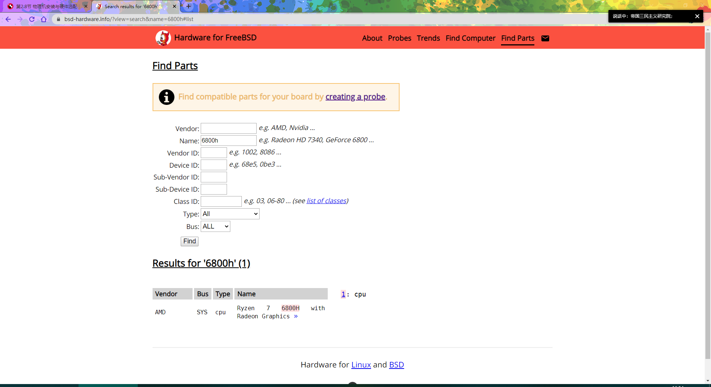
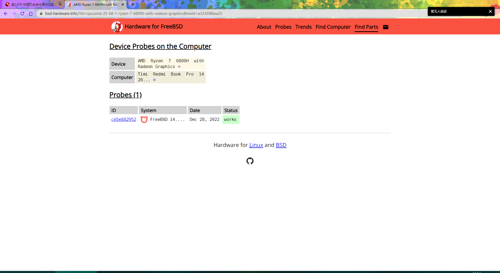
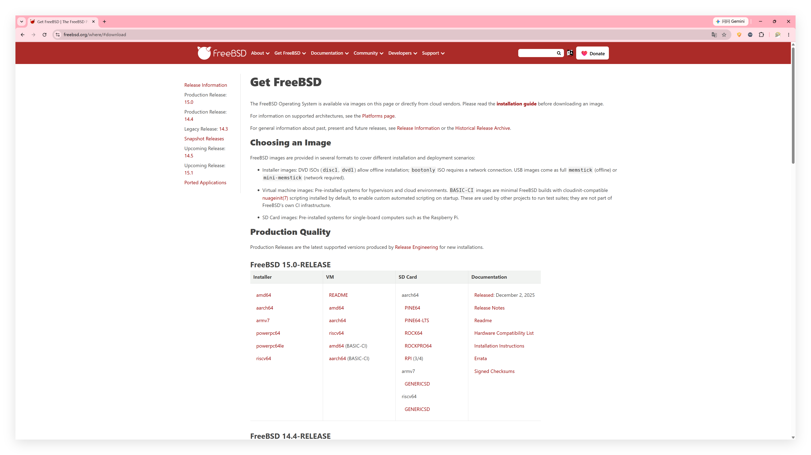
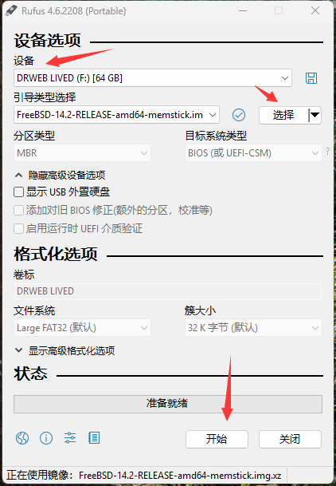

# 2.1 安装前的准备工作

在部署 FreeBSD 系统之前，需完成硬件兼容性评估、安装介质准备与制作等前期工作。

本节从硬件需求分析入手，逐步引导读者完成系统安装前的各项准备工作。

## 硬件兼容性

本节介绍 FreeBSD 系统的最低硬件需求与硬件支持情况。

### 最低硬件需求

amd64（又称 x86-64）是 64 位 x86 架构的扩展，广泛应用于现代个人计算机与服务器。针对 amd64 架构，14.2-RELEASE 版本在虚拟机环境中测得的最低硬件需求如下：

- 硬盘：
  - 仅安装基本系统：约 550 MB
  - 安装 KDE 桌面环境（通过 pkg 安装后）：约 15 GB
- 内存：
  - 统一可扩展固件接口（UEFI）模式下：最小 128 MB
  - 基本输入输出系统（BIOS）模式下：最小 64 MB

UEFI（Unified Extensible Firmware Interface）是现代计算机的固件接口标准，替代了传统的 BIOS，提供更强大的启动管理功能。BIOS（Basic Input/Output System）是早期计算机的固件接口。

### 实测硬件兼容性

下表列出了部分硬件的实测支持情况：

| 硬件类别 | 系列 | 实测型号 | 备注 |
| -------- | ---- | -------- | ---- |
| CPU | Intel Alder Lake（含混合架构与纯 E-core 架构） | i7-1260P、N100 | 可正常启动运行，但调度机制尚不完善，睿频功能受限。i7-1260P 为混合架构（P-core + E-core），N100 为纯 E-core 架构（4 个 Gracemont 核心） |
| NVMe 固态硬盘 | M.2 接口 | 英睿达 P310、Intel 600P、梵想 S530Q、S500Pro、S542PRO | 正常工作 |
| 无线网卡 | Intel AX 系列 | AX200 | Wi-Fi 5 速率与 Windows 11 IoT Enterprise 24H2 相当（使用 iperf2 测得） |
| 有线网卡 | Realtek 2.5 G | RTL8125B | 需要额外安装驱动程序，参见本书附录 |
| 有线网卡 | Intel 2.5 G | i226-V | 正常工作 |
| 显卡 | 近十年的 Intel 及 AMD 集成/独立显卡 | 英特尔锐炬® Xe 显卡、英特尔 HD Graphics 4000 | 支持程度与 DRM 驱动程序移植进度相关；截至写作时，FreeBSD 14.x 使用 drm-61-kmod（基于 Linux 6.1），FreeBSD 15.0+ 使用 drm-66-kmod（基于 Linux 6.6），最新非 LTS 版本 drm-latest-kmod 基于 Linux 6.9，最新进展参见 FreeBSD Project. drm-kmod: drm driver for FreeBSD[EB/OL]. [2026-03-25]. <https://github.com/freebsd/drm-kmod/pulls>. 该仓库提供 FreeBSD 图形驱动程序内核模块更新，追踪 Linux DRM 驱动程序移植进度。 |
| NVIDIA 显卡 | 近十多年的显卡 | GTX 850M | 受 NVIDIA 官方显卡驱动程序支持 |

> **注意**
>
> FreeBSD 尚未完全支持安全启动，参见：FreeBSD Project. SecureBoot[EB/OL]. [2026-03-25]. <https://wiki.freebsd.org/SecureBoot>. 该页面提供 FreeBSD 安全启动相关状态信息。在安装 FreeBSD 前，请务必关闭安全启动（Secure Boot）。此外，FreeBSD 也不支持 Fake RAID（伪 RAID），需将控制器模式修改为 AHCI。
>
> Fake RAID 是由主板 BIOS/固件提供的软件 RAID 功能，依赖操作系统驱动程序支持，并非真正的硬件 RAID。AHCI（Advanced Host Controller Interface）是 SATA 控制器的标准工作模式，提供原生支持 SATA 设备的高级特性。
>
> 操作方法：进入 BIOS/UEFI 设置界面，找到存储控制器相关选项，将其模式从 RAID 改为 AHCI 后保存重启。具体菜单位置因主板型号而异，可参考主板说明书。

### 特定硬件兼容性查询

除上述实测硬件外，更多硬件的支持情况可参考以下外部资源。

bsd-hardware.info. Hardware for BSD[EB/OL]. [2026-03-25]. <https://bsd-hardware.info/?view=search>. 该平台提供 BSD 系统硬件兼容性数据库，可用于查询设备支持情况。





> **注意**
>
> 建议进行实际测试，因为该网站也可能出现错误，例如将 LPDDR5 误识别为 LPDDR4。

## 下载 FreeBSD 镜像

了解硬件支持情况后，开始下载 FreeBSD 镜像。首先访问 FreeBSD 项目官网：<https://www.freebsd.org/>。


点击黄底红字的 `Download FreeBSD`，页面将跳转至下载页面：



> **技巧**
>
> 随着时间推移，读者进行下载时可能已无 14.2-RELEASE 版本。此时只需选择列表最顶部的 `FreeBSD-X.Y-RELEASE`（该版本推荐用于生产环境）。其中，`X.Y` 应为比 `14.2` 更大的版本号，如 `15.0`、`16.0` 等，但须注意其应以 `RELEASE` 结尾，而非 `CURRENT`。

> **警告**
>
> 使用非 RELEASE 版本的用户应有时间和意愿关注开发动态，浏览邮件列表与问题追踪系统，例如 FreeBSD Project. freebsd-src/UPDATING[EB/OL]. [2026-03-25]. <https://github.com/freebsd/freebsd-src/blob/main/UPDATING>. 该文件记录着系统更新重大变更，及 FreeBSD Project. freebsd-src/RELNOTES[EB/OL]. [2026-03-25]. <https://github.com/freebsd/freebsd-src/blob/main/RELNOTES>. 该文件提供发行版发布说明与新特性等文档。同时要求用户具备一定的探索和实践能力。否则，建议使用 RELEASE 版本。

| Installer | VM | SD Card | Documentation |
| --------- | -- | ------- | ------------- |
| 安装镜像 | 虚拟机预安装镜像 | 存储卡镜像 | 文档 |
| 适用于常规安装 | 适用于云平台和虚拟机 | 适用于单板机/嵌入式设备 | 发行说明等文档 |

> **技巧**
>
> 若不确定选择哪种镜像，请选择 `Installer`（标准个人计算机，Apple 除外）。

> **技巧**
>
> 若不明确 `amd64`、`i386`、`aarch64`、`armv7` 这些架构的区别，请选择 `amd64`（适用于大多数标准个人计算机，Apple 电脑除外）。

选择好安装镜像的主要类型后，将显示具体的下载列表：


```sh
File Name                                          File Size      Date
Parent directory/                                  -              -
CHECKSUM.SHA256-FreeBSD-14.2-RELEASE-amd64         1171           2024-Nov-29 14:11
CHECKSUM.SHA512-FreeBSD-14.2-RELEASE-amd64         1811           2024-Nov-29 14:09
FreeBSD-14.2-RELEASE-amd64-bootonly.iso            459491328      2024-Nov-29 13:04
FreeBSD-14.2-RELEASE-amd64-bootonly.iso.xz         100595956      2024-Nov-29 13:04
FreeBSD-14.2-RELEASE-amd64-disc1.iso               1310040064     2024-Nov-29 13:05
FreeBSD-14.2-RELEASE-amd64-disc1.iso.xz            855850608      2024-Nov-29 13:05
FreeBSD-14.2-RELEASE-amd64-dvd1.iso                4826406912     2024-Nov-29 13:05
FreeBSD-14.2-RELEASE-amd64-dvd1.iso.xz             3812250832     2024-Nov-29 13:05
FreeBSD-14.2-RELEASE-amd64-memstick.img            1559351808     2024-Nov-29 13:05
FreeBSD-14.2-RELEASE-amd64-memstick.img.xz         867177260      2024-Nov-29 13:05
FreeBSD-14.2-RELEASE-amd64-mini-memstick.img       564220416      2024-Nov-29 13:04
FreeBSD-14.2-RELEASE-amd64-mini-memstick.img.xz    107445036      2024-Nov-29 13:04
```

上述列表中，第一列为文件名，第二列为文件大小，第三列为文件构建日期（非发行日期）。

| 首列 | 说明 |
| :--- | :--- |
| Parent directory/ - - | 指向上级目录 |
| CHECKSUM.SHA256-FreeBSD-14.2-RELEASE-amd64 | 本页所有镜像的 SHA256 校验和 |
| CHECKSUM.SHA512-FreeBSD-14.2-RELEASE-amd64 | 本页所有镜像的 SHA512 校验和 |
| FreeBSD-14.2-RELEASE-amd64-bootonly.iso | 网络安装镜像，安装时需要联网 |
| FreeBSD-14.2-RELEASE-amd64-bootonly.iso.xz | 压缩的网络安装镜像，安装时需要联网 |
| FreeBSD-14.2-RELEASE-amd64-disc1.iso | 标准安装镜像 |
| FreeBSD-14.2-RELEASE-amd64-disc1.iso.xz | 压缩的标准安装镜像 |
| FreeBSD-14.2-RELEASE-amd64-dvd1.iso | DVD 镜像，相比标准安装镜像包含了更多软件包（pkg） |
| FreeBSD-14.2-RELEASE-amd64-dvd1.iso.xz | 压缩的 DVD 镜像，相比标准安装镜像包含了更多软件包（pkg） |
| FreeBSD-14.2-RELEASE-amd64-memstick.img | U 盘用的镜像（可以使用 Rufus 制作 U 盘启动盘） |
| FreeBSD-14.2-RELEASE-amd64-memstick.img.xz | 压缩的 U 盘用的镜像（无需解压缩，可以使用 Rufus 制作 U 盘启动盘） |
| FreeBSD-14.2-RELEASE-amd64-mini-memstick.img | U 盘用的网络安装镜像，安装时需要联网 |
| FreeBSD-14.2-RELEASE-amd64-mini-memstick.img.xz | 压缩的 U 盘用的网络安装镜像，安装时需要联网 |

.xz 是一种高压缩比的文件压缩格式，常用于缩小软件发行包的体积。SHA256 和 SHA512 是密码哈希函数，用于生成文件的唯一指纹，校验和（Checksum）则是通过这些函数计算出的固定长度字符串，用于验证文件完整性。

需要注意的是，DVD 镜像并不包含所有离线软件包，仅精选了若干软件包，具体清单可参见源代码文件 FreeBSD Project. freebsd-src/release/scripts/pkg-stage.sh[EB/OL]. [2026-03-25]. <https://github.com/freebsd/freebsd-src/blob/main/release/scripts/pkg-stage.sh>. 该脚本定义 DVD 镜像包含的预安装软件包清单。

FreeBSD 的所有安装介质（包括但不限于虚拟机镜像）默认均不提供图形界面，需由用户自行安装和配置。DVD 镜像虽包含更多软件包，但由于图形界面依赖关系复杂，且 DVD 上的软件包版本可能较旧，在安装图形界面时仍可能遇到依赖冲突或版本不匹配问题，因此不建议使用 DVD 镜像。

> **技巧**
>
> 网络传输可能产生错误，导致下载的文件与原始镜像不一致。因此，需要一种机制来验证所获取的文件与官方发布的镜像完全一致，这就需要使用 **校验和**。Windows 10 和 11 系统自带命令行工具 `CertUtil`，可用于计算校验和，无需安装额外软件。读者还可参考 Dell Technologies. 如何确定用于安全应用程序的文件 SHA-256 哈希[EB/OL]. [2026-03-25]. <https://www.dell.com/support/kbdoc/zh-cn/000130826/%E5%A6%82%E4%BD%95%E7%A1%AE%E5%AE%9A%E7%94%A8%E4%BA%8E%E5%AE%89%E5%85%A8%E5%BA%94%E7%94%A8%E7%A8%8B%E5%BA%8F%E7%9A%84%E6%96%87%E4%BB%B6-sha-256-%E5%93%88%E5%B8%8C>. 该文档介绍 Windows 系统下文件 SHA-256 哈希值计算方法。

FreeBSD 镜像 BT 种子下载地址（非官方，建议检查文件校验和后使用）：<https://fosstorrents.com/distributions/freebsd/>

- RELEASE 正式版镜像下载地址
  - 虚拟机用：<https://download.freebsd.org/ftp/releases/amd64/amd64/ISO-IMAGES/15.0/FreeBSD-15.0-RELEASE-amd64-disc1.iso>
  - 物理机用：<https://download.freebsd.org/ftp/releases/amd64/amd64/ISO-IMAGES/15.0/FreeBSD-15.0-RELEASE-amd64-memstick.img>
- CURRENT 开发版下载地址（仅限专业用户）
  - 虚拟机用：<https://download.freebsd.org/snapshots/amd64/amd64/ISO-IMAGES/16.0/>
  - 物理机下载 `-amd64-memstick.img` 或 `-amd64-memstick.img.xz` 结尾的文件

由于版本迭代，实际情况可能已发生变化，请自行查阅，选择合适的 RELEASE 版本用于生产环境。

FreeBSD `-RELEASE` 历史版本下载地址：

- 5.1-RELEASE 至 9.2-RELEASE <http://ftp-archive.freebsd.org/pub/FreeBSD-Archive/old-releases/amd64/ISO-IMAGES>
- 9.3-RELEASE 至最新的 `-RELEASE` 版本 <http://ftp-archive.freebsd.org/pub/FreeBSD-Archive/old-releases/ISO-IMAGES/>

## 刻录 FreeBSD 镜像

下载 FreeBSD 镜像后，需要将其刻录到 U 盘上才能进行安装。本节将介绍如何刻录 FreeBSD 镜像到 U 盘。

### 推荐镜像格式

制作 U 盘安装介质时，建议使用 `-img` 或 `-img.xz` 格式的镜像。`.iso` 镜像采用混合启动（Hybrid）模式，该模式同时支持从光驱和 U 盘启动，但可能未完全遵循 UEFI 规范，直接写入 U 盘可能导致启动错误。详见 FreeBSD Project. FreeBSD -.iso files not support written to USB drive[EB/OL]. [2026-03-25]. <https://bugs.freebsd.org/bugzilla/show_bug.cgi?id=236786>. 该 Bug 报告记录了 ISO 镜像直接写入 USB 设备的兼容性问题。建议读者仅在使用光学介质、虚拟机或云平台安装时选用 `iso` 结尾的镜像。

当然，也存在例外情况。部分机器的 UEFI 固件支持从 `.iso` 镜像刻录的 U 盘启动（例如一些老款神舟电脑），但并非所有机器都支持此方式（例如部分小米电脑可能无法引导）。

由于设备类型多样，即使在某台机器上测试通过，FreeBSD 的两个 ISO 镜像仍无法排除出现兼容性问题的可能性。若遇到引导问题，请首先尝试使用 Rufus 对 `img` 镜像进行刻录。

### Windows 平台下 Rufus 刻录方法

不同操作系统平台上有不同的镜像刻录工具推荐。

Windows 平台建议优先使用 **Rufus**，Linux 平台可直接使用 `dd` 命令进行镜像刻录。

Rufus 下载地址为 <https://rufus.ie/zh>，该工具为 Windows 平台开源 USB 启动盘制作工具。

当使用 Rufus 刻录镜像时，无需解压缩文件，直接选择 `-img.xz` 制作启动盘。



**不建议** 使用 FreeBSD 手册中提到的 win32diskimager，因其对某些镜像格式的处理存在缺陷，尽管实际文件校验和正确，但有时会错误地报告校验失败。类似地，**同样不建议** 使用 Ventoy。Ventoy - 多系统启动 USB 启动盘制作工具[EB/OL]. [2026-03-25]. <https://www.ventoy.net/>. 该工具为多系统启动 USB 启动盘制作工具，直接加载 ISO 或 IMG 镜像文件，但 Ventoy 的启动加载机制与 FreeBSD 镜像不完全兼容，可能导致启动失败。

**读者应仅在 Rufus 无效的情况下再使用 win32diskimager 或 Ventoy。**

win32diskimager 的下载地址为 <https://sourceforge.net/projects/win32diskimager/files/Archive/>，选择 `win32diskimager-1.0.0-install.exe` 进行下载。

> **思考题**
>
> > 有时候绕远路是必须的，人生是片森林，人们终究会再次迷路，短暂相遇。正所谓“念念不忘，必有回响”。然而，人们清醒地意识到，没有什么“必有回响”，有的只是“没有结局的开始”或者“稍纵即逝的追寻”。没有任何人许诺回响，这只是某种哲学层面的寄托，让人们与这种现实“和解”。“念念不忘，必有回响”的完整说明并非李叔同所述，而是源于当代人的《李叔同〈晚晴集〉人生解读》（王少农. 李叔同《晚晴集》人生解读[M]. 北京：线装书局，2008.）其中上半句“念念不忘”亦非李叔同原作，而是看似引用了南宋王龙舒《龙舒净土文卷第四》“蓋欲念念不忘也。如此久久念心成熟。”其中在清俞行敏重辑《净土全书》一书的“净土起信”中同样有类似描述“净土指归云：欲了生死，修行净业，当发十种信心，念念不忘，决生净土。”，再次索引到《净土指归集》，实际上是绕回了《佛说四谛经》，载“亦观持宿命，亦从得道行，念世间行不可悔，摄、止、度世、无为、寂然、止见、一德、无所著、如解脱意观念想念，从念念、念不忘、少言、念不离，是名为直正念，是名为道德谛。”由于这是汉传佛教，在历史上被记载为安世高的翻译贡献，我们需要看看原本可能的样子。查《佛说四谛经》，实际对应于中阿含经《分别圣谛经》，即对应《巴利三藏》的《中部》的《一四一分别谛经》（段晴，范晶晶，等，译. 汉译巴利三藏·经藏·中部[M]. 上海：中西书局，2022：963-965.）。是这样写的：“众仁友，何为正念？此谓比丘于身循观身，精勤，正知，具念，于世间戒除贪与忧；于诸受（……）于心（……）于诸法循观法，精勤，正知，具念，于世间断除贪与忧。这被称为正念。”可以清晰地看出，“念念不忘”实际上对应的是“具念”（巴利语 sati），在文献中往往又被翻译为“念”“正念”。实际上我们知道，在任何早期人类宗教活动中，传递的思想都是当时最合适不过的道德思想和伦理行为，也是最质朴，最清楚明白的，任何过于复杂的理论绝不可能流传数千年。因此，我们有必要怀疑这种“念念不忘”说法的合理性。在不同的学术观点中对此看法存在较大差异，但是无可辩驳的是，在佛教最早期的发展中，不可能有任何超越当时信众知识结构、道德伦理、认知能力的理论被普遍认可。因此，我们无需考察任何文本，越是从经验出发的理解，却往往是最接近合理性的存在。念念不忘实质上接近这种说法：“厨师一定要会做饭、水一定往低处流”，即，xx 就是 xx。可以看到，“念念不忘”与当代欧陆哲学产生了深切共鸣，不是让事情回到本身，而是认识到，有些时候，事情就是本身。“大音希声”。“一切真历史都是当代史”（Croce B. 历史学的理论和历史[M]. 田时纲，译. 北京：中国社会科学出版社，2018），但无论是玄奘短命的“法相唯识宗”，还是“念念不忘”的本义，都向我们启示着一个深邃的事实，“一切真历史都是古代史”。“谁试图诠释历史，谁就在篡改历史。讨论真假无非是在争夺自己的话语权。”历史学是一种解释学。佛经和道教经文的文言文呈现方式仍是绝对主流，且无定本；而与此同时，基督教两会甚至出版了官方的《拼音版圣经》。但在过去，甚至如今的天主教，保守也是常态。形式上的精致化现代化与内在的理论嬗变的平衡是大多数理论发展的痛点。后人对前人的经典论述究竟是形成了一层又一层的遮蔽，还是使其精致化顺应时代发展？我们现在看到的，持有的意见，究竟有几分是最初作者的面貌？后人往往通过注解经典来阐发自己的观点，甚至托名作书。念念不忘，恰巧就是指出一个道理，“没有回响才是常态”，这不是固执的坚持和重复，而是理解到一个无数人提及的话语，我们本就一无所有，唯一重要的事情只有生或死。念念不忘，不是执着于铭记，而是发现，我们感知到什么，那就是什么。与其说我们一生都在选择，不如说我们一生都在等待，等待回响。
>
>
> 如何理解“念念不忘”与“必有回响”的关系？
>
> 如果一切都是临时的，短暂的。那么，会不会有一天，有那么一刻，恰巧宇宙本身也不存在了？

## 附录：FreeBSD 兼容的以太网卡

以太网卡是最常见的网络适配器类型，FreeBSD 对多种以太网卡提供了良好支持。

### Realtek（螃蟹卡）

Realtek RTL8125 是一款常见的 2.5 G 以太网卡。在消费级市场中，常见的 2.5 G 网卡多采用该型号芯片。在安装 FreeBSD 前，可在 Windows 设备管理器中查看硬件标识，确认网卡型号是否为 RTL8125。


> **技巧**
>
> RTL8125 在 FreeBSD 下默认没有驱动，需手动安装。最简单的方法是通过手机 USB 共享网络临时上网，具体方法见本书其他部分。安装网卡驱动后需重启系统。

#### 支持列表

在安装驱动之前，需确认当前网卡型号是否在支持列表中。

- 5 G 网卡
  - RTL8126
- 2.5 G 网卡
  - RTL8125 / RTL8125B(G)
- 10/100/1000M 网卡
  - RTL8111B / RTL8111C / RTL8111D / RTL8111E / RTL8111F / RTL8111G
    RTL8111H / RTL8118(A) / RTL8119I / RTL8111L / RTL8111K
  - RTL8168B / RTL8168E / RTL8168H
  - RTL8111DP / RTL8111EP(P) / RTL8111FP
  - RTL8411 / RTL8411B
- 10/100 M 网卡
  - RTL8101E / RTL8102E / RTL8103E / RTL8105E / RTL8106E / RTL8107E
  - RTL8401 / RTL8402

#### Realtek 以太网卡驱动安装方法

确认网卡型号在支持列表中后，按照以下步骤安装驱动。

- 使用 pkg 安装：

```sh
# pkg install realtek-re-kmod
```

- 使用 Ports 安装：

```sh
# cd /usr/ports/net/realtek-re-kmod/
# make install clean
```

在编译安装时，需确保 `/usr/src` 目录下有源代码。

```sh
/usr/
├── ports/
│   └── net/
│       └── realtek-re-kmod/  # Realtek 网卡驱动 Ports 目录
└── src/                      # 系统源代码目录（编译驱动时需要）
```

> **技巧**
>
> 如果 Realtek 网卡仍存在断流、时断时续等情况，可尝试使用 net/realtek-re-kmod198[EB/OL]. [2026-03-26]. <https://www.freshports.org/net/realtek-re-kmod198/>，参见：Bug 275882 - net/realtek-re-kmod: Problem with checksum offload since +199.00[EB/OL]. [2026-03-26]. <https://bugs.freebsd.org/bugzilla/show_bug.cgi?id=275882>。

相关文件结构：

```sh
/boot/
├── loader.conf        # 系统启动加载器配置文件
└── modules/
    └── if_re.ko       # re 网卡驱动内核模块
```

编辑 `/boot/loader.conf` 文件，写入以下两行：

```ini
if_re_load="YES"                 # 设置开机自动加载 re 网卡驱动模块
if_re_name="/boot/modules/if_re.ko"   # 指定 re 网卡驱动模块路径
```

默认情况下已启用巨型帧。巨型帧是指大于标准以太网帧（1500 字节）的帧，通常为 9000 字节。巨型帧可减少网络开销、提升传输效率，但在某些网络环境下可能导致兼容性问题。如需关闭以优化网速（例如网速过慢时），可执行以下操作：

```sh
# echo 'hw.re.max_rx_mbuf_sz="2048"' >> /boot/loader.conf # 设置 re 网卡接收缓冲区最大尺寸为 2048，以优化网络性能
```

要启用 WOL 唤醒：

```sh
# echo 'hw.re.s5wol="1"' >> /boot/loader.conf          # 启用 re 网卡的 S5 唤醒功能（支持休眠唤醒）
# echo 'hw.re.s0_magic_packet="1"' >> /boot/loader.conf  # 启用 re 网卡的魔术包唤醒功能（Magic Packet Wake-on-LAN）
```

完成以上设置后，需重启系统使其生效。

参考文献：

- FreshPorts. realtek-re-kmod: Kernel driver for Realtek PCIe Ethernet Controllers[EB/OL]. [2026-03-25]. <https://www.freshports.org/net/realtek-re-kmod>. FreshPorts 上的 Realtek 网卡驱动页面，提供安装信息与版本更新。

### Intel 网卡

Intel 网卡也是常见的网络适配器类型，FreeBSD 对其提供了良好支持。

#### 2.5 G

英特尔 i225-V 和 i226-V 2.5 G 网卡默认可驱动，无需额外配置。已在 I226-V rev04 型号上测试通过，使用 `igc` 驱动，网卡显示为 `igc0` 样式。

支持列表：

- I225-LM（商业端产品线，服务器用）
- I225-V（桌面端产品线，常见于家用台式机）
- I225-IT
- I225-K

参考文献：

- FreeBSD Project. igc: Intel Ethernet Controller I225 driver[EB/OL]. [2026-03-25]. <https://man.freebsd.org/cgi/man.cgi?query=igc>. 手册页，详述了 Intel i225 网卡驱动的使用方法。

#### 千兆和百兆及其他以太网卡

除了 2.5 G 网卡外，Intel 还有其他多种型号的以太网卡。i210 和 i211 网卡由 em 驱动，通常无需额外配置便可使用，但尚未进行测试。

支持列表及更多参见：

- FreeBSD Project. em, lem, igb: Intel(R) PRO/1000 Gigabit Ethernet adapter driver[EB/OL]. [2026-03-25]. <https://man.freebsd.org/cgi/man.cgi?query=em>. 手册页，涵盖 Intel PRO/1000 系列千兆网卡驱动说明。

## 附录：USB 网卡推荐

USB 网卡具有便携性强、使用方便的特点，适合临时使用或设备没有内置网卡的情况。以下介绍 USB 网卡的相关推荐。

> **警告**
>
> 千兆和 2.5 G 网卡在 15.0-RELEASE 以前都有时断时续的故障。如果有更好的推荐（稳定不掉线）请提交 PR。
>
> 对于 2.5 G USB 网卡，目前可选的型号似乎仅有 RTL8156 和 RTL8156B。

| 类型 | 品牌/型号 | 芯片组/参数 | 售价（¥） | 备注 |
| ---- | --------- | ----------- | --------- | ---- |
| USB 以太网卡 | 绿联 USB 百兆网卡 CR110 | AX88772A 100M | 40 | / |
| USB 以太网卡 | 绿联 USB 千兆网卡 CM209 | AX88179A 1000M | 79 | 在 15.0-RELEASE 以前断流 |
| Type-C 以太网卡 | 绿联 Type-C 转百兆网卡 30287 | AX88772A 100M | 59 | / |
| Type-C 以太网卡 | 绿联 Type-C 转千兆网卡 CM199 | AX88179A 1000M | 99 | 在 15.0-RELEASE 以前断流。在树莓派 5 上的测试表明，目前 15.0-RELEASE 下的 AX88179A 和 RTL8156B 网卡均可持续稳定运行，不会断流，最长连续运行时间超过 72 小时 |
| USB 无线网卡 | COMFAST CF-WU810N（已停产） | RTL8188EUS 2.4 G 150 M | 20 | 由 rtwn 驱动 |
| USB 无线网卡 | COMFAST CF-912AC | RTL8812AU 2.4 G & 5 G 1200 M | 60 | 由 rtwn 驱动 |
| USB 无线网卡 | COMFAST CF-915AC | RTL8811AU 2.4 G & 5 G 600 M | 49 | 由 rtwn 驱动，理论上支持，未经实际测试，无论是否支持，都请提交 issue |
| USB 无线网卡 | 绿联 N300 M | RTL8192EU 2.4 G 300 M | 30 | 由 rtwn 驱动，理论上支持，未经实际测试，无论是否支持，都请提交 issue |
| USB 无线网卡 | 绿联 AC 1300 M-双频 | RTL8812AU 2.4 G & 5 G 1300 M | 129 | 由 rtwn 驱动，理论上支持，未经实际测试，无论是否支持，都请提交 issue |
| USB 以太网卡 | 绿联 USB 2.5 G 网卡 CM275 | RTL8156 2.5 G | 189 | 在 15.0-RELEASE 以前断流 |
| Type-C 以太网卡 | 绿联 Type-C 转 2.5 G 网卡 | RTL8156 2.5 G | 199 | 在 15.0-RELEASE 以前断流 |

VendorID（厂商标识）和 ProductID（产品标识）是 USB/PCI 设备的两个标准标识符，驱动程序通过这两个 ID 来识别和匹配硬件。

相同芯片组的硬件可能由不同厂商生产，使用不同的 VendorID/ProductID。

如果仅凭芯片组信息购买网卡，FreeBSD 很可能不支持其 `VendorID` 和 `ProductID`，例如 DOREWIN 达而稳。

在这种情况下，需联系驱动开发者将硬件信息加入驱动，并重新编译内核才能使用。

相关 Bug 反馈：

- FreeBSD Bugzilla. Bug 166724 - if_re(4): watchdog timeout[EB/OL]. [2026-03-25]. <https://bugs.freebsd.org/bugzilla/show_bug.cgi?id=166724>. 记载了 Realtek 网卡驱动看门狗超时问题的历史 Bug 报告。
- FreeBSD Bugzilla. Bug 267514 - AXGE(4) ASIX AX88179A ue0: link state changed to DOWN[EB/OL]. [2026-03-25]. <https://bugs.freebsd.org/bugzilla/show_bug.cgi?id=267514>. 记载了 ASIX USB 千兆网卡连接不稳定问题的 Bug 报告。
- FreeBSD Project. if_re(4) -- Realtek PCI Ethernet driver[EB/OL]. [2026-04-17]. <https://man.freebsd.org/cgi/man.cgi?query=if_re&sektion=4>. Realtek PCI 以太网卡驱动手册页。
- FreeBSD Project. axge(4) -- ASIX USB Gigabit Ethernet driver[EB/OL]. [2026-04-17]. <https://man.freebsd.org/cgi/man.cgi?query=axge&sektion=4>. ASIX USB 千兆网卡驱动手册页。
- FreeBSD Project. rtwn(4) -- Realtek USB IEEE 802.11 wireless network driver[EB/OL]. [2026-04-17]. <https://man.freebsd.org/cgi/man.cgi?query=rtwn&sektion=4>. Realtek USB 无线网卡驱动手册页。
- FreeBSD Project. igb(4) -- Intel PRO/1000 Gigabit Ethernet adapter driver[EB/OL]. [2026-04-17]. <https://man.freebsd.org/cgi/man.cgi?query=igb&sektion=4>. Intel PRO/1000 千兆网卡驱动手册页。
- FreeBSD Project. pciconf(8) -- PCI configuration utility[EB/OL]. [2026-04-17]. <https://man.freebsd.org/cgi/man.cgi?query=pciconf&sektion=8>. PCI 设备配置工具手册页。
- FreeBSD Project. usbconfig(8) -- USB configuration utility[EB/OL]. [2026-04-17]. <https://man.freebsd.org/cgi/man.cgi?query=usbconfig&sektion=8>. USB 设备配置工具手册页。

## 附录：共享硬件数据到数据库

若读者希望上传自己的数据到 <https://bsd-hardware.info>，与社区共享，可参照本节进行。

### 安装 hw-probe

- 使用 pkg 安装 hw-probe：

```sh
# pkg install hw-probe
```

- 或者还可以使用 Ports 安装 hw-probe：

```sh
# cd /usr/ports/sysutils/hw-probe/
# make install clean
```

### 上传硬件数据

执行以下命令可采集硬件信息并上传到 hw-probe 数据库：

```sh
# hw-probe -all -upload
Probe for hardware ... Ok
Reading logs ... Ok
Uploaded to DB, Thank you!

Probe URL: https://bsd-hardware.info/?probe=f64606c4b1
```

访问上述链接可查看设备信息。此处上传的为 Radxa x4 的配置信息。

其他操作系统可参见 linuxhw. hw-probe/INSTALL.BSD.md[EB/OL]. [2026-03-25]. <https://github.com/linuxhw/hw-probe/blob/master/INSTALL.BSD.md>，该文档提供 BSD 系统上 hw-probe 工具的安装说明。

## 课后习题

1. 下载最新版本 FreeBSD -RELEASE 的 memstick 镜像，使用 CertUtil 计算其 SHA256 校验和，同官方 CHECKSUM 文件进行比对验证。

2. 查阅 bsd-hardware.info 网站，查找当前设备的硬件兼容性信息，如果可以安装 FreeBSD，则使用 hw-probe 工具将自己的硬件数据上传到该平台。
