# 2.3 FreeBSD 13/14 安装指南（AMD64）

FreeBSD 13.x 和 14.x 系列作为稳定的长期支持版本，在生产环境中仍被广泛采用。其安装流程与 15.x 存在差异。以下是针对这些版本的标准化安装指南。

## 使用 bsdinstall 开始安装

在开始安装前，可先了解相关视频教程。

> **技巧**
>
> 视频教程见 Bilibili. FreeBSD 14.2 基础安装配置教程[EB/OL]. [2026-03-25]. <https://www.bilibili.com/video/BV1STExzEEhh>（物理机）和 Bilibili. 002-VMware17 安装 FreeBSD 14.2[EB/OL]. [2026-03-25]. <https://www.bilibili.com/video/BV1gji2YLEoC>（虚拟机），提供 FreeBSD 安装视频演示。

---

以下安装说明基于 FreeBSD-14.3-RELEASE-amd64-disc1.iso，`-dvd1.iso` 和 `-memstick.img` 的安装流程与之类似。

> **警告**
>
> 本节基于 VMware 17 进行演示（使用 UEFI）。

> **警告**
>
> 若是物理机，请考虑使用 Rufus. Rufus - Create bootable USB drives the easy way[EB/OL]. [2026-03-25]. <https://rufus.ie/zh/>，该工具为 Windows 平台开源 USB 启动盘制作工具，搭配 FreeBSD Project. FreeBSD-14.3-RELEASE-amd64-memstick.img[EB/OL]. [2026-03-25]. <https://download.freebsd.org/ftp/releases/amd64/amd64/ISO-IMAGES/14.3/FreeBSD-14.3-RELEASE-amd64-memstick.img>，该文件为 FreeBSD 14.3-RELEASE amd64 架构的 U 盘安装镜像，制作启动盘。

> **警告**
>
> 如果要在 VMware 虚拟机中使用 UEFI，必须使用 FreeBSD 13.0-RELEASE 及以上版本，否则启动时可能出现显示异常。

## 启动安装盘

准备工作就绪后，即可从安装盘启动系统。

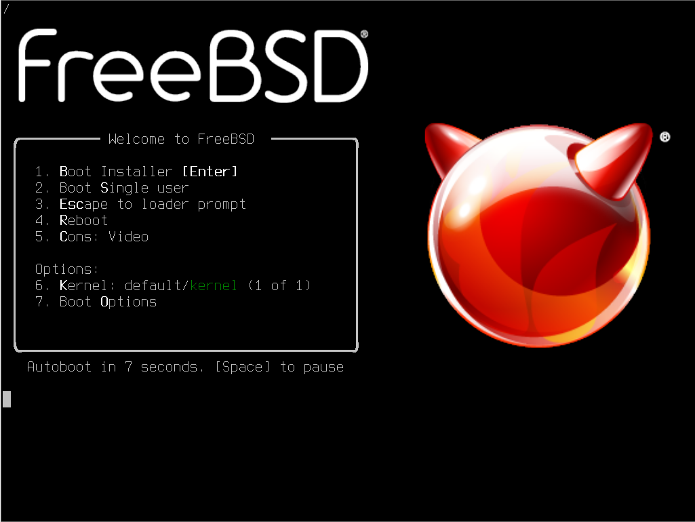

在此界面无需任何操作，等待 10 秒可自动进入 `1. Boot Installer [Enter]`；也可直接按 **回车键** 进入。

按 **空格键** 可暂停启动流程，并选择以下选项。

> **技巧**
>
> 若按其他任意键会进入提示符 `OK`，可输入 `menu` 再按 **回车键** 返回菜单。

以下操作中，可通过按选项前的数字进行选择。

`on` 代表已开启，`off` 代表已关闭。

| 选项 | 解释 |
| :--- | :--- |
| `1. Boot Installer [Enter]` | 用于安装 FreeBSD 系统 |
| `2. Boot Single user` | 单用户模式，找回 root 密码和修复磁盘时会用到 |
| `3. Escape to loader prompt` | 离开菜单，进入命令模式；进入后输入 reboot 并按回车键可重启系统 |
| `4. Reboot` | 重启 |
| `5. Cons: Video` | 选择输出模式：视频（`Video`）、串口（`Serial`）、同时输出，但串口优先（`Dual (Serial primary)`）、同时输出，但视频优先（`Dual (Video primary)`，可选） |
| `6. Kernel: default/kernel (1 of 1)` | 选择要启动的内核 |


| 7. Boot Options | 启动参数 |
| --------------- | -------- |
| `1. Back to main menu [Backspace]` | 按 **Backspace 键** 可返回上级菜单 |
| `2. Load System Defaults` | 恢复默认配置 |
| `3. ACPI` | Advanced Configuration and Power Interface，高级配置和电源接口 |
| `4. Safe Mode` | 安全模式 |
| `5. Single user` | 单用户模式 |
| `6. Verbose` | 详细模式，输出更多调试信息 |

> **警告**
>
> 值得注意的是，部分教程建议关闭 ACPI，然而此做法在当前计算环境中缺乏合理依据。对于现代 x86 计算机，并无关闭 ACPI 的必要。ACPI 涉及电源状态管理、设备节能、多处理器支持等关键功能。关闭 ACPI 应被视为一种遗留操作，通常仅适用于不支持 UEFI 的旧式计算机。
>
> 若出现 ACPI 相关报错，属于常见现象，多数情况下不影响系统使用。通常可通过更新 BIOS 解决。在极少数情况下，可能需要对 SSDT（次级系统描述表）和 DSDT（差异化系统描述表）进行修补，黑苹果用户可能对此过程较为熟悉。

## 使用 `bsdinstall` 进行安装流程

按 **回车键** 或等待 10 秒，将自动进入以下界面。


> **技巧**
>
> 此界面由 `bsdinstall` 工具提供。
>
> 本节将指导用户如何使用该工具进行 FreeBSD 安装。该工具不仅存在于安装镜像中，安装完成后在新系统中依然可以找到，并且还可用于执行普通的安装流程（此特性在高级安装方式中非常有用）。
>
> `bsdinstall` 工具本质上是由一系列 sh 脚本构成的，其源代码位于 FreeBSD Project. freebsd-src/usr.sbin/bsdinstall[EB/OL]. [2026-03-25]. <https://github.com/freebsd/freebsd-src/tree/main/usr.sbin/bsdinstall>。该仓库提供 FreeBSD 系统安装工具源代码，脚本位于“scripts”文件夹。

安装程序显示欢迎菜单：

`欢迎使用 FreeBSD！想要开始安装还是使用 Live 系统？`

选中左侧 `Install`，按下 **回车键** 可进行安装；中间 `Shell` 为命令行模式；右侧 `Live System` 为 LiveCD 模式。

> **技巧**
>
> 以下若无特别说明，可使用 **Tab 键** 或 **方向键** 在不同条目之间切换，按 **回车键** 选定高亮条目。

> **技巧**
>
> 注意观察图片中的红色加粗大写首字母，如 `Install`、`Shell` 和 `Live System` 中的 **`I`**、**`S`**、**`L`** 分别以红色加粗大写字母显示。若直接按键盘上面的对应按键（无论大小写），均会选定并直接进入该界面。

> **警告**
>
> 在任何步骤中，按 **ESC 键** 均无法返回上一菜单，而是会直接跳转到下一步，直至退出或完成安装。

## 设定键盘布局

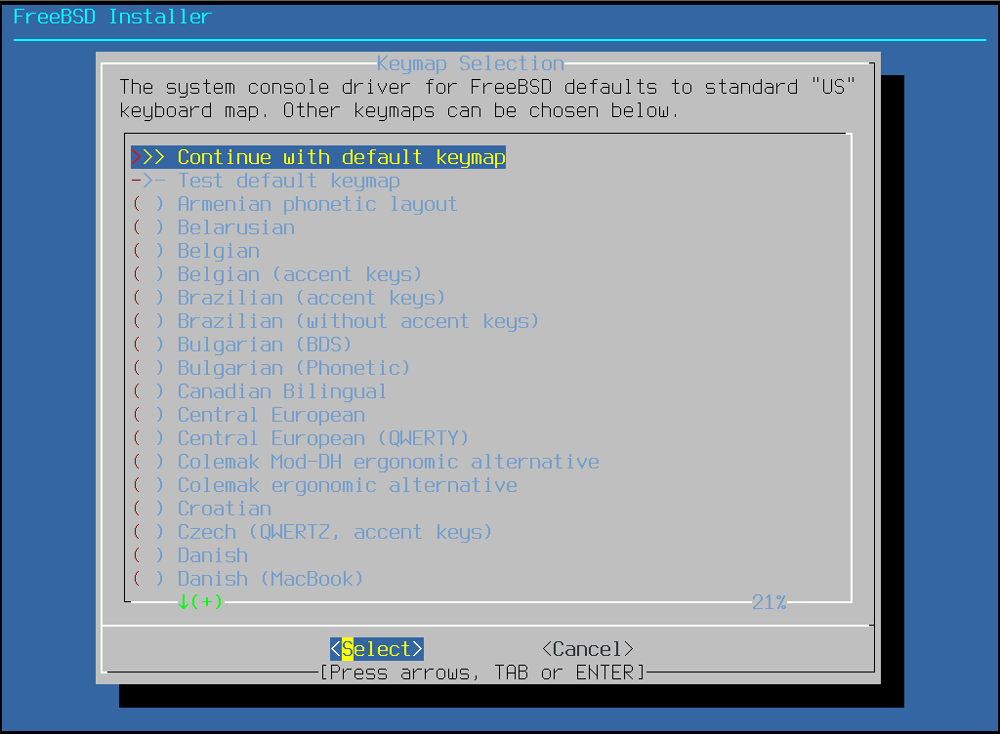

`FreeBSD 系统控制台驱动程序默认使用标准 US（美式）键盘布局。可以在下面选择别的键盘布局。`

此为键盘布局选择菜单，直接按 **回车键** 使用默认布局即可（目前中国普遍使用美式键盘布局）。

## 设定主机名


`请选择此机器的主机名。如果正运行在受管理的网络上，请向网络管理员询问合适的名称。`

此步骤用于设置系统主机名。

> **警告**
>
> **请勿** 在此步骤直接按 **回车键**！这将导致主机名为空，进而可能使登录管理器（如 SDDM）无法正常启动。

> **警告**
>
> 官方手册中关于 `Amnesiac` 的说法有误。若不设置主机名，系统不会自动分配任何值（包括 `Amnesiac`），因为 FreeBSD 源码默认假设将通过 DHCP 获取主机名。根据当前源码逻辑，使用 DHCP 时不会有空主机名提示；仅当无网络连接时，登录信息中才会显示 `Amnesiac` 并伴随一条错误提示。

### 参考信息

- FreeBSD Project. Bug 286847: If the hostname is not set for the host, the value "Amnesiac" should be written to rc.conf.[EB/OL]. [2026-03-25]. <https://bugs.freebsd.org/bugzilla/show_bug.cgi?id=286847>. 该 Bug 报告提出空主机名时应写入默认值。
- FreeBSD Project. freebsd-src/libexec/getty/main.c[EB/OL]. [2026-03-25]. <https://github.com/freebsd/freebsd-src/blob/80c12959679ab203459dc20eb9ece3a7328b7de5/libexec/getty/main.c#L178>. 该代码段包含登录提示符显示逻辑，为 `Amnesiac` 的源码
- FreeBSD Project. bsdinstall: Warn if hostname is empty[EB/OL]. [2026-03-25]. <https://github.com/freebsd/freebsd-src/pull/1700>. 该 PR 为空主机名添加警告

## 选择安装组件

设定主机名后，接下来需要选择要安装的系统组件。可以根据实际需求选择需要的组件。

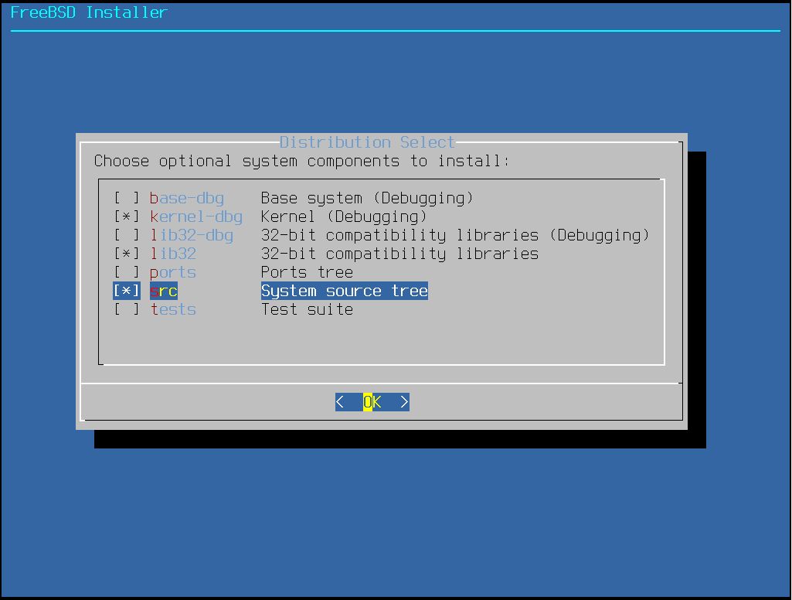

`选择要安装的可选系统组件`

> **技巧**
>
> 若无特别说明，以下操作中按 **空格键** 可选中或取消选中条目（`[ ]` 变为 `[ * ]`）。
>
> 推荐在默认选项基础上，**额外** 选中 `src`。因为部分显卡驱动程序（如 `drm`）及其他程序需要源码，且经测试 `lib32` 组件在系统安装后单独安装可能需要额外配置。

> **警告**
>
> **不要** 选择 `kernel-dbg`、`lib32`、`src` 之外的组件，这些组件需要联网安装，速度较慢。如有需要可在系统安装完成后另行安装。
>
> 若在安装中出现选择镜像站的提示，通常是因为选择了需要联网下载的额外组件，请避免此操作。

| 选项 | 解释 |
| ---- | ---- |
| `base-dbg` | 基本系统调试工具 |
| `kernel-dbg` | 内核调试工具 |
| `lib32-dbg` | 32 位应用程序的兼容库的调试工具 |
| `lib32` | 用于在 64 位 FreeBSD 上运行 32 位应用程序的兼容库 |
| `ports` | Ports 软件集 |
| `src` | 系统源代码 |
| `tests` | 测试工具 |

## 分配磁盘空间

选定安装组件后，接下来需要为系统分配磁盘空间，这是安装过程中的关键步骤之一。

FreeBSD 14.3-RELEASE 支持选择 UFS 或 ZFS 作为根文件系统。在旧版本中，`bsdinstall` 工具仅支持 UFS；FreeBSD Project. Revision 256361: bsdinstall: add ZFS support[EB/OL]. [2026-03-25]. <https://svnweb.freebsd.org/base?view=revision&revision=256361>。该修订记录 bsdinstall 增加 ZFS 支持，`bsdinstall` 开始支持 ZFS。通过手动安装方式，则早在 delphij. FreeBSD 8.0 ZFS 根分区手动安装方法[EB/OL]. [2026-03-25]. <https://blog.delphij.net/posts/2008/11/zfs-1/>。该博客介绍 FreeBSD 8.0 ZFS 根分区手动安装方法，即可将 ZFS 用作根分区。

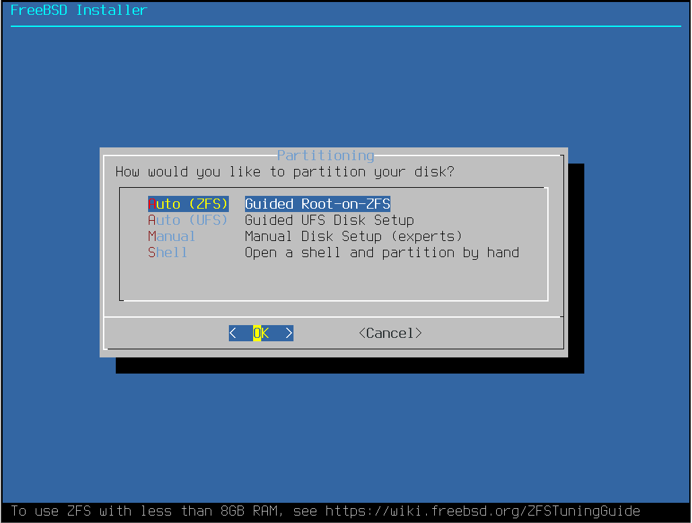

分区菜单。`你想如何对磁盘进行分区？`

| 配置选项 | 中文说明 |
| -------- | -------- |
| `Auto (ZFS) – Guided Root-on-ZFS` | 自动（ZFS） – 引导式 ZFS root 分区 |
| `Auto (UFS) – Guided UFS Disk Setup` | 自动（UFS） – 引导式 UFS 磁盘设置 |
| `Manual – Manual Disk Setup (experts)` | 手动 – 手动磁盘设置（适合专家） |
| `Shell – Open a shell and partition by hand` | Shell – 打开 Shell 并手动分区 |

文件系统详情请参阅其他章节（可手动分区解压 `txz` 文件以自定义）。此处推荐选择默认的 `Auto (ZFS)` 选项。通常建议内存不小于 8 GB 时选用 ZFS，小于 8 GB 时选用 UFS，以获得更佳性能。

手动分区和 Shell 分区参见手动安装 FreeBSD 相关章节。

### Auto (ZFS)（使用 ZFS 作为 `/` 文件系统）

> **技巧**
>
> 经测试，在 UEFI 环境下，256 MB 内存亦可启动 ZFS；若使用传统 BIOS，128 MB 内存即可。但此配置仅能完成安装，不具备实用价值。

> **注意**
>
> 若手动分区时反复提示分区表“损坏”（`corrupted`）等错误，请先退出安装程序，重启后进入 Shell 模式，尝试刷新分区表：
>
> ```sh
> # gpart recover ada0
> ```
>
> 请根据实际硬盘设备确定 `ada0` 参数（如可能是 `da0`、`nda0` 等）。
>
> 若不明确当前硬盘设备名，可参考图示命令进行查看。
>
> 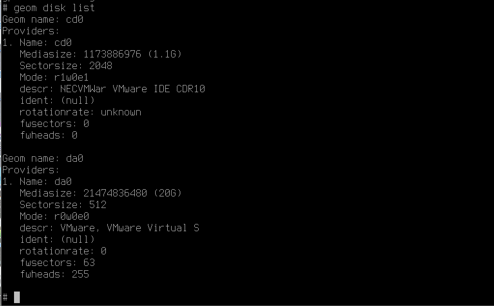
>
> 刷新后，输入 `bsdinstall` 即可进入安装模式。
>
> 原因详情见 FreeBSD 中文文档项目. FreeBSD 手册：磁盘分区调整[EB/OL]. [2026-03-25]. <https://handbook.bsdcn.org>。该章节介绍磁盘分区调整方法，但该现象疑似程序缺陷。


`正在探测设备，请稍候（这可能需要一些时间）……`

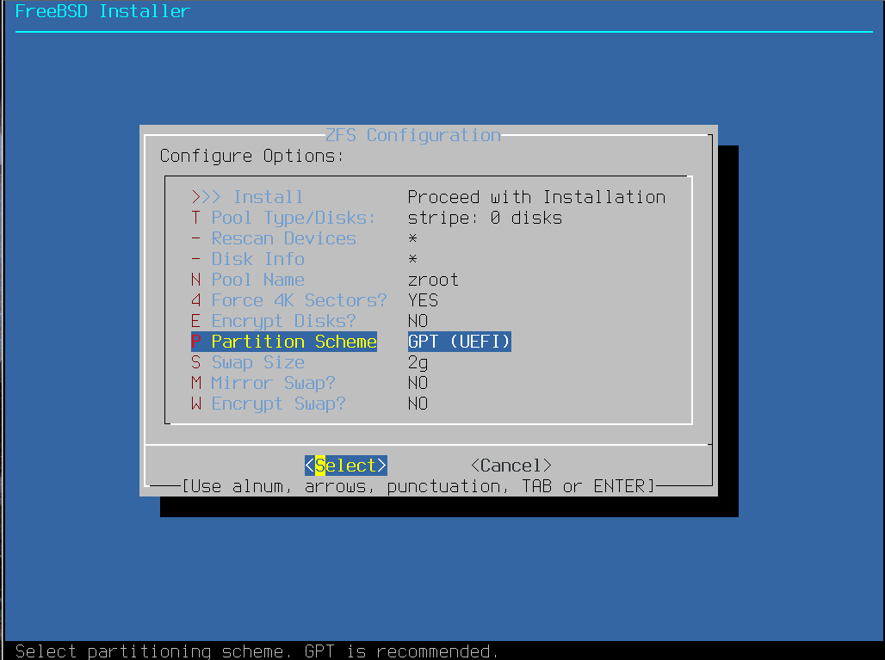

近 10 年的计算机通常应选择 `GPT (UEFI)`。请勿使用默认选项，否则将创建一个 512 KB 的 `freebsd-boot` 分区（对于纯 UEFI 启动并非必需）。

较老的计算机（如 2013 年以前）才应考虑选择 `GPT (BIOS)` 选项，该选项仅支持 BIOS 启动；如需同时兼容 BIOS 和 UEFI，应选择 `GPT (BIOS+UEFI)`。

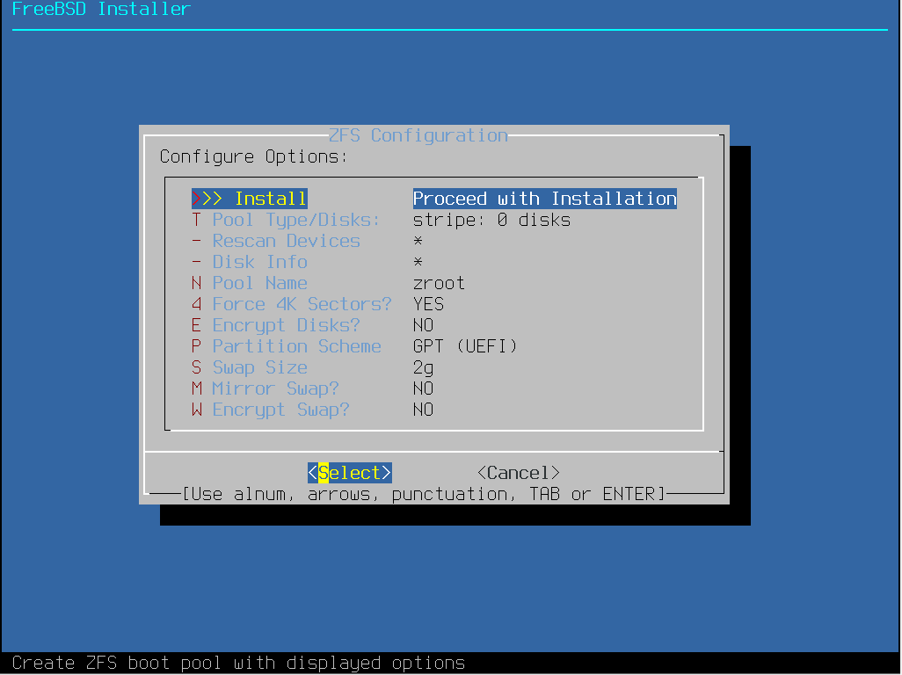

| 配置选项 | 中文 | 说明 |
| -------- | ---- | ---- |
| `>> Install Proceed with Installation` | >> 安装 | 继续安装 |
| `T Pool Type/Disks: stripe: 0 disks` | 存储池类型/磁盘：条带化：0 块磁盘 | 详细说明见下 |
| `- Rescan Devices *` | - 重新扫描设备 * | |
| `- Disk Info *` | - 磁盘信息 * | |
| `N Pool Name zroot` | 存储池名称 `zroot` | 默认池名 `zroot` |
| `4 Force 4K Sectors? YES` | 强制 4K 扇区？是 | 4K 对齐 |
| `E Encrypt Disks? NO` | 加密磁盘？否 | 加密后的登录系统方案请参考本书其他章节 |
| `P Partition Scheme` | 分区方案 GPT (UEFI) | 只有老电脑才需要 `GPT (BIOS+UEFI)` 等选项 |
| `S Swap Size 2G` | 交换分区大小 2 GB | 如果不需要 Swap，`Swap Size` 输入 `0` 或 `0G` 即可不设置交换分区。 |
| `M Mirror Swap? NO` | 交换分区镜像？否 | 是否在多个磁盘之间镜像交换分区，若选否，则每个磁盘的交换分区是独立的 |
| `W Encrypt Swap? NO` | 加密交换分区？否 | |

> **技巧**
>
> 如果在此处设置 `P Partition Scheme` 为 `GPT (UEFI)` 而非其他，后续分区与系统更新过程会更加简单。

> **注意**
>
> 请慎重设置交换分区（`Swap Size`）的大小。通常建议为物理内存的 1～2 倍，但考虑到实践因素，不建议超过 64 GB。因 ZFS 和 UFS 文件系统创建后不易缩小，而使用 `dd` 命令创建交换文件或后续调整可能带来性能开销或复杂度。

> **技巧**
>
> 若无法确定后续应选择哪块磁盘，可在此步骤选择 `- Disk Info *` 查看各磁盘的详细信息：
>
> 
>
> 此界面，选中磁盘按 **回车键** 可查看详情；选中 `<Back>` 可返回上一菜单。
>
> 
>
> 此界面按 **上下方向键** 可浏览。按 **回车键** 可返回到上一菜单。

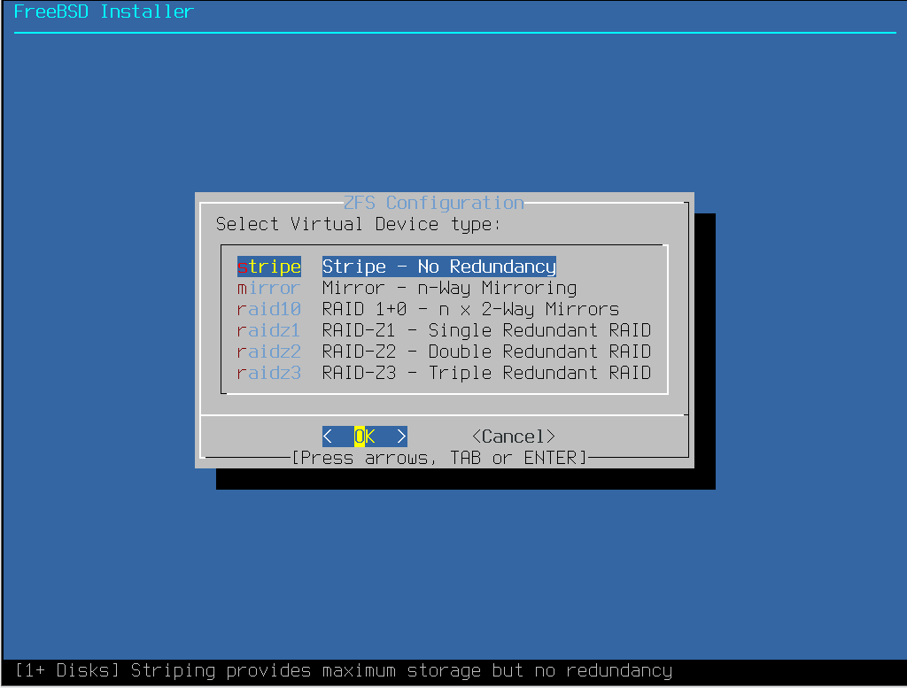

`选择虚拟设备类型：`

| 配置选项 | 中文 | 特点 |
| -------- | ---- | ---- |
| `Stripe` | 条带化，即 `RAID 0` | 无冗余，一块硬盘即可 |
| `mirror` | 镜像，即 `RAID 1` | n 路镜像，最少需要 2 块硬盘 |
| `raid10` | RAID 1+0 | n 组 2 路镜像，最少需要 4 块硬盘（要求偶数块硬盘） |
| `raidz1` | RAID-Z1 | 单冗余 RAID，最少需要 3 块硬盘 |
| `raidz2` | RAID-Z2 | 双冗余 RAID，最少需要 4 块硬盘 |
| `raidz3` | RAID-Z3 | 三重冗余 RAID，最少需要 5 块硬盘 |

直接按 **回车键** 使用默认的 `Stripe` 即可。

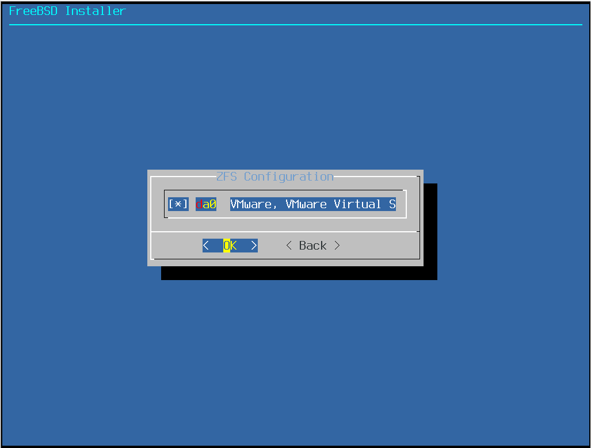

选中目标硬盘，按 **回车键** 确认选择。

> **技巧**
>
> 若要将系统安装到 U 盘或移动硬盘但未被识别，请尝试重新插拔该设备，然后选择上方的 `- Rescan Devices *` 重新扫描设备列表。

> **注意**
>
> 若硬盘为 eMMC 类型，可能会出现 `mmcsd0`、`mmcsd0boot0`、`mmcsd0boot1` 等选项，请选择 `mmcsd0`。此外，在多硬盘与 eMMC 共存的情况下，若另一块硬盘的分区数量超过 5 个，安装在 eMMC 中的 FreeBSD 可能会在启动时卡在 `Mounting from zfs:zroot/ROOT/default failed with error 22: retrying for 3 more seconds` 提示处。若手动指定参数，则可能导致内核恐慌（Panic）。此问题疑似程序缺陷，但目前尚无更详细的报告信息。

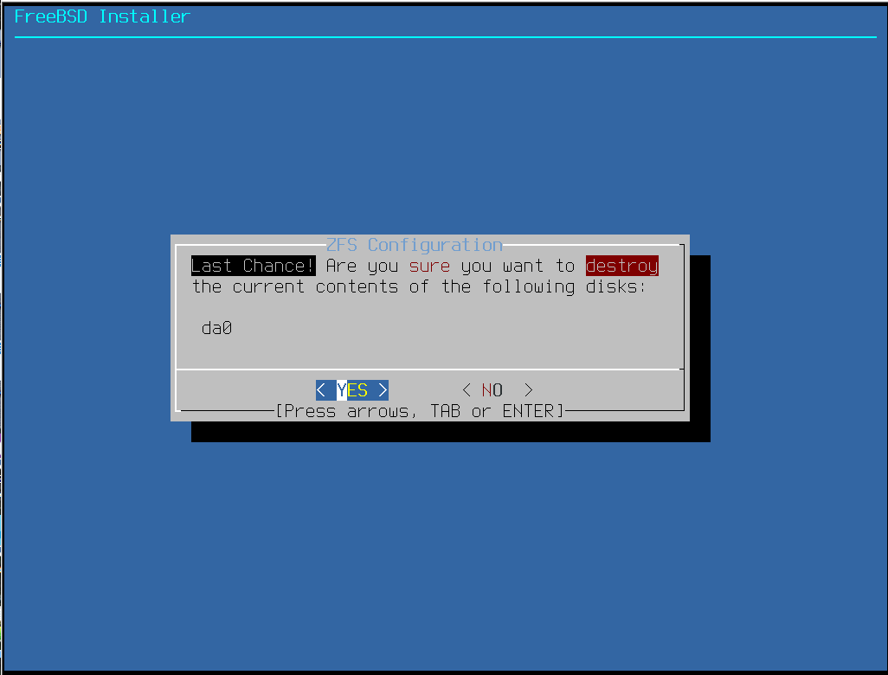

`最后确认！您确定要销毁以下磁盘上的所有现有数据吗：`

这是最终的警告与确认。请确保已备份重要数据，所选磁盘将被完全格式化。使用 **方向键** 或 **Tab 键** 将焦点切换至 `<YES>`，按 **回车键** 确认。

> **警告**
>
> 此操作将执行全盘安装，目标磁盘上的所有数据都将丢失！如需非全盘安装（如双系统），请参考本书其他相关章节。

#### ZFS 加密分区后如何解密

若在安装 FreeBSD 时启用了 ZFS 磁盘加密，则需了解如何解密并挂载该磁盘。

NVMe 硬盘 ZFS 加密后的磁盘结构（同时加密了交换空间）：

| 分区类型 | 挂载点 | 设备 |
| -------- | ------ | ---- |
| efi | | /dev/nda0p1 |
| freebsd-zfs | / | /dev/nda0p2、/dev/nda0p2.eli |
| freebsd-swap | | /dev/nda0p3、/dev/nda0p3.eli |

EFI 系统分区并无特殊变化，与正常安装相同。系统启动时将提示输入密码以解密并挂载根分区。

若需要在 LiveCD 环境中挂载该加密分区，操作亦较为简单（不需要密钥）。假设根分区为 `/dev/nda0p2`，执行以下命令：

```sh
# geli attach /dev/nda0p2
```

输入正确的加密密码后，即可通过命令 `# zfs mount zroot/ROOT/default` 挂载根文件系统。

### Auto (UFS)（使用 UFS 作为 `/` 文件系统）


`你想如何对磁盘进行分区？`

> **技巧**
>
> 若选择 `Partition`（分区），选项同下文。


`是想使用整个磁盘还是将其分区以与其他操作系统共享？使用整个磁盘将擦除当前存储在那里的所有数据。`


`为该卷选择分区方案`

| 英文 | 中文 | 注释 |
| ---- | ---- | ---- |
| `APM Apple Partition Map` | Apple 分区表 | Apple `PowerPC` 使用（2006 年以前） |
| `BSD BSD Labels` | BSD 磁盘标签 | 仅 BSD 可识别 |
| `GPT GUID Partition Table` | GPT 全局唯一标识分区表 | 现代计算机使用（2013+） |
| `MBR DOS Partitions` | MBR 主引导记录分区表 | 老式计算机使用（XP 及更早年代） |


`请审查当前的磁盘分区设置。确认无误后，可选择 `Finish`（完成）`

| 英文 | 中文 |
| ---- | ---- |
| `Create` | 创建 |
| `Delete` | 删除 |
| `Modify` | 调整 |
| `Revert` | 还原 |
| `Auto` | 自动 |
| `Finish` | 完成 |

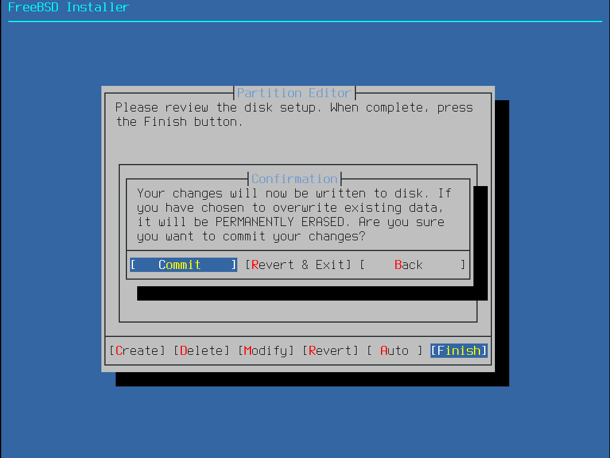

`你的更改不会被保存到磁盘。如果你选择了覆盖现有数据，它将被删除。你确定要提交你的更改吗？`

| 英文 | 中文 |
| ---- | ---- |
| `Commit` | 提交 |
| `Revert & Exit` | 还原并退出 |
| `Back` | 返回 |


初始化磁盘——此界面一闪而过。

---

校验相关分发文件包：


解压并安装相关分发文件包：

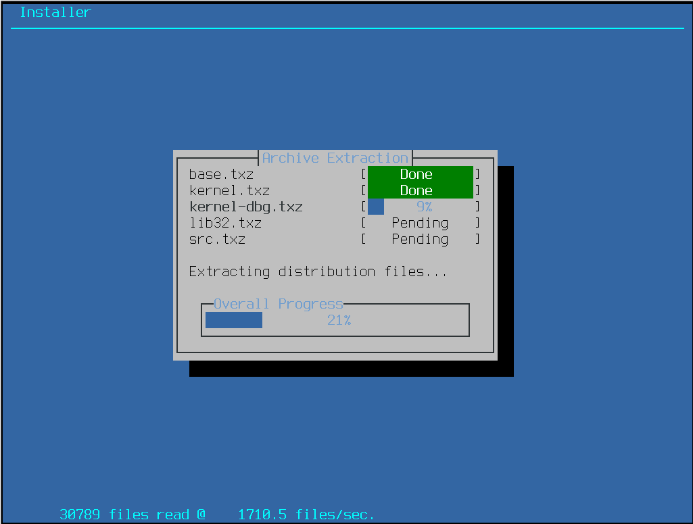

## 设置 root 密码

磁盘分区完成后，接下来需要为系统管理员账户设置密码，这是保障系统安全的重要步骤。

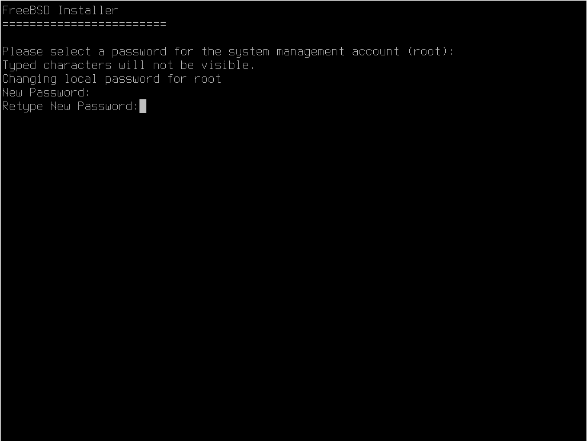

`请为系统管理员账户（root）设置密码：输入的字符将不可见。正在修改待安装系统的 root 密码。`

> **技巧**
>
> 在此界面，需使用 **上下方向键** 或 **Tab 键** 在不同密码输入框间移动焦点。输入完成后按 **回车键** 确认。

此处输入 root 密码，密码会在屏幕上显示为 `*`。

要求输入两次以确认一致性，若两次输入的密码不同则提示 `The passwords do not match`（密码不匹配）。

root 密码强度无强制要求，但不可为空。若密码为空，将提示 `The password cannot be empty`，必须输入有效密码才能继续。

## 网卡设置

设置好 root 密码后，接下来需要配置网络，以便系统能够连接到互联网或局域网。

### 以太网卡设置

首先介绍以太网卡的配置方法。

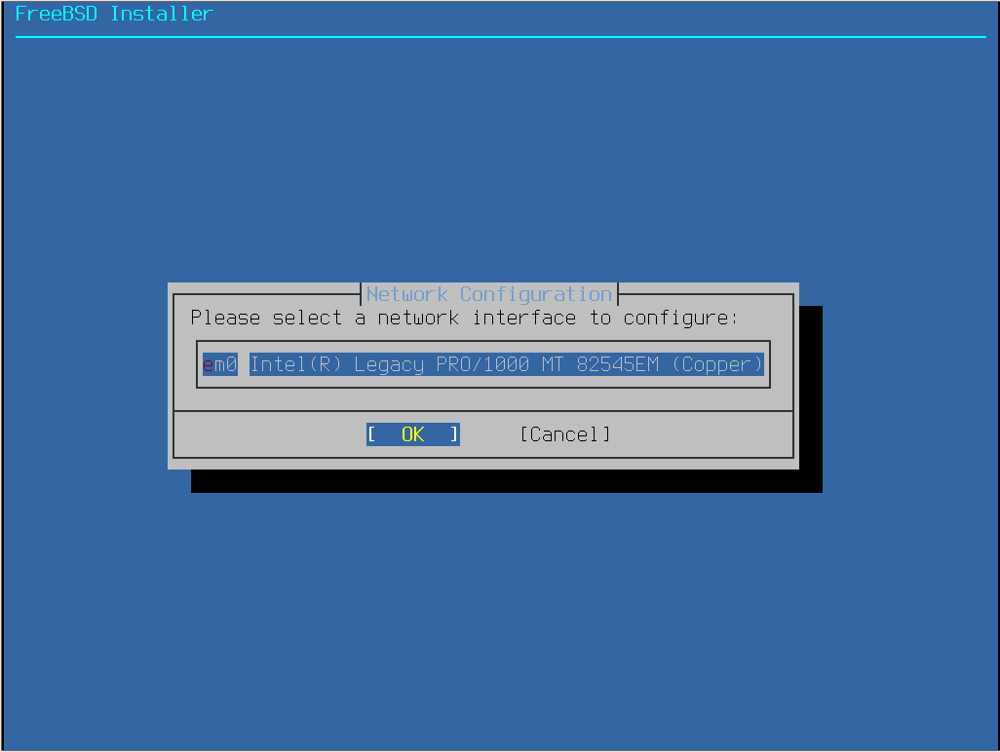

`请选择一个网络接口进行配置`

即选择网卡。按 **方向键** 可切换，按 **回车键** 可选定。

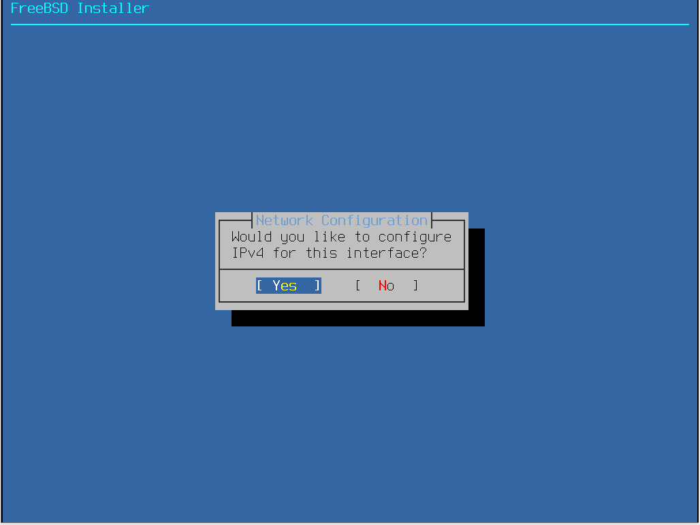

`希望为此接口配置 IPv4 吗？`

配置 IPv4。按 **回车键** 可选定。


`希望使用 DHCP 配置此接口吗？`

配置使用 DHCP。按 **回车键** 可选定。


`希望为此接口配置 IPv6 吗？`

配置 IPv6。因本书未使用 IPv6，故选 `No`，按 **回车键** 可选定。如有需要可自行配置 IPv6。


`配置解析器`

一般保持 DHCP 获取的 DNS 即可，也可以使用其他 DNS。此处使用了阿里 DNS `223.5.5.5`。按 **方向键** 可切换，按 **回车键** 可选定。

### 无线网卡/Wi-Fi 设置

> **警告**
>
> 由于 FreeBSD Project. Bug 289202: Missing CN regulatory domain and 11ac/DFS support in regdomain.xml[EB/OL]. [2026-03-25]. <https://bugs.freebsd.org/bugzilla/show_bug.cgi?id=289202>。该 Bug 报告记录中国无线管制域缺失问题，此部分功能目前存在问题，建议跳过。

> **注意**
>
> 建议跳过此步骤的无线网络配置，待系统安装完成后重启，再参考本书无线网络章节进行设置（尤其对于博通等网卡）。否则安装程序可能长时间无响应或引发内核恐慌（Panic）。

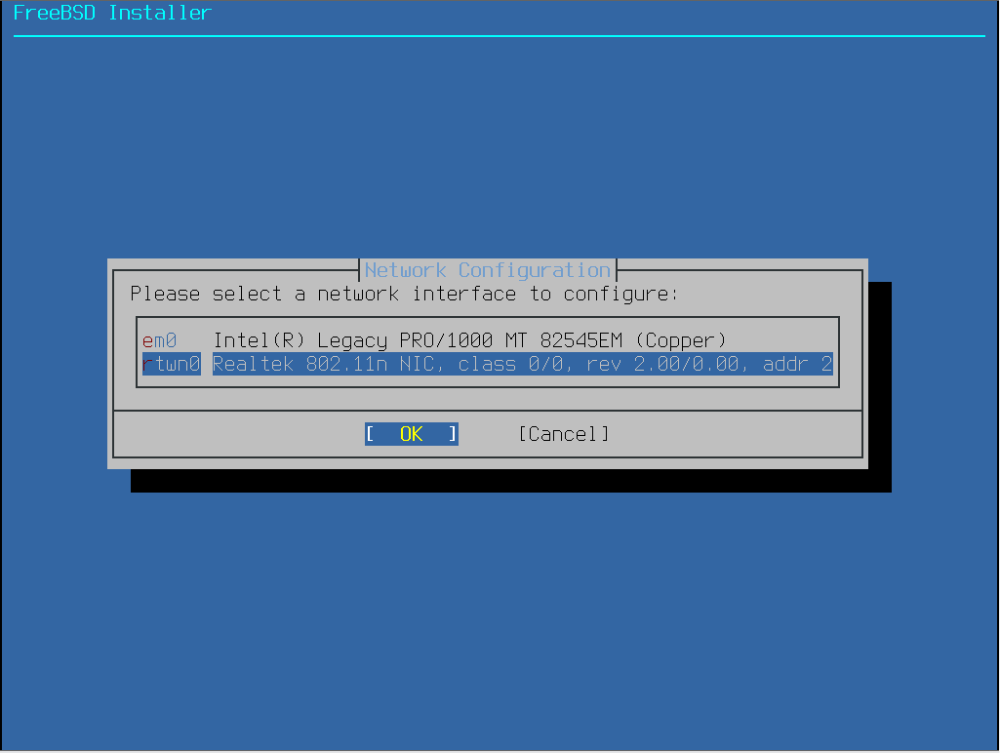

`请选择网络接口进行配置`

> **警告**
>
> 由于 FreeBSD Project. Bug 287538: Installer error on setting regdomain[EB/OL]. [2026-03-25]. <https://bugs.freebsd.org/bugzilla/show_bug.cgi?id=287538>。该 Bug 报告记录安装程序设置无线管制域错误，目前选择任何无线管制域，都会报错如下：
>
> ```sh
> Error while applying chosen settings
> (unknown regdomain Expected eval: Use: not found)
> ```
>
> 该问题在 15.0 版本中已修复。


`更改地区/国家（FCC/US）？`

修改 WiFi 区域码，按 **回车键** 确认。


`选择的区域码`

应该选择 `NONE ROW`（`NONE` 为区域码，`ROW` 即 Rest of World）。


`选择所在的地区`

选择区域：


`等待 5 秒钟，正在扫描无线网络……`

扫描。

> **技巧**
>
> 只要网卡能被识别，即表明其驱动程序可用。但安装程序可能无法正确扫描到所有 WiFi 网络。建议此处留空跳过，待系统安装完成后重启，再参考本书无线网络章节进行配置。

在列表中找到您的 WiFi 网络。若未找到，可尝试更改无线路由器的信道后重试。

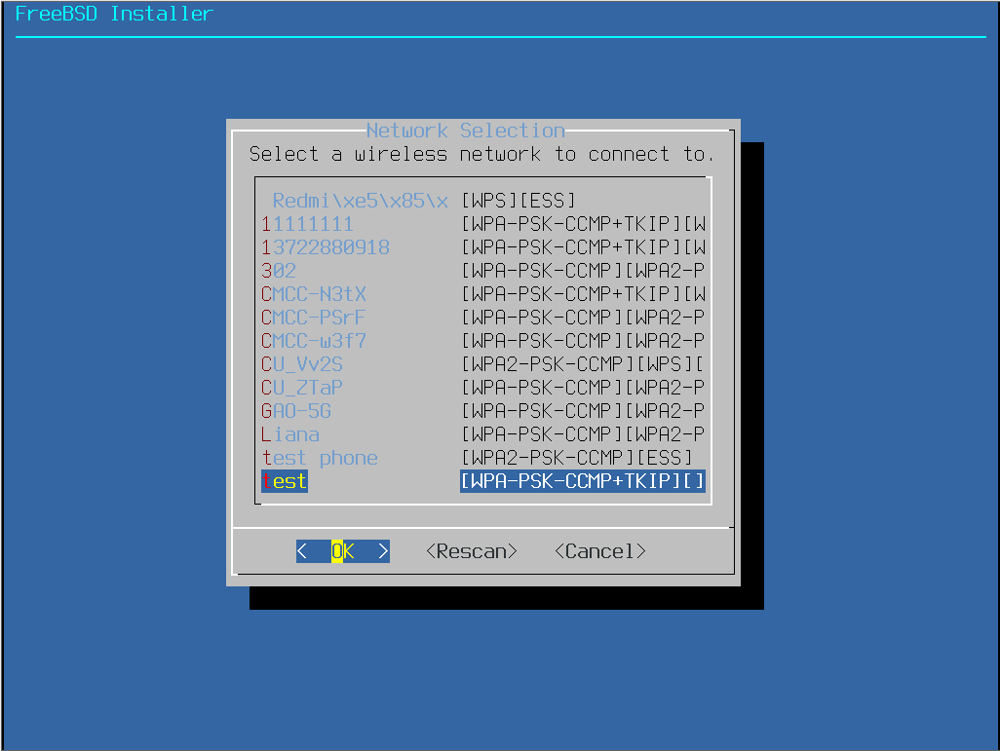

`选择要连接的无线网络`

输入 WiFi 密码即可连接：

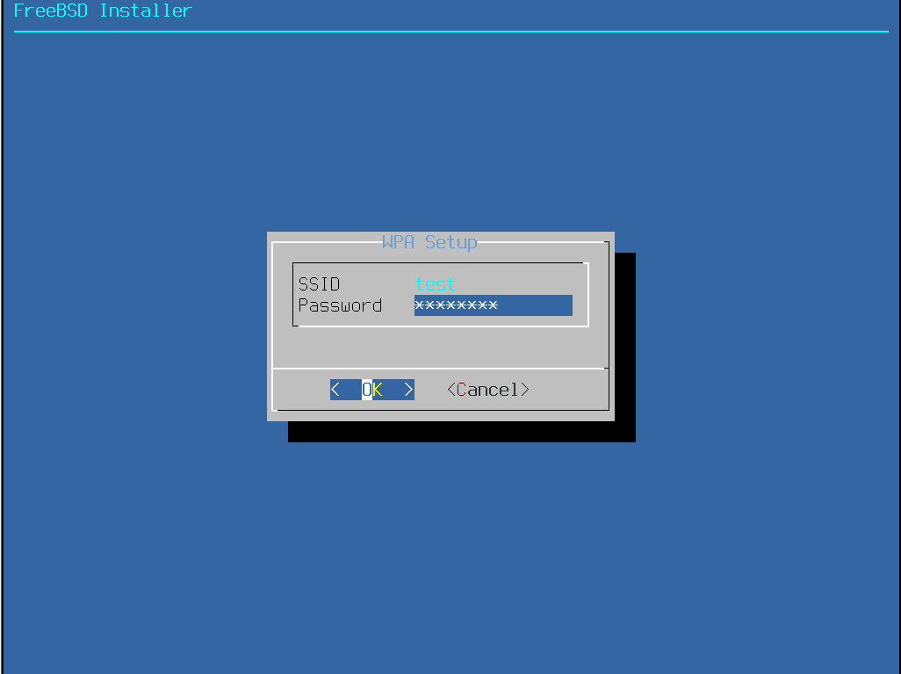


`想要为此接口配置 IPv4 吗？`

配置 IPv4。按 **回车键** 可选定。


`希望使用 DHCP 配置此接口吗？`

配置使用 DHCP。按 **回车键** 可选定。


`希望为此接口配置 IPv6 吗？`

配置 IPv6。因本书未使用 IPv6，故选 `No`，按 **回车键** 可选定。如有需要可自行配置 IPv6。


`配置解析器`

一般保持 DHCP 获取的 DNS 即可，也可以使用其他 DNS。此处使用了阿里 DNS `223.5.5.5`。按 **方向键** 可切换，按 **回车键** 可选定。

### 参考文献

- FreeBSD Project. Regulatory Domain Support[EB/OL]. [2026-03-25]. <https://wiki.freebsd.org/WiFi/RegulatoryDomainSupport>. 该页面介绍 FreeBSD 无线管制域支持状态
- FreeBSD Project. freebsd-src/lib/lib80211/regdomain.xml[EB/OL]. [2026-03-25]. <https://github.com/freebsd/freebsd-src/blob/main/lib/lib80211/regdomain.xml>. 该文件定义 802.11 无线管制域配置，regdomain.xml 在源代码的位置
- FreeBSD Project. regdomain.xml -- 802.11 wireless regulatory definitions[EB/OL]. [2026-03-25]. <https://man.freebsd.org/cgi/man.cgi?query=regdomain&sektion=5>. 该手册页说明无线管制域配置文件格式，对应编码请参考系统中的 `/etc/regdomain.xml` 文件
- Alibaba Cloud. 阿里公共 DNS[EB/OL]. [2026-03-25]. <https://www.alidns.com/>. 该服务提供公共 DNS 解析

## 时区设置

网络配置完成后，接下来需要设置系统的时区，以确保系统时间显示正确。时区设置分为多个步骤，首先需要选择所在的地区。


`选择地区`

设置时区。中国位于 `5 Asia`（亚洲）。按 **方向键** 可切换，按 **回车键** 可选定。

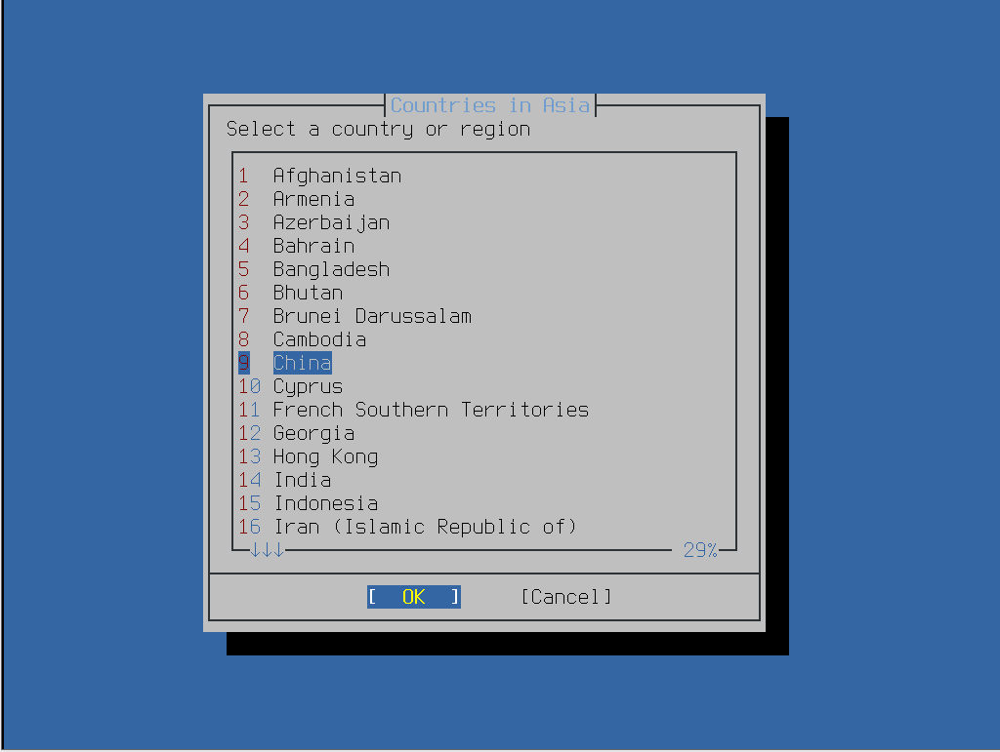

`设置国家或区域`

中国选择 `9 China`（中国）。按 **方向键** 可切换，按 **回车键** 可选定。


中国统一使用东八区时间，即北京时间，请选择 `1 Beijing Time`（北京时间）。按 **方向键** 可切换，按 **回车键** 可选定。

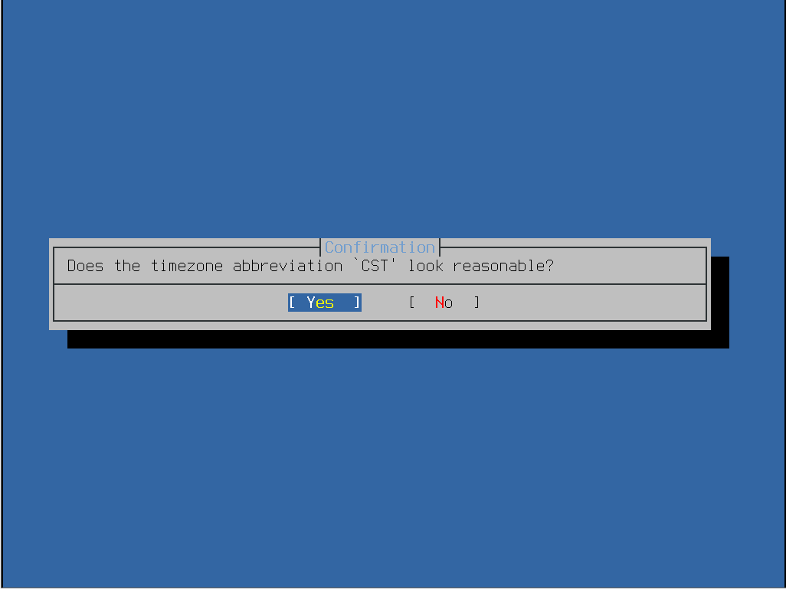

`时区缩写 'CST' 看起来合理吗？`

使用中国标准时间：China Standard Time（CST），确认无误，按 **回车键** 选定 `Yes`。


`设置时间与日期`

按 **回车键** 即可。

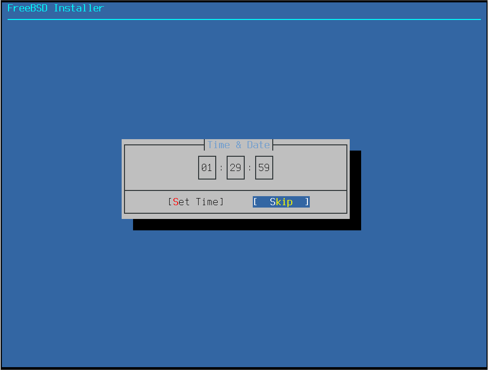

`时间与日期`

按 **回车键** 即可。

## 启动服务设置

时区设置完成后，接下来需要选择系统启动时自动运行的服务，以便系统能够提供所需的功能。

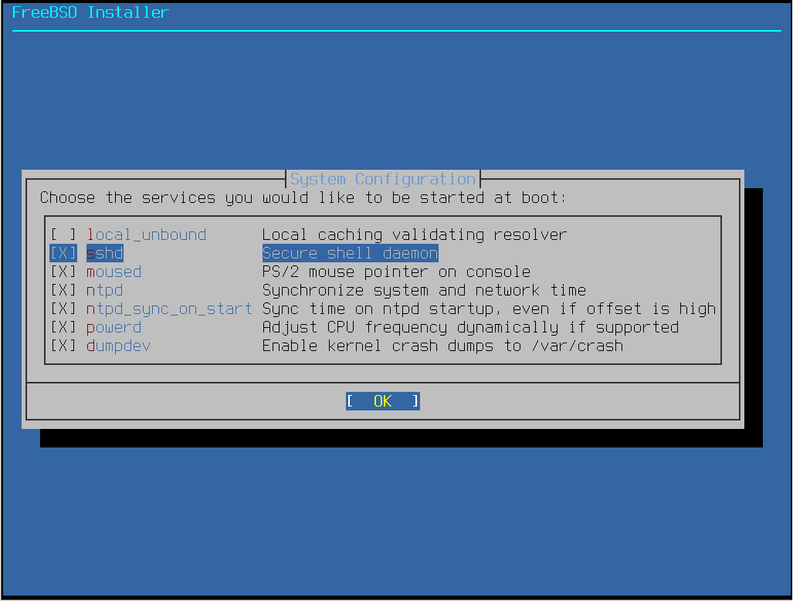

`选择希望在开机时启动的服务`

> **警告**
>
> **请勿全选！**
>
> **不要** 选择 `local_unbound`，否则可能影响系统 DNS 解析（参见 FreeBSD Project. Bug 262290: After a normal FreeBSD installation and reboot, /etc/resolv.conf will be changed[EB/OL]. [2026-03-25]. <https://bugs.freebsd.org/bugzilla/show_bug.cgi?id=262290>。该 Bug 报告记录 local_unbound 服务导致 resolv.conf 变更问题）。除非明确了解其用途。

| 选项 | 解释 |
| ---- | ---- |
| `local_unbound` | 启用本地 Unbound DNS 缓存转发解析器。注意：启用后需手动配置 DNS，否则可能无法正常联网。不建议未充分了解其功能的用户启用 |
| `sshd` | 启用 SSH 远程访问服务 |
| `moused` | 在文本控制台（tty）中启用鼠标支持 |
| `ntpd` | 用于自动时钟同步的网络时间协议（NTP）守护进程 |
| `ntpd_sync_on_start` | 系统启动时立即同步时间 |
| `powerd` | 启用电源管理守护进程，动态调整 CPU 频率以节约能耗 |
| `dumpdev` | 启用内核崩溃转储功能，便于系统调试 |

## 安全加固

启动服务设置完成后，接下来需要配置系统安全加固选项，以增强系统的安全性。


`选择系统安全加固选项`

此处为系统安全加固选项，可根据实际需求选择启用。

> **技巧**
>
> 在 FreeBSD 14 以前版本的安装中，此步骤会出现 `disable_sendmail` 选项，建议选定。若不禁止该服务，每次开机时可能会延迟数分钟，且该服务主要用于邮件发送，一般用户无需使用。

| 选项 | 解释 |
| ---- | ---- |
| `0 hide_uids` | 隐藏其他用户拥有的进程 |
| `1 hide_gids` | 隐藏其他组拥有的进程 |
| `2 hide_jail` | 隐藏 jail 内的进程 |
| `3 read_msgbuf` | 禁止非特权用户读取内核消息缓冲区（通常通过 `dmesg` 命令访问） |
| `4 proc_debug` | 禁用非特权用户的进程调试功能 |
| `5 random_pid` | 启用进程 PID 随机化 |
| `6 clear_tmp` | 系统启动时自动清理 `/tmp` 目录 |
| `7 disable_syslogd` | 禁用 syslogd 的网络套接字（即禁用远程日志接收） |
| `8 secure_console` | 启用控制台安全保护（单用户模式也需 root 密码） |
| `9 disable_ddtrace` | 禁用 DTrace 的破坏性（destructive）操作模式 |

```text
/
├── tmp/ # 临时文件目录
└── etc/
    └── rc.conf # 系统启动配置文件
```

以上目录树展示了 `clear_tmp`（清理 `/tmp`）和 `rc.conf`（系统启动配置）的相关路径。

## 安装固件

安全加固设置完成后，接下来需要安装硬件所需的固件，以确保硬件设备能够正常工作。


自动检测并安装所需的硬件固件（该功能自 14.2 版本 FreeBSD Project. Commit 03c07bdc8b31: firmware auto-detection[EB/OL]. [2026-03-25]. <https://cgit.freebsd.org/src/commit/?id=03c07bdc8b31> ）。

**此图片来自虚拟机安装界面**。

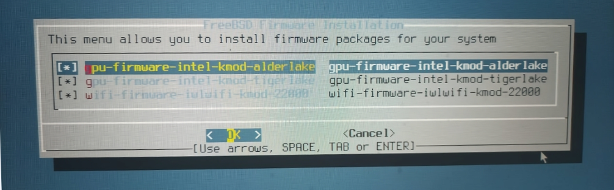

**此图片来自物理机安装界面（使用采集卡）。**

> **警告**
>
> 建议在此步骤取消所有勾选，即不安装任何固件（在线安装可能因网络问题失败或耗时过长）。如需安装固件，可在系统安装完成后使用 `fwget` 命令另行获取。
>
> 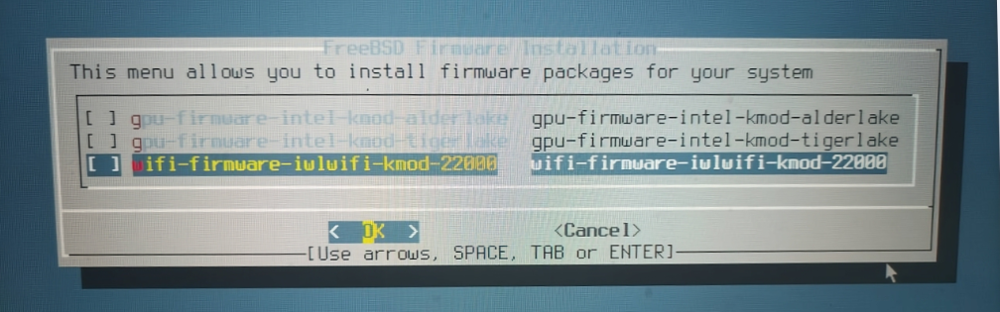
>
> **此图片来自物理机安装界面（使用采集卡）。**

## 创建普通用户

固件安装完成后，接下来需要创建普通用户账户，以便日常使用系统时避免直接使用 root 账户。


`现在希望向已安装的系统添加用户吗？`

如需创建，请按 **回车键** 选择 `Yes`；如果不需要创建普通用户（仅使用 root），请使用 **方向键** 选择 `No`。

> **技巧**
>
> 绝大多数图形登录管理器默认禁止 root 用户直接登录。因此，若不进行额外配置（参见其他章节），默认情况下可能无法使用 root 账户登录桌面环境。

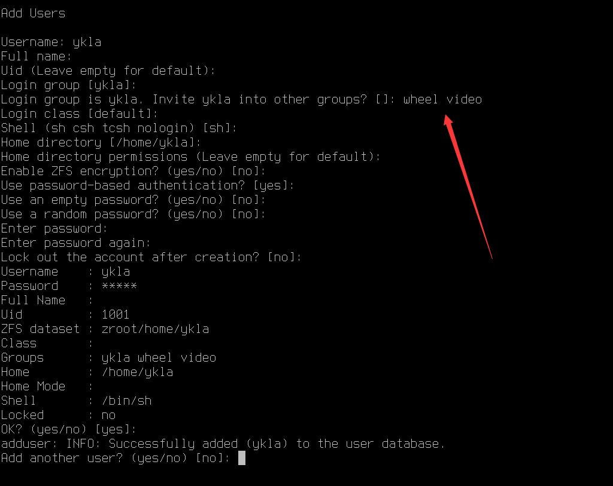

> **警告**
>
> 若创建普通用户，请务必将其同时加入 `wheel` 组（用于 `su` 提权）和 `video` 组（用于图形加速）。仅加入 `wheel` 组可能无法正常调用 GPU。

```sh
FreeBSD Installer # FreeBSD 安装程序
========================
Add Users # 添加用户

Username: ykla # 此处输入用户名。只能使用小写字母（不支持非拉丁字符，如中、日、韩、俄）或数字，且不能以连字符 - 开头。最大长度为 16 个字符（历史原因）
Full name: # 此处输入用户全名，①可留空。不能使用英文冒号 : 字符。
Uid (Leave empty for default):  # 用户 UID，留空将使用默认值。手动设置时必须小于 32000。
Login group [ykla]: # 用户主组
Login group is ykla. Invite ykla into other groups? []: wheel video # 此处输入"wheel video"（两个单词之间有一个空格），邀请用户"ykla"加入附加组"wheel"和"video"
Login class [default]: # 用户分级
Shell (sh csh tcsh nologin) [sh]: # 用户默认 shell，默认是 sh
Home directory [/home/ykla]: # 用户主（家）目录，普通用户默认在 /home 下面
Home directory permissions (Leave empty for default): # 用户主（家）目录权限，留空使用默认值
Use password-based authentication? [yes]:  # 是否启用密码验证
Use an empty password? (yes/no) [no]:  # 是否使用空密码，即密码为空
Use a random password? (yes/no) [no]:  # 是否使用随机密码。若设置为 yes 将生成随机字符串用作密码。该密码会回显到标准输出。②
Enter password:  # 输入密码，密码不显示在屏幕上，也不会是 ****，就是什么也没有
Enter password again:  # 重复输入密码，密码不显示在屏幕上，也不会是 ****，就是什么也没有
Lock out the account after creation? [no]: # 创建账户后锁定账户（禁用该账户）
Username    : ykla # 设定的用户名
Password    : ***** # 设定的用户密码
Full Name   : # 设定的用户全名
Uid         : 1001 # 设定的用户 UID
ZFS dataset : zroot/home/ykla # 主（家）目录所在的 ZFS 数据集，自 14.1 引入
Class       :  # 设定的用户分级
Groups      : ykla wheel video # 设定所在的用户组
Home        : /home/ykla # 设定的用户主（家）目录
Home Mode   :  # 设定的用户主（家）目录权限
Shell       : /bin/sh # 设定的用户默认的 shell
Locked      : no # 是否锁定（禁用）用户
OK? (yes/no) [yes]: # 确认上述设置是否正确
adduser: INFO: Successfully added (ykla) to the user database. # 已成功将 ykla 添加到用户数据库
Add another user? (yes/no) [no]: # 是否继续添加其他用户
```

- ① 如果用户全名为空（即不设置），系统会分配一个默认值 `User &`，其中 `&` 会自动展开为首字母大写的用户名（如用户 `ykla` 的全名将显示为 `User Ykla`）。这是早期 Unix 的 GECOS 字段行为。相关源代码见 FreeBSD Project. freebsd-src/usr.sbin/pw/pw_user.c[EB/OL]. [2026-03-25]. <https://github.com/freebsd/freebsd-src/blob/main/usr.sbin/pw/pw_user.c>，该文件包含用户管理工具 pw 的源代码，其中 `static struct passwd fakeuser` 部分实现了该行为。

- ② 如果设置使用随机密码，在最后的部分会输出：`adduser: INFO: Password for (ykla) is: D1MnujkWMv/m`（adduser：信息：用户 (ykla) 的密码是：D1MnujkWMv/m）。

其他参数可以保持默认设置不变。在 FreeBSD 14 及以后，所有用户的默认 shell 都被统一为 `sh`。

最后会询问 `Add another user? (yes/no) [no]`，按 **回车键** 可结束用户添加流程；

若输入 `yes` 并按 **回车键**，则可继续添加第二个用户。

### 参考文献

- FreeBSD Project. man adduser(8)[EB/OL]. [2026-03-25]. <https://man.freebsd.org/cgi/man.cgi?adduser(8)>. 该手册页说明 FreeBSD 用户添加命令使用方法

## 完成安装

普通用户创建完成后，接下来可以完成整个安装流程，开始使用 FreeBSD 系统。

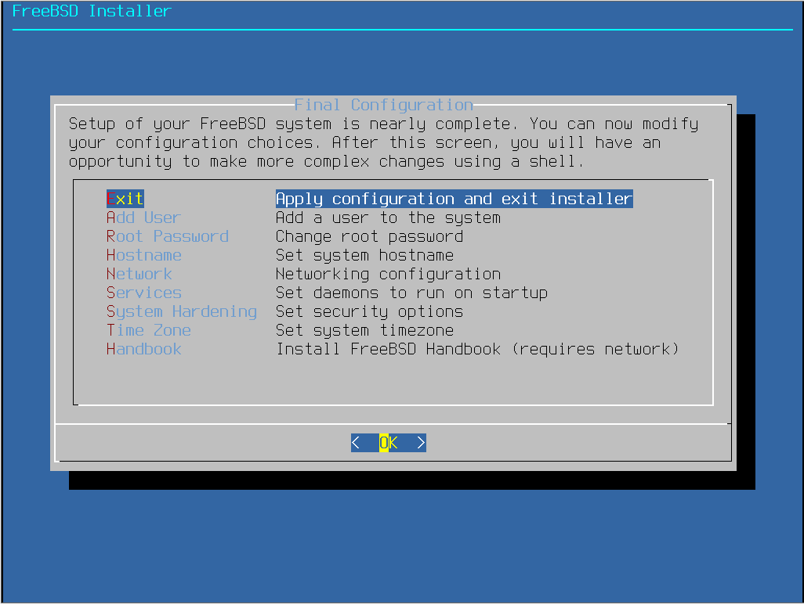

`您的 FreeBSD 系统设置即将完成。现在可以返回修改先前的配置选项。在此菜单之后，您还可以进入 Shell 进行更复杂的调整。`

按 **回车键** 选择 `Finish` 以完成安装。

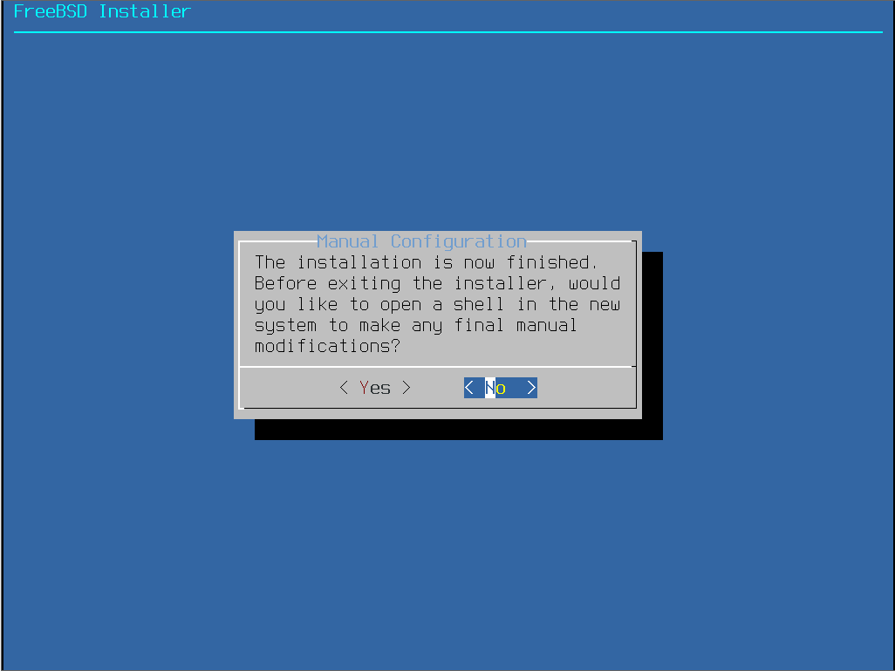

`安装现已完成。在退出安装程序前，您是否希望在新系统中打开 Shell 以进行最终的手动调整？`

按 **回车键** 选择 `No` 以直接完成安装（或选择 `Yes` 进入 Shell）。


`FreeBSD 安装完成！您现在是否希望重启并进入新安装的系统？`

按 **回车键** 确认重启。

## 欢迎来到 FreeBSD 世界

安装完成后重启，进入 FreeBSD 新系统：


系统完全启动后：

> **技巧**
>
> FreeBSD 基本系统默认不包含图形界面（未安装 Xorg），因此启动后将进入文本控制台界面。

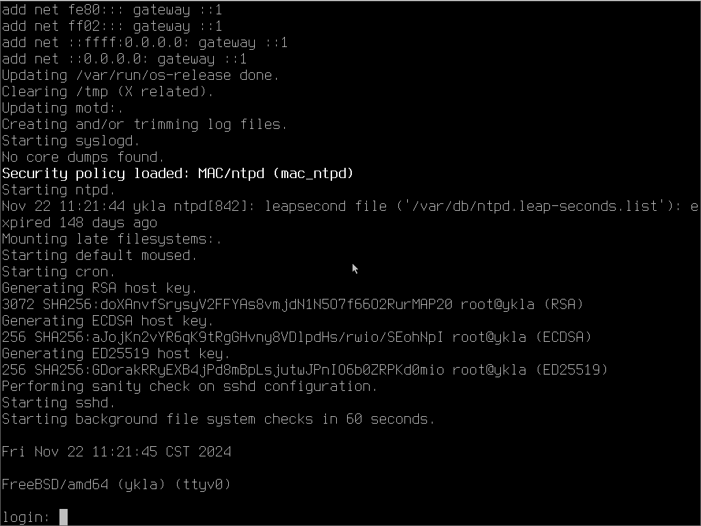

输入用户名 `root` 及安装时设置的 root 密码以登录系统。

> **技巧**
>
> 密码不会显示在屏幕上，也不会以 `***` 形式呈现，而是无任何显示，输入后按 **回车键** 即可。

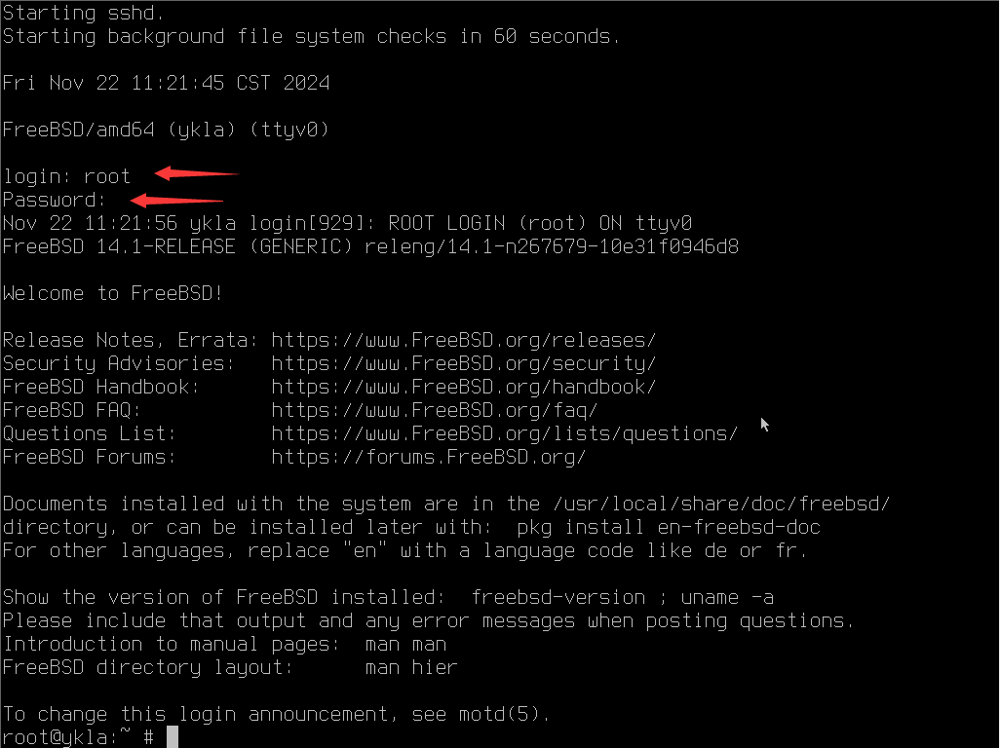

## 课后习题

1. 将现有业务迁移到最新版本的 RELEASE。
