# 2.5 在 Windows 中将 USB 启动盘恢复为普通存储设备

USB 存储介质在作为系统安装介质使用后，其分区表结构可能发生变化，导致操作系统无法完全识别其可用存储空间。

以下提供三种在 Windows 环境下恢复 USB 存储介质的方法。


> **警告**
>
> 本节所述操作具有高风险性，可能会损坏部分或全部数据。除非已明确可接受的最坏结果、做好完整可验证的备份、并有可用的回滚方案，否则请勿执行。
>
> 若无法自行解决，可尝试在电商平台购买有偿服务。

当使用 Rufus、Win32DiskImager 等软件制作 U 盘启动盘用于安装系统后，用户可能会发现 U 盘的可见容量仅有 31.9 MB（即 EFI 分区）。

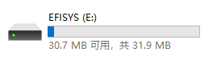

这是一款 64 GB 的 U 盘。

## 使用 DiskGenius 恢复 U 盘启动盘

首先介绍使用 DiskGenius 恢复 U 盘的方法。DiskGenius 是一款常用的磁盘管理工具，其官网为：<https://www.diskgenius.cn/>，该网站为 DiskGenius 磁盘管理工具官方网站。该软件包含收费功能，但免费功能已足够使用。使用 DiskGenius 恢复 U 盘需要经过几个步骤，首先是下载软件。

### 下载 DiskGenius

首先需要下载 DiskGenius 软件。下载时，大多数用户应选择 DiskGenius. DiskGenius 下载页面[EB/OL]. [2026-03-25]. <https://www.diskgenius.cn/download.php>，该页面提供 DiskGenius 软件各版本下载链接。

下载后，会得到一个 ZIP 压缩包。


在桌面新建文件夹 `1`（路径为 `C:\Users\用户名\Desktop\1`），将压缩包内所有文件解压至该文件夹。

相关文件结构：

```powershell
C:\Users\用户名\
└── Desktop\
    └── 1\
        └── DiskGenius\
            └── DiskGenius.exe # DiskGenius 可执行文件
```

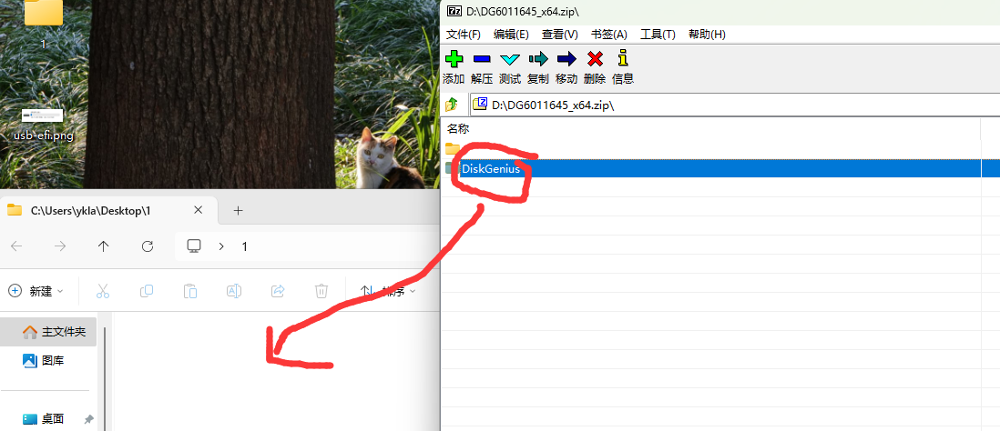

解压后的文件应如下图所示：


### 启动 DiskGenius

下载并解压完成后，即可启动 DiskGenius。启动过程较为简便，只需要找到并运行解压后的可执行文件即可。

启动 DiskGenius 时，双击 `DiskGenius.exe` 即可（路径如 `C:\Users\用户名\Desktop\1\DiskGenius\DiskGenius.exe`，具体路径因解压位置而异）。


同意许可证：


### 判断哪个是 U 盘

启动 DiskGenius 后，需要先判断哪个设备是目标 U 盘。这一步非常重要，因为选错设备可能会导致数据丢失。

判断哪个是目标 U 盘，通常可通过 U 盘容量进行判断。若不记得 U 盘容量，可查询购买记录或拔下 U 盘查看其外壳上标注的容量。

- 通过容量判断：64 GB 的 U 盘在 Windows/Linux 中通常显示为 58 GB，在 macOS 中显示为 64 GB；
- 通过盘符判断：在下图中，可通过“EFISYS(E:)”来判断（E 盘），这就是使用 Rufus 制作的 U 盘启动盘；
- 通过 DiskGenius 显示的接口判断：顶部显示的“硬盘 1 接口:USB”标识表明这是 USB 设备，即目标 U 盘。


### 恢复 U 盘

确定目标 U 盘后，即可开始恢复操作。恢复过程分为几个关键步骤，首先需要删除 U 盘上的所有现有分区。

确认目标 U 盘后，在其上右键单击，选择“删除所有分区”：

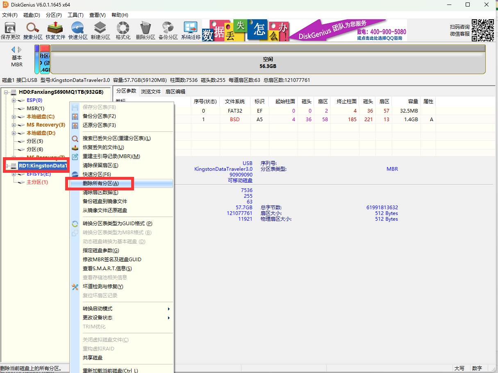

在确认后选择“是”。


删除后的 U 盘状态：

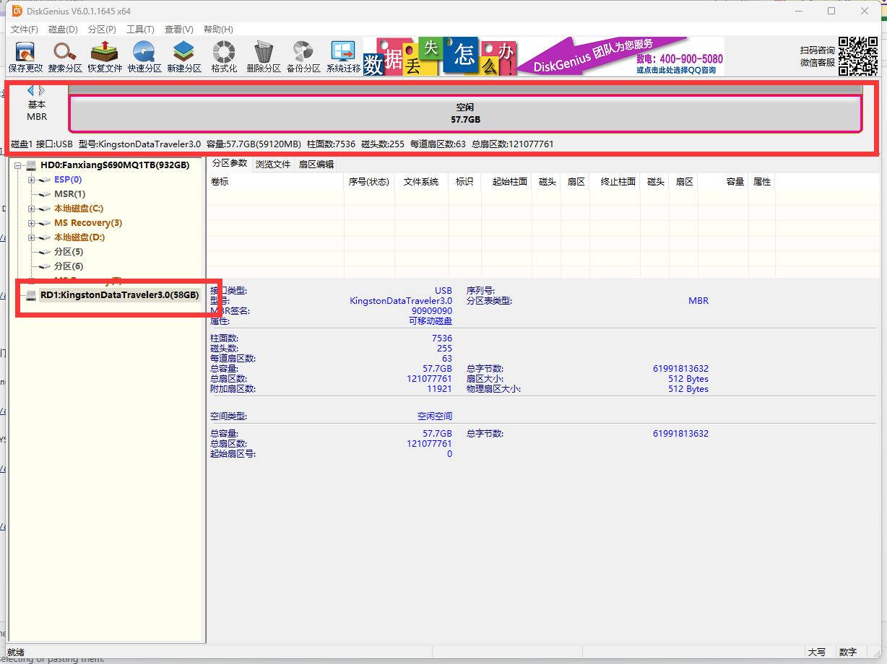

右键单击空白区域，选择“建立新分区”。


参数设置如下：文件系统选择 `exFAT`（通用性好，主流操作系统均支持读写，且不受单文件 4 GB 大小限制），勾选“对齐到下列扇区数的整数倍”，并选择“4096 扇区”（实现 4K 对齐）。

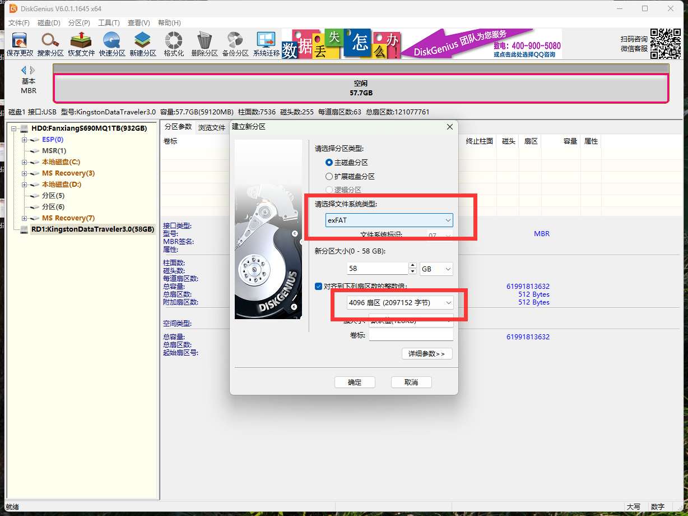

点击左上角的“保存更改”按钮。


确认后选择“是”。


在确认后选择“是”。


最后结果：


打开资源管理器：

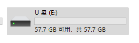

恢复完成。

## 使用傲梅分区助手恢复 U 盘启动盘

除了 DiskGenius 外，还可以使用傲梅分区助手来恢复 U 盘。傲梅分区助手是另一款常用的磁盘管理工具，使用方法与前述 DiskGenius 方法基本相同。使用傲梅分区助手恢复 U 盘首先需要下载并安装软件。

### 下载并安装傲梅分区助手

首先需要下载傲梅分区助手软件。

傲梅分区助手官网：<https://www.disktool.cn/>，该网站为傲梅分区助手官方网站。

点击 AOMEI Technology. 傲梅分区助手下载页面[EB/OL]. [2026-03-25]. <https://www.disktool.cn/download.html>，该页面提供傲梅分区助手各版本下载链接，“绿色版”（免安装，可直接运行）。在解压目录中找到“PartAssist.exe”（可执行文件名称可能略有不同），右键单击并选择“打开”。

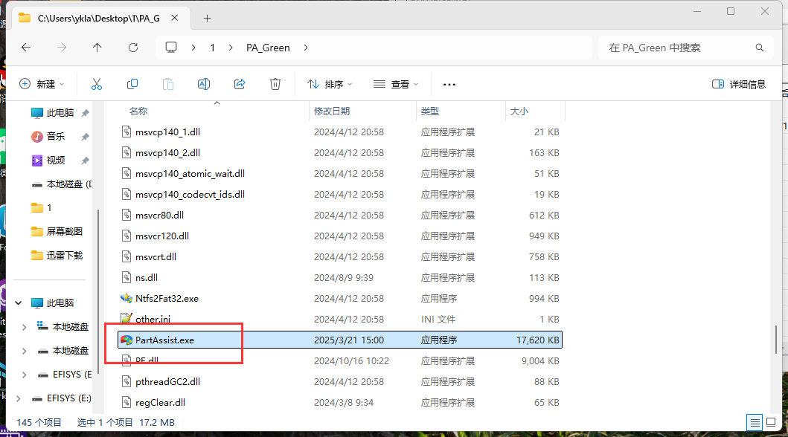

> **技巧**
>
> 专业版会提示需要授权码，但 **无需** 关注其微信公众号，在授权码框中填入数字“1122”即可。参见 AOMEI Technology. 傲梅分区助手常见问题解答[EB/OL]. [2026-03-25]. <https://www.disktool.cn/faq/partition-assistant.html>，该页面提供傲梅分区助手使用常见问题解答，“分区助手使用码：1122”。
>
> 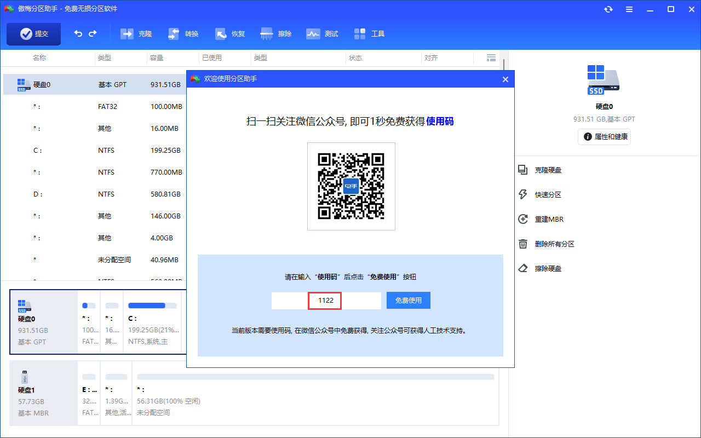

### 判断 U 盘设备

启动傲梅分区助手后，首先需要判断哪个设备是目标 U 盘。这一步与使用 DiskGenius 时类似，需要仔细确认目标设备，以免误操作。

可通过以下信息判断设备是否为 U 盘（若界面显示不全，可使用鼠标滚轮向下滚动）：

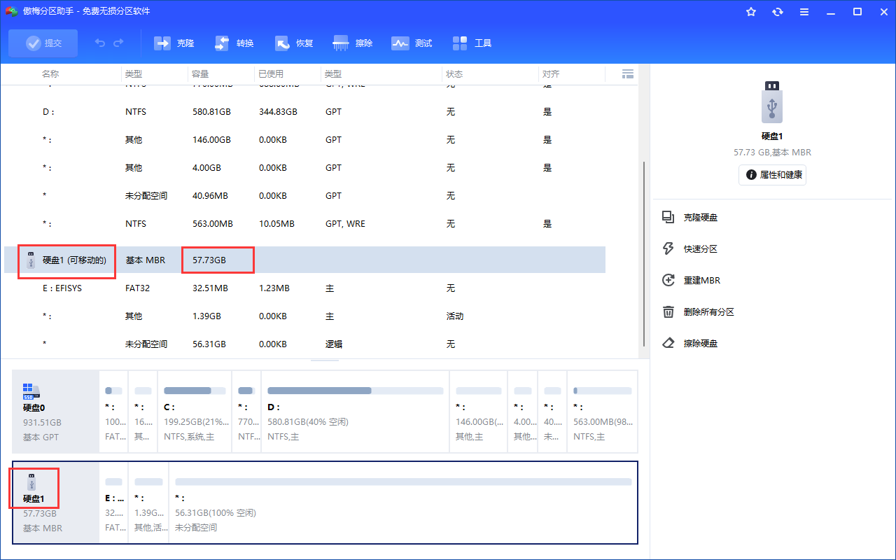

打开“属性与健康”：


观察接口：

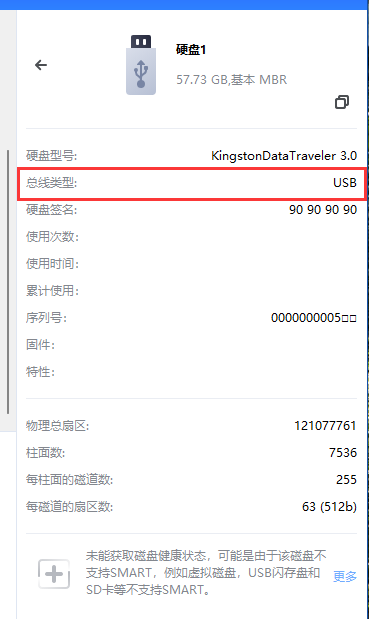

### 还原 U 盘启动盘

确定目标 U 盘后，即可开始还原操作。还原操作分为两个主要步骤：首先删除所有分区，然后创建新的分区。

#### 删除所有分区

首先需要删除 U 盘上的所有分区。

选中 U 盘设备，右键单击“删除所有分区”。

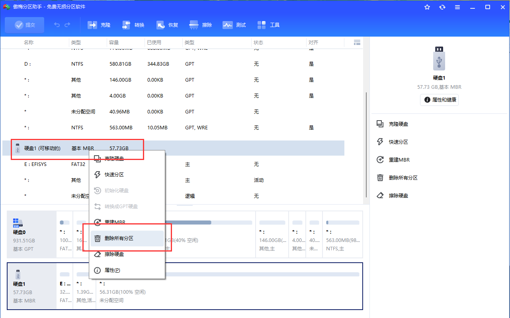

在确认对话框中点击“确定”，以执行“删除所有分区”操作。

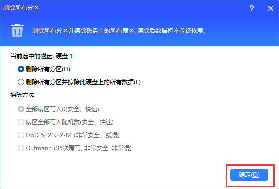

操作后界面如下图所示。点击左上角的“提交”按钮以确认并应用上述修改。


点击“执行”。


确认。

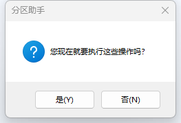

分区删除完毕。


#### 创建新分区

删除所有分区后，需要为 U 盘创建新的分区。

点击底部的 U 盘，右键单击，选择“创建分区”

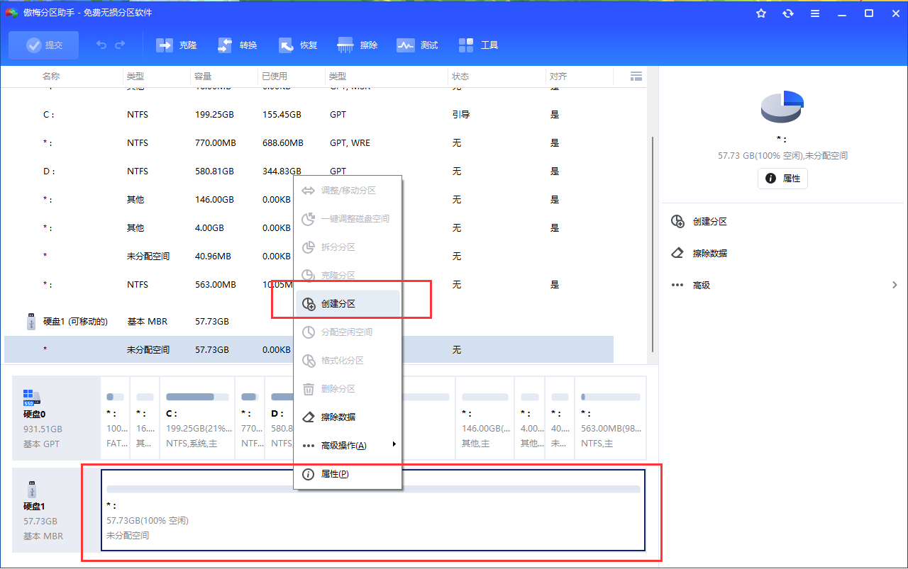

将文件系统设置为“exFAT”，然后点击“确定”按钮。

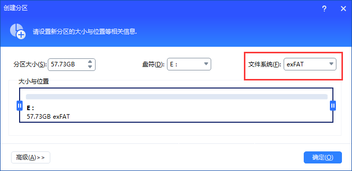

然后点击左上角的“提交”。


在随后弹出的确认窗口中：


执行：

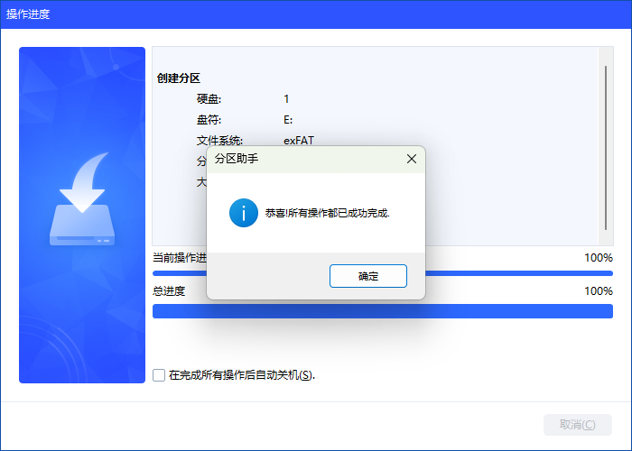

此时，软件已为 U 盘自动分配了盘符 E。


## 通过命令 diskpart 恢复

除了图形界面工具外，还可以使用 Windows 自带的命令行工具 diskpart 来恢复 U 盘。使用命令行工具恢复 U 盘首先需要以管理员身份打开 PowerShell，然后根据 U 盘分区表类型选择相应的操作步骤。

MBR（Master Boot Record，主引导记录）和 GPT（GUID Partition Table，全局唯一标识分区表）是两种常见的磁盘分区表格式。MBR 是传统格式，适用于老式计算机；GPT 是现代格式，支持更大容量磁盘和更多分区，与 UEFI 配合使用。

打开 PowerShell：右键单击 Windows 图标，选择“Windows PowerShell（管理员）”。

### MBR 分区表

首先介绍 MBR 分区表的 U 盘恢复方法。

```powershell
PS C:\WINDOWS\system32> diskpart # 进入 diskpart

Microsoft DiskPart 版本 10.0.26100.1150

Copyright (C) Microsoft Corporation.
在计算机上: DESKTOP-M5P610N

DISKPART> list disk # 列出所有磁盘，下图磁盘 1 没有 GPT 标识，代表这可能是 MBR 分区表的磁盘

  磁盘 ###  状态           大小     可用     Dyn  GPT
  --------  -------------  -------  -------  ---  ---
  磁盘 0    联机              931 GB    41 MB        *
  磁盘 1    联机               57 GB  5120 KB

DISKPART> sel disk 1 # 选中磁盘 1 （根据上下文）在命令输出中，磁盘 1 没有“GPT”标记，表明其可能采用 MBR 分区表。

磁盘 1 现在是所选磁盘。

DISKPART> clean # 清除磁盘 1 所有分区

DiskPart 成功地清除了磁盘。 

DISKPART> cre part pri # 在磁盘 1 创建主分区

DiskPart 成功地创建了指定分区。

DISKPART> list part # 列出磁盘 1 的所有主分区

  分区 ###       类型              大小     偏移量
  -------------  ----------------  -------  -------
* 分区      1    主要                  57 GB  1024 KB

DISKPART> sel part 1 # 选中主分区 1

分区 1 现在是所选分区。

DISKPART> format fs=exfat quick #  快速将所选分区格式化为 exFAT 文件系统

  100 百分比已完成

DiskPart 成功格式化该卷。

DISKPART> active # 设置主分区 1 为活动分区

DiskPart 将当前分区标为活动。

DISKPART> ass letter=E # 挂载到 E 盘，也可以将 U 盘拔出后再插入

DiskPart 成功地分配了驱动器号或装载点。
```

### GPT 分区表

```powershell
PS C:\WINDOWS\system32> diskpart

Microsoft DiskPart 版本 10.0.26100.1150

Copyright (C) Microsoft Corporation.
在计算机上: DESKTOP-M5P610N

DISKPART> list disk # 列出磁盘

  磁盘 ###  状态           大小     可用     Dyn  Gpt
  --------  -------------  -------  -------  ---  ---
  磁盘 0    联机              931 GB    41 MB        *
  磁盘 1    联机               57 GB      0 B

DISKPART> sel disk 1 # 选中磁盘 1

磁盘 1 现在是所选磁盘。

DISKPART> list disk # 当前选中的磁盘前会有标记 *

  磁盘 ###  状态           大小     可用     Dyn  Gpt
  --------  -------------  -------  -------  ---  ---
  磁盘 0    联机              931 GB    41 MB        *
* 磁盘 1    联机               57 GB      0 B


DISKPART> clean # 清空磁盘

DiskPart 成功地清除了磁盘。

DISKPART> convert gpt # 将所选磁盘转换为 GPT 分区表格式
 
DiskPart 已将所选磁盘成功地转更换为 GPT 格式。

DISKPART> list disk # 列出所有磁盘

  磁盘 ###  状态           大小     可用     Dyn  Gpt
  --------  -------------  -------  -------  ---  ---
  磁盘 0    联机              931 GB    41 MB        *
* 磁盘 1    联机               57 GB    57 GB        *

DISKPART> cre part pri # 创建主分区

DiskPart 成功地创建了指定分区。

DISKPART> list part # 列出磁盘 1 的所有分区

  分区 ###       类型              大小     偏移量
  -------------  ----------------  -------  -------
* 分区      1    主要                  57 GB  1024 KB

DISKPART> format fs=exfat quick # 快速将所选分区格式化为 exFAT 文件系统

  100 百分比已完成

DiskPart 成功格式化该卷。

DISKPART> ass letter=E # 将 U 盘分配到 E 盘符

DiskPart 成功地分配了驱动器号或装载点。
```

## 课后习题

1. 在大部分教程中并未提及上面的三字命令缩写，如 `ass`、`cre` 等。但是鲜有人尝试并且大多数 AI 也认为这是错误的命令，原因可能是什么？
