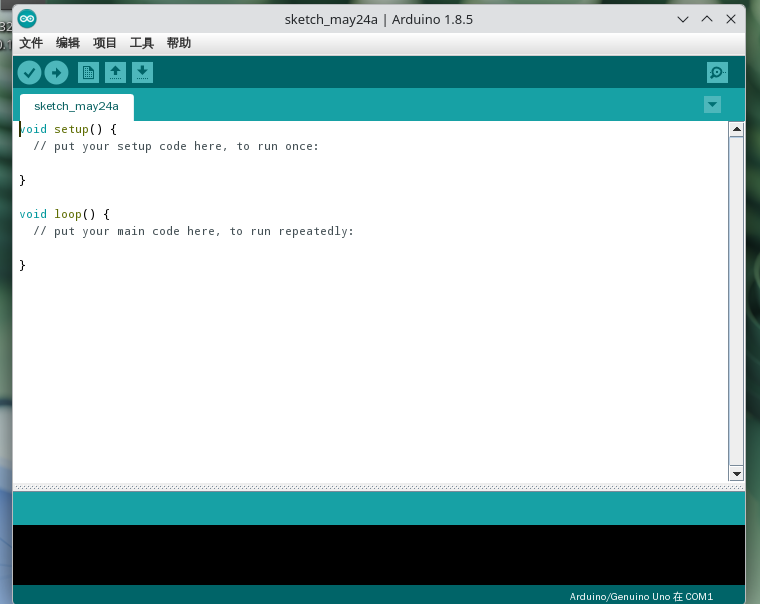

# 20.5 通用嵌入式开发环境

嵌入式系统开发是计算机科学与技术学科的重要分支，其技术成果广泛应用于物联网（Internet of Things，IoT）、工业自动化控制、消费类电子等诸多领域。

本节详细介绍如何在 FreeBSD 操作系统上搭建主流的嵌入式开发环境。

## STM32 开发环境

### STM32 微控制器概述

STM32 是意法半导体（STMicroelectronics，ST）自 2007 年起推出的 32 位微控制器（Microcontroller Unit，MCU）产品系列，该系列产品基于 ARM Cortex‑M 处理器内核架构，目前已成为嵌入式开发领域应用最为广泛的 MCU 平台之一。

### STM32CubeMX 安装与配置

STM32CubeMX 是意法半导体官方提供的图形化硬件配置与代码生成工具，其核心功能是帮助开发者快速完成 STM32 项目的硬件初始化代码生成。本节介绍如何在 FreeBSD 平台上安装 STM32CubeMX。

在 FreeBSD 平台进行 STM32 嵌入式开发，推荐采用 STM32CubeMX 进行项目初始化配置。STM32CubeMX 官方仅支持 Windows、Linux、macOS 三大平台，因此在 FreeBSD 上运行该软件需要借助 Linux 兼容层。

关于在 FreeBSD 上安装 Linux 兼容层的详细教程，请参考本书其他章节，推荐使用 FreeBSD 官方维护的 linux-rl9 兼容层。

在开始安装 STM32CubeMX 之前，请确保系统已安装 OpenJDK（版本要求不低于 17.0.6）作为运行时依赖。

> **注意**
>
> 建议在 `/compat/linux/home` 目录下为当前用户创建专用的主目录，并以非特权用户身份完成 STM32CubeMX 的安装流程，以避免不必要的 root 权限操作带来的安全风险。

例如：

```sh
# mkdir -p /compat/linux/home/username
# cd /compat/linux/home/
# chmod -R 775 username
```

配置好兼容层后，到 [STM32CubeMX 官网](https://www.st.com/en/development-tools/stm32cubemx.html) 下载最新压缩包后进行解压。写作本节时，下载无需注册登录，仅需点击以访客身份下载即可，注意下载链接会被发送到邮件中，请确保邮件地址可以收信。

解压后进入 Linux 兼容层的 bash：

```sh
$ /compat/linux/usr/bin/bash
```

定位到解压缩文件夹并运行其中的 `SetupSTM32CubeMX-{版本号}` 安装脚本（`{版本号}` 对应下载的 STM32CubeMX 版本），指定安装目录即可。

创建桌面快捷方式：

在 `~/Desktop` 目录下创建 `STM32CubeMX.desktop` 文件，然后写入：

```ini
[Desktop Entry]
Name=STM32CubeMX
Exec=/path/to/STM32Cube/STM32CubeMX %U      # 改为对应地址
Terminal=false
Type=Application
Icon=/path/to/STM32Cube/help/STM32CubeMX.png      # 改为对应地址
StartupWMClass=STM32CubeMX
Categories=Development;
Comment=STM32CubeMX
MimeType=application/x-stm32cube-ioc;
```


### 安装其他工具

除了 STM32CubeMX 外，还需要安装一些必要的开发工具链和调试工具，才能完成完整的嵌入式开发流程。本节介绍如何安装其他开发工具。使用 pkg 安装：

```sh
# pkg install gcc-arm-embedded cmake ninja openocd stlink
```

或者使用 ports 构建：

```sh
# cd /usr/ports/devel/gcc-arm-embedded && make install clean      # 嵌入式 ARM 工具链
# cd /usr/ports/devel/cmake && make install clean      # 项目构建系统核心
# cd /usr/ports/devel/ninja && make install clean      # 高效的构建工具
# cd /usr/ports/devel/openocd && make install clean      # 通用 JTAG/SWD 调试和烧录工具
# cd /usr/ports/devel/stlink && make install clean      # ST 官方 ST‑LINK 调试器的用户空间工具集
```

### 编译与烧录

完成开发环境搭建后，就可以开始进行 STM32 程序的编译和烧录工作。本节介绍如何编译和烧录 STM32 程序。使用 STM32CubeMX 创建项目，在 `Project Manager` 的 `Project` 里的 `Toolchain/IDE` 栏选择 CMake，在 `Code Generator` 里选择 `copy all used libraries into project folder` 和 `Generate peripheral initialization as a pair of '.c/.h' files per peripheral`。

生成项目后修改 `CMakeLists.txt` 文件：

```cmake
# 最小 cmake 版本
cmake_minimum_required(VERSION 3.22)

# 交叉编译配置
set(CMAKE_SYSTEM_NAME Generic)
set(CMAKE_SYSTEM_PROCESSOR arm)
set(CMAKE_TRY_COMPILE_TARGET_TYPE STATIC_LIBRARY)

# FreeBSD 下 arm-none-eabi-gcc 默认安装路径
set(TOOLCHAIN_PREFIX "/usr/local/gcc-arm-embedded-14.2.rel1/bin")
set(CMAKE_C_COMPILER   ${TOOLCHAIN_PREFIX}/arm-none-eabi-gcc)
set(CMAKE_ASM_COMPILER ${TOOLCHAIN_PREFIX}/arm-none-eabi-gcc)
set(CMAKE_OBJCOPY      ${TOOLCHAIN_PREFIX}/arm-none-eabi-objcopy)

# 避免查找主机库/头文件
set(CMAKE_FIND_ROOT_PATH_MODE_PROGRAM NEVER)
set(CMAKE_FIND_ROOT_PATH_MODE_LIBRARY ONLY)
set(CMAKE_FIND_ROOT_PATH_MODE_INCLUDE ONLY)
set(CMAKE_FIND_ROOT_PATH_MODE_PACKAGE ONLY)

# 项目定义
project(test LANGUAGES C ASM)      # 改为实际的项目名称

# 收集源文件
file(GLOB_RECURSE HAL_SOURCES "Drivers/STM32F1xx_HAL_Driver/Src/*.c")
# 剔除所有的模板文件，这些文件不应参与编译
list(FILTER HAL_SOURCES EXCLUDE REGEX ".*_template\\.c$")

file(GLOB CORE_SOURCES "Core/Src/*.c")
set(ASM_SOURCES "startup_stm32f103xb.s")

# 定义编译标志
set(MCU_FLAGS "-mcpu=cortex-m3" "-mthumb" "-mfloat-abi=soft")

# 创建可执行目标
add_executable(${PROJECT_NAME}
    ${CORE_SOURCES}
    ${HAL_SOURCES}
    ${ASM_SOURCES}
)

# 配置目标属性 (Include, Options, Definitions)
target_include_directories(${PROJECT_NAME} PRIVATE
    Core/Inc
    Drivers/CMSIS/Include
    Drivers/CMSIS/Device/ST/STM32F1xx/Include
    Drivers/STM32F1xx_HAL_Driver/Inc
    Drivers/STM32F1xx_HAL_Driver/Inc/Legacy
)

target_compile_options(${PROJECT_NAME} PRIVATE
    ${MCU_FLAGS}
    -O2
    -ffunction-sections
    -fdata-sections
    -Wall
)

target_compile_definitions(${PROJECT_NAME} PRIVATE
    STM32F103xB          # 芯片型号，改为实际的芯片
    USE_HAL_DRIVER       # 启用 HAL 驱动
)

target_link_options(${PROJECT_NAME} PRIVATE
    ${MCU_FLAGS}
    -Wl,--gc-sections
    -T${CMAKE_CURRENT_SOURCE_DIR}/STM32F103XX_FLASH.ld
    -specs=nosys.specs
    -Wl,-Map=${PROJECT_NAME}.map
)

# 生成二进制文件
add_custom_command(TARGET ${PROJECT_NAME} POST_BUILD
    COMMAND ${CMAKE_OBJCOPY} -O binary $<TARGET_FILE:${PROJECT_NAME}> ${PROJECT_NAME}.bin
    COMMENT "Building ${PROJECT_NAME}.bin"
)

# 烧录目标
add_custom_target(flash
    COMMAND openocd -f interface/stlink.cfg -f target/stm32f1x.cfg -c "program ${PROJECT_NAME}.bin 0x08000000 verify reset exit"
    DEPENDS ${PROJECT_NAME}
    WORKING_DIRECTORY ${CMAKE_BINARY_DIR}
    COMMENT "Flashing ${CMAKE_BINARY_DIR}/${PROJECT_NAME}.bin via OpenOCD"
)
```

> **注意**
>
> 该演示针对的是 STM32F103C8T6 等 STM32F1x 的芯片，请根据实际情况修改 CMakeLists.txt 文件。
>
> 该演示使用的是 openocd 烧录，也可换为 stlink。

为了在终端使用 gcc-arm-embedded 系列工具，应将其二进制文件加入 PATH 中。

对于 sh/bash/zsh，写入 `~/.profile` 文件：

```sh
export PATH=/usr/local/gcc-arm-embedded-14.2.rel1/bin:$PATH
```

对于 fish，写入 `~/.config/fish/config.fish` 文件：

```sh
set -gx PATH /usr/local/gcc-arm-embedded-14.2.rel1/bin $PATH
```

对于 csh，写入 `~/.cshrc` 文件：

```sh
setenv PATH /usr/local/gcc-arm-embedded-14.2.rel1/bin:$PATH
```

开始编译：

```sh
# 在项目根目录执行

# 第一次创建 build 目录
$ mkdir build && cd build

# 配置
$ cmake .. -G Ninja

# 开始编译
$ ninja
```

最后烧录到开发板：

```sh
# 在 build 目录下执行
ninja flash
```

## Espressif 乐鑫科技开发环境

### ESP 系列芯片概述

除 STM32 平台外，乐鑫科技（Espressif）的 ESP 系列芯片亦是物联网（IoT）开发领域的主流选择，该系列芯片以其集成度高、功耗低以及出色的 Wi‑Fi 和蓝牙连接能力而著称。

[Espressif 乐鑫科技](https://espressif.com/) 的核心开发项目为 ESP‑IDF，这是该公司为 ESP8266、ESP32 等芯片系列提供的官方开发框架，以 Apache 2.0 许可证开源发布。ESP‑IDF 框架包含完整的 Wi‑Fi/Bluetooth 协议栈、FreeRTOS 实时操作系统内核、各类外设驱动程序、功能组件库以及丰富的示例代码。

> **警告**
>
> 需要明确的是，ESP‑IDF 官方尚未正式支持 FreeBSD 平台，其官方文档仅列出了 Windows、Linux、macOS 三大平台的支持说明。
>
> 在 ESP‑IDF 仓库的 `tools/idf_tools.py` 文件中存在以下配置：
>
> ```python
> 'FreeBSD-amd64': PLATFORM_LINUX64,
> 'FreeBSD-i386': PLATFORM_LINUX32,
> ```
>
> 但这仅为将 FreeBSD 平台映射至 Linux 平台的兼容性处理手段，并非官方意义上的直接支持。
>
> 尽管通过一定的技术手段可在 FreeBSD 上成功编译 ESP‑IDF，但其稳定性仍不及官方支持平台，且可能出现未预期的错误，因此不建议在生产环境中采用此配置。

### esptool 与编译工具链安装

在开始使用 ESP‑IDF 之前，需先安装一系列基础工具，包括固件烧录工具和交叉编译工具链。本节介绍 esptool 及相关工具的安装方法。

**使用 pkg 二进制包管理器安装：**

```sh
# pkg install py311-esptool xtensa-esp-elf
```

或者使用 ports 构建：

```sh
# cd /usr/ports/comms/py-esptool && make install clean          # ESP 烧录工具
# cd /usr/ports/devel/xtensa-esp-elf && make install clean     # ESP32/ESP-IDF 编译工具链
```

### 安装 ESP‑IDF

ESP‑IDF 是乐鑫科技官方提供的开发框架，包含了完整的开发工具链和组件库。

#### 下载最新的 ESP‑IDF RELEASE 压缩包

```sh
$ fetch https://github.com/espressif/esp-idf/releases/download/v5.5.3/esp-idf-v5.5.3.zip
```

> **注意**
>
> ESP‑IDF 的版本可能会更新，请检查 [ESP‑IDF 的 GitHub 仓库](https://github.com/espressif/esp-idf) 来获取最新版。

#### 安装必要工具

使用 pkg 安装：

```sh
# pkg install rust cmake ninja pkgconf libffi openssl libxml2 unzip
```

或者使用 ports 构建：

```sh
# cd /usr/ports/lang/rust && make install clean      # 项目要用到 Cargo 构建
# cd /usr/ports/devel/cmake && make install clean      # 项目构建系统核心
# cd /usr/ports/devel/ninja && make install clean      # 高效的构建工具
# cd /usr/ports/devel/pkgconf && make install clean      # 提供 pkg-config 功能
# cd /usr/ports/devel/libffi && make install clean      # Python cffi 模块的底层依赖
# cd /usr/ports/security/openssl && make install clean      # 提供加密算法支持
# cd /usr/ports/textproc/libxml2 && make install clean      # XML 解析库
# cd /usr/ports/archivers/unzip && make install clean      # 终端解压缩工具
```

#### 初次运行 ESP‑IDF 安装程序

下载完 ESP‑IDF 后，需要运行安装脚本进行环境配置。本节介绍如何初次运行 ESP‑IDF 安装程序。然后开始编译 ESP‑IDF：

```sh
$ unzip /path/to/esp-idf-v5.5.3.zip          # 解压 ESP-IDF
$ cd esp-idf-v5.5.3
$ ./install.sh                               # 运行 ESP-IDF 安装脚本（使其生成 espidf.constraints.v5.5.txt 文件）
```

此时脚本会自动下载这些工具：

```sh
~/.espressif/
└── dist/
    ├── esp-rom-elfs-20241011.tar.gz
    ├── esp32ulp-elf-2.38_20240113-linux-amd64.tar.gz
    ├── openocd-esp32-linux-amd64-0.12.0-esp32-20251215.tar.gz
    ├── openocd-esp32-linux-amd64-0.12.0-esp32-20251215.tar.gz.tmp
    ├── riscv32-esp-elf-14.2.0_20251107-x86_64-linux-gnu.tar.xz
    ├── riscv32-esp-elf-14.2.0_20251107-x86_64-linux-gnu.tar.xz.tmp
    ├── riscv32-esp-elf-gdb-16.3_20250913-x86_64-linux-gnu.tar.gz
    ├── xtensa-esp-elf-14.2.0_20251107-x86_64-linux-gnu.tar.xz
    └── xtensa-esp-elf-gdb-16.3_20250913-x86_64-linux-gnu.tar.gz
```

> **技巧**
>
> 如果下载过慢，可以复制终端中的下载链接，然后使用工具加速下载。

> **注意**
>
> 第一次运行 `./install.sh` 命令会卡在 Python 包安装阶段并报错：

```sh
ERROR: Cannot install cryptography because these package versions have conflicting dependencies.
...（省略一些非必要信息）
ERROR: ResolutionImpossible
```

**原因**：

PyPI 和 Espressif 的 extra-index 里根本没有 FreeBSD-amd64 的预编译 wheel（官方只提供了 linux-amd64、win-amd64、macosx 等）。同时 `espidf.constraints.v5.5.txt` 文件里还强制写了 `--only-binary cryptography` 和 `--only-binary tree-sitter-c`，导致 pip 拒绝从源代码编译。

**解决方法：修改 constraints 文件**：

```sh
$ sed -i '' 's/^--only-binary /#--only-binary /' ~/.espressif/espidf.constraints.v5.5.txt
```

这行命令旨在放开源代码编译限制，把文件中所有 `--only-binary` 都注释掉，允许 pip 从源代码编译 cryptography、tree-sitter-c 等包。

修改完成后，重新执行：

```sh
$ ./install.sh
```

这样方可使安装脚本顺利通过 Python 环境阶段。

成功编译后，就可以开始激活 ESP‑IDF 环境：

对于 sh / bash / zsh 用户：

```sh
$ cd ~/Downloads/esp-idf-v5.5.3
$ ./export.sh
```

对于 fish 用户：

```sh
$ cd ~/Downloads/esp-idf-v5.5.3
$ ./export.fish
```

### 编译与烧录示例

完成 ESP‑IDF 环境配置后，就可以开始编译和烧录示例程序了。本节介绍如何编译和烧录 ESP‑IDF 程序。

#### 擦除整个 Flash

在烧录新固件前，通常需要先擦除芯片上的 Flash 存储空间，以确保新固件能够正常运行。

```sh
esptool.py --chip esp32 --port /dev/cuaU0 erase_flash
```

参数说明：

- 把 `--chip` 改为实际的芯片型号，如 `esp32s3`、`esp32c3`。
- `--port` 端口可根据 `dmesg | grep usb` 或 `usbconfig` 查找，通常是 `/dev/cuaU0` 或 `/dev/ttyU0`。

更多子命令帮助请使用：`esptool.py {子命令} --help`，例如 `esptool.py write_flash --help`。

#### 编译项目

擦除 Flash 后，就可以创建并编译 ESP‑IDF 项目了。本节介绍如何编译 ESP‑IDF 项目。执行编译操作：

```sh
$ mkdir -p /path/to/new/project      # 创建文件夹来存储示例项目
$ cd /path/to/new/project    # 进入该目录
$ idf.py create-project hello_world      # 使用 ESP-IDF 创建一个 Espressif 项目，项目名称是 hello_world
$ idf.py set-target esp32          # 设定项目使用的是 esp32 的芯片，可以改为 esp32s3 等
$ idf.py build                     # 使用 xtensa-esp-elf-gcc 编译
```

#### 烧录固件

使用 esptool.py 烧录：

```sh
$ esptool.py --chip esp32 --port /dev/cuaU0 --baud 921600 write_flash -z 0x1000 bootloader.bin
```

参数说明：

- `-z`：压缩模式，速度更快。
- `0x1000`：应用程序起始地址。
- `bootloader.bin`：要烧录的应用程序固件。

额外说明：

| 组件 | 地址 |
| ---- | ---- |
| bootloader | `0x1000` |
| partition table | `0x8000` |
| app (factory) | `0x10000` |

>**警告**
>
>不同型号的刷写地址不一定一致，请务必参考官方文档进行核查。参见：乐鑫科技. 获取不同软件开发平台的固件烧录信息（开发阶段）[EB/OL]. (n.d.)[2026-04-19]. <https://docs.espressif.com/projects/esp-techpedia/zh_CN/latest/esp-friends/get-started/try-firmware/get-firmware-address.html>.

或者使用 idf.py 烧录：

```sh
$ idf.py -p /dev/cuaU0 flash       # 自动调用 esptool.py 烧录
```

### 参考文献

- Espressif Systems. ESP-IDF 编程指南：分区表[EB/OL]. [2026-04-19]. <https://docs.espressif.com/projects/esp-idf/zh_CN/v6.0/esp32/api-guides/partition-tables.html>. 官方分区表介绍。
- Espressif Systems. Flashing Firmware — ESP32 esptool documentation[EB/OL]. [2026-04-19]. <https://docs.espressif.com/projects/esptool/en/latest/esp32/esptool/flashing-firmware.html>. 官方刷写固件的方法。

## Arduino 开发环境

### Arduino 平台概述

Arduino 是一款深受电子爱好者与教育工作者喜爱的开源硬件平台，其设计理念以简易性与可访问性为核心。本节介绍 Arduino 开发平台的配置与使用方法。

[Arduino](https://www.arduino.cc/)（中文常译为阿尔杜伊诺）是一个开源电子原型开发平台，于 2005 年由意大利伊夫雷亚交互设计学院（Interaction Design Institute Ivrea, IDII）的师生共同发起创立。该项目的初衷是服务于教学用途（具体为交互设计硕士课程），旨在让非专业背景的人士也能够便捷地开展电子项目开发。2006 年，由于资金困难，伊夫雷亚交互设计学院（2001-2006 年存续）宣告停办，但 Arduino 项目原型却得以保留并持续发展。

值得一提的是，Arduino 项目的愿景与 FreeBSD 项目的开源理念具有共通之处，[Arduino 的官方愿景](https://www.arduino.cc/en/about/)明确提出要让 Arduino 平台能够为任何人所使用。

> **背景知识**
>
> Arduino 这一名称源自一千多年前的一位意大利国王——伊夫雷亚的阿尔杜因（Arduin of Ivrea），其名字含义为“勇敢的朋友”。而在这位国王的出生地——意大利北部风景如画的伊夫雷亚镇（Ivrea），有一家名为“di Re Arduino”（意为“国王 Arduino 的”）的酒吧，Arduino 项目的联合创始人曾是这家酒吧的常客，项目名称即由此而来。

### Arduino 安装方法

本节介绍 Arduino 开发环境的安装步骤。

**使用 pkg 二进制包管理器安装：**

```sh
# pkg install arduino18 uarduno
```

或者使用 ports 构建：

```sh
# cd /usr/ports/devel/arduino18 && make install clean      # Arduino IDE
# cd /usr/ports/comms/uarduno && make install clean       # Arduino Uno 内核驱动模块
```

然后加载模块：

```sh
# kldload uarduno
```

编辑 `/boot/loader.conf` 文件，加入下行使其永久生效：

```sh
uarduno_load="YES"
```

> **注意**
>
> FreeBSD ports 上的 Arduino IDE 只有 1.8.x 版本，而最新的 Arduino IDE 已经到了 2.x 版本，这是因为 1.8.x 是基于 Java 编写的，易于移植，而 Arduino IDE 2.x（从 2.0 开始）基于 Eclipse Theia 框架和 Electron/Chromium，Theia 虽与 VS Code 共享 Monaco Editor、LSP 等底层技术，但并非 VS Code 的衍生品，而是由 Eclipse 基金会独立开发的 IDE 平台。Electron 在 FreeBSD 上移植更复杂，因为其需要 Linux 专有依赖，且 FreeBSD 的 Chromium port 存在兼容性问题。
>
> 如果对此感兴趣，可以尝试移植。



### 参考文献

- Arduino 中国官方微信公众号. Arduino，你的名字究竟该怎么读？[EB/OL]. (2016-12-09)[2026-03-25]. <https://mp.weixin.qq.com/s/O4wfBF_WlHksmoWbMs7QeA>. 详细介绍 Arduino 名称的由来与正确发音。微信公众号运营主体为 Arduino 在中国的外企独资公司，法定代表人为创始人 Federico Musto 先生。
- 大英百科全书. Arduin of Ivrea[EB/OL]. [2026-03-25]. <https://www.britannica.com/biography/Arduin-of-Ivrea>. 大英百科全书关于意大利国王阿尔杜因·德·伊夫雷亚的历史记载条目。
- Eclipse Foundation. Eclipse Theia FAQ[EB/OL]. [2026-04-17]. <https://theia-ide.org/docs/faq/>. 明确说明 Theia 并非 VS Code 的分支，而是独立开发的 IDE 平台。

## 故障排除与后续研究主题

嵌入式开发环境的搭建与使用过程中可能会遇到各类技术问题，本节旨在记录一些常见问题的解决思路，并预留后续内容的撰写位置。

## 课后习题

1. 查找 PlatformIO 在 FreeBSD 上的相关资料，补充其完整的安装与配置流程，在 FreeBSD 上创建一个 STM32 项目并成功编译烧录。

2. 适配 stm32cubemx2 到 FreeBSD。
