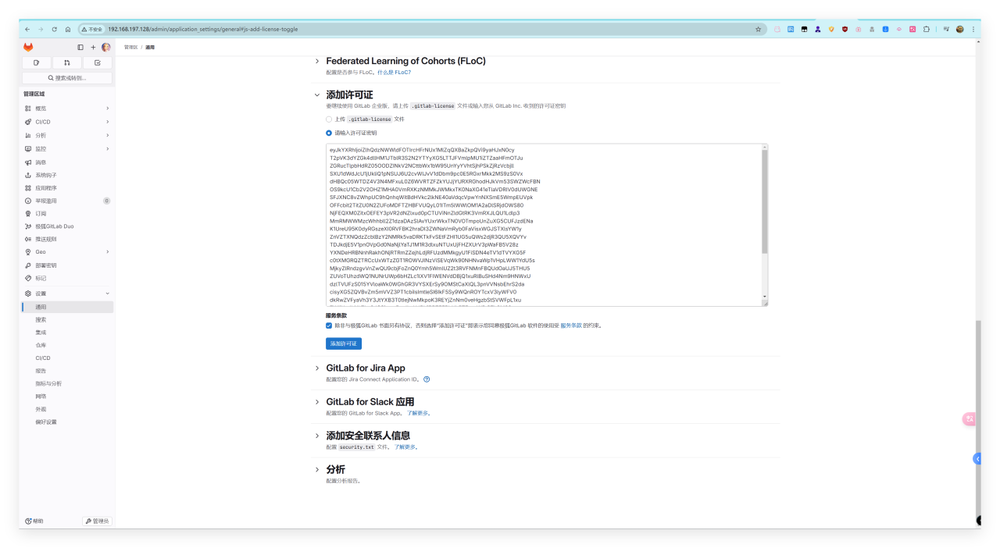
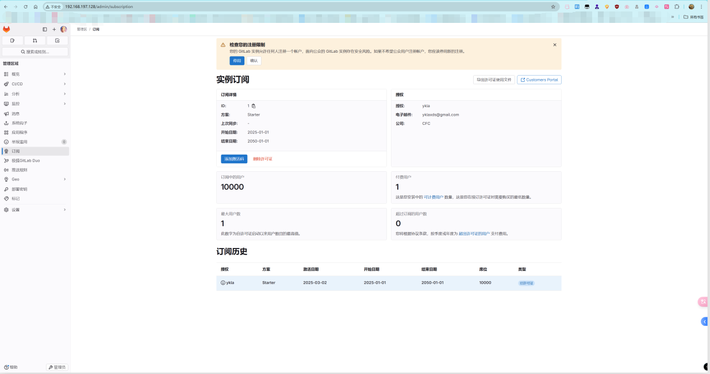
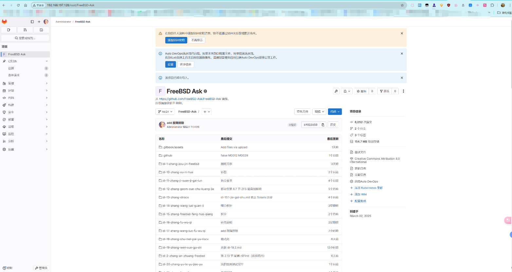

# 20.11 GitLab Enterprise Edition 部署

GitLab EE 提供额外的企业级功能，CE 版本功能相对简化。

## 安装 GitLab EE

```sh
# pkg install gitlab-ee
```

或使用 Ports 安装：

```sh
# cd /usr/ports/www/gitlab/
# make FLAVOR=ee install clean
```

该 Port 同时包含 GitLab CE（社区版）；若要安装 EE（企业版），必须指定参数 `FLAVOR=ee`。

### 安装说明

安装完成后，查看安装包说明，了解后续需完成的配置步骤。

```sh
# pkg info -D gitlab-ee
gitlab-ee-17.8.2_1:
On install:
Gitlab was installed successfully.
# GitLab 已成功安装。

You now need to set up the various components of Gitlab, so please
follow the instructions in the guide at:

https://gitlab.com/mfechner/freebsd-gitlab-docu/blob/master/install/17.8-freebsd.md
# 接下来需要配置 GitLab 的各个组件。
# 请参考上面的 FreeBSD 安装指南链接进行设置。

On upgrade from gitlab-ee<11.9.7:
!! WARNING: Please make sure you read in UPDATING entry 20190423 !!
# 如果从低于 11.9.7 的旧版本升级，
# 请务必阅读 FreeBSD ports 树中 UPDATING 文件中 20190423 的条目！

On upgrade:
If you just installed an major upgrade of GitLab, for example you
switched from 17.5.x to 17.6.x, please follow the instructions in the guide at:

https://gitlab.com/mfechner/freebsd-gitlab-docu/blob/master/update/17.7-17.8-freebsd.md
# 如果进行了主版本升级（例如从 17.5.x 升级到 17.6.x），
# 请按照上面链接的升级指南进行操作。

If you just installed an minor upgrade of GitLab please follow
the instructions in the guide at:

https://gitlab.com/mfechner/freebsd-gitlab-docu/blob/master/update/freebsd_patch_versions.md
# 如果只是进行了小版本升级（例如从 17.8.1 升级到 17.8.2），
# 请参阅上面的补丁版本更新指南。
```

开发者已提供完整安装说明，详见 <https://gitlab.com/mfechner/freebsd-gitlab-docu/blob/master/install/17.8-freebsd.md>。

如需赞助该开发者，可访问：<https://www.patreon.com/mfechner_gitlab_freebsd>。

## 启动服务

安装完成后，需启动相关服务。

首先设置 GitLab 服务开机自启：

```sh
# service gitlab enable
```

## PostgreSQL 数据库配置

GitLab 需要使用 PostgreSQL 数据库。当前 GitLab 17.x 要求 PostgreSQL 最低版本为 14，GitLab 18.x 要求最低版本为 16（参见 GitLab. GitLab installation requirements — PostgreSQL[EB/OL]. [2026-04-16]. <https://docs.gitlab.com/ee/install/requirements.html>. 该页面列出了各版本 GitLab 对 PostgreSQL 的版本要求）。

请参考本书其他相关章节完成 PostgreSQL 数据库部署。

### 数据库与用户初始化

创建 GitLab 使用的数据库和用户：

```sql
$ psql -d template1 -U postgres -c "CREATE USER git CREATEDB SUPERUSER PASSWORD 'password';"   # 创建 PostgreSQL 用户 git，授予创建数据库和超级用户权限，密码为 "password"
CREATE ROLE

$ psql -d template1 -U postgres -c "CREATE DATABASE gitlabhq_production OWNER git;"   # 创建数据库 gitlabhq_production，所有者为 git
CREATE DATABASE

$ psql -U git -d gitlabhq_production   # 使用 git 用户连接到 gitlabhq_production 数据库
psql (16.8)
Type "help" for help.

gitlabhq_production-# \q           # 退出 psql
$ exit                              # 退出 postgres 用户
```

### 数据库扩展配置

为 GitLab 数据库创建必要的扩展：

```sh
# psql -U postgres -d gitlabhq_production -c "CREATE EXTENSION IF NOT EXISTS pg_trgm;"   # 为 gitlabhq_production 数据库创建 pg_trgm 扩展
# psql -U postgres -d gitlabhq_production -c "CREATE EXTENSION IF NOT EXISTS btree_gist;"   # 为 gitlabhq_production 数据库创建 btree_gist 扩展
# psql -U postgres -d gitlabhq_production -c "CREATE EXTENSION IF NOT EXISTS plpgsql;"   # 为 gitlabhq_production 数据库创建 plpgsql 扩展
```

## Redis 缓存服务配置

Redis 是一个开源的内存数据结构存储系统，GitLab 使用其作为缓存和会话存储。Redis 已自动作为依赖项安装。

查看安装后信息：

```sh
# pkg info -D redis
redis-7.4.2:
On install:
To setup "redis" you need to edit the configuration file:
      /usr/local/etc/redis.conf
# 要配置 Redis，需要编辑配置文件：
# /usr/local/etc/redis.conf

      To run redis from startup, add redis_enable="YES"
      in your /etc/rc.conf.
# 要使 Redis 在系统启动时自动运行，需在 /etc/rc.conf 文件中添加以下行：
# redis_enable="YES"
```

Redis 相关文件结构：

```sh
/
├── usr
│   └── local
│       └── etc
│           └── redis.conf    # Redis 配置文件
└── var
    └── run
        └── redis
            └── redis.sock   # Redis UNIX socket
```

### 配置 socket

配置 Redis 使用 UNIX socket 进行通信：

```sh
# echo 'unixsocket /var/run/redis/redis.sock' >> /usr/local/etc/redis.conf   # 配置 Redis 使用 UNIX socket
# echo 'unixsocketperm 770' >> /usr/local/etc/redis.conf                    # 设置 Redis UNIX socket 权限为 770
```

### 配置服务

设置 Redis 服务开机启动：

```sh
# service redis enable
```

重启 Redis 服务：

```sh
# service redis restart
```

### 配置用户权限

将用户 git 添加到 redis 用户组，以允许 GitLab 访问 Redis：

```sh
# pw groupmod redis -m git
```

## Git 环境配置

GitLab 的核心组件包括：

- **Puma**：GitLab 使用的 Web 应用服务器
- **Gitaly**：负责 Git 仓库存储和访问的服务
- **Sidekiq**：后台任务处理队列
- **GitLab Workhorse**：智能反向代理，处理 HTTP 请求

配置 Git 环境：

```sh
# su -l git -c "git config --global core.autocrlf input" # Web 编辑器需要
# su -l git -c "git config --global gc.auto 0" # GitLab 在需要时会自动运行 git gc
# su -l git -c "git config --global repack.writeBitmaps true" # 加速仓库的对象访问和克隆操作
# su -l git -c "git config --global receive.advertisePushOptions true" # 允许服务器在 git push 时支持推送参数
# su -l git -c "git config --global core.fsync objects,derived-metadata,reference" # 减少服务器崩溃时存储库损坏的风险
# su -l git -c "mkdir -p /usr/local/git/.ssh" # 确保 .ssh 目录存在
# su -l git -c "mkdir -p /usr/local/git/repositories" # 确保存储库目录存在，并后续设置正确权限
# chown git /usr/local/git/repositories     # 将 /usr/local/git/repositories 所有者设置为 git 用户
# chgrp git /usr/local/git/repositories     # 将 /usr/local/git/repositories 所属组设置为 git
# chmod 2770 /usr/local/git/repositories    # 设置目录权限为 2770，启用 SGID，使组内用户可读写并继承组
```

文件结构：

```sh
/usr/local/git/
├── .ssh/ # SSH 配置目录
└── repositories/ # GitLab 仓库存储目录
```

## 配置 GitLab

配置文件路径在 **/usr/local/www/gitlab**。

```sh
/
├── usr
│   └── local
│       ├── www
│       │   └── gitlab
│       │       ├── config
│       │       │   ├── puma.rb                 # Puma 配置文件
│       │       │   ├── database.yml           # 数据库连接配置
│       │       │   └── secrets.yml            # 密钥配置文件
│       │       ├── db
│       │       │   └── fixtures
│       │       │       └── production         # 生产环境数据种子文件
│       │       ├── lib
│       │       │   └── support
│       │       │       └── nginx
│       │       │           └── gitlab         # GitLab Nginx 配置文件
│       │       ├── tmp
│       │       │   └── sockets
│       │       │       └── private
│       │       │           └── gitaly.socket  # Gitaly socket
│       │       └── package.json              # Node.js 依赖配置
│       └── share
│           └── gitlab-shell                  # GitLab Shell 目录
```

### 调整 GitLab 负载

查看系统的 CPU 核心数量：

```sh
# sysctl hw.ncpu
hw.ncpu: 16
```

编辑 **/usr/local/www/gitlab/config/puma.rb** 文件，将 `workers 3` 改为上述输出的值，即改为 `workers 16`。

### 数据库连接配置

编辑 **/usr/local/www/gitlab/config/database.yml** 文件，将 `password: "secure password"` 修改为 `password: "password"`（`password` 是上述设置的数据库密码）。

GitLab 需要写入权限来创建符号链接：

```sh
# chown git /usr/local/share/gitlab-shell      # 将 /usr/local/share/gitlab-shell 的所有者设置为 git 用户
```

初始化 GitLab 数据库和相关配置：

```sh
# cd /usr/local/www/gitlab # 确保路径正确
root@ykla:/usr/local/www/gitlab # su -l git -c "cd /usr/local/www/gitlab && rake gitlab:setup RAILS_ENV=production" #  初始化 GitLab 数据库和相关配置

……此处省略部分内容……

This will create the necessary database tables and seed the database.
You will lose any previous data stored in the database.
Do you want to continue (yes/no)? yes # 此处输入 yes 按回车键

Dropped database 'gitlabhq_production'
Created database 'gitlabhq_production'

……此处省略部分内容……

Administrator account created:

login:    root # 注意用户名
password: You'll be prompted to create one on your first visit.

……此处省略部分内容……
```

撤销之前授予的权限：

```sh
# chown root /usr/local/share/gitlab-shell      # 将 /usr/local/share/gitlab-shell 的所有者设置为 root 用户
```

- 初始化 GitLab 数据库（注意：此操作会清空并重建数据库，仅首次部署时执行）

```sh
# su -l git -c "cd /usr/local/www/gitlab && rake gitlab:setup RAILS_ENV=production"      # 以 git 用户身份进入 GitLab 目录并执行生产环境初始化任务

……此处省略部分内容……

This will create the necessary database tables and seed the database.
You will lose any previous data stored in the database.
Do you want to continue (yes/no)? yes

……此处省略部分内容……
```

重新设置权限：

```sh
# chown root /usr/local/share/gitlab-shell      # 将 /usr/local/share/gitlab-shell 的所有者更改为 root 用户
```

检查 GitLab 及其环境是否配置正确：

```sh
# su -l git -c "cd /usr/local/www/gitlab && rake gitlab:env:info RAILS_ENV=production"      # 以 git 用户身份执行命令，切换到 GitLab 目录并显示生产环境信息

System information
System:
Proxy:		no
Current User:	git
Using RVM:	no
Ruby Version:	3.2.7
Gem Version:	3.6.4
Bundler Version:2.6.4
Rake Version:	13.2.1
Redis Version:	7.4.2
Sidekiq Version:7.2.4
Go Version:	unknown

GitLab information
Version:	17.8.2-ee
Revision:	Unknown
Directory:	/usr/local/www/gitlab
DB Adapter:	PostgreSQL
DB Version:	16.8
URL:		http://localhost
HTTP Clone URL:	http://localhost/some-group/some-project.git
SSH Clone URL:	git@localhost:some-group/some-project.git
Elasticsearch:	no
Geo:		no
Using LDAP:	no
Using Omniauth:	yes
Omniauth Providers:

GitLab Shell
Version:	14.39.0
Repository storages:
- default: 	unix:/usr/local/www/gitlab/tmp/sockets/private/gitaly.socket
GitLab Shell path:		/usr/local/share/gitlab-shell

……此处省略部分内容……
```

如果使用 corepack（Node.js），将 `package.json` 文件的所有者更改为 git 用户：

```sh
# chown git /usr/local/www/gitlab/package.json
```

设置 Python 版本，设置前先用 `ls` 查看：

```sh
# ls /usr/local/bin/python3.11
/usr/local/bin/python3.11
```

在确认版本后，以 git 用户身份设置 Yarn 使用指定的 Python 解释器：

```sh
# su -l git -c "cd /usr/local/www/gitlab && yarn config set python /usr/local/bin/python3.11"
yarn config v1.22.19
success Set "python" to "/usr/local/bin/python3.11".
Done in 0.03s.
```

编译资源，以 git 用户身份在 GitLab 目录安装生产依赖并使用 lockfile 文件：

```sh
# su -l git -c "cd /usr/local/www/gitlab && yarn install --production --pure-lockfile"
yarn install v1.22.19
$ node ./scripts/frontend/preinstall.mjs
[WARNING] package.json changed significantly. Removing node_modules to be sure there are no problems.
[1/5] Validating package.json...

……此处省略部分内容……

[-/8] ⠠ waiting...
warning Your current version of Yarn is out of date. The latest version is "1.22.22", while you're on "1.22.19".
Done in 109.27s.
```

以 git 用户身份在生产环境下编译 GitLab 资产，同时跳过数据库和存储验证：

```sh
# su -l git -c "cd /usr/local/www/gitlab && RAILS_ENV=production NODE_ENV=production USE_DB=false SKIP_STORAGE_VALIDATION=true bundle exec rake gitlab:assets:compile"

……此处省略。该步骤大概需要几十分钟；若提示内存溢出，请增加 swap。通常需要执行两次；若出现内存溢出，则需再重复执行一次……

The file does not introduce any side effects, we are all good.
gitlab:assets:check_page_bundle_mixins_css_for_sideeffects finished in 0.371513498 seconds
```

将 PostgreSQL 用户 git 设置为非超级用户：

```sh
# psql -d template1 -U postgres -c "ALTER USER git WITH NOSUPERUSER;"
ALTER ROLE
```

启动 GitLab 服务：

```sh
# service gitlab start

……此处省略部分内容……

Started in 45s.
The GitLab web server with pid 8202 is running.
The GitLab Sidekiq job dispatcher with pid 8212 is running.
The GitLab Workhorse with pid 8216 is running.
Gitaly with pid 8218 is running.
GitLab and all its components are up and running.
```

## Nginx

Nginx 是一个高性能的 Web 服务器和反向代理，GitLab 使用其作为前端 Web 服务器。

请参考其他章节安装 Nginx。

### 配置 **/usr/local/etc/nginx/nginx.conf** 文件

编辑 **/usr/local/etc/nginx/nginx.conf** 文件，找到：

```nginx
http {
    include       mime.types;
    default_type  application/octet-stream;
```

修改如下以包含 GitLab 提供的 Nginx 配置文件：

```nginx
http {
    include       mime.types;
    default_type  application/octet-stream;
    include       /usr/local/www/gitlab/lib/support/nginx/gitlab; # 加入此行
```

目录结构：

```sh
/
├── usr
│   └── local
│       └── etc
│           └── nginx
│               └── nginx.conf        # Nginx 主配置文件
└── var
    └── log
        └── nginx
            ├── gitlab_error.log     # GitLab 错误日志
            └── error.log            # Nginx 错误日志
```

## 配置服务

设置 Nginx 在系统启动时自动启动：

```sh
# service nginx enable
```

启动 Nginx 服务：

```sh
# service nginx start
```

## 配置 GitLab Pages

GitLab Pages 是 GitLab 提供的静态网站托管服务。配置 GitLab Pages：

```sh
# su -l git -c "openssl rand -base64 32 > /usr/local/www/gitlab/.gitlab_pages_secret"   # 以 git 用户身份生成 GitLab Pages 密钥
# chmod 640 /usr/local/www/gitlab/.gitlab_pages_secret   # 设置密钥文件权限为 640
# chgrp gitlab-pages /usr/local/www/gitlab/.gitlab_pages_secret   # 将密钥文件的用户组更改为 gitlab-pages
```

目录结构：

```sh
/
├── usr
│   └── local
│       └── www
│           └── gitlab
│               ├── .gitlab_pages_secret                  # GitLab Pages 密钥
│               ├── .license_encryption_key.pub           # GitLab 许可证加密公钥
│               └── .license_encryption_key.pub.back      # GitLab 许可证加密公钥备份
└── var
    └── log
        ├── gitlab_pages.log                             # GitLab Pages 日志
        └── gitlab-shell
            └── gitlab-shell.log                         # GitLab Shell 日志
```

### 启动服务

启动 GitLab Pages 服务：

```sh
# sysrc gitlab_pages_enable="YES"   # 设置 GitLab Pages 在系统启动时自动启动
# service gitlab_pages start        # 启动 GitLab Pages 服务
```

## 检查配置

以 git 用户身份检查 GitLab 生产环境配置：

```sh
# su -l git -c "cd /usr/local/www/gitlab && rake gitlab:check RAILS_ENV=production"
Checking GitLab subtasks ...

……此处省略部分内容……

Checking GitLab App ... Finished

Checking GitLab subtasks ... Finished
```

## 平台访问与初始化

重启 GitLab 服务：

```sh
# service gitlab restart
```

在浏览器中输入服务器 IP 并回车，例如本示例为 `192.168.197.128`。请填写电子邮箱并设置密码（至少 8 位，需包含复杂字符）。


登录：


## 语言环境配置

点击头像，进入“Preferences”，找到“Localization”，选择“简体中文”，然后点击“Save changes”保存设置：


## 许可证激活（仅供学习参考）

> **⚠ 合规警告**
>
> 以下操作涉及生成非授权许可证，**违反 GitLab 最终用户许可协议（EULA）**。此部分内容仅供个人学习研究参考，**严禁用于任何生产环境或商业用途**。本书作者及出版方不承担因滥用本节内容而产生的任何法律责任。请支持正版：[购买 GitLab 许可证](https://about.gitlab.com/pricing/)。

安装 `gitlab-license`（gem 是 Ruby 包管理器，已作为依赖自动安装）：

```sh
# gem install gitlab-license
```

创建许可证目录：

```sh
# mkdir gitlab-license           # 创建 gitlab-license 目录
```

将以下内容写入 `gitlab-license/license.rb` 文件：

```ruby
require "openssl"
require "gitlab/license"
key_pair = OpenSSL::PKey::RSA.generate(2048)
File.open("license_key", "w") { |f| f.write(key_pair.to_pem) }
public_key = key_pair.public_key
File.open("license_key.pub", "w") { |f| f.write(public_key.to_pem) }
private_key = OpenSSL::PKey::RSA.new File.read("license_key")
Gitlab::License.encryption_key = private_key
license = Gitlab::License.new
license.licensee = {
"Name" => "ykla", # 修改为用户名
"Company" => "CFC", # 修改为机构
"Email" => "yklaxds@gmail.com", # 修改为电子邮箱
}
license.starts_at = Date.new(2025, 1, 1) # 开始时间
license.expires_at = Date.new(2050, 1, 1) # 结束时间
license.notify_admins_at = Date.new(2049, 12, 1)
license.notify_users_at = Date.new(2049, 12, 1)
license.block_changes_at = Date.new(2050, 1, 1)
license.restrictions = {
active_user_count: 10000,
}
puts "License:"
puts license
data = license.export
puts "Exported license:"
puts data
File.open("GitLabBV.gitlab-license", "w") { |f| f.write(data) }
public_key = OpenSSL::PKey::RSA.new File.read("license_key.pub")
Gitlab::License.encryption_key = public_key
data = File.read("GitLabBV.gitlab-license")
$license = Gitlab::License.import(data)
puts "Imported license:"
puts $license
unless $license
raise "The license is invalid."
end
if $license.restricted?(:active_user_count)
active_user_count = 10000
if active_user_count > $license.restrictions[:active_user_count]
    raise "The active user count exceeds the allowed amount!"
end
end
if $license.notify_admins?
puts "The license is due to expire on #{$license.expires_at}."
end
if $license.notify_users?
puts "The license is due to expire on #{$license.expires_at}."
end
module Gitlab
class GitAccess
    def check(cmd, changes = nil)
    if $license.block_changes?
        return build_status_object(false, "License expired")
    end
    end
end
end
puts "This instance of GitLab Enterprise Edition is licensed to:"
$license.licensee.each do |key, value|
puts "#{key}: #{value}"
end
if $license.expired?
puts "The license expired on #{$license.expires_at}"
elsif $license.will_expire?
puts "The license will expire on #{$license.expires_at}"
else
puts "The license will never expire."
end
```

使用 Ruby 执行 `license.rb` 脚本：

```ruby
# ruby license.rb
License:
#<Gitlab::License:0x00001333815f0f88>
Exported license:
eyJkYXRhIjoiZlhQdzNWWldFOTIrcHFrNUx1MlZqQXBaZkpQVi9yaHJxN0cy

……此处省略部分内容……

K2YwbWhobEpRPT1cbiJ9
Imported license:
#<Gitlab::License:0x0000133381f3ece8>
This instance of GitLab Enterprise Edition is licensed to:
Name: ykla
Company: CFC
Email: yklaxds@gmail.com
The license will expire on 2050-01-01
```

备份旧的公钥：

```sh
# cp /usr/local/www/gitlab/.license_encryption_key.pub /usr/local/www/gitlab/.license_encryption_key.pub.back
```

查看目录下文件。在目录下生成三个文件：

```sh
root@ykla:~/gitlab-license # ls
GitLabBV.gitlab-license	license_key
license.rb		license_key.pub
```

用新生成的公钥替换原有公钥：

```sh
root@ykla:~/gitlab-license # cp license_key.pub /usr/local/www/gitlab/.license_encryption_key.pub
```

查看公钥：

```sh
root@ykla:~/gitlab-license # cat GitLabBV.gitlab-license
eyJkYXRhIjoiZlhQdzNWWldFOTIrcHFrNUx1MlZqQXBaZkpQVi9yaHJxN0cy

……此处省略部分内容……

K2YwbWhobEpRPT1cbiJ9
```

访问 [http://192.168.197.128/admin/application\_settings/general](http://192.168.197.128/admin/application_settings/general)（请替换为实际的 IP 地址），点击“添加许可证”，然后在“请输入许可证密钥”框中粘贴 `GitLabBV.gitlab-license` 文件中的内容：





### 参考文献

- 孟古一. GitLab EE 16 安装破解教程[EB/OL]. (2023-07-05)[2026-03-26]. <https://blog.mengguyi.com/articles/GitLab-Install.html>. 记录 GitLab Enterprise Edition 的安装流程与许可证配置方法。

## 外部项目导入配置

打开 <http://192.168.197.128/admin>，点击“通用”，选择右侧“导入和导出设置”，选择所需的项目，保存。




### 参考文献

- 李俊才. CI/CD 笔记.Gitlab 系列：2024 更新后 - 设置 GitLab 导入源[EB/OL]. (2024-03-11)[2026-03-26]. <https://bbs.huaweicloud.com/blogs/423539>. 说明 2024 版 GitLab 中配置外部项目导入源的操作步骤。

## 故障排除与未竟事宜

### 日志

- **/var/log/nginx/gitlab_error.log**
- **/var/log/nginx/error.log**
- **/var/log/gitlab_pages.log**
- **/var/log/gitlab-shell/gitlab-shell.log**

### `500: We're sorry, something went wrong on our end`

查看 GitLab 服务的当前状态：

```sh
# service gitlab status
The GitLab web server with pid 8202 is running.
The GitLab Sidekiq job dispatcher with pid 8212 is running.
The GitLab Workhorse with pid 8216 is running.
Gitaly with pid 8218 is running.
GitLab and all its components are up and running.
```

如果服务运行状态正常且错误日志无异常，可能是内存不足。显示内核环缓冲区消息：

```sh
# dmesg

……此处省略部分内容……

swap_pager: out of swap space
swap_pager_getswapspace(11): failed
swap_pager: out of swap space
swap_pager_getswapspace(27): failed
swap_pager_getswapspace(11): failed
swap_pager_getswapspace(4): failed
pid 7965 (node), jid 0, uid 211, was killed: failed to reclaim memory
pid 7822 (ruby32), jid 0, uid 211, was killed: failed to reclaim memory
```

如果仍然出现 500 错误，建议检查系统资源配置。

#### 参考文献

- AppX. CentOS 7 上 GitLab 的安装、备份、迁移及恢复[EB/OL]. (2018-11-14)[2026-03-26]. <https://blog.ifeegoo.com/the-installation-backup-migration-restore-of-gitlab-on-centos-7.html>. 该文档提供了 GitLab 常见问题排查与数据管理的实用指南。

## 课后习题

1. 在 FreeBSD 上安装 GitLab CE（社区版）而非 EE 版，完成完整配置流程并验证代码仓库创建、提交与克隆功能，提交 PR 至本节。

2. 加固 GitLab 安全，使之适用于生产环境。总结并提交 PR 至本节。

3. 修改 GitLab 的默认项目可见性设置，从私有改为内部。
