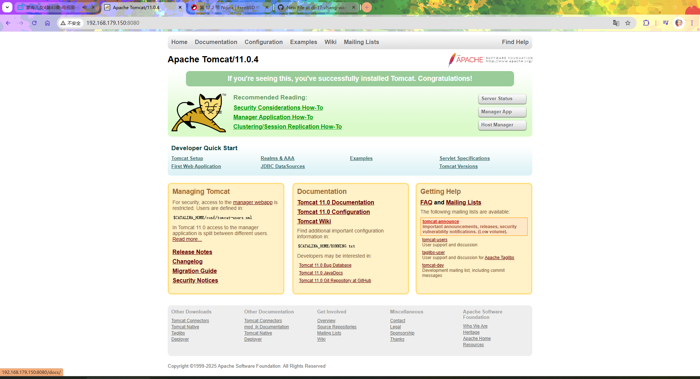

# 20.5 Tomcat 应用服务器

本节介绍在 FreeBSD 操作系统上部署 Tomcat 应用服务器的方法。

## 安装 Tomcat

使用 pkg 包管理器安装：

```sh
# pkg install tomcat110
```

若使用 Ports 方式安装：

```sh
# cd /usr/ports/www/tomcat110/
# make install clean
```

## 配置 Tomcat

Tomcat 11 文件路径在 **/usr/local/apache-tomcat-11.0**。

```sh
/usr/local/apache-tomcat-11.0/
├── bin/
├── conf/
│   ├── server.xml
│   └── web.xml
├── webapps/
├── logs/
└── work/
```

其主要目录结构：

- `bin/`：存放启动、停止等脚本文件
- `conf/`：存放配置文件，包括 `server.xml`（主配置文件，重命名 `server.xml.sample` 而来）和 `web.xml`（Web 应用默认配置，由 `web.xml.sample` 文件重命名而来）
- `webapps/`：Web 应用部署目录
- `logs/`：日志文件目录
- `work/`：JSP 编译后的临时工作目录

### Tomcat 服务

加入启动项，设置 Tomcat 服务开机自启：

```sh
# service tomcat110 enable
tomcat110 enabled in /etc/rc.conf
```

启动 Tomcat 服务：

```sh
# service tomcat110 start
Starting tomcat110.
```

打开 `ip:8080`，如 `http://192.168.179.150:8080/`，可以访问 Tomcat 的默认页面：



### 基础配置说明

Tomcat 的主要配置文件为 **/usr/local/apache-tomcat-11.0/conf/server.xml**，该文件定义了服务端口、连接器、引擎和主机等核心组件。在默认情况下，Tomcat 监听 8080 端口用于 HTTP 连接。AJP（Apache JServ Protocol）连接器默认未启用，如需使用可在 `server.xml` 中取消注释来开启 8009 端口。如需修改端口或配置 HTTPS 支持，可编辑该配置文件。

Web 应用应部署在 **/usr/local/apache-tomcat-11.0/webapps/** 目录下，Tomcat 会自动加载该目录下的 WAR 包或解压后的 Web 应用目录。

- Apache Software Foundation. Apache Tomcat 11 Configuration Reference[EB/OL]. [2026-04-17]. <https://tomcat.apache.org/tomcat-11.0-doc/config/index.html>，Tomcat 11 各组件配置参考。
- Apache Software Foundation. Apache Tomcat 11 Migration Guide[EB/OL]. [2026-04-17]. <https://tomcat.apache.org/migration-11.0.html>，详述 Tomcat 11 所实现的 Jakarta EE 规范版本及从旧版本迁移的注意事项。

## 课后习题

1. 为 Tomcat 新增 HTTPS 支持，及 SSL 自动续签。
2. 修改 Tomcat 默认的 server.xml 配置，将默认 HTTP 端口从 8080 改为 8081，同时配置线程池最大线程数从 200 改为 50，验证配置变更效果（例如，重启服务并访问新端口）。
3. Tomcat 作为 Java Servlet 容器，其线程模型与 JVM 垃圾回收策略存在深度绑定。分析在不同 GC 算法（G1、ZGC）下调整线程池大小的性能影响，并讨论 FreeBSD 上 OpenJDK 的 GC 表现是否因操作系统调度程序差异而与 Linux 有所不同。
