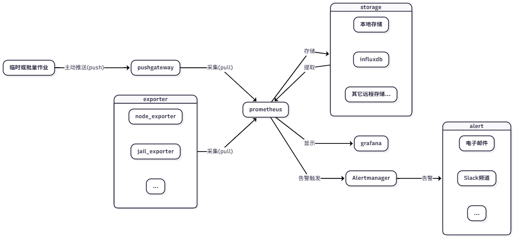
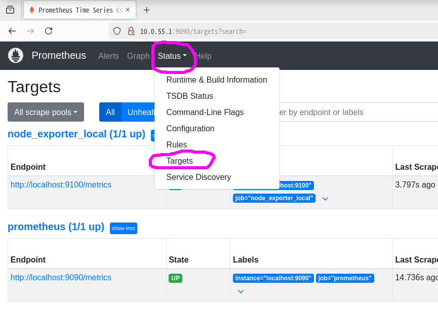
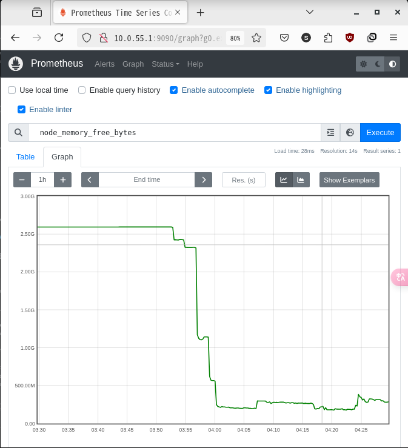
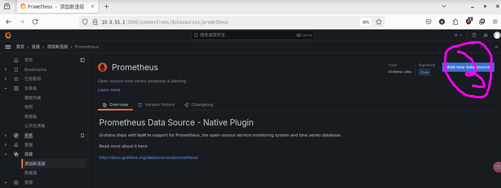
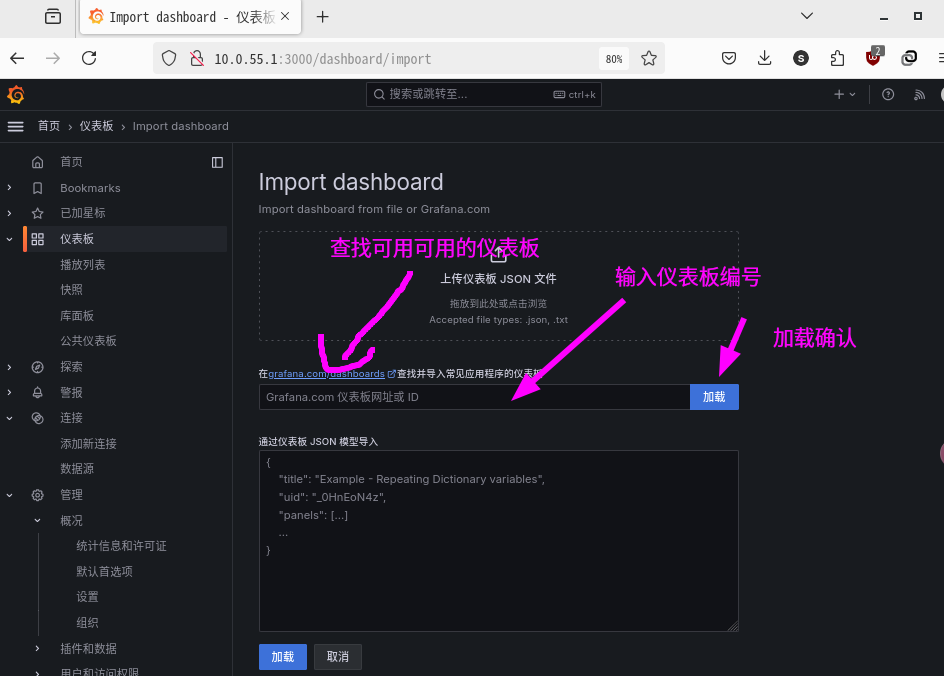
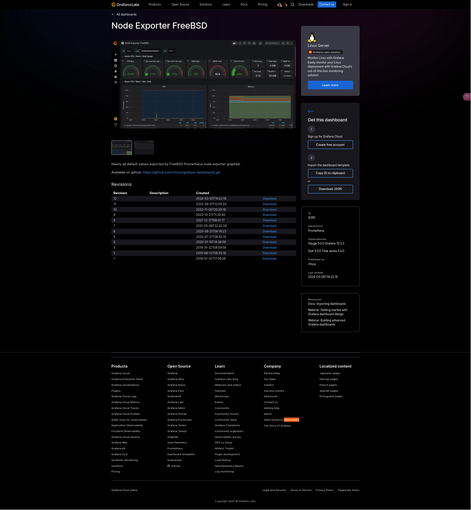
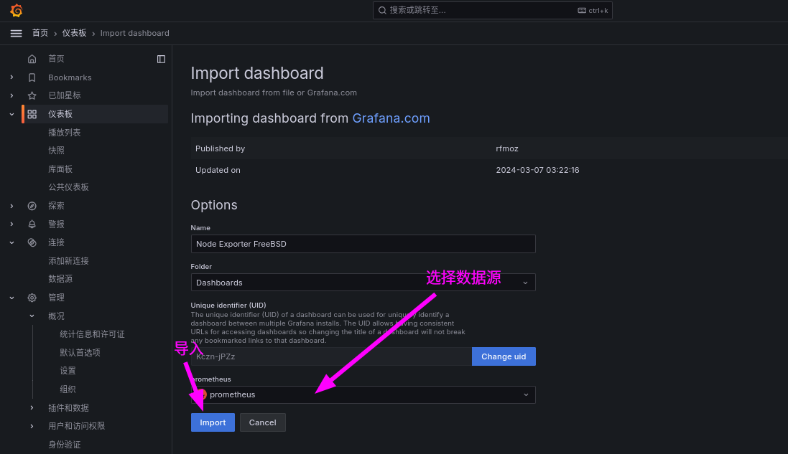
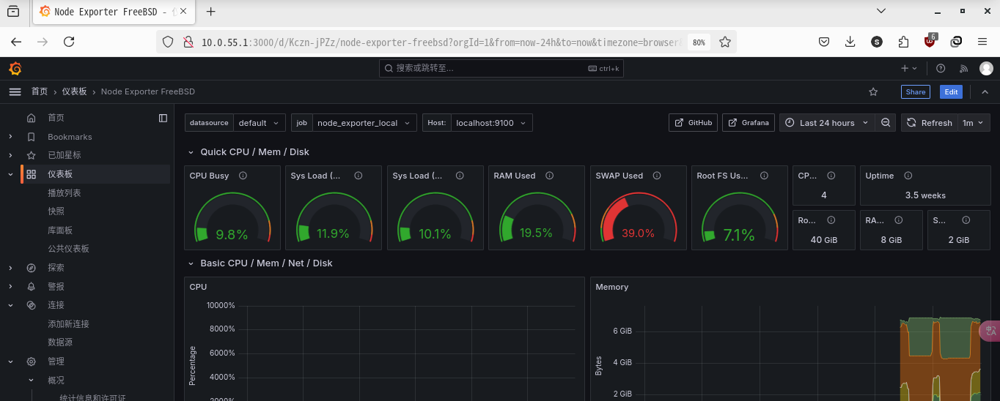
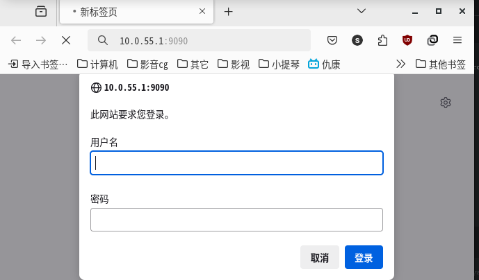

# 20.8 Prometheus 监控部署

以 Prometheus TSDB 为时序数据库，通过 exporters 采集节点系统负载、存储与内存指标，并部署 Alertmanager 实现告警通知。

## 框架

Prometheus 监控部署框架如图所示。



说明：

- Prometheus 是整个监控系统的中心。
- Grafana 用于将监控数据可视化显示。
- Exporter 用于数据采集。Prometheus 支持多种 Exporter，可使用 `pkg search -D prometheus` 查找。
- Alertmanager 用于处理告警信息。
- Prometheus 可配置多种远程存储。

> **注意**
>
> Prometheus、Grafana、Exporter、Alertmanager 等组件可以分别部署在不同的设备或操作系统上。Exporter 应安装在被监控的节点上。以下示例中，Prometheus、Grafana、Alertmanager 安装在同一台机器上，Exporter 根据需要单独部署。

如果遇到服务启动问题，可先查看 **/var/log/daemon.log** 文件。Prometheus 配置文件大部分采用 YAML 格式，请注意缩进。对于 Prometheus 配置文件，可使用 `promtool check` 命令检查配置文件是否正确。

## 安装基本工具

了解框架后，需要安装 Prometheus 监控系统的基本组件。

### 安装 prometheus

使用 pkg 包管理器安装 Prometheus 是最快捷的方式，执行以下命令即可完成安装。

```sh
# pkg install prometheus
```

或者使用 Ports 方式安装 Prometheus，需要先进入对应的目录再执行安装命令。

```sh
# cd /usr/ports/net-mgmt/prometheus2/
# make install clean
```

#### 服务项

设置 Prometheus 服务开机自启并启动服务：

```sh
# service prometheus enable   # 将 Prometheus 服务加入系统启动项
# service prometheus start    # 启动 Prometheus 服务
```

### 安装 Grafana

使用 pkg 包管理器安装 Grafana 是最快捷的方式，执行以下命令即可完成安装：

```sh
# pkg install grafana
```

或者使用 Ports 方式安装 Grafana，需要先进入对应目录再执行编译安装命令。

```sh
# cd /usr/ports/www/grafana/
# make install clean
```

#### 服务项

设置 Grafana 服务开机自启并启动服务：

```sh
# service grafana enable   # 将 Grafana 服务加入系统启动项
# service grafana start    # 启动 Grafana 服务
```

### 安装 node_exporter

使用 pkg 包管理器安装 Node Exporter 是最快捷的方式，执行以下命令即可完成安装：

```sh
# pkg install node_exporter
```

或者使用 Ports 方式安装 Node Exporter，需要先进入对应目录再执行编译安装命令。

```sh
# cd /usr/ports/sysutils/node_exporter
# make install clean
```

#### 服务项

设置 Node Exporter 服务开机自启并启动服务：

```sh
# service node_exporter enable   # 将 Node Exporter 服务加入系统启动项
# service node_exporter start    # 启动 Node Exporter 服务
```

## 配置

目录结构：

```sh
/
├── usr
│   └── local
│       └── etc
│           ├── prometheus.yml                 # Prometheus 主配置文件
│           ├── prometheus_webconfig.yml       # Prometheus Web 认证配置文件
│           ├── node_exporter_webconfig.yml    # Node Exporter Web 认证配置文件
│           └── prometheus
│               └── alert.rules.yml           # Prometheus 告警规则文件
└── var
    └── log
        └── daemon.log                         # 系统守护进程日志
```

### Prometheus

Prometheus 的主要配置文件为 **/usr/local/etc/prometheus.yml**，内容如下：

```yml
scrape_configs:
  # The job name is added as a label `job=<job_name>` to any timeseries scraped from this config.
  - job_name: "prometheus"

    # metrics_path defaults to '/metrics'
    # scheme defaults to 'http'.

    static_configs:
      - targets: ["localhost:9090"]
```

`scrape_configs` 用于配置采集数据的目标节点，这里默认的 `targets: ["localhost:9090"]` 指 Prometheus 服务本身。

现在增加用于监控主机信息的 `node_exporter`，在 `scrape_configs` 下写入如下：

```yml
scrape_configs:
  # The job name is added as a label `job=<job_name>` to any timeseries scraped from this config.
  - job_name: "prometheus"

    # metrics_path defaults to '/metrics'
    # scheme defaults to 'http'.

    static_configs:
      - targets: ["localhost:9090"]

  - job_name: "node_exporter_local"
    static_configs:
      - targets: ["localhost:9100"]
```

重启 Prometheus。

```sh
# service prometheus restart
```

如此便向 Prometheus 增加了一个新的监控节点，任务名为 `node_exporter_local`。`[]` 中可添加多个主机。

Prometheus 提供 Web 界面（默认端口 9090），可查看如下监控目标信息：



Graph 页面：可以查看各项监控指标，支持表达式。



熟悉界面后可知，直接查看数据或 Panel 并不方便。此时可使用 Grafana 以更友好的方式展示数据。

### Grafana

在浏览器中打开 Grafana 的 Web 页面（默认端口为 `3000`），默认用户名为 `admin`，密码为 `admin`。

如下图所示，可切换为中文界面：


先创建与 Prometheus 的数据源连接。





使用已创建的数据源创建仪表板，可导入社区预设模板。










## 安全认证

默认情况下，只有登录 Grafana 需要密码。各组件之间以 HTTP 连接，例如可通过访问 `http://ip:9100/` 直接获取 Node Exporter 的监控数据，Prometheus 可通过 `http://ip:9090/` 直接访问。

在生产环境中直接暴露这些信息存在安全风险，因此需要进行安全认证。

### 基本认证

#### Prometheus 的 basic_auth

- 编辑 **/usr/local/etc/prometheus_webconfig.yml** 文件，格式如下：

```yml
basic_auth_users:
  prometheususer: $2a$10$mxpc1PdYgOwvGepNtCuBKO6RXVUzLDg8feOvuz6szOsBa9M28ECfe
```

第二行中，冒号前为用户名，冒号后为密码的 bcrypt 哈希值——此处使用 sttr 工具生成，也可使用其他工具。假设密码为 `prometheuspassword`：

```sh
# pkg install sttr
$ sttr bcrypt prometheuspassword
$2a$10$mxpc1PdYgOwvGepNtCuBKO6RXVUzLDg8feOvuz6szOsBa9M28ECfe%
```

末尾的 `%` 是终端未换行时的显示符号，可忽略。

- 编辑 **/usr/local/etc/prometheus.yml** 文件，在 prometheus 的配置下加入下面三行：

```yml
    basic_auth:
      username: prometheususer
      password: prometheuspassword
```

请注意缩进，完整示例如下：

```yml
scrape_configs:
  # The job name is added as a label `job=<job_name>` to any timeseries scraped from this config.
  - job_name: "prometheus"

    # metrics_path defaults to '/metrics'
    # scheme defaults to 'http'.

    static_configs:
      - targets: ["localhost:9090"]
    basic_auth:
      username: prometheususer
      password: prometheuspassword

  - job_name: "node_exporter_local"
    static_configs:
      - targets: ["localhost:9100"]
```

- 修改 prometheus 启动配置，并重启

```sh
# sysrc prometheus_args="--web.config.file='/usr/local/etc/prometheus_webconfig.yml'"  # 设置 Prometheus 启动参数，指定 Web 配置文件
# service prometheus restart   # 重启 Prometheus 服务以应用配置
```

访问 `http://ip:9090/` 时，Prometheus 会要求先登录：



相应地，Grafana 在连接数据源时也需设置认证信息。

#### Exporter 的 basic_auth

下面以 node_exporter 为例：

- 编辑 **/usr/local/etc/node_exporter_webconfig.yml** 文件，格式如下：

```yml
basic_auth_users:
  node_exporter_user: $2a$10$XoJoz.x.m9FTEbaTF3hBsehE9C8zCWjCQUHkSL0Isk53UnUTjR4hi
```

- 修改 node_exporter 启动配置，并重启服务

```sh
# sysrc node_exporter_args="--web.config.file='/usr/local/etc/node_exporter_webconfig.yml'"
# service node_exporter restart
```

- 编辑 **/usr/local/etc/prometheus.yml** 文件，如下：

```yml
scrape_configs:
  # The job name is added as a label `job=<job_name>` to any timeseries scraped from this config.
  - job_name: "prometheus"

    # metrics_path defaults to '/metrics'
    # scheme defaults to 'http'.

    static_configs:
      - targets: ["localhost:9090"]
    basic_auth:
      username: prometheususer
      password: prometheuspassword

  - job_name: "node_exporter_local"
    static_configs:
      - targets: ["localhost:9100"]
    basic_auth:
      username: node_exporter_user
      password: node_exporter_password
```

重启 Prometheus

```sh
# service prometheus restart
```

### CA 证书认证

对安全要求很高的情况下，还可以使用 CA 证书认证方式加强安全，但这不是每个 exporter 都支持的认证方式。

以下仍以 Node Exporter 为例，假设其节点 IP 为 10.0.55.1。

#### 生成证书

```sh
# 生成 CA 私钥
$ openssl genpkey -algorithm RSA -out ca.key
# 生成 CA 证书
$ openssl req -new -x509 -key ca.key -out ca.crt -days 3650 -subj "/CN=my-ca"
```

#### 生成 prometheus 端证书

```sh
# 生成 Prometheus 客户端私钥
$ openssl genpkey -algorithm RSA -out prometheus.key
# 生成客户端证书请求
$ openssl req -new -key prometheus.key -out prometheus.csr -subj "/CN=prometheus-client"
# 使用 CA 对客户端证书请求进行签名
$ openssl x509 -req -in prometheus.csr -CA ca.crt -CAkey ca.key -CAcreateserial -out prometheus.crt -days 3650
```

#### 生成 node_exporter 端证书

1. 创建一个 OpenSSL 配置文件，以便在生成证书时指定 SAN（Subject Alternative Name）。

创建文件并命名为 `san.cnf`，内容如下。

```ini
[ req ]
distinguished_name = req_distinguished_name
x509_extensions = v3_ca
prompt = no

[ req_distinguished_name ]
CN = node-exporter-server

[ v3_ca ]
# 添加 SAN 字段
subjectAltName = @alt_names

[ alt_names ]
DNS.1 = node-exporter-server.example.com  # 如果有域名，添加它
IP.1 = 10.0.55.1  # 如果用的是 IP 地址，添加它
```

2. 生成证书请求时使用 SAN 配置

使用这个配置文件来生成证书签名请求（CSR）和证书。

```sh
# 首先，生成私钥
$ openssl genpkey -algorithm RSA -out node_exporter.key
# 然后，生成带有 SAN 字段的 CSR。
$ openssl req -new -key node_exporter.key -out node_exporter.csr -config san.cnf
# 用 CA 签署证书
$ openssl x509 -req -in node_exporter.csr -CA ca.crt -CAkey ca.key -CAcreateserial -out node_exporter.crt -days 3650 -extensions v3_ca -extfile san.cnf
```

指定 SAN（Subject Alternative Name）非常重要，否则可能无法访问。也可以在 Prometheus 中配置忽略证书验证，但这与安全原则相悖，因此本文不予赘述。

#### 配置 Prometheus 和 node_exporter

编辑 **/usr/local/etc/node_exporter_webconfig.yml** 文件，如下：

```yml
tls_server_config:
  cert_file: /path/to/node_exporter.crt
  key_file: /path/to/node_exporter.key
  client_ca_file: /path/to/ca.crt
  client_auth_type: "RequireAndVerifyClientCert"
```

最后一句最为重要，仅此选项可确保安全性。

修改 **/usr/local/etc/prometheus.yml** 文件如下：

```yml
  - job_name: "node_exporter_local"
    static_configs:
      - targets: ["10.0.55.1:9100"]
    scheme: 'https'
    tls_config:
      cert_file: '/path/to/prometheus.crt'
      key_file: '/path/to/prometheus.key'
      ca_file: '/path/to/ca.crt'
```

这两个文件在 [基本认证](#基本认证) 中已经提及，用法相同。

请注意密钥和证书文件的存放位置及权限设置，应只赋予最低访问权限。

重启 Prometheus 和 node_exporter 即可。

## Pushgateway

上述介绍均为 Pull 方式，由 Prometheus 从各个 Exporter 拉取数据；Pushgateway 则允许监测点主动推送数据到 Pushgateway，再由 Prometheus 从 Pushgateway 拉取数据，适用于临时任务和批量任务的监控场景。

1. 安装 pushgateway

```sh
# pkg install pushgateway
# service pushgateway enable
# service pushgateway start
```

2. 在 Prometheus 中配置 Pushgateway

编辑 **/usr/local/etc/prometheus.yml** 文件，增加如下内容：

```yml
  - job_name: "pushgateway"
    static_configs:
      - targets: ["localhost:9091"]
```

3. 临时任务举例

假设有一个查看僵尸进程的管理脚本，如下：

```sh
num=$(ps aux |awk 'NR>1 {print $8}'|grep Z|wc -l)
echo "process_zombie $num"|curl --data-binary @- http://10.0.55.1:9091/metrics/job/check_processes
```

第一行用于检查僵尸进程数量，第二行将僵尸进程计数发送到 Pushgateway。注意发送的数据每行必须以换行符 `\n` 结尾。

## 告警

Prometheus 的告警依赖 Alertmanager 组件。此处示例以 Jail Exporter 为例（安装配置较为简单，参见上文），同时需要在 **/boot/loader.conf** 文件中写入 `kern.racct.enable=1` 以开启系统记账功能。

1. 使用 pkg 安装：

```sh
# pkg install alertmanager
```

2. 配置 Alertmanager 告警路由规则

以下示例仅展示 Email 通知方式，Alertmanager 亦支持其他通知渠道。

```yml
global:
  smtp_smarthost: 'smtp.sina.com:25'
  smtp_from: 'xxxxx@sina.com'
  smtp_auth_username: 'xxxxx'
  smtp_auth_password: 'xxxxxxxxxxxxxxx'
templates:
  - '/etc/alertmanager/template/*.tmpl'
route:
  group_by: ['alertname']
  group_wait: 30s
  group_interval: 5m
  repeat_interval: 3h
  receiver: xxxxx

  routes:
    - matchers:
        - alertname=~"jail"
      receiver: xxxxx
      routes:
        - matchers:
            - severity="critical"
          receiver: xxxxx

receivers:
  - name: 'xxxxx'
    email_configs:
      - to: 'xxxxx@qq.com'
```

其中 global 指定全局配置，此处指定了 SMTP 服务。route 指定发送路由规则。receivers 指定接收者信息。

3. 配置告警规则

编写规则文件，如 **/usr/local/etc/prometheus/alert.rules.yml** 文件：

```yml
groups:
- name: jails-alerts
  rules:
  - alert: jail_down
    expr: absent(jail_id{name="dox"})
    for: 5m
    labels:
      severity: critical
    annotations:
      summary: "jail dox is down"
      description: "jail dox is down"
```

- `alert` 指定告警名称。
- `expr` 指定告警触发条件表达式，这里使用 `absent(jail_id{name="dox"})` 表示当名为 dox 的 jail 的指标（jail_id）不存在时触发告警。
- `for` 指触发告警的等待时间，此处为 5 分钟。如果在 5 分钟内问题得到解决，则不会发送告警。

4. 在 prometheus 配置文件中引入规则文件，并连接 alertmanager

```yml
# Alertmanager configuration
alerting:
  alertmanagers:
    - static_configs:
        - targets:
          - 10.0.55.1:9093

# Load rules once and periodically evaluate them according to the global 'evaluation_interval'.
rule_files:
  # - "first_rules.yml"
  # - "second_rules.yml"
  - "/usr/local/etc/prometheus/alert.rules.yml"
```

5. 重启 Prometheus 和 Alertmanager

```sh
# service prometheus restart
# service alertmanager restart
```

6. 测试

关闭 Jail 以触发规则：

```sh
# jail -r dox
```

5 分钟后发送告警邮件。

再开启 Jail。

```sh
# jail -c dox
```

告警规则重置为非活跃状态。

## 远程存储

Prometheus 的数据支持远程存储。下面以 InfluxDB 为例。

1. InfluxDB 的安装与配置可参考本书数据库相关章节。

请注意 InfluxDB 的服务名是 `influxd`。

出于安全考量，应该修改 **/usr/local/etc/influxd.conf** 文件，在 http 段开启 http 认证：

```ini
[http]
auth-enabled = true
```

2. 创建 InfluxDB 用户和数据库

用 `influx` 进入命令行客户端

```sql
create database "prometheus"
create user prometheus with password '123'
grant read on prometheus to prometheus
grant write on prometheus to prometheus
```

重启 InfluxDB 即可。

3. 配置 prometheus

编辑 **/usr/local/etc/prometheus.yml** 文件，修改如下：

```yml
remote_write:
  - url: "http://10.0.55.1:8086/api/v1/prom/write?db=prometheus&u=prometheus&p=123"
remote_read:
  - url: "http://10.0.55.1:8086/api/v1/prom/read?db=prometheus&u=prometheus&p=123"
```

FreeBSD Ports 中的 InfluxDB 为 v1 版本，请使用 v1 API 进行配置。

重启 prometheus 服务即可。

4. 验证

可使用 `influx` 命令查询数据库中的数据指标：

```sql
use prometheus   -- 切换到 Prometheus 数据库
select * from jail_id   -- 查询 jail_id 表中的所有记录
1739497283285000000 jail_id  192.168.0.100:9452 jail_exporter prometheus 1
1739497298285000000 jail_id  192.168.0.100:9452 jail_exporter dox        4
1739497298285000000 jail_id  192.168.0.100:9452 jail_exporter prometheus 1
1739497313285000000 jail_id  192.168.0.100:9452 jail_exporter dox        4
```

## Prometheus 深入配置

### 存储与数据管理

Prometheus 的数据存储在 **/var/db/prometheus** 目录下。建议在 ZFS 上将其作为独立数据集并启用压缩：

```sh
# zfs create -o compression=zstd sys/var/db/prometheus
```

### 配置文件详解

Prometheus 的配置文件 **/usr/local/etc/prometheus.yml** 采用 YAML 格式，需要特别注意不要使用制表符，并使用适当的空格进行缩进：

```yml
global:
  scrape_interval: 15s
  evaluation_interval: 15s

scrape_configs:
  - job_name: "prometheus"
    static_configs:
      - targets:
          - mistwood:9090
  - job_name: bdc
    static_configs:
      - targets:
          - mistwood:9100
```

### PromQL 查询语言

Prometheus 提供了名为 PromQL 的查询语言，用于查询和分析监控数据。Grafana 能理解 PromQL 并基于其构建仪表板。用户还可以使用 PromQL 编写自己的临时查询，从而快速进行搜索，而无需先构建仪表板。

### 导出器

提取、格式化和发送指标的逻辑编码在导出器中。针对特定软件（如数据库）有多个不同的导出器可供使用。像 RabbitMQ、GitLab 和 Grafana 本身这样的应用程序允许将它们的应用状态导出为与 Prometheus 兼容的格式进行监控。

### 告警管理器

告警管理器是 Prometheus 的重要组件，当某些事件发生时，它会发送各种可配置的通知类型（电子邮件、短信、寻呼器、聊天消息）。可以配置警报规则，在特定事件发生时发送通知（例如系统是否可达），或者当某些阈值被触及时（例如剩余磁盘空间只有 10%）。

## 参考文献

- Prometheus. exporter 配置参考[EB/OL]. [2026-03-25]. <https://github.com/prometheus/exporter-toolkit/blob/master/docs/web-configuration.md>. 提供 Exporter 安全认证与 TLS 配置的完整说明。
- Prometheus. prometheus 配置参考[EB/OL]. [2026-03-25]. <https://github.com/prometheus/prometheus/blob/main/docs/configuration/configuration.md>. 详述 Prometheus 主配置文件的完整参数集。
- Prometheus. 远程存储相关[EB/OL]. [2026-03-25]. <https://prometheus.io/docs/operating/integrations/#remote-endpoints-and-storage>. 介绍 Prometheus 远程读写接口及集成方案。
- Prometheus. alertmanager 配置参考[EB/OL]. [2026-03-25]. <https://prometheus.io/docs/alerting/latest/configuration/>. 告警路由与通知渠道的完整配置指南。

## 课后习题

1. 对 Prometheus 进行安全加固，使其适用于生产环境。

2. 重构 Prometheus 的中文翻译，贡献至上游。

3. 将目前不兼容 FreeBSD 的组件完全适配，并将其制作成 Podman 容器。
