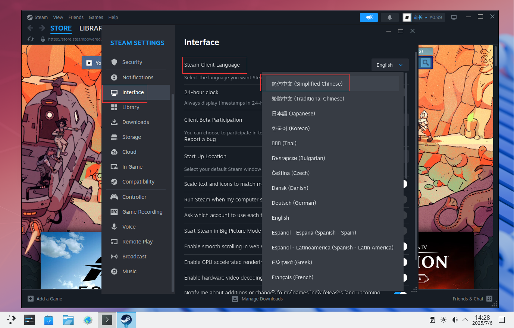
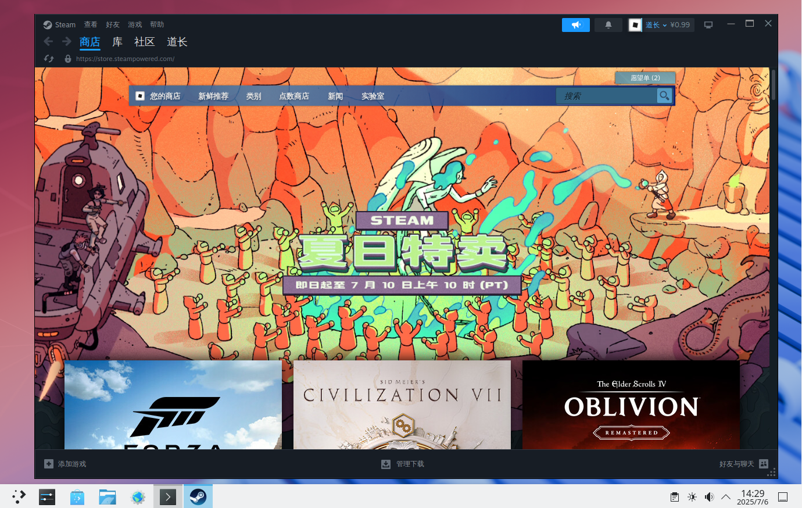
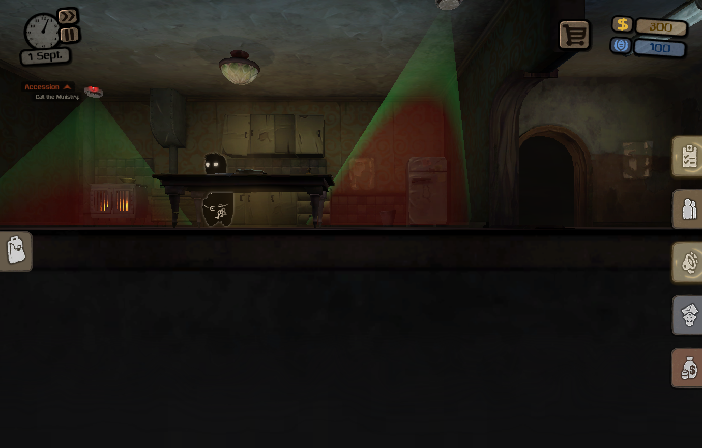

# 20.5 Steam 客户端

Steam 是全球知名的数字游戏分发平台，拥有庞大的游戏库与用户社区。

本节介绍 Steam 游戏平台在 FreeBSD 上的实现方案，使得 FreeBSD 用户能够享受 Linux 丰富的游戏生态。

## 基于 Port games/linux-steam-utils

### 加载 Linux 兼容层模块

加载该内核模块是运行 Steam 的前提条件，它为 FreeBSD 系统提供了执行 Linux 二进制文件的能力。

启用并启动 Linux 兼容层服务：

```sh
# service linux enable   # 启用 Linux 兼容层服务，并设置为开机自启
# service linux start    # 启动 Linux 兼容层服务
```

### 安装 games/linux-steam-utils

本小节介绍 games/linux-steam-utils 的安装方法。该软件包是社区开发的第三方封装工具，提供了在 FreeBSD 上运行 Steam 的必要工具与配置脚本。

使用 pkg 安装：

```sh
# pkg install linux-steam-utils
```

使用 Ports 安装：

```sh
# cd /usr/ports/games/linux-steam-utils/
# make install clean
```

查看安装后的说明：

```sh
# pkg info -D linux-steam-utils
linux-steam-utils-20250627:
On install:
Please note, this is an unofficial wrapper for the Steam client
请注意，这只是 Steam 客户端的非官方封装。
and as such it is supported on a best effort basis.
因此仅提供力所能及的支持。

Limitations:
限制：

- Sandbox is disabled for the web browser component.
  浏览器组件的沙盒已被禁用。
- No controller input, no streaming, no VR.
  不支持手柄输入、串流与 VR。
- Valve Anti-Cheat is untested.
  尚未测试 Valve 反作弊系统。
- Steam's container runtime (pressure-vessel) doesn't work.
  Steam 的容器运行时（pressure-vessel）无法使用。

Additional dependencies:
额外依赖：

- If you use an NVIDIA card, you need to install a suitable
  x11/linux-nvidia-libs(-xxx) port.
  如果使用 NVIDIA 显卡，需要安装适配的 x11/linux-nvidia-libs（-xxx）Port。

Steam setup:
Steam 设置步骤：

1. Set security.bsd.unprivileged_chroot and vfs.usermount sysctls to 1.
   将 sysctl 变量 security.bsd.unprivileged_chroot 和 vfs.usermount 设置为 1。
2. Add nullfs to kld_list, load it.
   将 nullfs 添加到 kld_list 并加载该模块。
3. Create a dedicated FreeBSD non-wheel user account for Steam. Switch to it.
   为 Steam 创建一个专用的 FreeBSD 非 wheel 用户账户，并切换至该用户。
4. Run `/usr/local/steam-utils/bin/lsu-bootstrap` to download the Steam bootstrap executable.
   运行 `/usr/local/steam-utils/bin/lsu-bootstrap` 下载 Steam 的引导可执行文件。
5. Run `steam` to download updates and start Steam.
   运行 `steam` 下载更新并启动 Steam。

For the list of tested Linux games see https://github.com/shkhln/linuxulator-steam-utils/wiki/Compatibility.
已测试的 Linux 游戏列表请参见：https://github.com/shkhln/linuxulator-steam-utils/wiki/Compatibility。

Native Proton setup (optional, semi-experimental):
原生 Proton 设置（可选，半实验性）：

1. Run `sudo pkg install wine-proton libc6-shim python3`.
   运行 `sudo pkg install wine-proton libc6-shim python3` 安装依赖。
2. Run `/usr/local/wine-proton/bin/pkg32.sh install wine-proton mesa-dri`.
   运行 `/usr/local/wine-proton/bin/pkg32.sh install wine-proton mesa-dri` 安装 32 位依赖。
3. In Steam install the matching Proton version (appid 2348590 for 8.0, 2805730 for 9.0, etc).
   在 Steam 中安装匹配的 Proton 版本（8.0 对应 appid 2348590，9.0 对应 appid 2805730，等等）。
```

### 文件结构

```sh
/
├── bin/
│   └── sh # Steam 用户的默认 shell
├── etc/
│   └── sysctl.conf # 系统控制变量配置文件
└── usr/
    └── local/
        ├── steam-utils/
        │   └── bin/
        │       ├── lsu-bootstrap # Steam 引导程序下载工具
        │       └── steam # Steam 启动器
        └── wine-proton/
            └── bin/
                └── pkg32.sh # 32 位依赖安装脚本
```

### 配置 Port linux-steam-utils

本小节介绍 Port linux-steam-utils 的详细配置步骤。配置过程涉及系统参数调整、用户账户创建等多项操作，这些步骤对于确保 Steam 在 FreeBSD 上稳定运行至关重要。

若使用 NVIDIA 显卡，需安装适配的 Port x11/linux-nvidia-libs（-xxx）。

#### 设置 sysctl 变量

将 sysctl 系统控制变量 `security.bsd.unprivileged_chroot` 与 `vfs.usermount` 设置为 `1`。这两个参数分别控制非特权用户的 chroot 权限与用户挂载文件系统的能力。Steam 需要这些权限来创建隔离环境和挂载必要的文件系统。

立即生效：

```sh
# sysctl security.bsd.unprivileged_chroot=1   # 允许非特权用户使用 chroot
# sysctl vfs.usermount=1                      # 允许普通用户挂载文件系统
```

若需永久生效：编辑 `/etc/sysctl.conf` 文件，在文件最后一行换行，添加：

```sh
security.bsd.unprivileged_chroot=1   # 允许非特权用户使用 chroot
vfs.usermount=1                      # 允许普通用户挂载文件系统
```

#### 启用内核模块 nullfs

nullfs 是一种透传文件系统，用于创建文件系统的绑定挂载，Steam 需要它来组织文件系统结构。

立即加载 nullfs 内核模块：

```sh
# kldload nullfs
```

将 `nullfs` 添加到 `kld_list`，以实现开机自动加载：

```sh
# sysrc kld_list+="nullfs"
```

#### 为 Steam 创建专用用户账户

为安全起见，建议为 Steam 创建专用用户账户。该用户不应属于 wheel 组，以限制其系统权限。如果不这样做，启动 Steam 时会提示安全警告。

创建名为 test 的用户，指定默认 shell 为 `/bin/sh`，并创建用户主目录：

```sh
# pw useradd -n test -s /bin/sh -m
```

切换到 test 用户：

```sh
# su test
```

> **技巧**
>
> 在 test 用户权限下，输入命令 `exit` 即可退回到之前的用户。

#### 下载 Steam 的引导可执行文件

启动 steam-utils 的 lsu-bootstrap 初始化程序，该程序负责下载 Steam 客户端的引导文件：

```sh
$ /usr/local/steam-utils/bin/lsu-bootstrap
```

#### 允许 test 用户访问 X11

Steam 是图形化应用程序，需要访问 X Server 才能显示界面。在当前登录桌面的用户权限下执行以下命令，以允许本地用户 test 访问当前的 X Server：

```sh
$ xhost +SI:localuser:test
```

### 启动 Steam

本小节介绍如何启动 Steam 客户端。启动前需确保所有配置步骤已完成。

切换到 test 用户：

```sh
# su test
```

启动 Steam 客户端：

```sh
$ /usr/local/steam-utils/bin/steam
```

输入用户名和密码登录：


加载中：


设置中文界面：



Steam：



### 测试游戏 Beholder 的运行情况

本小节以游戏 Beholder 为例，测试 Steam 的运行情况。通过测试可验证 Steam 配置是否正确。

> **注意**
>
> Beholder 是付费游戏，需要购买后才能体验。

下载 Beholder：


启动 Beholder：




### 故障排除

本小节介绍常见问题的解决方法。在实际使用过程中可能会遇到各种技术问题，遇到问题时可以参考如下内容进行排查。

#### `Bubblewrap doesn't work on FreeBSD. Select LSU chroot or Legacy Runtime in the game compatibility settings.`

该错误表明 Steam 的容器运行时（pressure-vessel）在 FreeBSD 上不兼容，需要选择兼容的运行时环境。

右键单击游戏，点击属性，在兼容性选项卡中，勾选“强制使用特定 Steam Play 兼容性工具”，选择“Legacy Runtime 1.0”。

#### 无中文字体显示

该问题在当前配置环境下可通过安装中文字体来解决，推荐安装 `wqy-fonts` 或 `noto-fonts-cjk` 等字体包。

## 参考文献

- shkhln. linuxulator-steam-utils[EB/OL]. [2026-04-17]. <https://github.com/shkhln/linuxulator-steam-utils>. FreeBSD 上运行 Steam 客户端的社区适配工具，提供引导脚本和兼容性配置。

## 课后习题

1. 查找 linux-steam-utils 的官方源代码，在 FreeBSD 上构建其最新版本，并分析其实现如何通过 Linux 兼容层桥接 FreeBSD 系统与 Steam 客户端。

2. 适配 GOG 的 Linux 客户端到 FreeBSD。

3. 解决中文字体在 Steam 客户端乱码问题。
